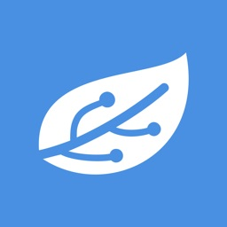
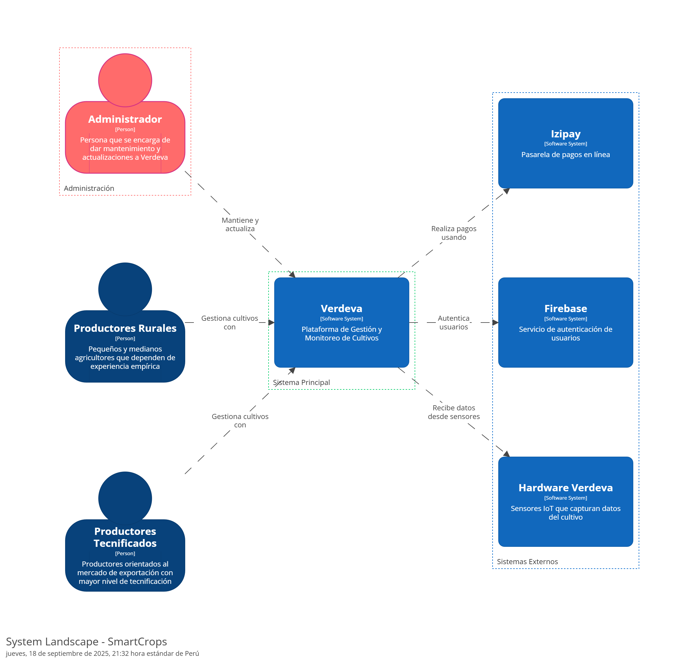

    <strong>Universidad Peruana de Ciencias Aplicadas</strong> 
     </img> 
     
    <strong>Ingeniería de Software - 2025-02</strong> 
     
    <strong>Arquitecturas De Software Emergentes - 14653</strong>   
     
    <strong>Profesor: Richard Leonardo Berrocal Navarro </strong> 
      <strong>INFORME DE TB1</strong> 

    <strong>Startup: SmartCrops</strong> 
    <strong>Producto: Verdeva</strong>

<h3 align="center" >Team Members:</h3>

    <table align="center">
        <tr>
            <th style="text-align:center;">Miembro</th>
            <th style="text-align:center;">Código</th>
        </tr>
        <tr>
            <td>Pinto Fuentes Rivera, Alvaro Felipe </td>
            <td>U202213384 </td>
        </tr>
        <tr>
            <td>Espinoza Saenz, Christian Renato </td>
            <td>U202213208 </td>
        </tr>
        <tr>
            <td>Chirinos Zúñiga, Rodrigo Manuel </td>
            <td>U202217804   </td>
        </tr>
        <tr>
            <td>Litano Liza, Joel Alexander</td>
            <td>U20181A732  </td>
        </tr>
        <tr>
            <td>Isla Quispe, Luis Fernando </td>
            <td>U202124146 </td>
        </tr>
    </table>

 

    <strong>SEPTIEMBRE 2025 </strong>

 

---

# Registro de Versiones del Informe

| Versión |   Fecha    | Autor | Descripción de modificación | 
|:-------:|:----------:|:-----:|:----------------------------| 
|TB1| 20/04/2025 |Antonio Salazar Jhan Clinton|  Capítulo I: Introducción, Capítulo II: Requirement Elicitation & Analysis, Capítulo III: Requirements Specification, Capítulo IV: Solution Software Design |

---

# Contenido
## Tabla de Contenidos
### [Registro de versiones del informe](#registro-de-versiones-del-informe)
### [Project Report Collaboration Insights](#project-report-collaboration-insights)
### [Contenido](#contenido)
### [Student Outcome](#student-outcome-1)
### [Capítulo I: Introducción](#capítulo-i-introducción-1)
- [1.1. Startup Profile](#11-startup-profile)
    - [1.1.1. Descripción de la Startup](#111-descripción-de-la-startup)
    - [1.1.2. Perfiles de integrantes del equipo](#112-perfiles-de-integrantes-del-equipo)
- [1.2. Solution Profile](#12-solution-profile)
    - [1.2.1. Antecedentes y problemática](#121-antecedentes-y-problemática)
    - [1.2.2. Lean UX Process](#122-lean-ux-process)
        - [1.2.2.1. Lean UX Problem Statements](#1221-lean-ux-problem-statements)
        - [1.2.2.2. Lean UX Assumptions](#1222-lean-ux-assumptions)
        - [1.2.2.3. Lean UX Hypothesis Statements](#1223-lean-ux-hypothesis-statements)
        - [1.2.2.4. Lean UX Canvas](#1224-lean-ux-canvas)
- [1.3. Segmentos objetivo](#13-segmentos-objetivo)

### [Capítulo II: Requirements Elicitation & Analysis](#capítulo-ii-requirements-elicitation-&-analysis-1)
- [2.1. Competidores](#21-competidores)
    - [2.1.1. Análisis competitivo](#211-análisis-competitivo)
    - [2.1.2. Estrategias y tácticas frente a competidores](#212-estrategias-y-tácticas-frente-a-competidores)
- [2.2. Entrevistas](#22-entrevistas)
    - [2.2.1. Diseño de entrevistas](#221-diseño-de-entrevistas)
    - [2.2.2. Registro de entrevistas](#222-registro-de-entrevistas)
    - [2.2.3. Análisis de entrevistas](#223-análisis-de-entrevistas)
- [2.3. Needfinding](#23-needfinding)
    - [2.3.1. User Personas](#231-user-personas)
    - [2.3.2. User Task Matrix](#232-user-task-matrix)
    - [2.3.3. User Journey Mapping](#233-user-journey-mapping)
    - [2.3.4. Empathy Mapping](#234-empathy-mapping)
    - [2.3.5. As-is Scenario Mapping](#235-as-is-scenario-mapping)
- [2.4. Ubiquitous Language](#24-ubiquitous-language)

### [Capítulo III: Requirements Specification](#capítulo-iii-requirements-specification-1)
- [3.1. To-Be Scenario Mapping](#31-to-be-scenario-mapping)
- [3.2. User Stories](#32-user-stories)
- [3.3. Impact Mapping](#33-impact-mapping)
- [3.4. Product Backlog](#34-product-backlog)

### [Capítulo IV: Solution Software Design](#capítulo-iv-solution-software-design-1)
- [4.1. Strategic-Level Domain-Driven Design](#41-strategic-level-domain-driven-design)
    - [4.1.1. EventStorming](#411-eventstorming)
        - [4.1.1.1. Candidate Context Discovery](#4111-candidate-context-discovery)
        - [4.1.1.2. Domain Message Flows Modeling](#4112-domain-message-flows-modeling)
        - [4.1.1.3. Bounded Context Canvases](#4113-bounded-context-canvases)
    - [4.1.2. Context Mapping](#412-context-mapping)
    - [4.1.3. Software Architecture](#413-software-architecture)
        - [4.1.3.1. Software Architecture System Landscape Diagram](#4131-software-architecture-system-landscape-diagram)        
        - [4.1.3.2. Software Architecture Context Level Diagrams](#4132-software-architecture-context-level-diagrams)
        - [4.1.3.3. Software Architecture Container Level Diagrams](#4133-software-architecture-container-level-diagrams)
        - [4.1.3.4. Software Architecture Deployment Diagrams](#4134-software-architecture-deployment-diagrams)
        - [4.1.3.5. Software Architecture Components Level Diagrams](#4135-software-architecture-components-level-diagrams)
- [4.2. Tactical-Level Domain-Driven Design](#42-tactical-level-domain-driven-design)
    - [4.2.1. Bounded Context: <Bounded Context Name>](#421-bounded-context-1)
        - [4.2.1.1. Domain Layer](#4211-domain-layer)
        - [4.2.1.2. Interface Layer](#4212-interface-layer)
        - [4.2.1.3. Application Layer](#4213-application-layer)
        - [4.2.1.4. Infrastructure Layer](#4214-infrastructure-layer)
        - [4.2.1.5. Bounded Context Software Architecture Component Level Diagrams](#4215-bounded-context-software-architecture-component-level-diagrams)
        - [4.2.1.6. Bounded Context Software Architecture Code Level Diagrams](#4216-bounded-context-software-architecture-code-level-diagrams)
            - [4.2.1.6.1. Bounded Context Domain Layer Class Diagrams](#42161-bounded-context-domain-layer-class-diagrams)
            - [4.2.1.6.2. Bounded Context Database Design Diagram](#42162-bounded-context-database-design-diagram)

### [Capítulo V: Solution UI/UX Design](#capítulo-v-solution-uiux-design-1)
- [5.1. Style Guidelines](#51-style-guidelines)  
    - [5.1.1. General Style Guidelines](#511-general-style-guidelines)  
    - [5.1.2. Web, Mobile and IoT Style Guidelines](#512-web-mobile-and-iot-style-guidelines)  
- [5.2. Information Architecture](#52-information-architecture)  
    - [5.2.1. Organization Systems](#521-organization-systems)  
    - [5.2.2. Labeling Systems](#522-labeling-systems)  
    - [5.2.3. SEO Tags and Meta Tags](#523-seo-tags-and-meta-tags)  
    - [5.2.4. Searching Systems](#524-searching-systems)  
    - [5.2.5. Navigation Systems](#525-navigation-systems)  
- [5.3. Landing Page UI Design](#53-landing-page-ui-design)  
    - [5.3.1. Landing Page Wireframe](#531-landing-page-wireframe)  
    - [5.3.2. Landing Page Mock-up](#532-landing-page-mock-up)  
- [5.4. Applications UX/UI Design](#54-applications-uxui-design)  
    - [5.4.1. Applications Wireframes](#541-applications-wireframes)  
    - [5.4.2. Applications Wireflow Diagrams](#542-applications-wireflow-diagrams)  
    - [5.4.3. Applications Mock-ups](#543-applications-mock-ups)  
    - [5.4.4. Applications User Flow Diagrams](#544-applications-user-flow-diagrams)  
- [5.5. Applications Prototyping](#55-applications-prototyping)

### [Capítulo VI: Product Implementation, Validation & Deployment](#capítulo-vi-product-implementation-validation--deployment-1)
- [6.1. Software Configuration Management](#61-software-configuration-management)  
    - [6.1.1. Software Development Environment Configuration](#611-software-development-environment-configuration)  
    - [6.1.2. Source Code Management](#612-source-code-management)  
    - [6.1.3. Source Code Style Guide & Conventions](#613-source-code-style-guide--conventions)  
    - [6.1.4. Software Deployment Configuration](#614-software-deployment-configuration)  
- [6.2. Landing Page, Services & Applications Implementation](#62-landing-page-services--applications-implementation)  
    - [6.2.1. Sprint 1](#621-sprint-1)  
        - [6.2.1.1. Sprint Planning 1](#6211-sprint-planning-1)  
        - [6.2.1.2. Aspect Leaders and Collaborators](#6212-aspect-leaders-and-collaborators)  
        - [6.2.1.3. Sprint Backlog 1](#6213-sprint-backlog-1)  
        - [6.2.1.4. Development Evidence for Sprint Review](#6214-development-evidence-for-sprint-review)  
        - [6.2.1.5. Testing Suite Evidence for Sprint Review](#6215-testing-suite-evidence-for-sprint-review)  
        - [6.2.1.6. Execution Evidence for Sprint Review](#6216-execution-evidence-for-sprint-review)  
        - [6.2.1.7. Services Documentation Evidence for Sprint Review](#6217-services-documentation-evidence-for-sprint-review)  
        - [6.2.1.8. Software Deployment Evidence for Sprint Review](#6218-software-deployment-evidence-for-sprint-review)  
        - [6.2.1.9. Team Collaboration Insights during Sprint](#6219-team-collaboration-insights-during-sprint)

    - [6.2.2. Sprint 2](#622-sprint-2)  
        - [6.2.2.1. Sprint Planning 2](#6221-sprint-planning-2)  
        - [6.2.2.2. Aspect Leaders and Collaborators](#6222-aspect-leaders-and-collaborators)  
        - [6.2.2.3. Sprint Backlog 2](#6223-sprint-backlog-2)  
        - [6.2.2.4. Development Evidence for Sprint Review](#6224-development-evidence-for-sprint-review)  
        - [6.2.2.5. Testing Suite Evidence for Sprint Review](#6225-testing-suite-evidence-for-sprint-review)  
        - [6.2.2.6. Execution Evidence for Sprint Review](#6226-execution-evidence-for-sprint-review)  
        - [6.2.2.7. Services Documentation Evidence for Sprint Review](#6227-services-documentation-evidence-for-sprint-review)  
        - [6.2.2.8. Software Deployment Evidence for Sprint Review](#6228-software-deployment-evidence-for-sprint-review)  
        - [6.2.2.9. Team Collaboration Insights during Sprint](#6229-team-collaboration-insights-during-sprint)
     
    - [6.2.3. Sprint 3](#632-sprint-3)  
        - [6.2.3.1. Sprint Planning 3](#6231-sprint-planning-3)  
        - [6.2.3.2. Aspect Leaders and Collaborators](#6222-aspect-leaders-and-collaborators)  
        - [6.2.3.3. Sprint Backlog 3](#6233-sprint-backlog-3)  
        - [6.2.3.4. Development Evidence for Sprint Review](#6234-development-evidence-for-sprint-review)  
        - [6.2.3.5. Testing Suite Evidence for Sprint Review](#6235-testing-suite-evidence-for-sprint-review)  
        - [6.2.3.6. Execution Evidence for Sprint Review](#6236-execution-evidence-for-sprint-review)  
        - [6.2.3.7. Services Documentation Evidence for Sprint Review](#6237-services-documentation-evidence-for-sprint-review)  
        - [6.2.3.8. Software Deployment Evidence for Sprint Review](#6238-software-deployment-evidence-for-sprint-review)  
        - [6.2.3.9. Team Collaboration Insights during Sprint](#6239-team-collaboration-insights-during-sprint)

    - [6.3. Validation Interviews](#63-validation-interviews)  
        - [6.3.1. Diseño de entrevistas](#631-diseño-de-entrevistas)
        - [6.3.2. Registro de entrevistas](#632-registro-de-entrevistas)
        - [6.3.3. Evaluación según heurísticas](#633-evaluación-según-heurísticas)  
    - [6.4. Video About-the-product](#64-video-about-the-product)

### [Conclusiones](#conclusiones-1)
### [Bibliografía](#bibliografía-1)
### [Anexos](#anexos-1)
---

# Student Outcome

**ABET – EAC – Student Outcome 5**

    Criterio: La capacidad de funcionar efectivamente en un equipo cuyos miembros
juntos proporcionan liderazgo, crean un entorno de colaboración e inclusivo,
establecen objetivos, planifican tareas y cumplen objetivos.  

En el siguiente cuadro se describe las acciones realizadas y enunciados de
conclusiones por parte del grupo, que permiten sustentar el haber alcanzado el logro
del ABET – EAC - Student Outcome 5.

    

    

<table>
  <tr>
    <th>Criterio Específico</th>
    <th>Acciones Realizadas</th>
    <th>Conclusiones</th>
  </tr>
  <tr>
    <td>.</td>
    <td>
      <strong>TB1:</strong> 
      <strong>Pinto Fuentes Rivera, Alvaro Felipe:</strong>  
      <strong>Espinoza Saenz, Christian Renato:</strong>  
      <strong>Chirinos Zúñiga, Rodrigo Manuel:</strong>  
      <strong>Litano Liza, Joel Alexander:</strong>  
      <strong>Isla Quispe, Luis Fernando:</strong>  
    </td>
    <td>
      <strong>TB1:</strong>  
    </td>	
  </tr>
  <tr>
    <td>.</td>
    <td>
      <strong>TB1:</strong> 
      <strong>Pinto Fuentes Rivera, Alvaro Felipe:</strong>  
      <strong>Espinoza Saenz, Christian Renato:</strong>  
      <strong>Chirinos Zúñiga, Rodrigo Manuel:</strong>  
      <strong>Litano Liza, Joel Alexander:</strong>  
      <strong>Isla Quispe, Luis Fernando:</strong>  
    </td>
    <td>
      <strong>TB1:</strong>  
    </td>
  </tr>
</table>

# Capítulo I: Introducción

## 1.1. Startup Profile
### 1.1.1. Descripción de la Startup

    SmartCrops es una startup dedicada a revolucionar la agroindustria a través del desarrollo de soluciones tecnológicas inteligentes. Su propuesta se centra en la agricultura de precisión, la automatización y el uso estratégico del Internet de las Cosas (IoT), creando herramientas avanzadas para monitorear y analizar factores clave como el clima, la humedad del suelo, la salud de los cultivos y otras variables determinantes. Todo esto con el objetivo de optimizar la productividad, reducir el consumo innecesario de insumos y facilitar decisiones respaldadas en datos confiables en tiempo real. 

 

En SmartCrops creemos en una agricultura sostenible, conectada y enfocada en mejorar la experiencia del productor. Por ello, buscamos hacer accesible la tecnología agrointeligente para agricultores de cualquier escala, brindándoles la posibilidad de gestionar sus cultivos desde cualquier lugar y en todo momento. 
      
    
  

  

    <ul>
        <li>
            <b>Misión:</b>
        </li> 
En SmartCrops creemos en una agricultura sostenible, conectada y enfocada en mejorar la experiencia del productor. Por ello, buscamos hacer accesible la tecnología agrointeligente para agricultores de cualquier escala, brindándoles la posibilidad de gestionar sus cultivos desde cualquier lugar y en todo momento.           
    <li>
            <b>Visión:</b>
        </li>
Nuestra visión del futuro agrícola es clara: un ecosistema donde cada hectárea sea más eficiente y menos contaminante, donde las decisiones estén impulsadas por información precisa y donde la tecnología se convierta en un aliado esencial frente a los retos del cambio climático y la seguridad alimentaria mundial.     </ul>
 

### 1.1.2. Perfiles de integrantes del equipo

### Los integrantes que conforman parte de nuestro startup son:

| Integrante                | Perfil                                                                                                                                                                                                                                                                                                                                                                                                                                                                                                                                                                                                                                                                                                                                                                                              | Foto                                                |
|---------------------------|-----------------------------------------------------------------------------------------------------------------------------------------------------------------------------------------------------------------------------------------------------------------------------------------------------------------------------------------------------------------------------------------------------------------------------------------------------------------------------------------------------------------------------------------------------------------------------------------------------------------------------------------------------------------------------------------------------------------------------------------------------------------------------------------------------|-------------------------------------|
| Isla Quispe, Luis Fernando | Me llamo Luis Fernando Isla Quispe, tengo 21 años y soy estudiante de Ingeniería de Software. Poseo experiencia en programación con lenguajes como C++, C#, Python, HTML, y SQL, lo que me ha permitido desarrollar diversos proyectos. Además, he trabajado en equipo, aprendiendo a comunicarme eficazmente y a colaborar en entornos.                                                                                                                                                                                                                                                                                                                                                                                                                                     |                                       |
| Chirinos Zúñiga, Rodrigo Manuel | Tengo 21 años, soy un estudiante de la carrera de Ingeniería de Software, considero que soy una persona responsable y de escucha activa. Estoy comprometido con mis compañeros en realizar un buen trabajo y así aprender todos en el proceso. También tengo conocimientos en programación en C++, HTML, CSS y JavaScript.                                                                                                                                                                                                                                                                                                                                                                                                                                                             |                                       |
| Pinto Fuentes Rivera, Alvaro Felipe | Hola, mi nombre es Alvaro, soy un estudiante del octavo ciclo de la carrera Ingeniería de Software. Me gusta mucho leer, sobre todo el género de fantasía y ciencia ficción, mi frase favorita de un libro es el credo "Vida antes que muerte, fuerza antes que debilidad y viaje antes que destino", también soy un gran fan del cine y pasó la mayor parte de mi tiempo libre escribiendo por diversión. Poseo un nivel bueno de programación en los lenguajes de C# y C++, creo que podré resultar de gran ayuda para resolver cualquier tipo de problema durante el desarrollo del proyecto, así como podré brindar ideas creativas para el equipo.                                                                                             |                      |
| Espinoza Saenz, Christian Renato (U202213208) | Mi nombre es Christian Espinoza, soy un estudiante de 21 años que cursa el 8vo ciclo de la carrera Ingeniería de Software. Poseo ideas únicas e innovadoras para que el trabajo logre sobresalir. Tengo experiencia en la creación de distintos tipos de diagramas, editar diferentes tipos de multimedia como videos, y un conocimiento general en programación de C++, HTML, CSS y SQL. Además, se me facilita desarrollar interfaces intuitivas en el frontend, lo cual será beneficioso para el proyecto.                                                                                                                                                                                                                                                 |                     |
| Litano Liza, Joel Alexander (U20181A732) | Mi nombre es Joel Litano, soy estudiante de 8vo ciclo de la carrera de Ingeniería de Software. Estoy comprometido con el desarrollo del proyecto, brindando mis aptitudes al equipo y aportando especialemnte en desarrollo WEB, con ASP .net, automatizaciones y procesos de inteligencia artificial con python, C# y C++.                                                                                                                                                                                                                                                  |                     |

## 1.2. Solution Profile

**Product Name:** Verdeva

**Descripción del Producto:**  Verdeva es una solución tecnológica desarrollada por SmartCrops para optimizar la fertilización agrícola de manera inteligente y sostenible. Diseñada especialmente para pequeños y medianos productores en Sudamérica, integra sensores avanzados con riego por goteo automatizado, permitiendo medir en tiempo real parámetros esenciales del suelo como pH, humedad y nutrientes. Con esta información, Verdeva activa el riego únicamente cuando los cultivos lo requieren, garantizando un uso eficiente de agua y fertilizantes. Además, ofrece una plataforma web y una aplicación móvil con acceso a monitoreo en tiempo real, alertas, reportes y recomendaciones personalizadas, lo que facilita decisiones más informadas y productivas. Así, Terranova impulsa la productividad agrícola y fomenta prácticas sostenibles frente a la crisis climática y la escasez de agua. 

**Monetización:**  Verdeva se comercializará bajo un modelo freemium accesible y escalable. Los agricultores podrán usar sin costo funciones básicas como monitoreo y alertas, mientras que las herramientas avanzadas —análisis históricos, reportes predictivos y asesoría personalizada— estarán disponibles mediante planes de suscripción mensual de bajo costo, ajustados al tamaño del terreno o al número de sensores instalados.

### 1.2.1. Antecedentes y problemática

En el contexto agrícola de Sudamérica, y de manera particular en Perú, los productores se enfrentan a una combinación de retos estructurales y emergentes que comprometen la eficiencia y sostenibilidad del sector. Uno de los más críticos es la escasez de agua: de acuerdo con el Centro Nacional de Planeamiento Estratégico (Ceplan), para el año 2030 más del 58% de la población peruana residirá en zonas con estrés hídrico. Regiones como Piura ya atraviesan emergencias debido al déficit de agua, lo que afecta directamente la capacidad de riego y exige nuevas estrategias de gestión hídrica. A ello se suma el incremento sostenido de los precios de los fertilizantes: Perú importa anualmente más de un millón de toneladas de estos insumos, con un valor que supera los 800 millones de dólares, impulsado por factores como la pandemia, conflictos geopolíticos y disrupciones en la cadena de suministro. Este escenario ha golpeado con mayor fuerza a los pequeños y medianos agricultores, reduciendo sus márgenes y dificultando el acceso a insumos básicos. Otro gran desafío es la brecha tecnológica: mientras algunos grandes productores han comenzado a implementar agricultura de precisión, la mayoría de los agricultores aún no dispone de herramientas para monitorear en tiempo real parámetros esenciales como humedad, pH o niveles de nutrientes, limitando la capacidad de reaccionar frente a condiciones climáticas cada vez más inestables.
  
En respuesta a estos desafíos, SmartCrops presenta Verdeva, una solución tecnológica integral que automatiza el proceso de fertilización a través de sensores inteligentes capaces de medir en tiempo real variables críticas del suelo, como pH, humedad y nutrientes. Con estos datos, el sistema activa de manera autónoma el riego por goteo únicamente cuando el cultivo lo necesita, garantizando así una aplicación precisa y eficiente de agua y fertilizantes. Esta innovación no solo reduce el uso innecesario de recursos, sino que también incrementa el rendimiento de los cultivos de forma significativa.
  
Para explicar con mayor claridad el valor de Verdeva, utilizamos el modelo 5W y 2H:
  

***What***

* Actualmente, los agricultores gestionan el riego y la fertilización de manera empírica o siguiendo calendarios fijos.
* Esto provoca un consumo excesivo de agua y fertilizantes, encareciendo los costos y reduciendo la eficiencia.
* La ausencia de monitoreo en tiempo real limita la toma de decisiones oportunas y precisas.

***Who***

* Pequeños y medianos agricultores rurales, que dependen de la experiencia empírica y enfrentan restricciones económicas, técnicas y climáticas.
* Agricultores de cultivos de alto valor orientados a la exportación, que requieren precisión en el manejo de insumos para mantener calidad y rentabilidad.

***Where***
* El problema se presenta en toda Sudamérica, pero tiene especial impacto en regiones agrícolas peruanas como Piura, Lambayeque o Ica, donde la disponibilidad de agua es crítica y los efectos del cambio climático intensifican la variabilidad en suelo y clima.

***When***
* El desafío es constante durante toda la campaña agrícola, pero se agudiza en etapas clave de desarrollo del cultivo, donde la falta de agua o nutrientes afecta directamente el rendimiento.
* También se intensifica en periodos de sequía o cuando los precios de fertilizantes se disparan.

***Why***

* Los agricultores carecen de herramientas accesibles para monitorear las condiciones del suelo.
* Las decisiones se toman en base a experiencia o tradición, más que en datos concretos.
* La tecnología agrointeligente aún no llega de forma masiva a las zonas rurales.

***How***

* Con Verdeva, los productores pueden automatizar el riego y la fertilización mediante sensores que registran en tiempo real las condiciones del suelo.
* El sistema decide de manera autónoma cuándo activar el riego por goteo, optimizando el uso de recursos.
* A través de una plataforma web y una aplicación móvil, los agricultores acceden a monitoreo, alertas y recomendaciones adaptadas a su terreno.

***How Much***

* Un agricultor puede perder hasta un 30% del rendimiento por una fertilización mal ejecutada.
* Con Verdeva, es posible reducir hasta un 40% el consumo de agua y fertilizantes, y aumentar la productividad en aproximadamente un 25%, generando un impacto económico directo y positivo para el productor.

 

### 1.2.2. *Lean UX Process*

#### 1.2.2.1. *Lean UX Problem Statements*

***Problem Statement:***

**1. Dominio:**
* El sector de aplicación es el agropecuario, con foco en la agricultura de precisión para cultivos de pequeña y mediana escala en zonas impactadas por limitaciones climáticas, hídricas y económicas. El enfoque se centra en el uso de tecnologías digitales, sensores IoT, automatización y analítica de datos para optimizar recursos críticos y aumentar la rentabilidad agrícola.

**2. Segmentos de Clientes:**

***Pequeños y medianos agricultores rurales:***
  * No cuentan con acceso a tecnologías de monitoreo o automatización.
  * Sus decisiones productivas se basan en experiencia empírica, no en datos.
  * Operan con recursos económicos limitados y márgenes de ganancia reducidos.
  * Trabajan en zonas rurales con alta presión hídrica y condiciones climáticas adversas.

***Productores de cultivos de alto valor destinados a exportación:***
  * Requieren precisión en riego y nutrición para cumplir estándares de calidad internacional.
  * Están más dispuestos a invertir si existe un retorno claro y medible.
  * Errores en la fertilización o riego tienen un alto impacto en su producción y rentabilidad.

**3. Puntos de Dolor (Pain Points):**
* **Falta de información confiable sobre el estado del suelo:** La mayoría carece de herramientas para medir humedad, pH o nutrientes, aplicando insumos de forma poco técnica.

* **Ineficiencia en el uso de agua:** El riego manual o en horarios fijos no considera las necesidades reales del cultivo, lo que deriva en desperdicio o déficit hídrico.
  
* **Dependencia de fertilizantes costosos:** Los altos precios y el uso ineficiente elevan los costos de producción sin garantizar mayores rendimientos.

* **Acceso limitado a tecnología adecuada:** Las soluciones actuales suelen ser costosas, complejas y diseñadas para grandes productores, dejando de lado a los agricultores rurales.

* **Vulnerabilidad al cambio climático:** Fenómenos como sequías, heladas o lluvias intensas afectan de forma impredecible y sin información en tiempo real el agricultor no puede anticiparse.

* **Sobrecarga operativa y decisiones bajo presión:** El monitoreo manual y la falta de apoyo tecnológico generan estrés y errores frecuentes en la gestión diaria.

**4. Brecha Identificada (Gap):**
  Existe una falta evidente de soluciones agro inteligentes que sean:

* **Económicamente accesibles para pequeños y medianos productores,** frente a un mercado saturado de opciones costosas e importadas.
  
* **Simples de instalar y usar,** sin necesidad de conocimientos técnicos avanzados ni soporte constante.
  
* **Adaptadas a la baja conectividad de zonas rurales,** capaces de funcionar offline o con sincronización diferida.
  
* **Centradas en el ahorro de recursos y en el empoderamiento del agricultor,** con interfaces claras y orientadas al impacto inmediato.

**5. Visión / Estrategia:**  
 La visión de SmartCrops con su producto Verdeva es democratizar el acceso a la agricultura de precisión, transformando la tecnología en una herramienta práctica y cercana para el agricultor. Para ello, se plantea:

* Crear una solución modular, escalable y de bajo costo, equipada con sensores precisos para recolectar datos del suelo y del clima.
* Implementar un sistema que automatice riego y fertilización, reduciendo la carga operativa y optimizando recursos críticos.
* Diseñar una interfaz visual e intuitiva, fácil de usar incluso para agricultores con poca experiencia tecnológica.
* Incorporar alertas y recomendaciones accionables, que faciliten la toma de decisiones sin depender de consultores externos.
* Promover una red de usuarios conectados que compartan aprendizajes y validen el valor de la tecnología desde la práctica en campo.

#### 1.2.2.2. *Lean UX Assumptions*

***Business Assumptions:***

1. Los agricultores estarán motivados a incorporar tecnología siempre que represente un beneficio tangible en su rentabilidad y productividad.

2. La creciente necesidad de optimizar el uso del agua impulsará la demanda de herramientas de monitoreo y control hídrico.

3. La dependencia del Perú de fertilizantes importados seguirá generando interés por alternativas que reduzcan su consumo.

4. Programas de subsidios y financiamiento agrícola podrían facilitar la adquisición de soluciones como Verdeva.

5. Las políticas públicas tenderán a favorecer la sostenibilidad, creando un escenario favorable para la agricultura de precisión.

6. El mercado agrícola en Sudamérica, al ser diverso, exigirá soluciones flexibles y adaptables a distintos cultivos.

7. La brecha tecnológica entre pequeños y grandes productores representa una oportunidad para democratizar la innovación.

8. La confianza en la solución se generará principalmente mediante recomendaciones directas y demostraciones en campo.

***Business Outcomes:***

- Incremento progresivo en las ventas y adopción de Verdeva en regiones agrícolas con problemas severos de agua (Piura, Arequipa, Ica y Lambayeque).

- Reducción del uso de fertilizantes entre un 20% y 40% gracias a la dosificación inteligente y personalizada.

- Optimización del riego hasta en un 50%, especialmente en zonas con recursos hídricos limitados.

- Expansión hacia otros países andinos con contextos agrícolas similares (Ecuador, Bolivia, Colombia).

- Establecimiento de alianzas con cooperativas, ONGs rurales y entidades públicas que faciliten la implementación.

- Posicionamiento de SmartCrops como referente en innovación agrícola en ferias, congresos y medios especializados.

- Obtención de datos estratégicos sobre suelos y cultivos que permitan futuras mejoras del producto.

***User Assumptions:***

1. **¿Quién es el usuario?**
    * Agricultores pequeños y medianos de zonas rurales de Perú y Sudamérica, con acceso limitado a tecnología.
    * Productores tecnificados de cultivos de alto valor, enfocados en exportación.

2. **¿Qué problemas resuelve?**
    * Escasez de agua, costos elevados de fertilizantes, baja eficiencia en riego y fertilización, carencia de información en tiempo real.

3. **¿Qué características son críticas?**
    * Sensores de humedad, pH y nutrientes, monitoreo en tiempo real, riego y fertilización automatizados, interfaz intuitiva, acceso remoto.

4. **¿Dónde se integra en su vida laboral?**
    * En la gestión diaria de los cultivos, permitiendo supervisar riego y nutrición sin necesidad de presencia constante en el campo.

5. **¿Cuándo y cómo se utiliza?**
    * Durante toda la temporada de cultivo mediante una app móvil o plataforma web conectada a los sensores instalados, operando de forma autónoma y continua.

6. **¿Cómo debe verse y funcionar?**
    * Interfaz sencilla y clara, accesible en dispositivos móviles de gama media/baja, con funcionamiento predictivo, automatizado y con alertas personalizadas.

***User Outcomes:***

- Mejor control sobre agua y nutrientes con información clara y visual.

- Ahorro anual en costos de agua, fertilizantes y mano de obra.

- Mayor productividad por hectárea gracias a decisiones más precisas.

- Reducción de carga operativa mediante automatización de riego y fertilización.

- Menor riesgo de pérdidas por climas extremos con alertas predictivas.

- Adopción de decisiones basadas en datos, fomentando profesionalización agrícola.

- Imagen de modernización tecnológica y competitividad frente a grandes productores.

- Mayor resiliencia ante efectos del cambio climático y variaciones de mercado.

***Feature Assumptions:***

- Los sensores funcionarán correctamente en distintos tipos de suelo y condiciones climáticas extremas.

- El sistema de riego responderá en tiempo real a los datos del suelo sin intervención humana constante.

- La interfaz será simple, multilingüe y apta para celulares de gama baja con conectividad inestable.

- Habrá acceso en zonas con internet limitado, incluyendo funciones offline.

- Reportes y alertas se adaptarán a cultivo, suelo y perfil del agricultor.

- El sistema será modular y ampliable, permitiendo incorporar nuevas variables (temperatura, salinidad, plagas).

- Instalación y mantenimiento sencillos, con capacitación básica y sin necesidad de técnicos permanentes.

- Escalabilidad desde pequeñas parcelas hasta fincas medianas, con configuraciones ajustables.

#### 1.2.2.3. *Lean UX Hypothesis Statements*

* **Creemos que** los pequeños y medianos agricultores adoptarán Verdeva si perciben un beneficio claro en la eficiencia del uso de agua y fertilizantes. **Esto se confirmará cuando** al menos el 70% de los usuarios en piloto reporten una reducción comprobada en el consumo de recursos durante los primeros tres meses de uso.

* **Consideramos que** una interfaz simple, visual e intuitiva permitirá que agricultores sin experiencia tecnológica manejen el sistema sin apoyo externo. **Lo validaremos cuando** el 80% de los participantes en pruebas de usabilidad puedan realizar las funciones básicas (consultar datos, programar riego, recibir alertas) sin asistencia técnica.

* **Planteamos que** la automatización del riego y la fertilización disminuirá la carga operativa y elevará la productividad de los agricultores. **Esto será cierto cuando,** tras dos ciclos agrícolas, al menos el 60% de los usuarios informen un incremento en el rendimiento de sus cultivos y menos carga de trabajo diario.

* **Confiamos en que** Verdeva, desarrollado por SmartCrops, podrá adaptarse a distintos cultivos y tipos de terreno sin rediseños complejos. **Esto quedará demostrado cuando** al menos tres tipos de cultivos diferentes (ejemplo: vid, maíz y arándanos) integren el sistema sin requerir modificaciones técnicas relevantes.

* **Estimamos que** un proceso de instalación guiado y sencillo elevará la tasa de adopción sin depender de visitas presenciales. **Sabremos que esto es cierto cuando** más del 70% de los usuarios logren instalar y activar Verdeva por sí mismos, sin intervención directa del equipo de SmartCrops.

* **Creemos que** al incorporar lenguaje local, soporte en español y ejemplos prácticos con cultivos reales, se generará mayor confianza en el uso de la plataforma. **Lo confirmaremos cuando** el índice de satisfacción del onboarding supere el 80% en comunidades rurales durante las primeras pruebas piloto.

#### 1.2.2.4. *Lean UX Canvas*

## 1.3. Segmentos objetivo

En esta sección se identifican los segmentos de clientes objetivo de Verdeva, desarrollada por SmartCrops, considerando sus características productivas, prácticas agrícolas y necesidades comunes frente a los principales retos del sector agropecuario.

 

**1. Productores rurales tradicionales (pequeños y medianos agricultores)**

**Descripción:**  
Son agricultores que trabajan en zonas rurales, usualmente con acceso limitado a tecnologías modernas, y que gestionan sus cultivos basándose en la experiencia acumulada. Representan la mayoría de productores en regiones como la sierra y la costa del Perú, donde la escasez de agua y la vulnerabilidad climática impactan fuertemente en la producción.

**Características:**  
- Bajo nivel de tecnificación en sus procesos.  
- Recursos económicos reducidos.  
- Alta dependencia de condiciones climáticas.  
- Cultivos de subsistencia o producción destinada al mercado local.

**Necesidades:**  
- Herramientas accesibles para monitorear riego y condiciones del suelo.  
- Optimizar el uso de agua y fertilizantes sin requerir conocimientos técnicos avanzados.  
- Alertas y recomendaciones claras que simplifiquen la toma de decisiones.  
- Acceso a financiamiento o subsidios que faciliten la adopción de Verdeva.

 

**2. Productores tecnificados de cultivos de alto valor (orientados al mercado de exportación)**

**Descripción:**  
Se trata de agricultores o agroindustrias que producen cultivos como arándanos, uvas, paltas o espárragos, destinados a mercados nacionales e internacionales. Este grupo busca optimizar procesos para mantener calidad, trazabilidad y sostenibilidad, cumpliendo los estándares de exportación.

**Características:**  
- Mayor capacidad de inversión y apertura a nuevas tecnologías.  
- Necesidad de un control riguroso de las variables agrícolas.  
- Altos requerimientos de calidad y cumplimiento normativo.  
- Operación en contextos donde pequeñas variaciones pueden afectar la rentabilidad.

**Necesidades:**  
- Monitoreo en tiempo real de variables críticas del suelo (humedad, pH y nutrientes).  
- Automatización del riego y la fertilización para aumentar la eficiencia operativa.  
- Reportes históricos y análisis predictivos para mejorar la planificación estratégica.  
- Recomendaciones adaptadas al tipo de cultivo y a las condiciones específicas del terreno.

# Capítulo II: Requirements Elicitation & Analysis

## 2.1. Competidores

A partir de un análisis exhaustivo del mercado, se identificaron tres soluciones tecnológicas que presentan características similares a Verdeva, la propuesta de SmartCrops:

**Competidores identificados:**

* ***NetBeat (Netafim):***
NetBeat es una plataforma digital avanzada desarrollada por Netafim, empresa líder mundial en tecnologías de riego por goteo y agricultura de precisión. Esta solución integra monitoreo, análisis y automatización en tiempo real, permitiendo a los agricultores gestionar el riego y la fertilización desde un panel de control centralizado. Utiliza datos obtenidos de sensores de suelo, clima y cultivos para optimizar las decisiones agrícolas. A pesar de su robusta funcionalidad y consolidación en el mercado, representa una inversión elevada, especialmente para pequeños y medianos productores rurales.

  )](Images/chapter2/neatfeat.jpg)

 

* ***Agrosmart:***
Agrosmart es una plataforma brasileña especializada en agricultura digital que facilita la toma de decisiones informadas a través de datos climáticos, sensores de campo y análisis predictivo. Proporciona monitoreo remoto de suelo, clima y cultivos, generando alertas, reportes y recomendaciones personalizadas. Su posicionamiento sólido en América Latina se debe a su enfoque regionalizado y mayor accesibilidad económica. No obstante, su propuesta se centra principalmente en el monitoreo y análisis, sin incluir funcionalidades avanzadas de automatización directa del riego y fertilización como las que ofrece Verdeva.

  )](Images/chapter2/agrosmart.jpeg)
  

* ***Taranis:***
Taranis es una plataforma global de inteligencia agrícola que emplea imágenes aéreas de alta resolución, sensores especializados y algoritmos de inteligencia artificial para identificar problemas en los cultivos, incluyendo plagas, enfermedades y deficiencias nutricionales. Su enfoque principal se dirige a grandes explotaciones agrícolas, proporcionando reportes detallados y alertas tempranas sobre el estado fitosanitario del cultivo. Aunque tecnológicamente es muy sofisticada, su propuesta se concentra en el diagnóstico visual a gran escala más que en la automatización de procesos operativos como el riego o la fertilización que caracterizan a Verdeva.

  )](Images/chapter2/taranis.jpg)

 

### 2.1.1. Análisis competitivo

<table>
    <thead>
        <tr>
            <th colspan="6">Competitive Analysis Landscape</th>
        </tr>
        <tr>
            <th colspan="6">Este análisis se realizó con la finalidad de poder identificar a nuestros potenciales competidores e idear estrategias y tácticas para diferenciarnos de estos.</th>
        </tr>
        <tr>
            <th colspan="2">Nombre</th>
            <th>Verdeva</th>
            <th>NetBeat (Netafim)</th>
            <th>AgroSmart</th>
            <th>Taranis</th>
        </tr>
        <tr>
            <th colspan="2">Logo</th>
            <th></th>
            <th></th>
            <th></th>
            <th></th>
        </tr>
    </thead>
    <tbody>
        <tr>
            <td rowspan="2" align="justify">Perfil</td>
            <td align="justify">Overview</td>
            <td align="justify">Solución IoT integral que combina sensores inteligentes, automatización de riego por goteo y análisis de datos en tiempo real para optimizar la gestión agrícola.</td>
            <td align="justify">Plataforma de gestión digital de riego que integra monitoreo, análisis y automatización en tiempo real para agricultura de precisión.</td>
            <td align="justify">Plataforma de agricultura digital enfocada en monitoreo climático, análisis predictivo y recomendaciones personalizadas.</td>
            <td align="justify">Plataforma de inteligencia agrícola basada en imágenes aéreas de alta resolución y algoritmos de IA para detectar problemas fitosanitarios.</td>
        </tr>
        <tr>
            <td align="justify">Ventaja competitiva ¿Qué valor ofrece a los clientes?</td>
            <td align="justify">Enfoque específico en pequeños y medianos productores rurales, ofreciendo una solución accesible, escalable y fácil de implementar que democratiza el acceso a la agricultura de precisión.</td>
            <td align="justify">Automatización avanzada de riego y fertilización con tecnología líder en precisión agrícola y respaldo de marca consolidada.</td>
            <td align="justify">Adaptación al contexto latinoamericano, accesibilidad económica y recomendaciones personalizadas para productores de menor escala.</td>
            <td align="justify">Tecnología de vanguardia en detección visual automatizada de problemas en cultivos mediante IA aplicada a grandes explotaciones.</td>
        </tr>
        <tr>
            <td rowspan="5" align="justify">Perfil de Marketing</td>
            <td align="justify">Mercado Objetivo</td>
            <td align="justify">Pequeños y medianos productores rurales como segmento primario, con escalabilidad planificada hacia productores tecnificados de cultivos de exportación.</td>
            <td align="justify">Productores tecnificados especializados en cultivos de alto valor comercial y grandes operaciones agroindustriales.</td>
            <td align="justify">Pequeños y medianos productores rurales de América Latina, con énfasis en Brasil y países vecinos.</td>
            <td align="justify">Grandes explotaciones agrícolas comerciales a nivel internacional, principalmente en mercados desarrollados.</td>
        </tr>
        <tr>
            <td align="justify">Estrategias de Marketing</td>
            <td align="justify">Marketing directo en ferias agropecuarias, demostraciones in situ, alianzas estratégicas con cooperativas rurales y presencia digital en redes sociales agrícolas.</td>
            <td align="justify">Posicionamiento de marca premium, enfoque en ROI tecnológico y testimonios de grandes productores exitosos.</td>
            <td align="justify">Marketing regional adaptado, alianzas con instituciones gubernamentales y cooperativas, programas de adopción gradual.</td>
            <td align="justify">Marketing B2B especializado, participación en eventos tecnológicos agrícolas globales y alianzas con distribuidores especializados.</td>
        </tr>
        <tr>
            <td align="justify">Productos & servicios</td>
            <td align="justify">Sistema integral: riego automatizado, monitoreo IoT en tiempo real, alertas personalizadas, reportes analíticos y recomendaciones adaptadas por cultivo y región.</td>
            <td align="justify">Plataforma completa de automatización de riego y fertilización con análisis avanzado de datos agrícolas.</td>
            <td align="justify">Monitoreo ambiental remoto, análisis predictivo climático, alertas tempranas y reportes personalizados de campo.</td>
            <td align="justify">Diagnóstico fitosanitario avanzado mediante IA, análisis de imágenes aéreas y reportes visuales especializados.</td>
        </tr>
        <tr>
            <td align="justify">Precios & Costos</td>
            <td align="justify">Modelo freemium con funcionalidades básicas gratuitas; suscripciones mensuales accesibles escalonadas según superficie cultivada y número de sensores implementados.</td>
            <td align="justify">Inversión promedio de $2,500 a $6,000 por hectárea, variando según complejidad del cultivo y características del suelo.</td>
            <td align="justify">Tarifa anual inicial de $950, con opciones de financiamiento y descuentos por volumen para cooperativas.</td>
            <td align="justify">Costo por acre de $5 a $20 por temporada agrícola, ajustado según tipo de cultivo y frecuencia de monitoreo requerida.</td>
        </tr>
        <tr>
            <td align="justify">Canales de distribución (Web y/o móvil)</td>
            <td align="justify">Aplicación web responsive optimizada para dispositivos móviles y de escritorio, con interfaz intuitiva diseñada para usuarios con distintos niveles de experiencia tecnológica.</td>
            <td align="justify">Plataforma web principal complementada con aplicación móvil, priorizando funcionalidades avanzadas en la versión web.</td>
            <td align="justify">Aplicación web y móvil equilibradas, con énfasis en usabilidad y accesibilidad para mercados emergentes.</td>
            <td align="justify">Acceso principalmente via plataforma web profesional y red de socios tecnológicos especializados en agroindustria.</td>
        </tr>
        <tr>
            <td rowspan="4" align="justify">Análisis SWOT</td>
            <td align="justify">Fortalezas</td>
            <td align="justify">Solución integral accesible y escalable, especializada en pequeños productores rurales, combinando monitoreo IoT avanzado con automatización práctica y análisis de datos localizados.</td>
            <td align="justify">Tecnología consolidada y liderazgo reconocido en automatización de riego y fertilización de precisión, con amplia experiencia en mercados internacionales.</td>
            <td align="justify">Fuerte adaptación al contexto latinoamericano, modelo económico accesible para pequeños productores y recomendaciones personalizadas basadas en datos regionales.</td>
            <td align="justify">Algoritmos de inteligencia artificial de vanguardia y alta precisión en diagnóstico visual automatizado para detección temprana de problemas fitosanitarios.</td>
        </tr>
        <tr>
            <td align="justify">Debilidades</td>
            <td align="justify">Dependencia crítica de conectividad a internet en zonas rurales con infraestructura limitada; marca nueva sin reconocimiento establecido en el mercado.</td>
            <td align="justify">Modelo de precios elevado que limita significativamente el acceso para pequeños y medianos agricultores en mercados emergentes.</td>
            <td align="justify">Funcionalidad limitada al monitoreo y análisis, sin capacidades de automatización directa de procesos críticos como riego y fertilización.</td>
            <td align="justify">Enfoque exclusivo en grandes explotaciones comerciales, con costos prohibitivos para pequeños productores y alta complejidad operativa.</td>
        </tr>
        <tr>
            <td align="justify">Oportunidades</td>
            <td align="justify">Creciente adopción tecnológica en agricultura familiar; oportunidades de alianzas con programas gubernamentales de financiamiento y subsidios para digitalización agrícola.</td>
            <td align="justify">Potencial expansión en mercados emergentes con alta demanda de soluciones eficientes de riego debido al cambio climático y escasez hídrica.</td>
            <td align="justify">Mercado latinoamericano en crecimiento con demanda insatisfecha; posibilidad de expandir servicios hacia automatización de procesos agrícolas.</td>
            <td align="justify">Desarrollo de funcionalidades complementarias de automatización; expansión hacia nuevos segmentos agrícolas y mercados geográficos emergentes.</td>
        </tr>
        <tr>
            <td align="justify">Amenazas</td>
            <td align="justify">Ingreso de competidores con mayor respaldo financiero y tecnológico; resistencia cultural al cambio tecnológico en sectores rurales tradicionales.</td>
            <td align="justify">Aparición de soluciones más accesibles económicamente y mejor adaptadas a las necesidades específicas de pequeños productores.</td>
            <td align="justify">Competidores con capacidades integrales de automatización que podrían capturar su segmento objetivo mediante ofertas más completas.</td>
            <td align="justify">Requerimientos de alta inversión inicial en equipamiento especializado; posibles restricciones regulatorias sobre uso de drones y tecnologías de monitoreo aéreo.</td>
        </tr>
    </tbody>
</table>

### 2.1.2. Estrategias y tácticas frente a competidores

Según el modelo de estrategias competitivas de Michael Porter, las empresas pueden posicionarse frente a sus competidores mediante tres enfoques fundamentales: liderazgo en costos (ofrecer precios competitivos), diferenciación (proporcionar productos o servicios únicos) y enfoque (especializarse en segmentos específicos del mercado). La implementación exitosa de cualquiera de estas estrategias requiere un profundo entendimiento del mercado y la competencia para construir ventajas competitivas sostenibles. Considerando el análisis SWOT de Verdeva y el panorama competitivo identificado, se proponen las siguientes estrategias competitivas alineadas con estos principios estratégicos.

 

**Estrategias Competitivas para** ***Verdeva:***

1. **Liderazgo en Costos Accesibles:**

**Estrategia:**  
Verdeva puede posicionarse como una solución tecnológica eficiente y económicamente accesible, diseñada específicamente para pequeños y medianos productores rurales, utilizando tecnologías optimizadas y estructuras operativas eficientes.

**Tácticas:**
* Desarrollar una plataforma optimizada compatible con dispositivos de gama media/baja y conexiones de internet limitadas.  
* Implementar modelos de suscripción flexibles y escalonados según el tamaño de la operación agrícola y número de sensores desplegados.  
* Establecer alianzas estratégicas con instituciones gubernamentales, ONGs y programas de desarrollo rural para facilitar subsidios y cofinanciamiento.

2. **Diferenciación Tecnológica Especializada:**

**Estrategia:**  
Verdeva puede diferenciarse desarrollando funcionalidades especializadas en análisis nutricional del suelo y modelos predictivos personalizados, adaptados a las condiciones climáticas y tipos de cultivos específicos de cada región.

**Tácticas:**
* Integrar análisis avanzados de variables del suelo (pH, humedad, nutrientes) con recomendaciones agronómicas automatizadas en tiempo real.  
* Desarrollar algoritmos de inteligencia artificial entrenados con datos locales y regionales para mejorar la precisión de las recomendaciones.  
* Diseñar una interfaz de usuario intuitiva con alertas claras y consejos prácticos, adaptada a usuarios con diferentes niveles de experiencia tecnológica.

3. **Enfoque en Nichos de Mercado Desatendidos:**

**Estrategia:**  
Verdeva puede especializarse en atender segmentos agrícolas con baja penetración tecnológica, como cooperativas rurales, cultivos de exportación de pequeña y mediana escala, y regiones con acceso limitado a servicios de asesoramiento técnico especializado.

**Tácticas:**
* Desarrollar soluciones personalizadas para cultivos estratégicos como café, cacao, maíz, hortalizas y frutales en regiones tropicales y subtropicales.  
* Proporcionar soporte técnico personalizado y recursos educativos en idioma local y contexto cultural apropiado.  
* Establecer alianzas estratégicas con asociaciones de productores y cooperativas para facilitar la adopción y distribución masiva de la solución.

**Tácticas Operacionales Específicas para** ***Verdeva:***

1. **Inteligencia Competitiva Continua:**

**Táctica:**  
Mantener un monitoreo sistemático de las estrategias, funcionalidades y posicionamiento de competidores clave como NetBeat, Agrosmart y Taranis para identificar oportunidades de diferenciación y gaps de mercado.

**Acciones:**
* Implementar benchmarking regular de funcionalidades, modelos de pricing y tecnologías utilizadas por la competencia.  
* Analizar las limitaciones de los competidores en términos de adaptabilidad a pequeños productores y contextos rurales específicos.

2. **Estrategia de Precios Competitiva y Flexible:**

**Táctica:**  
Desarrollar paquetes de servicios modulares y adaptados a diferentes perfiles de usuarios, con estructura de precios transparente, accesible y escalable.

**Acciones:**
* Ofrecer un modelo freemium robusto con funcionalidades básicas gratuitas y opciones de upgrade mediante módulos adicionales especializados.  
* Crear planes de precios corporativos para cooperativas, asociaciones y grupos de productores que faciliten el acceso colectivo.

3. **Marketing Diferenciado y Centrado en el Usuario:**

**Táctica:**  
Posicionar a Verdeva como la solución tecnológica más accesible y especializada para agricultura familiar, enfocándose en demostrar beneficios tangibles y medibles en productividad y rentabilidad.

**Acciones:**
* Desarrollar y publicar casos de estudio detallados, testimonios de usuarios y métricas de impacto en rendimiento agrícola.  
* Utilizar canales de comunicación directa y locales como redes sociales especializadas, ferias agropecuarias regionales y alianzas con medios rurales.

4. **Alianzas Estratégicas del Ecosistema Agrícola:**

**Táctica:**  
Desarrollar colaboraciones estratégicas con actores clave del ecosistema agropecuario para ampliar el alcance, generar credibilidad y facilitar la distribución de Verdeva.

**Acciones:**
* Establecer convenios formales con ministerios de agricultura, universidades especializadas, centros de investigación agrícola y extensión rural.  
* Integrar Verdeva en programas existentes de asistencia técnica, capacitación agronómica y líneas de financiamiento agrícola gubernamentales y privadas.

## 2.2. Entrevistas

### 2.2.1. Diseño de entrevistas

Se han realizado entrevistas detalladas enfocadas en individuos que representan nuestros grupos meta. Las interrogantes se ajustaron a cada grupo, considerando su contexto, grado de tecnología y requerimientos específicos. Esta variedad nos facilita obtener datos más exactos y pertinentes, además de ser adaptados a la situación particular de cada tipo de usuario. 

**Segmento 1: Productores Rurales Tradicionales** 

El objetivo de realizar estas entrevistas es comprender a profundidad las necesidades, prácticas actuales y limitaciones de los productores rurales tradicionales, validar la propuesta de valor de Verdeva, y definir las funcionalidades prioritarias para garantizar que la solución sea relevante, accesible y efectiva en mejorar la productividad agrícola mientras se enfrentan desafíos como el cambio climático y la escasez hídrica.

**Preguntas de introducción:**

1. ¿Cuál es su nombre y cuántos años tiene?
2. ¿En qué zona o distrito vive?
3. ¿Cómo calificaría su situación económica? (Alta, media, media-baja o baja)
4. ¿Cuántos años lleva trabajando en agricultura?
5. ¿Qué cultivos tiene y en cuántas hectáreas?
6. ¿Alguna vez ha usado tecnología o herramientas digitales para su trabajo en el campo?

**Preguntas principales:**

1. ¿Cómo realiza actualmente el riego y la fertilización de sus cultivos? ¿Sigue algún calendario o lo hace según la observación diaria?
2. ¿Qué dificultades enfrenta al momento de decidir cuánto fertilizante o agua aplicar a sus plantas?
3. ¿Con qué frecuencia monitorea el estado del suelo (humedad, pH, nutrientes)? ¿Utiliza algún método o herramienta para hacerlo?
4. ¿Ha tenido pérdidas en sus cultivos por aplicar demasiada o muy poca agua/fertilizante?
5. ¿Qué tan costoso representa para usted adquirir fertilizantes o insumos? ¿Ha notado que su precio ha cambiado en los últimos años?
6. ¿Qué haría diferente si pudiera saber en tiempo real lo que su cultivo necesita?
7. ¿Qué importancia tiene para usted el ahorro de agua en su actividad agrícola?
8. ¿Cómo le afecta el cambio climático en su producción agrícola? ¿Ha cambiado algo en la forma en que trabaja?
9. ¿Con qué frecuencia accede a internet o usa un celular durante su jornada en el campo?
10. ¿Estaría dispuesto a utilizar una herramienta que le diga exactamente cuándo y cuánto fertilizante o agua aplicar?
11. ¿Qué condiciones debería tener una herramienta tecnológica para que usted la use sin complicaciones?
12. ¿Qué beneficios espera de una solución que automatice parte del riego o fertilización?
13. ¿Desea agregar algo más que considere importante sobre su trabajo o sobre el uso de nuevas herramientas?

**Segmento 2: Productores Tecnificados de Cultivos de Alto Valor** 

El objetivo es identificar las necesidades específicas y los retos operativos de este segmento avanzado, con el fin de personalizar la propuesta de Verdeva. Esto incluye entender los niveles actuales de tecnificación, el impacto económico de sus decisiones agrícolas, y las funcionalidades clave que una solución tecnológica debe ofrecer para optimizar la eficiencia, garantizar estándares de calidad y trazabilidad, y mejorar la rentabilidad en un entorno competitivo de exportación.

**Preguntas de introducción:**

1. ¿Cuál es su nombre, edad y cargo dentro de la empresa o predio agrícola?
2. ¿Hace cuántos años están operando con este cultivo?
3. ¿Qué cultivos producen principalmente y cuántas hectáreas manejan actualmente?
4. ¿En qué región o zona se ubica su operación agrícola?
5. ¿Actualmente cuentan con algún sistema de agricultura de precisión o monitoreo digital?
6. ¿Qué herramientas o tecnologías utilizan para gestionar riego, fertilización o trazabilidad?

**Preguntas principales:**

1. ¿Cómo determinan actualmente la cantidad de agua y fertilizantes que necesita el cultivo?
2. ¿Con qué frecuencia monitorean variables como humedad del suelo, pH o niveles de nutrientes?
3. ¿Tienen sensores instalados actualmente? Si no, ¿por qué aún no los implementan?
4. ¿Qué tan automatizado está su sistema de riego/fertilización? ¿Hay procesos manuales?
5. ¿Qué impacto económico tiene el uso de fertilizantes en su operación? ¿Buscan optimizarlo?
6. ¿Han tenido problemas por sobreuso o deficiencia de fertilizantes o agua en campañas pasadas?
7. ¿Qué tan importante es para su empresa la trazabilidad de los insumos y el historial del cultivo?
8. ¿Cómo gestionan actualmente la toma de decisiones en base a los datos del terreno o clima?
9. ¿Qué tipo de reportes o métricas son más útiles en su gestión diaria o estratégica?
10. ¿Qué valoraría más de una solución como Verdeva: automatización, precisión o ahorro?
11. ¿Qué características o integraciones consideran imprescindibles en una plataforma tecnológica agrícola?
12. ¿Estarían dispuestos a adoptar una solución modular que se adapte al tipo de cultivo, terreno o tamaño de operación?
13. ¿Desea agregar algo más que considere importante sobre su trabajo o sobre el uso de nuevas herramientas?

### 2.2.2. Registro de entrevistas

Se llevará a cabo tres entrevistas por cada segmento, sumando un total de seis. Cada entrevista estará en formato MP4 y será independiente, ya que las preguntas y respuestas varían según el entrevistado de cada segmento.

**Segmento 1: Productores Rurales Tradicionales**

<table>
<colgroup>
</colgroup>
<thead>
  <tr>
    <th colspan="2">
Entrevista #1 
</th>
  </tr>
</thead>
<tbody>
  <tr>
    <td>Nombre</td>
    <td>Diego</td>
  </tr>
  <tr>
    <td>Apellidos</td>
    <td>Cano Acero</td>
  </tr>
  <tr>
    <td>Edad</td>
    <td>23 años</td>
  </tr>
  <tr>
    <td>Distrito</td>
    <td>La molina</td>
  </tr>
  <tr>
    <td>Aplicaciones Usadas</td>
    <td>Zoom</td>
  </tr>
  <tr>
    <td>Motivación</td>
    <td>Mejorar la calidad del cultivo, optimizar el uso del agua y garantizar la producción de arándanos de alta calidad.</td>
  </tr>
  <tr>
    <td>Frustración</td>
    <td>Enfrenta dificultades al aplicar teorías agrícolas que no siempre se ajustan a las condiciones reales del campo. El cambio climático ha afectado la calidad del cultivo por el exceso de calor y la pérdida de nutrientes. Además, la mala conectividad limita el uso de herramientas digitales en tiempo real y la falta de información compartida con otros agricultores dificulta la prevención de plagas.</td>
  </tr>
  <tr>
    <td>Tecnologías</td>
    <td> celular, laptop , sensores de ph y Riego por goteo</td>
  </tr>
	<tr>
    <td>Browsers</td>
    <td>Google Chrome</td>
  </tr>
  <tr>
    <td>Entrevistador</td>
    <td>Christian Espinoza</td>
  </tr>
  <tr>
    <td>Evidencia</td>
    <td>

</td>
  </tr>
  <tr>
    <td>Link</td>
    <td>
<a target="_blank"  href="https://upcedupe-my.sharepoint.com/:v:/g/personal/u202213208_upc_edu_pe/EdJzNuCob-1PrY6UBgIBcSwB0K6qXUohLTGqV5Ooa8s0tA?e=p6rfef&nav=eyJyZWZlcnJhbEluZm8iOnsicmVmZXJyYWxBcHAiOiJTdHJlYW1XZWJBcHAiLCJyZWZlcnJhbFZpZXciOiJTaGFyZURpYWxvZy1MaW5rIiwicmVmZXJyYWxBcHBQbGF0Zm9ybSI6IldlYiIsInJlZmVycmFsTW9kZSI6InZpZXcifX0%3D" title="Title">Ver Entrevista</a>
</td>
  </tr>
  <tr>
    <td>Duración </td>
    <td>11:04 min</td>
  </tr>
  <tr>
    <td>Resumen</td>
    <td style="text-align: justify;">
    Diego Cano, joven agricultor de 23 años, trabaja desde hace tres años en el cultivo de arándanos en unas 3 hectáreas que le fueron asignadas. Aunque no es propietario, está familiarizado con prácticas avanzadas en agricultura como el riego por goteo, fertirriego, uso de sensores y análisis de suelo. Resalta el impacto del cambio climático en su zona, con temperaturas elevadas y menor disponibilidad de agua. Usa tecnología en campo, pero limitada al uso por computadora, ya que la señal móvil es deficiente. Expresa interés en herramientas digitales que le proporcionen retroalimentación en tiempo real sobre el estado del cultivo, dosificación precisa de fertilizantes y alertas preventivas frente a plagas observadas por agricultores cercanos. Recalca la importancia de herramientas confiables, fáciles de usar y compartidas entre el personal.</td>
  </tr>
</tbody>
</table>

<table>
<colgroup>
</colgroup>
<thead>
  <tr>
    <th colspan="2">
Entrevista #2 
</th>
  </tr>
</thead>
<tbody>
  <tr>
    <td>Nombre</td>
    <td>José</td>
  </tr>
  <tr>
    <td>Apellidos</td>
    <td>Mamani</td>
  </tr>
  <tr>
    <td>Edad</td>
    <td>28 años</td>
  </tr>
  <tr>
    <td>Distrito</td>
    <td>Huancarama, Apurímac</td>
  </tr>
  <tr>
    <td>Aplicaciones Usadas</td>
    <td>WhatsApp</td>
  </tr>
  <tr>
    <td>Motivación</td>
    <td>Mejorar el rendimiento de sus cultivos, ahorrar agua y fertilizantes, y aumentar la producción para vender más.</td>
  </tr>
  <tr>
    <td>Frustración</td>
    <td>Dificultades para saber con exactitud cuánto fertilizante o agua aplicar, lo que a veces le genera pérdidas por exceso (quema) o por falta (bajo rendimiento). Los efectos del cambio climático con lluvias impredecibles y el alto costo de los fertilizantes que aumentan cada año.</td>
  </tr>
  <tr>
    <td>Tecnologías</td>
    <td>Celular básico, observación visual y táctil del suelo</td>
  </tr>
  <tr>
    <td>Browsers</td>
    <td>No usa navegadores web</td>
  </tr>
  <tr>
    <td>Entrevistador</td>
    <td>Alvaro Pinto</td>
  </tr>
  <tr>
    <td>Evidencia</td>
    <td>

</td>
  </tr>
  <tr>
    <td>Link</td>
    <td>
<a target="_blank"  href="https://upcedupe-my.sharepoint.com/:v:/g/personal/u202213384_upc_edu_pe/ER6TzAqBGM5Bm4h6cNtzbC8BU9UU686WAOGUPslb7DfNQg?nav=eyJyZWZlcnJhbEluZm8iOnsicmVmZXJyYWxBcHAiOiJTdHJlYW1XZWJBcHAiLCJyZWZlcnJhbFZpZXciOiJTaGFyZURpYWxvZy1MaW5rIiwicmVmZXJyYWxBcHBQbGF0Zm9ybSI6IldlYiIsInJlZmVycmFsTW9kZSI6InZpZXcifX0%3D&e=NmcLTw" title="Title">Ver Entrevista</a>
</td>
  </tr>
  <tr>
    <td>Duración </td>
    <td>4 min</td>
  </tr>
  <tr>
    <td>Resumen</td>
    <td style="text-align: justify;">
    José Mamani, agricultor de 28 años de Huancarama, Apurímac, con más de 15 años de experiencia en agricultura, cultiva maíz y papa en 3 hectáreas. Realiza el riego por canal cuando corresponde y fertiliza basándose en la observación visual de las plantas. Su principal dificultad es determinar las cantidades exactas de fertilizante y agua, lo que le ha causado pérdidas por aplicación excesiva (quemado) o insuficiente (bajo rendimiento). No utiliza instrumentos para monitorear el suelo, solo observación y tacto. Enfrenta los desafíos del cambio climático con lluvias impredecibles y el constante aumento en los precios de fertilizantes. Tiene acceso limitado a internet (solo en el pueblo) y señal débil en el campo, usando únicamente un celular básico con WhatsApp. Muestra interés en usar herramientas tecnológicas que le indiquen cuándo y cuánto aplicar, siempre que sean sencillas, no costosas, funcionen sin mucho internet y vengan acompañadas de capacitación. Espera como beneficios principales ahorrar agua, mejorar el rendimiento y poder vender más.</td>
  </tr>
</tbody>
</table>

<table>
<colgroup>
</colgroup>
<thead>
  <tr>
    <th colspan="2">
Entrevista #3 
</th>
  </tr>
</thead>
<tbody>
  <tr>
    <td>Nombre</td>
    <td>José</td>
  </tr>
  <tr>
    <td>Apellidos</td>
    <td>Isla Quispe</td>
  </tr>
  <tr>
    <td>Edad</td>
    <td>54 años</td>
  </tr>
  <tr>
    <td>Distrito</td>
    <td>San Miguel</td>
  </tr>
  <tr>
    <td>Aplicaciones Usadas</td>
    <td>Presencial</td>
  </tr>
  <tr>
    <td>Motivación</td>
    <td>Mejorar el rendimiento de sus cultivos, ahorrar agua y fertilizantes, y aumentar la producción para vender más.</td>
  </tr>
  <tr>
    <td>Frustración</td>
    <td>Dificultades para identificar la cantidad exacta de agua y fertilizante que debe aplicar. Tambien presenta problemas evaluando el estado actual de sus cultivos al momento y debe esperar a que se terminen de cultivar.</td>
  </tr>
  <tr>
    <td>Tecnologías</td>
    <td>Celular básico y observación visual</td>
  </tr>
  <tr>
    <td>Browsers</td>
    <td>Google Chrome</td>
  </tr>
  <tr>
    <td>Entrevistador</td>
    <td>Luis Isla</td>
  </tr>
  <tr>
    <td>Evidencia</td>
    <td>

</td>
  </tr>
  <tr>
    <td>Link</td>
    <td>
<a target="_blank"  href="http://upcedupe-my.sharepoint.com/personal/u202124146_upc_edu_pe/_layouts/15/stream.aspx?id=%2Fpersonal%2Fu202124146_upc_edu_pe%2FDocuments%2FEntrevista-Jose+Isla.mp4&startedResponseCatch=true&referrer=StreamWebApp.Web&referrerScenario=AddressBarCopied.view.2d46aefd-a259-4bd6-bb30-93af62062332">Ver Entrevista</a>
</td>
  </tr>
  <tr>
    <td>Duración </td>
    <td>6 min</td>
  </tr>
  <tr>
    <td>Resumen</td>
    <td style="text-align: justify;">
    José Isla es un agricultor de 54 años, residente de San Miguel, Lima, con más de 20 años de experiencia en la agricultura. Se dedica al cultivo de mango y palta en un terreno de 2 hectáreas. A lo largo de los años, ha cuidado sus cultivos con dedicación, pero ha enfrentado dificultades para conocer en tiempo real el estado de sus plantas, así como la cantidad exacta de agua y fertilizante que necesitan en cada momento. A pesar de su experiencia, no ha utilizado herramientas tecnológicas para medir estos parámetros, y solo puede evaluar la calidad de los cultivos al final del proceso. Aunque tiene acceso a internet y se mantiene atento a las condiciones climáticas para anticipar posibles cambios que puedan afectar sus cultivos, José está buscando una solución que le permita conocer de manera precisa y oportuna el estado actual de sus cultivos. Su objetivo es optimizar el uso de recursos como el agua y el fertilizante, y, en consecuencia, mejorar la calidad de la cosecha.</td>
  </tr>
</tbody>
</table>

**Segmento 2: Productores tecnificados de cultivos de alto valor (orientados al mercado de exportación)**

<table>
<colgroup>
</colgroup>
<thead>
  <tr>
    <th colspan="2">
Entrevista #1 
</th>
  </tr>
</thead>
<tbody>
  <tr>
    <td>Nombre</td>
    <td>Álvaro</td>
  </tr>
  <tr>
    <td>Apellidos</td>
    <td>Acero</td>
  </tr>
  <tr>
    <td>Edad</td>
    <td>25 años</td>
  </tr>
  <tr>
    <td>Distrito</td>
    <td>Ica</td>
  </tr>
  <tr>
    <td>Aplicaciones Usadas</td>
    <td>Excel, WhatsApp</td>
  </tr>
  <tr>
    <td>Motivación</td>
    <td>Optimizar la producción agrícola, asegurar el bienestar de los cultivos y mejorar el uso del agua.</td>
  </tr>
  <tr>
    <td>Frustración</td>
    <td>No contar con herramientas digitales para monitoreo, depender de la experiencia y recomendaciones externas, y las variaciones climáticas que afectan la producción.</td>
  </tr>
  <tr>
    <td>Tecnologías</td>
    <td>Riego por goteo, programación manual de válvulas, fertilización según asesoría, Excel para trazabilidad</td>
  </tr>
  <tr>
    <td>Browsers</td>
    <td>Uso ocasional de navegadores en laptop como chrome</td>
  </tr>
  <tr>
    <td>Entrevistador</td>
    <td>Christian Espinoza</td>
  </tr>
  <tr>
    <td>Evidencia</td>
    <td>

</td>
  </tr>
  <tr>
    <td>Link</td>
    <td>
<a target="_blank"  href="https://upcedupe-my.sharepoint.com/:v:/g/personal/u202213208_upc_edu_pe/Ef7wQZukSLRFmy4pYLBRumABOneJxIZeOKF7mdzGk39CaA?nav=eyJyZWZlcnJhbEluZm8iOnsicmVmZXJyYWxBcHAiOiJPbmVEcml2ZUZvckJ1c2luZXNzIiwicmVmZXJyYWxBcHBQbGF0Zm9ybSI6IldlYiIsInJlZmVycmFsTW9kZSI6InZpZXciLCJyZWZlcnJhbFZpZXciOiJNeUZpbGVzTGlua0NvcHkifX0&e=ixXWyG" title="Title">Ver Entrevista</a>
</td>
  </tr>
  <tr>
    <td>Duración </td>
    <td>5 min y 34 segundos</td>
  </tr>
  <tr>
    <td>Resumen</td>
    <td style="text-align: justify;">
    Álvaro Acero, de 25 años, es el encargado técnico y operativo del predio agrícola de su familia en Ica. Tiene 6 años de experiencia trabajando con los cultivos actuales y maneja un total de 35 hectáreas, donde produce principalmente papa, maíz y espárrago. Cuenta con un sistema de riego por goteo, aunque la programación es manual, y realiza la fertilización en base a la experiencia y recomendaciones de asesores externos. Para la trazabilidad utiliza Excel. Su motivación principal es optimizar la producción y asegurar el buen manejo del agua, aunque enfrenta frustraciones por no tener acceso a herramientas digitales de precisión, depender de criterios subjetivos y por las variaciones climáticas de la zona. Muestra interés en soluciones tecnológicas que le permitan tener datos claros para la toma de decisiones, siempre que sean prácticas y fáciles de implementar.
    </td>
  </tr>
</tbody>
</table>

<table>
<colgroup>
</colgroup>
<thead>
  <tr>
    <th colspan="2">
Entrevista #2 
</th>
  </tr>
</thead>
<tbody>
  <tr>
    <td>Nombre</td>
    <td>Diego</td>
  </tr>
  <tr>
    <td>Edad</td>
    <td>24 años</td>
  </tr>
  <tr>
    <td>Distrito</td>
    <td>Lima</td>
  </tr>
  <tr>
    <td>Motivación</td>
    <td>Mejorar la eficiencia en el uso de insumos (agua y fertilizantes), reducir costos operativos y optimizar la trazabilidad para cumplir normativas y obtener certificaciones.</td>
  </tr>
  <tr>
    <td>Frustración</td>
    <td>NLa falta de automatización, el uso de métodos manuales en riego y fertilización, y la ausencia de herramientas digitales que integren datos.</td>
  </tr>
  <tr>
    <td>Tecnologías</td>
    <td>Riego por goteo con activación y dosificación manual. No se usan sensores ni sistemas automatizados para monitoreo o ajuste del riego.</td>
  </tr>
  <tr>
    <td>Entrevistador</td>
    <td>Rodrigo Chirinos</td>
  </tr>
  <tr>
    <td>Evidencia</td>
    <td>

</td>
  </tr>
  <tr>
    <td>Link</td>
    <td>
<a target="_blank"  href="https://upcedupe-my.sharepoint.com/:v:/g/personal/u202217804_upc_edu_pe/EXaMhQA1sc5KlTQTX-t8LQ4B4heWH2fwSJ56RF0PLAlYBQ?nav=eyJyZWZlcnJhbEluZm8iOnsicmVmZXJyYWxBcHAiOiJPbmVEcml2ZUZvckJ1c2luZXNzIiwicmVmZXJyYWxBcHBQbGF0Zm9ybSI6IldlYiIsInJlZmVycmFsTW9kZSI6InZpZXciLCJyZWZlcnJhbFZpZXciOiJNeUZpbGVzTGlua0NvcHkifX0&e=oVD9FR" title="Title">Ver Entrevista</a>
</td>
  </tr>
  <tr>
    <td>Duración </td>
    <td>9 min y 27 segundos</td>
  </tr>
  <tr>
    <td>Resumen</td>
    <td style="text-align: justify;">
    La empresa se enfoca en la producción de arándanos (40 hectáreas) y aguacates (80 hectáreas) en el Valle de Cañete, ubicado en Lima. No utilizan tecnología avanzada de agricultura de precisión, sino que se basan en supervisiones manuales y emplean hojas de Excel para controlar el riego y los fertilizantes. Aplican un sistema de riego por goteo que funciona manualmente, sin contar con sensores o mecanismos automáticos. Su meta fundamental es optimizar la trazabilidad para cumplir con regulaciones y obtener certificaciones, así como perfeccionar la eficiencia en el uso de recursos, como fertilizantes y agua, y reducir los costos operativos. La falta de herramientas tecnológicas integradas y la dependencia de procesos manuales les causan frustración, lo que aumenta la posibilidad de cometer errores al aplicar insumos. Buscan una solución que ofrezca exactitud, la integración sencilla con sensores de IoT y que posibilite tomar decisiones fundamentadas en datos. Valoran soluciones modulares y escalables que se ajusten a su clase de cultivo y dimensión de operación sin necesidad de realizar grandes desembolsos al inicio.
    </td>
  </tr>
</tbody>
</table>

### 2.2.3. Análisis de entrevistas

## 2.3. *Needfinding*

NeedFinding es un método cualitativo que se centra en los sentimientos y opiniones de los usuarios. Como su nombre lo indica, su propósito es reconocer, probar, analizar y evaluar las necesidades que pueden administrar el desarrollo y el desarrollo de cualquier proyecto. En este proyecto, hemos decidido usar entrevistas y estudios para interactuar con usuarios potenciales. Los siguientes son varios análisis, que son el resultado de estas entrevistas en artefactos posteriores.

### 2.3.1. *User Personas*
Se presentan los User Persona correspondientes a cada segmento objetivo, elaborados a partir de los perfiles de usuarios ideales de cada grupo. 

**User Persona 1 - Segmento de : Productores rurales tradicionales (pequeños y medianos agricultores)**

**User Persona 2 - Segmento de: Productores tecnificados de cultivos de alto valor (orientados al mercado de exportación)**

### 2.3.2. *User Task Matrix*
Para construir una matriz de tareas adecuada al proyecto, se tomaron en cuenta dos segmentos principales identificados a partir del análisis de entrevistas: los productores rurales tradicionales y los productores tecnificados de cultivos de alto valor.

<b>José Ramírez (Productor rural tradicional)</b> 

| **TAREA DEL USUARIO**                          | **Frecuencia** | **Relevancia** |
|------------------------------------------------|----------------|----------------|
| Revisar la humedad y nutrientes del suelo      |     Media      |      Alta      |
| Recibir notificaciones sobre riego             |     Alta       |      Alta      |
| Programar horarios automáticos de riego        |     Baja       |      Media     |
| Consultar reportes generales del terreno       |     Media      |      Media     |
| Obtener recomendaciones básicas                |     Alta       |      Alta      |
| Ajustar los sensores instalados                |     Baja       |      Media     |
| Revisar el estado de cultivos en campo         |     Media      |      Alta      |
| Supervisar el flujo de riego en campo          |     Baja       |      Media     |

  

<b>Julieta Torres(Productora tecnificada de cultivos de alto valor)</b> 

| **TAREA DEL USUARIO**                           | **Frecuencia** | **Relevancia** |
|-------------------------------------------------|----------------|----------------|
| Supervisar en tiempo real las condiciones del suelo |     Alta      |      Alta      |
| Automatizar el riego y la aplicación de fertilizantes |     Alta      |      Alta      |
| Revisar reportes históricos detallados          |     Media      |      Alta      |
| Evaluar predicciones basadas en datos           |     Media      |      Alta      |
| Ajustar las alertas y notificaciones            |     Baja       |      Media     |
| Configurar y ajustar sensores avanzados         |     Baja       |      Alta      |
| Conectar Verdeva con otros sistemas agrícolas |     Baja      |      Alta      |
| Capacitar a su equipo en el uso de la herramienta |     Baja      |      Media     |

  

### 2.3.3. *User Journey Mapping*

**User Journey map 1 - Segmento de : Productores rurales tradicionales (pequeños y medianos agricultores)**

**User Journey map 2 - Segmento de: Productores tecnificados de cultivos de alto valor (orientados al mercado de exportación)**

### 2.3.4. *Empathy Mapping*

**Empathy map 1 - Segmento de : Productores rurales tradicionales (pequeños y medianos agricultores)**

**Empathy map 2 - Segmento de: Productores tecnificados de cultivos de alto valor (orientados al mercado de exportación)**

### 2.3.5. *As-is Scenario Mapping*

**As Is Scenario Map 1- Segmento de : Productores rurales tradicionales (pequeños y medianos agricultores)**

**As Is Scenario Map 2 - Segmento de: Productores tecnificados de cultivos de alto valor (orientados al mercado de exportación)**

## 2.4. *Ubiquitous Language*

A continuación, se presentan los términos propios del dominio del negocio:

| **Término**              | **Definición**                                                                 |
|---------------------------|--------------------------------------------------------------------------------|
| **Crop**                  | Conjunto de plantas sembradas en un área determinada, supervisadas con sensores. |
| **Cultivation Zone**      | Espacio delimitado donde se gestionan y controlan los cultivos.                |
| **Environmental Variable**| Elemento del ambiente como temperatura, humedad o luz solar que influye en el desarrollo del cultivo. |
| **Precision Agriculture** | Enfoque que usa tecnología y análisis de datos para mejorar el aprovechamiento de recursos agrícolas. |
| **Irrigation System**     | Conjunto de herramientas y equipos que permiten administrar de manera óptima el riego según condiciones ambientales. |
| **Real-time Monitoring**  | Seguimiento constante de la información del campo para facilitar decisiones rápidas. |
| **Decision Support**      | Sistemas o métodos que ayudan al agricultor a decidir con base en datos confiables. |
| **Soil Moisture**         | Nivel de agua disponible en el suelo, esencial para calcular cuándo regar.     |
| **Data-driven Agriculture** | Modelo agrícola donde las decisiones se guían principalmente por el análisis de información recolectada. |
| **Field Activity Log**    | Registro ordenado de todas las labores y eventos vinculados a un cultivo en particular. |

# Capítulo III: Requirements Specification

## 3.1. *To-Be Scenario Mapping*

**To-Be Scenario Map 1- Segmento de : Productores rurales tradicionales (pequeños y medianos agricultores)**

**To-Be Scenario Map 2 - Segmento de: Productores tecnificados de cultivos de alto valor (orientados al mercado de exportación)**

## 3.2. *User Stories*

***Epics***

<table>
  <tr>
    <th>Epic / Story ID</th>
    <th>Título</th>
    <th>Descripción</th>
    <th>Historias de usuario relacionadas</th>
  </tr>
  <tr>
    <td>EP-01</td>
    <td>Presentación de Verdeva</td>
    <td>Como usuario potencial, cuando ingrese a la Landing Page de Verdeva, quiero poder ver una presentación clara de la solución, incluyendo su funcionamiento, características y opciones de planes, para poder decidir si la plataforma satisface mis necesidades y si quiero registrarme.
    </td>
    <td>US-01, US-02, US-03</td>
  </tr>
  <tr>
    <td>EP-02</td>
    <td>Gestión de Usuarios</td>
    <td>Como usuario, cuando ingrese a la plataforma Verdeva, quiero poder registrarme, iniciar sesión y gestionar mi información personal, de modo que pueda acceder a todos los beneficios de la solución y mantener mis datos actualizados en todo momento.
    </td>
    <td>US-04, US-05, US-06, US-22, US-23</td>
  </tr>
  <tr>
    <td>EP-03</td>
    <td>Gestión de Campos Agrícolas</td>
    <td>Como productor agrícola, cuando ingrese a Verdeva, quiero poder gestionar mis campos agrícolas, lo que incluye agregar, editar y eliminar campos, para poder automatizarlos y tener un control eficiente de los recursos y las tareas en mis cultivos.
    </td>
    <td>US-07, US-08, US-09</td>
  </tr>
  <tr>
    <td>EP-04</td>
    <td>Gestión de Cultivos</td>
    <td>Como productor agrícola, cuando acceda a la plataforma, quiero poder gestionar mis cultivos dentro de los campos agrícolas, permitiéndome agregar, editar y eliminar cultivos según mis necesidades, para optimizar el manejo de mis recursos agrícolas.
    </td>
    <td>US-10, US-11, US-12</td>
  </tr>
  <tr>
    <td>EP-05</td>
    <td>Gestión de Dispositivos IOT y Automatización</td>
    <td>Como productor agrícola, cuando acceda a mis campos agrícolas en Verdeva, quiero poder conectar y gestionar dispositivos IOT que automatizan tareas como el riego y la fertilización, y recibir alertas sobre su estado, de modo que pueda optimizar el monitoreo y control de mis cultivos.
    </td>
    <td>US-13, US-14, US-16, US-18</td>
  </tr>
  <tr>
    <td>EP-06</td>
    <td>Inteligencia Agrícola y Optimización</td>
    <td>Como agricultor, cuando necesite mejorar el rendimiento de mis cultivos, quiero recibir recomendaciones, alertas y análisis predictivos basados en datos inteligentes, para tomar decisiones más informadas sobre el riego, la fertilización y otros aspectos agrícolas, optimizando el uso de recursos y mejorando la producción.
    </td>
    <td>US-15, US-17, US-19, US-20, US-21</td>
  </tr>
  <tr>
    <td>EP-07</td>
    <td>Implementación Técnica</td>
    <td>Como equipo de desarrollo, cuando construyamos la solución Verdeva, quiero establecer toda la base técnica necesaria (infraestructura, autenticación, integración IoT, motor de alertas, y frontend responsive) para garantizar el correcto funcionamiento, escalabilidad y mantenimiento del sistema.
    </td>
    <td>TS-01, TS-02, TS-03, TS-04, TS-05</td>
  </tr>
</table>

***User Stories***

<table>
  <tr>
    <th>Epic / Story ID</th>
    <th>Título</th>
    <th>Descripción</th>
    <th>Criterios de Aceptación</th>
    <th>Relacionado con (Epic ID)</th>
  </tr>
  <tr>
    <td>US-01</td>
    <td>Información de Verdeva</td>
    <td>Como usuario potencial, cuando ingrese a la Landing Page de Verdeva, quiero poder visualizar información del funcionamiento de la solución y su propuesta de valor.</td>
    <td>
    Escenario 1: Visualizar la descripción general de Verdeva
      
    Dado que el usuario potencial ingresa a la Landing Page,
    Cuando acceda a la sección principal,
    Entonces podrá visualizar información sobre el funcionamiento de Verdeva
    Y entenderá su propuesta de valor.
      
    Escenario 2: Navegación fluida a la sección de información
      
    Dado que el usuario está en la Landing Page,
    Cuando haga clic en el botón "¿Qué es Verdeva?",
    Entonces deberá ser dirigido de forma fluida a la sección informativa
    Y podrá regresar fácilmente al inicio.
    </td>
    <td>EP-01</td>
  </tr>
  <tr>
    <td>US-02</td>
    <td>Características de Verdeva</td>
    <td>Como usuario potencial, cuando navegue dentro de las secciones de la Landing Page de Verdeva, quiero poder visualizar características específicas de lo que Verdeva ofrece y ver si se adecuan a mis necesidades.</td>
    <td>
    Escenario 1: Visualizar las características principales
      
    Dado que el usuario potencial navega por la Landing Page,
    Cuando llegue a la sección de características,
    Entonces podrá visualizar una lista de funcionalidades destacadas de Verdeva
    Y entender para qué sirve cada una.
      
    Escenario 2: Información expandida de características
      
    Dado que el usuario esté interesado en una funcionalidad específica,
    Cuando haga clic en "Más información" de una característica,
    Entonces se desplegará una descripción detallada
    Y podrá cerrar esa información para seguir navegando.
    </td>
    <td>EP-01</td>
  </tr>
  <tr>
    <td>US-03</td>
    <td>Sección de planes o membresías</td>
    <td>Como usuario potencia, cuando navegue dentro de las secciones de la Landing Page de Verdeva, quiero poder visualizar una sección de planes en los cuales ver los beneficios adicionales que tendría fuera de un plan 
     Freemium. 
    </td>
    <td>
    Escenario 1: Visualizar todos los tipos de planes
      
    Dado que el usuario potencial está navegando por la Landing Page,
    Cuando acceda a la sección de planes,
    Entonces podrá visualizar todos los tipos de planes disponibles
    Y comparar sus beneficios.
      
    Escenario 2: Diferenciación clara entre planes
      
    Dado que el usuario potencial observa los planes,
    Cuando revise las características,
    Entonces podrá identificar las diferencias entre el plan Freemium y los planes Premium
    Y entender qué beneficios adicionales ofrece cada uno.
    </td>
    <td>EP-01</td>
  </tr>
  <tr>
    <td>US-04</td>
    <td>Registro de Usuario</td>
    <td>Como usuario, cuando ingrese a la App Web o descargue el App Móvil, quiero poder registrarme con un correo electrónico y contraseña para poder usar Verdeva.</td>
    <td>
    Escenario 1: Registro exitoso
      
    Dado que un usuario nuevo quiere registrarse,
    Cuando ingrese un correo electrónico válido y una contraseña segura,
    Entonces podrá completar el registro
    Y recibirá una confirmación de creación de cuenta.
      
    Escenario 2: Error en el registro por datos inválidos
      
    Dado que un usuario quiere registrarse,
    Cuando ingrese un correo inválido o una contraseña débil,
    Entonces el sistema mostrará un mensaje de error
    Y le pedirá corregir los datos antes de continuar.
      
    Escenario 3: Confirmación visual del registro
      
    Dado que el usuario haya terminado el registro,
    Cuando se envíe el formulario correctamente,
    Entonces verá una pantalla de "Registro exitoso"
    Y se le ofrecerá iniciar sesión de inmediato.
    </td>
    <td>EP-02</td>
  </tr>
  <tr>
    <td>US-05</td>
    <td>Inicio de Sesión</td>
    <td>Como usuario, cuando ingrese a la App Web o descargue el App Móvil, quiero poder iniciar sesión con mis credenciales ya creadas en el registro de Verdeva.</td>
    <td>
    Escenario 1: Inicio de sesión exitoso
      
    Dado que un usuario registrado ingresa a la App Web o App Móvil,
    Cuando proporcione un correo y contraseña correctos,
    Entonces accederá a su cuenta
    Y verá el dashboard principal.
      
    Escenario 2: Error de inicio de sesión por credenciales incorrectas
      
Dado que un usuario intente iniciar sesión,
Cuando ingrese credenciales incorrectas,
Entonces recibirá un mensaje de error
Y podrá intentar ingresar nuevamente.
    </td>
    <td>EP-02</td>
  </tr>
  <tr>
    <td>US-06</td>
    <td>Recuperación de Contraseña</td>
    <td>Como usuario, cuando ingrese a la App Web o descargue el App Móvil, quiero poder recuperar o cambiar mi contraseña en caso la haya olvidado.</td>
    <td>
    Escenario 1: Solicitar recuperación de contraseña
      
Dado que un usuario ha olvidado su contraseña,
Cuando haga clic en "¿Olvidaste tu contraseña?",
Entonces se le pedirá ingresar su correo electrónico
Y recibirá instrucciones para cambiar su contraseña.
      
    Escenario 2: Recuperación exitosa de contraseña
      
Dado que un usuario haya solicitado recuperar su contraseña,
Cuando ingrese una nueva contraseña válida a través del enlace recibido,
Entonces el sistema actualizará su contraseña
Y podrá iniciar sesión con la nueva clave.
    </td>
    <td>EP-02</td>
  </tr>
  <tr>
    <td>US-07</td>
    <td>Adición de Campos Agrícolas</td>
    <td>Como productor agrícola, cuando ingrese al inicio de Verdeva, quiero poder agregar los Campos Agrícolas que deseo automatizar.</td>
    <td>
    Escenario 1: Agregar un nuevo Campo Agrícola
      
Dado que un productor agrícola haya iniciado sesión,
Cuando seleccione la opción "Agregar Campo",
Entonces podrá registrar un nuevo campo con nombre, ubicación y tamaño
Y visualizarlo en la lista de campos.
      
    Escenario 2: Validación de datos al registrar campo
      
Dado que el productor quiera registrar un campo,
Cuando deje algún campo obligatorio vacío,
Entonces el sistema mostrará un mensaje de error
Y no permitirá guardar el campo hasta completar los datos.
      
    Escenario 3: Confirmación de campo agregado
      
Dado que el productor haya agregado correctamente un nuevo campo,
Cuando termine de registrar los datos,
Entonces recibirá un mensaje de confirmación
Y verá su campo reflejado en el mapa o lista de campos.
    </td>
    <td>EP-03</td>
  </tr>
  <tr>
    <td>US-08</td>
    <td>Edición de Campos Agrícolas</td>
    <td>Como productor agrícola, cuando ingrese a ver mis Campos Agrícolas, quiero poder editar la información de los Campos que poseo.</td>
    <td>
Escenario 1: Editar información de un campo existente
      
Dado que el productor agrícola visualiza sus campos,
Cuando seleccione un campo y haga clic en "Editar",
Entonces podrá modificar la información como nombre, ubicación o tamaño
Y guardar los cambios.
      
Escenario 2: Validar cambios en el campo
      
Dado que el productor modifique un campo,
Cuando edite y guarde cambios inválidos (por ejemplo, nombre vacío),
Entonces el sistema mostrará un mensaje de error
Y no actualizará el campo hasta corregir los errores.
      
Escenario 3: Confirmación de campo actualizado
      
Dado que el productor termine de editar el campo,
Cuando guarde los cambios,
Entonces recibirá un mensaje de éxito
Y verá los datos actualizados en la vista general.
    </td>
    <td>EP-03</td>
  </tr>
  <tr>
    <td>US-09</td>
    <td>Eliminación de Campos Agrícolas</td>
    <td>Como productor agrícola, cuando ingrese a ver mis Campos Agrícolas, quiero poder eliminar cualquier Campo Agrícola que posea.</td>
    <td>
Escenario 1: Eliminar un campo agrícola existente
      
Dado que el productor visualiza la lista de sus campos,
Cuando seleccione la opción "Eliminar" en un campo,
Entonces se le pedirá una confirmación
Y, si confirma, el campo será eliminado.
      
Escenario 2: Cancelar la eliminación
      
Dado que el productor haya presionado "Eliminar",
Cuando vea el cuadro de confirmación,
Entonces podrá cancelar la acción
Y el campo permanecerá sin cambios.
    </td>
    <td>EP-03</td>
  </tr>
  <tr>
    <td>US-10</td>
    <td>Registro de Cultivos</td>
    <td>Como productor agrícola, cuando ingrese a ver mis Campos Agrícolas, quiero poder agregar cultivos dentro de mis campos.</td>
    <td>
Escenario 1: Agregar un cultivo a un campo
      
Dado que el productor visualiza sus campos agrícolas,
Cuando seleccione un campo y haga clic en "Agregar Cultivo",
Entonces podrá registrar un cultivo con nombre, fecha de siembra y variedad
Y visualizarlo dentro del campo.
      
Escenario 2: Validación de datos en registro de cultivo
      
Dado que el productor intente registrar un cultivo,
Cuando deje campos obligatorios vacíos o ingrese datos inválidos,
Entonces el sistema mostrará un mensaje de error
Y no permitirá guardar hasta completar correctamente.
      
Escenario 3: Confirmación de cultivo agregado
      
Dado que el productor haya registrado un cultivo correctamente,
Cuando envíe el formulario,
Entonces verá un mensaje de éxito
Y el cultivo aparecerá en la lista de cultivos del campo seleccionado.
    </td>
    <td>EP-04</td>
  </tr>
  <tr>
    <td>US-11</td>
    <td>Edición de Cultivos</td>
    <td>Como productor agrícola, cuando ingrese a ver mis Cultivos de los Campos, quiero poder editar la información de mis Cultivos.</td>
    <td>
Escenario 1: Editar un cultivo existente
      
Dado que el productor visualiza los cultivos de sus campos,
Cuando seleccione un cultivo y haga clic en "Editar",
Entonces podrá modificar información como nombre, variedad o fecha de siembra
Y guardar los cambios realizados.
      
Escenario 2: Validar datos al editar un cultivo
      
Dado que el productor edite un cultivo,
Cuando ingrese información inválida o deje campos obligatorios vacíos,
Entonces el sistema mostrará un mensaje de error
Y no permitirá actualizar el cultivo hasta corregir los datos.
      
Escenario 3: Confirmación de edición exitosa
      
Dado que el productor haya realizado cambios en un cultivo,
Cuando guarde los cambios,
Entonces verá un mensaje de éxito
Y los cambios se reflejarán en la lista de cultivos.
    </td>
    <td>EP-04</td>
  </tr>
  <tr>
    <td>US-12</td>
    <td>Eliminación de Cultivos</td>
    <td>Como productor agrícola, cuando ingrese a ver mis Campos de los Campos, quiero poder eliminar ciertos cultivos dentor de mis Campos Agrícolas.</td>
    <td>
Escenario 1: Eliminar un cultivo de un campo
      
Dado que el productor visualiza los cultivos de sus campos,
Cuando seleccione un cultivo y haga clic en "Eliminar",
Entonces se le pedirá confirmar la eliminación
Y al confirmar, el cultivo será eliminado del sistema.
      
Escenario 2: Cancelar eliminación de cultivo
      
Dado que el productor haya presionado "Eliminar" sobre un cultivo,
Cuando vea el cuadro de confirmación,
Entonces podrá cancelar la acción
Y el cultivo permanecerá intacto.
    </td>
    <td>EP-04</td>
  </tr>
  <tr>
    <td>US-13</td>
    <td>Conectar y Adicionar Dispositivos IOT a mis Cultivos</td>
    <td>Como productor agrícola, cuando ingrese a ver mis Campos Agrícolas, quiero registrar y adicionar a mis Campos los dispositivos IOT que están presentes en mis cultivos.</td>
    <td>
Escenario 1: Conectar un nuevo dispositivo IoT
      
Dado que el productor quiere mejorar el monitoreo de sus cultivos,
Cuando acceda a la opción "Conectar Dispositivo" en un campo,
Entonces podrá registrar un dispositivo IoT ingresando su ID y tipo
Y asociarlo a un cultivo específico.
      
Escenario 2: Validar conexión de dispositivo
      
Dado que el productor intenta conectar un dispositivo IoT,
Cuando ingrese datos inválidos o el dispositivo ya esté registrado,
Entonces el sistema mostrará un mensaje de error
Y no permitirá completar la conexión hasta corregir.
      
Escenario 3: Confirmación de dispositivo conectado
      
Dado que el productor haya conectado correctamente un dispositivo,
Cuando finalice el registro,
Entonces verá un mensaje de éxito
Y el dispositivo aparecerá en la lista de dispositivos asociados.
    </td>
    <td>EP-05</td>
  </tr>
  <tr>
    <td>US-14</td>
    <td>Desconectar Dispositivos IOT a mis Cultivos</td>
    <td>Como productor agrícola, cuando ingrese a ver mis Campos Agrícolas, quiero desactivar los dispositivos IOT que están presentes en mis cultivos.</td>
    <td>
Escenario 1: Desconectar un dispositivo IoT
      
Dado que el productor desea desconectar un dispositivo de un cultivo,
Cuando seleccione el dispositivo y presione "Desconectar",
Entonces verá una confirmación de acción
Y al confirmar, el dispositivo será desvinculado del cultivo.
      
Escenario 2: Cancelar desconexión de dispositivo
      
Dado que el productor presione "Desconectar" sobre un dispositivo,
Cuando vea la ventana de confirmación,
Entonces podrá cancelar la acción
Y el dispositivo seguirá vinculado al cultivo.
    </td>
    <td>EP-05</td>
  </tr>
  <tr>
    <td>US-15</td>
    <td>Alertas del pH del Suelo</td>
    <td>Como agricultor rural, cuando no entiendo los niveles de pH del suelo, quiero recibir una alerta con una recomendación sencilla para saber qué hacer.</td>
    <td>
Escenario 1: Recibir alerta de pH bajo o alto
      
Dado que el agricultor tiene dispositivos IoT conectados,
Cuando los sensores detecten un nivel de pH fuera del rango ideal,
Entonces recibirá una alerta en la aplicación
Y un mensaje sencillo con recomendaciones prácticas.
      
Escenario 2: Visualizar recomendaciones de acción
      
Dado que el agricultor recibe una alerta de pH,
Cuando abra la alerta desde la app,
Entonces podrá visualizar instrucciones claras sobre qué acciones tomar
Y enlaces o recursos para apoyo adicional.
    </td>
    <td>EP-06</td>
  </tr>
  <tr>
    <td>US-16</td>
    <td>Alertas y Configuración del Riego Automático</td>
    <td>Como agricultor rural, cuando necesito usar el riego automático, quiero recibir una alerta cuando el riego esté completado o necesite activar el riego en cierta determinada zona de mis cultivos.</td>
    <td>
Escenario 1: Recibir alerta de riego completado
      
Dado que el agricultor tiene configurado el riego automático,
Cuando el sistema detecte que el riego ha finalizado,
Entonces recibirá una notificación en la aplicación
Y podrá consultar el resumen de la actividad de riego.
      
Escenario 2: Recibir alerta de necesidad de riego
      
Dado que el agricultor está monitoreando su cultivo,
Cuando el sistema detecte que una zona necesita riego,
Entonces recibirá una alerta con el nombre de la zona afectada
Y un botón rápido para activar el riego desde la app.
      
Escenario 3: Configurar programación de riego automático
      
Dado que el agricultor quiere personalizar su riego,
Cuando entre a la configuración del dispositivo,
Entonces podrá definir horarios, frecuencia y cantidad de agua a suministrar
Y guardar esos parámetros para su riego automático.
    </td>
    <td>EP-05</td>
  </tr>
  <tr>
    <td>US-17</td>
    <td>Recomendaciones y Toma de decisón de los Cultivos</td>
    <td>Como agricultor rural, cuando necesito recomendaciones sobre la toma de decisiones, quiero recibir consejos sobre que hacer respecto al estado de cada cultivo.</td>
    <td>
Escenario 1: Recibir recomendaciones de cuidado
      
Dado que el agricultor revisa el estado de sus cultivos,
Cuando un cultivo muestre signos de estrés o necesidad de intervención,
Entonces el sistema mostrará recomendaciones específicas de acción
Y podrá aplicar los consejos directamente desde la app.
      
Escenario 2: Recomendaciones automáticas basadas en clima
      
Dado que el agricultor tiene sensores climáticos conectados,
Cuando se detecten cambios drásticos de temperatura o humedad,
Entonces recibirá alertas de acción preventiva
Y sugerencias para proteger sus cultivos.
    </td>
    <td>EP-06</td>
  </tr>
  <tr>
    <td>US-18</td>
    <td>Gestión del Riego y Fertilización</td>
    <td>Como agricultor rural, cuando necesito gestionar el riego automático y fertilización, quiero poder entrar a manejar el estado de mis dispositivos de riego y fertilización para poder configurarlos según mis necesidades y recomendaciones.</td>
    <td>
Escenario 1: Activar o desactivar dispositivos de riego y fertilización
      
Dado que el agricultor necesita controlar su sistema,
Cuando acceda a la gestión de dispositivos,
Entonces podrá activar o desactivar manualmente el riego o fertilización
Y visualizar el estado actualizado en tiempo real.
      
Escenario 2: Configurar fertilización personalizada
      
Dado que el agricultor quiere optimizar su fertilización,
Cuando acceda a la sección de configuración de fertilizantes,
Entonces podrá definir tipo de fertilizante, frecuencia y cantidad aplicada
Y asignarlo a cultivos específicos.
      
Escenario 3: Recibir alertas de fertilización necesaria
      
Dado que el sistema detecte bajos niveles de nutrientes,
Cuando esto ocurra,
Entonces enviará una alerta recomendando fertilización
Y sugerirá el tipo de fertilizante más adecuado.
    </td>
    <td>EP-05</td>
  </tr>
  <tr>
    <td>US-19</td>
    <td>Ahorro de Recursos</td>
    <td>Como agricultor tecnificado, cuando necesito reducir o minimizar recursos, quiero poder recibir recomendaciones de uso de los recursos como el agua o fertilizanes en mis cultivos.</td>
    <td>
Escenario 1: Recibir alertas de optimización de agua
      
Dado que el agricultor desea minimizar el uso de agua,
Cuando el sistema detecte un uso excesivo,
Entonces enviará una alerta con recomendaciones de ahorro
Y opciones de riego alternativo.
      
Escenario 2: Recomendaciones de uso eficiente de fertilizantes
      
Dado que el agricultor aplica fertilizantes a sus cultivos,
Cuando el sistema analice los niveles de suelo,
Entonces sugerirá ajustes de cantidad o frecuencia
Y recomendará prácticas más eficientes.
      
Escenario 3: Visualizar reportes de ahorro logrado
      
Dado que el agricultor sigue las recomendaciones,
Cuando consulte su historial de recursos,
Entonces podrá visualizar cuánto agua y fertilizantes ha ahorrado
Y compararlo con periodos anteriores.
    </td>
    <td>EP-06</td>
  </tr>
  <tr>
    <td>US-20</td>
    <td>Análisis Predictivo de Cultivos</td>
    <td>Como agricultor tecnificado, cuando conocer información de ayuda a futuro sobre mis cultivos, quiero poder revisar en base al registro de mis cultivos y técnicas empleadas, datos predictivos sobre que hacer en diferentes ocasiones.</td>
    <td>
Escenario 1: Visualizar predicciones de crecimiento de cultivos
      
Dado que el agricultor tiene historial de cultivos registrado,
Cuando consulte el módulo de predicción,
Entonces verá estimaciones de producción y posibles fechas de cosecha
Y sugerencias de cuidados preventivos.
      
Escenario 2: Recibir predicciones basadas en técnicas agrícolas
      
Dado que el agricultor aplica diferentes técnicas de cultivo,
Cuando registre el tipo de técnica utilizada,
Entonces el sistema ajustará las predicciones
Y mostrará resultados proyectados basados en esas técnicas.
    </td>
    <td>EP-06</td>
  </tr>
  <tr>
    <td>US-21</td>
    <td>Recomendaciones de Cultivos</td>
    <td>Como agricultor tecnificado, cuando necesito recibir recomendaciones sobre mis cultivos o técnicas, quiero poder visualizar información sobre recomendaciones para cada tipo de cultivo o terreno de campo agrícola.</td>
    <td>
Escenario 1: Visualizar recomendaciones específicas para cada cultivo
      
Dado que el agricultor tiene cultivos registrados en Verdeva,
Cuando acceda a la sección de recomendaciones,
Entonces verá consejos personalizados para cada tipo de cultivo registrado
Y podrá aplicar sugerencias de manejo o mejora.
      
Escenario 2: Recibir alertas de mejora según tipo de terreno
      
Dado que el agricultor tiene distintos tipos de terreno,
Cuando seleccione un cultivo y su terreno asociado,
Entonces el sistema mostrará recomendaciones específicas según las características del terreno
Y estrategias de optimización de recursos.
    </td>
    <td>EP-06</td>
  </tr>
  <tr>
    <td>US-22</td>
    <td>Planes de Suscripción</td>
    <td>Como usuario, cuando necesito adquirir más beneficios o elegir un plan de suscripción de acuerdo a mis necesidades, quiero poder visualizar detalles sobre planes premium o freemium sobre Verdeva y elegir la mejor opción para mis necesidades.</td>
    <td>
Escenario 1: Visualizar detalle de cada plan
      
Dado que el usuario está en la sección de suscripción,
Cuando vea los planes disponibles,
Entonces podrá ver el detalle de beneficios, costos y condiciones de cada plan
Y comparar entre diferentes opciones.
      
Escenario 2: Seleccionar un plan para suscribirse
      
Dado que el usuario quiere cambiar su suscripción,
Cuando seleccione un plan premium o freemium,
Entonces podrá confirmar su selección
Y el sistema actualizará su cuenta al nuevo plan.
    </td>
    <td>EP-02</td>
  </tr>
  <tr>
    <td>US-23</td>
    <td>Configuración de Cuenta</td>
    <td>Como usuario, cuando necesito cambiar información personal de mi cuenta o visualizar, quiero poder tener una sección de Perfil dentro de Verdeva para ver toda tipo de esa información.</td>
    <td>
Escenario 1: Editar información personal
      
Dado que el usuario desea actualizar su información,
Cuando acceda a la sección de configuración de cuenta,
Entonces podrá editar datos como nombre, correo y teléfono
Y guardar los cambios.
      
Escenario 2: Cambiar contraseña
      
Dado que el usuario quiere aumentar la seguridad de su cuenta,
Cuando ingrese a la opción de cambiar contraseña,
Entonces podrá definir una nueva contraseña
Y recibir confirmación de cambio exitoso.
      
Escenario 3: Visualizar información de perfil
      
Dado que el usuario quiere ver su información registrada,
Cuando entre a su perfil,
Entonces verá todos los datos asociados a su cuenta
Y podrá verificar que estén correctos.
    </td>
    <td>EP-02</td>
  </tr>
</table>

***Technical User Stories***

<table>
  <tr>
    <th>Epic / Story ID</th>
    <th>Título</th>
    <th>Descripción</th>
    <th>Criterios de Aceptación</th>
    <th>Relacionado con (Epic ID)</th>
  </tr>
<tr>
    <td>TS-01</td>
    <td>Configuración de Infraestructura y Base de Datos Inicial</td>
    <td>Como equipo de desarrollo, cuando configuremos la infraestructura de Verdeva, quiero tener una base de datos organizada para almacenar usuarios, campos, cultivos, dispositivos IoT y sus configuraciones.</td>
    <td>
Escenario 1: Creación de base de datos con entidades principales
      
Dado que estamos configurando el sistema,
Cuando se cree la base de datos,
Entonces deberá existir tablas para Usuarios, Campos Agrícolas, Cultivos, Dispositivos IoT y Suscripciones
Y deben estar correctamente relacionadas.
      
Escenario 2: Infraestructura lista para la aplicación
      
Dado que el sistema debe ser escalable,
Cuando termine la configuración de infraestructura,
Entonces el backend estará desplegado en un servidor seguro
Y será accesible mediante una API REST.
    </td>
    <td>EP-07</td>
  </tr>
  <tr>
    <td>TS-02</td>
    <td>Desarrollo del Módulo de Autenticación y Gestión de Cuenta</td>
    <td>Como equipo técnico, cuando los usuarios deseen ingresar o gestionar sus cuentas, quiero contar con módulos para el registro, login, recuperación de contraseña y configuración de cuenta.</td>
    <td>
Escenario 1: Registro de nuevos usuarios
      
Dado que los usuarios nuevos desean acceder,
Cuando llenen su formulario de registro,
Entonces se deberá guardar su información de manera segura
Y el sistema enviará una confirmación de registro.
      
Escenario 2: Inicio de sesión y recuperación de contraseña
      
Dado que el usuario puede olvidar su clave,
Cuando solicite una recuperación,
Entonces se enviará un enlace seguro a su correo
Y podrá cambiar su contraseña exitosamente.
      
Escenario 3: Actualización de información personal
      
Dado que el usuario desea modificar sus datos,
Cuando entre a la configuración de su cuenta,
Entonces podrá actualizar su nombre, correo, teléfono y contraseña
Y recibirá un mensaje de éxito.
    </td>
    <td>EP-07</td>
  </tr>
  <tr>
    <td>TS-03</td>
    <td>Integración de Dispositivos IoT a Campos y Cultivos</td>
    <td>Como equipo técnico, cuando los agricultores quieran asociar dispositivos IoT a sus campos, quiero que puedan registrar, visualizar, editar y eliminar dispositivos conectados a sus cultivos.
    </td>
    <td>
Escenario 1: Asociación de dispositivos IoT a campos
      
Dado que los dispositivos deben controlarse por campo,
Cuando el agricultor registre un dispositivo,
Entonces se asociará a un campo agrícola específico
Y quedará visible en su panel de control.
      
Escenario 2: Desactivación y eliminación de dispositivos
      
Dado que el agricultor puede reemplazar un dispositivo,
Cuando elimine o desactive un dispositivo,
Entonces el sistema eliminará su relación con el campo
Y actualizará la información en tiempo real.
    </td>
    <td>EP-07</td>
  </tr>
  <tr>
    <td>TS-04</td>
    <td>Implementación de Motor de Alertas y Recomendaciones</td>
    <td>Como equipo de backend, cuando se detecten cambios importantes en el estado de cultivos o dispositivos, quiero generar alertas automáticas y enviar recomendaciones al agricultor.</td>
    <td>
Escenario 1: Generación de alertas automáticas
      
Dado que el pH del suelo o el nivel de riego puede variar,
Cuando un dispositivo IoT detecte un valor fuera del rango ideal,
Entonces el sistema generará una alerta
Y enviará una recomendación de acción al agricultor.
      
Escenario 2: Motor de recomendaciones predictivas
      
Dado que los agricultores necesitan apoyo en su toma de decisiones,
Cuando se acumulen suficientes datos históricos,
Entonces el sistema podrá recomendar acciones predictivas
Y mostrarlas en el panel de control del agricultor.
    </td>
    <td>EP-07</td>
  </tr>
  <tr>
    <td>TS-05</td>
    <td>Desarrollo de Frontend Web y Móvil para Visualización y Gestión</td>
    <td>Como equipo de frontend, cuando los usuarios accedan a Verdeva vía web o móvil, quiero que puedan navegar de forma intuitiva por sus campos, cultivos, dispositivos, suscripciones y perfil.</td>
    <td>
Escenario 1: Visualización clara de campos, cultivos y dispositivos
      
Dado que el usuario necesita gestionar su producción,
Cuando acceda a la aplicación,
Entonces podrá ver una lista de campos y cultivos registrados
Y detalles de los dispositivos asociados.
      
Escenario 2: Acceso a planes de suscripción y perfil
      
Dado que el usuario necesita administrar su cuenta,
Cuando navegue a la sección de suscripción o perfil,
Entonces podrá visualizar detalles de su plan actual
Y editar su información personal de manera sencilla.
      
Escenario 3: Aplicación responsive y amigable
      
Dado que los usuarios utilizarán diversos dispositivos,
Cuando accedan desde móvil, tablet o PC,
Entonces la plataforma se adaptará correctamente
Y ofrecerá una experiencia fluida y rápida.
    </td>
    <td>EP-07</td>
  </tr>
</table>

## 3.3. *Impact Mapping*

El impact map es una herramienta estratégica que ayuda a alinear el desarrollo de una aplicación con los objetivos empresariales. Parte de un objetivo clave, identifica los comportamientos esperados de los usuarios, define las acciones necesarias dentro de la app y determina las funcionalidades que las habilitan. Esto permite evaluar el impacto de cada característica y construir un plan de acción enfocado, asegurando que cada mejora contribuya directamente al logro de metas.

**Productores rurales tradicionales (pequeños y medianos agricultores) y Productores tecnificados de cultivos de alto valor (orientados al mercado de exportación) :**

## 3.4. *Product Backlog*

Con el objetivo de simplificar la complejidad de las tareas, hemos empleado la escala de Fibonacci (1/2/3/5/8) para elaborar nuestro product backlog.

**User Story Base:**

Seleccionamos esta User Story como base de referencia para la valorización de las demás User Stories.

<table>
  <thead>
    <tr>
      <th><strong># Orden</strong></th>
      <th><strong>User Story ID</strong></th>
      <th><strong>Título</strong></th>
      <th><strong>Descripción</strong></th>
      <th><strong>Story Points (1 / 2 / 3 / 5 / 8 / 13 /…)</strong></th>
    </tr>
  </thead>
  <tbody>
    <tr>
      <td>13</td>
      <td>US-13</td>
      <td style="text-align: justify;">Conectar y Adicionar Dispositivos IOT a mis Cultivos</td>
      <td style="text-align: justify;">Como productor agrícola, cuando ingrese a ver mis Campos Agrícolas, quiero registrar y adicionar a mis Campos los dispositivos IOT que están presentes en mis cultivos para poder automatizar el monitoreo y control de mis cultivos.</td>
      <td>8</td>
    </tr>
  </tbody>
</table>

**Product Backlog:**

| Orden | User Story ID | Título                                            | Descripción                                                                                       | Story Points |
|-------|---------------|---------------------------------------------------|---------------------------------------------------------------------------------------------------|--------------|
| 1     | US-01         | Información de Verdeva                       | Como usuario potencial, cuando ingrese a la Landing Page de Verdeva, quiero poder visualizar información del funcionamiento de la solución y su propuesta de valor. | 3            |
| 2     | US-02         | Características de Verdeva                   | Como usuario potencial, cuando navegue dentro de las secciones de la Landing Page de Verdeva, quiero poder visualizar características específicas de lo que Verdeva ofrece y ver si se adecuan a mis necesidades. | 3            |
| 3     | US-03         | Sección de planes o membresías                    | Como usuario potencial, cuando navegue dentro de las secciones de la Landing Page de Verdeva, quiero poder visualizar una sección de planes en los cuales ver los beneficios adicionales que tendría fuera de un plan Freemium. | 5            |
| 4     | US-04         | Registro de Usuario                               | Como usuario, cuando ingrese a la App Web o descargue el App Móvil, quiero poder registrarme con un correo electrónico y contraseña para poder usar Verdeva. | 5            |
| 5     | US-05         | Inicio de Sesión                                  | Como usuario, cuando ingrese a la App Web o descargue el App Móvil, quiero poder iniciar sesión con mis credenciales ya creadas en el registro de Verdeva. | 5            |
| 6     | US-06         | Recuperación de Contraseña                        | Como usuario, cuando ingrese a la App Web o descargue el App Móvil, quiero poder recuperar o cambiar mi contraseña en caso la haya olvidado. | 3            |
| 7     | US-07         | Adición de Campos Agrícolas                       | Como productor agrícola, cuando ingrese al inicio de Verdeva, quiero poder agregar los Campos Agrícolas que deseo automatizar. | 5            |
| 8     | US-08         | Edición de Campos Agrícolas                       | Como productor agrícola, cuando ingrese a ver mis Campos Agrícolas, quiero poder editar la información de los Campos que poseo. | 3            |
| 9     | US-09         | Eliminación de Campos Agrícolas                   | Como productor agrícola, cuando ingrese a ver mis Campos Agrícolas, quiero poder eliminar cualquier Campo Agrícola que posea. | 3            |
| 10    | US-10         | Registro de Cultivos                              | Como productor agrícola, cuando ingrese a ver mis Campos Agrícolas, quiero poder agregar cultivos dentro de mis campos. | 5            |
| 11    | US-11         | Edición de Cultivos                               | Como productor agrícola, cuando ingrese a ver mis Cultivos de los Campos, quiero poder editar la información de mis Cultivos. | 3            |
| 12    | US-12         | Eliminación de Cultivos                           | Como productor agrícola, cuando ingrese a ver mis Campos de los Campos, quiero poder eliminar ciertos cultivos dentro de mis Campos Agrícolas. | 3            |
| 13    | US-13         | Conectar y Adicionar Dispositivos IOT a mis Cultivos | Como productor agrícola, cuando ingrese a ver mis Campos Agrícolas, quiero registrar y adicionar a mis Campos los dispositivos IOT que están presentes en mis cultivos. | 8            |
| 14    | US-14         | Desconectar Dispositivos IOT a mis Cultivos        | Como productor agrícola, cuando ingrese a ver mis Campos Agrícolas, quiero desactivar los dispositivos IOT que están presentes en mis cultivos. | 5            |
| 15    | US-15         | Alertas del pH del Suelo                          | Como agricultor rural, cuando no entiendo los niveles de pH del suelo, quiero recibir una alerta con una recomendación sencilla para saber qué hacer. | 5            |
| 16    | US-16         | Alertas y Configuración del Riego Automático      | Como agricultor rural, cuando necesito usar el riego automático, quiero recibir una alerta cuando el riego esté completado o necesite activar el riego en cierta determinada zona de mis cultivos. | 8            |
| 17    | US-17         | Recomendaciones y Toma de decisión de los Cultivos | Como agricultor rural, cuando necesito recomendaciones sobre la toma de decisiones, quiero recibir consejos sobre qué hacer respecto al estado de cada cultivo. | 5            |
| 18    | US-18         | Gestión del Riego y Fertilización                 | Como agricultor rural, cuando necesito gestionar el riego automático y fertilización, quiero poder entrar a manejar el estado de mis dispositivos de riego y fertilización para poder configurarlos según mis necesidades y recomendaciones. | 8            |
| 19    | US-19         | Ahorro de Recursos                                | Como agricultor tecnificado, cuando necesito reducir o minimizar recursos, quiero poder recibir recomendaciones de uso de los recursos como el agua o fertilizantes en mis cultivos. | 5            |
| 20    | US-20         | Análisis Predictivo de Cultivos                   | Como agricultor tecnificado, cuando conozca información de ayuda a futuro sobre mis cultivos, quiero poder revisar en base al registro de mis cultivos y técnicas empleadas, datos predictivos sobre qué hacer en diferentes ocasiones. | 8            |
| 21    | US-21         | Recomendaciones de Cultivos                       | Como agricultor tecnificado, cuando necesito recibir recomendaciones sobre mis cultivos o técnicas, quiero poder visualizar información sobre recomendaciones para cada tipo de cultivo o terreno de campo agrícola. | 5            |
| 22    | US-22         | Planes de Suscripción                             | Como usuario, cuando necesito adquirir más beneficios o elegir un plan de suscripción de acuerdo a mis necesidades, quiero poder visualizar detalles sobre planes premium o freemium sobre Verdeva y elegir la mejor opción para mis necesidades. | 5            |
| 23    | US-23         | Configuración de Cuenta                           | Como usuario, cuando necesito cambiar información personal de mi cuenta o visualizar, quiero poder tener una sección de Perfil dentro de Verdeva para ver toda tipo de esa información. | 5            |
| 24    | TS-01         | Configuración de Infraestructura y Base de Datos Inicial | Como desarrollador, quiero configurar la infraestructura y la base de datos inicial para soportar el crecimiento y la estabilidad de Verdeva. | 13           |
| 25    | TS-02         | Desarrollo del Módulo de Autenticación y Gestión de Cuenta | Como desarrollador, quiero crear el módulo de autenticación y gestión de cuentas para garantizar que los usuarios puedan registrarse, iniciar sesión y recuperar sus contraseñas. | 8            |
| 26    | TS-03         | Integración de Dispositivos IoT a Campos y Cultivos | Como desarrollador, quiero integrar dispositivos IoT a los campos y cultivos de los usuarios para permitir la automatización del riego y otras tareas. | 13           |
| 27    | TS-04         | Implementación de Motor de Alertas y Recomendaciones | Como desarrollador, quiero crear un motor de alertas y recomendaciones para que los usuarios reciban notificaciones sobre el estado de sus cultivos, su pH, y sus necesidades de riego. | 13           |
| 28    | TS-05         | Desarrollo de Frontend Web y Móvil para Visualización y Gestión | Como desarrollador, quiero desarrollar el frontend web y móvil para que los usuarios puedan visualizar y gestionar toda la información relacionada con sus cultivos y campos agrícolas. | 13           |

# Capítulo IV: *Solution Software Design*

## 4.1. *Strategic-Level Domain-Driven Design*
### 4.1.1. *Design Purpose*

El propósito fundamental del proceso de diseño de la arquitectura de software para Verdeva es crear una solución tecnológica integral que aborde de manera efectiva la problemática central identificada:

**Las significativas barreras de eficiencia en la gestión agrícola que enfrentan los pequeños y medianos productores en Sudamérica, particularmente en el Perú, donde la escasez de agua, el incremento de precios de fertilizantes y la ausencia de herramientas de monitoreo en tiempo real limitan la productividad, sostenibilidad y rentabilidad de sus cultivos.**

**Segmentos de usuarios objetivo:**

• **Productores rurales tradicionales (pequeños y medianos agricultores):**
Buscamos proporcionarles una herramienta tecnológica accesible que automatice el riego y la fertilización mediante sensores inteligentes, permitiendo optimizar el uso de agua y fertilizantes sin requerir conocimientos técnicos avanzados. Esto mejorará su eficiencia operativa, reducirá costos y aumentará la productividad en contextos de recursos limitados y alta vulnerabilidad climática.

• **Productores tecnificados de cultivos de alto valor (orientados al mercado de exportación):**
El diseño considera la necesidad de contar con una plataforma robusta que proporcione monitoreo en tiempo real de variables críticas del suelo (pH, humedad, nutrientes), automatización precisa del riego por goteo, y reportes históricos con análisis predictivos que permitan mantener estándares de calidad internacional y optimizar la rentabilidad.

**Desde la perspectiva del negocio, el diseño arquitectónico busca materializar la misión de SmartCrops:**

Revolucionar la agricultura mediante tecnologías IoT inteligentes que permitan a los productores optimizar el uso de recursos críticos, aumentar la productividad de sus cultivos y adoptar prácticas sostenibles frente a los desafíos del cambio climático y la escasez hídrica.

**Además, el diseño se orienta a alcanzar los objetivos de negocio planteados en el proceso Lean UX, tales como:**

• Reducción del 40% en el consumo de agua y fertilizantes mediante automatización inteligente.
• Incremento del 25% en la productividad de los cultivos a través de decisiones basadas en datos en tiempo real.
• Mejora en la adopción tecnológica del 70% de usuarios en piloto durante los primeros tres meses.
• Disminución de la carga operativa diaria y aumento de la eficiencia en la gestión agrícola.
• Fortalecimiento de la competitividad y sostenibilidad del sector agrícola sudamericano.

### 4.1.2. *Attribute-Driven Design Inputs*

#### 4.1.2.1. *Primary Functionality (Primary User Stories)*

Dentro del conjunto de requisitos levantados para la solución Verdeva, se han identificado ciertos Epics y User Stories críticos que impactan directamente en la arquitectura del sistema. Estos requisitos se relacionan con la gestión de usuarios, la integración de dispositivos IoT, el motor de alertas y recomendaciones, así como la visualización y control de los cultivos.

Su relevancia radica en que determinan las decisiones tecnológicas clave (infraestructura, seguridad, comunicación en tiempo real, procesamiento de datos, interfaces de usuario y escalabilidad).

A continuación, se detallan los Epics y User Stories seleccionados:

|**Epic / User Story ID**|**Título**|**Descripción**|**Criterios de Aceptación**|**Relacionado con (Epic ID)**|
|---|---|---|---|---|
|**TS-01**|Configuración de Infraestructura y Base de Datos Inicial|Como equipo de desarrollo, cuando configuremos la infraestructura de Verdeva, quiero tener una base de datos organizada para almacenar usuarios, campos, cultivos, dispositivos IoT y sus configuraciones.|Escenario 1: Creación de base de datos con entidades principales      Dado que estamos configurando el sistema, Cuando se cree la base de datos, Entonces deberá existir tablas para Usuarios, Campos Agrícolas, Cultivos, Dispositivos IoT y Suscripciones Y deben estar correctamente relacionadas.      Escenario 2: Infraestructura lista para la aplicación      Dado que el sistema debe ser escalable, Cuando termine la configuración de infraestructura, Entonces el backend estará desplegado en un servidor seguro Y será accesible mediante una API REST.|EP-07|
|**TS-02**|Desarrollo del Módulo de Autenticación y Gestión de Cuenta|Como equipo técnico, cuando los usuarios deseen ingresar o gestionar sus cuentas, quiero contar con módulos para el registro, login, recuperación de contraseña y configuración de cuenta.|Escenario 1: Registro de nuevos usuarios  Dado que los usuarios nuevos desean acceder, Cuando llenen su formulario de registro, Entonces se deberá guardar su información de manera segura Y el sistema enviará una confirmación de registro.  Escenario 2: Inicio de sesión y recuperación de contraseña  Dado que el usuario puede olvidar su clave, Cuando solicite una recuperación, Entonces se enviará un enlace seguro a su correo Y podrá cambiar su contraseña exitosamente.  Escenario 3: Actualización de información personal  Dado que el usuario desea modificar sus datos, Cuando entre a la configuración de su cuenta, Entonces podrá actualizar su nombre, correo, teléfono y contraseña Y recibirá un mensaje de éxito.|EP-07|
|**US-13**|Conectar y Adicionar Dispositivos IoT a mis Cultivos|Como productor agrícola, cuando ingrese a ver mis Campos Agrícolas, quiero registrar y adicionar a mis Campos los dispositivos IOT que están presentes en mis cultivos.|Escenario 1: Conectar un nuevo dispositivo IoT  Dado que el productor quiere mejorar el monitoreo de sus cultivos, Cuando acceda a la opción "Conectar Dispositivo" en un campo, Entonces podrá registrar un dispositivo IoT ingresando su ID y tipo Y asociarlo a un cultivo específico.  Escenario 2: Validar conexión de dispositivo  Dado que el productor intenta conectar un dispositivo IoT, Cuando ingrese datos inválidos o el dispositivo ya esté registrado, Entonces el sistema mostrará un mensaje de error Y no permitirá completar la conexión hasta corregir.  Escenario 3: Confirmación de dispositivo conectado  Dado que el productor haya conectado correctamente un dispositivo, Cuando finalice el registro, Entonces verá un mensaje de éxito Y el dispositivo aparecerá en la lista de dispositivos asociados.|EP-05|
|**TS-03**|Integración de Dispositivos IoT a Campos y Cultivos|Como equipo técnico, cuando los agricultores quieran asociar dispositivos IoT a sus campos, quiero que puedan registrar, visualizar, editar y eliminar dispositivos conectados a sus cultivos.|Escenario 1: Asociación de dispositivos IoT a campos      Dado que los dispositivos deben controlarse por campo, Cuando el agricultor registre un dispositivo, Entonces se asociará a un campo agrícola específico Y quedará visible en su panel de control.      Escenario 2: Desactivación y eliminación de dispositivos      Dado que el agricultor puede reemplazar un dispositivo, Cuando elimine o desactive un dispositivo, Entonces el sistema eliminará su relación con el campo Y actualizará la información en tiempo real.|EP-07|
|**TS-04**|Implementación de Motor de Alertas y Recomendaciones|Como equipo de backend, cuando se detecten cambios importantes en el estado de cultivos o dispositivos, quiero generar alertas automáticas y enviar recomendaciones al agricultor.|Escenario 1: Generación de alertas automáticas      Dado que el pH del suelo o el nivel de riego puede variar, Cuando un dispositivo IoT detecte un valor fuera del rango ideal, Entonces el sistema generará una alerta Y enviará una recomendación de acción al agricultor.      Escenario 2: Motor de recomendaciones predictivas      Dado que los agricultores necesitan apoyo en su toma de decisiones, Cuando se acumulen suficientes datos históricos, Entonces el sistema podrá recomendar acciones predictivas Y mostrarlas en el panel de control del agricultor.|EP-07|
|**TS-05**|Desarrollo de Frontend Web y Móvil para Visualización y Gestión|Como equipo de frontend, cuando los usuarios accedan a Verdeva vía web o móvil, quiero que puedan navegar de forma intuitiva por sus campos, cultivos, dispositivos, suscripciones y perfil.|Escenario 1: Visualización clara de campos, cultivos y dispositivos      Dado que el usuario necesita gestionar su producción, Cuando acceda a la aplicación, Entonces podrá ver una lista de campos y cultivos registrados Y detalles de los dispositivos asociados.      Escenario 2: Acceso a planes de suscripción y perfil      Dado que el usuario necesita administrar su cuenta, Cuando navegue a la sección de suscripción o perfil, Entonces podrá visualizar detalles de su plan actual Y editar su información personal de manera sencilla.      Escenario 3: Aplicación responsive y amigable      Dado que los usuarios utilizarán diversos dispositivos, Cuando accedan desde móvil, tablet o PC, Entonces la plataforma se adaptará correctamente Y ofrecerá una experiencia fluida y rápida.|EP-07|

#### 4.1.2.2. *Quality attribute Scenarios*

|**Atributo**|**Fuente**|**Estímulo**|**Artefacto**|**Entorno**|**Respuesta**|**Medida**|
|---|---|---|---|---|---|---|
|**Rendimiento**|Usuario agrícola|Solicita visualizar en tiempo real el estado de humedad de sus cultivos|Módulo de IoT + Backend|Conectividad normal en campo agrícola|El sistema procesa y despliega los datos en el dashboard en menos de 2 segundos|Tiempo de respuesta ≤ 2 s|
|**Disponibilidad**|Dispositivo IoT|Un sensor de riego deja de enviar datos por falla de conectividad|Motor de monitoreo IoT|Red inestable en zona rural|El sistema genera alerta y reintenta la conexión de forma automática|Tasa de recuperación ≤ 30 s|
|**Seguridad**|Usuario malintencionado|Intenta acceder a datos de otros agricultores sin autorización|Backend de Autenticación|Sistema en operación normal|El sistema bloquea el acceso y registra el intento en logs de seguridad|100% de accesos no autorizados bloqueados|
|**Usabilidad**|Productor agrícola|Accede desde la aplicación móvil para registrar un nuevo campo|Frontend Web/Móvil|Usuario en campo con conectividad limitada|La interfaz responde de forma simple e intuitiva en menos de 3 pasos|Flujo completado en ≤ 3 interacciones|
|**Escalabilidad**|Nuevos usuarios concurrentes|500 agricultores se conectan simultáneamente para revisar alertas|Infraestructura Cloud + Base de Datos|Carga alta y simultánea|El sistema distribuye la carga y mantiene tiempos de respuesta aceptables|Soporta ≥ 500 usuarios concurrentes con tiempo de respuesta ≤ 3 s|
|**Mantenibilidad**|Equipo de desarrollo|Se requiere actualizar el módulo de alertas por nuevas reglas de riego|Backend de Alertas|Sistema en operación con despliegue continuo|La nueva versión se despliega sin afectar la operación actual|Tiempo de despliegue ≤ 10 min con downtime = 0|

#### 4.1.2.3. *Constraints*

En el desarrollo de _Verdeva_ se identificaron restricciones (**constraints**) que no son negociables y que deben cumplirse obligatoriamente. Estas restricciones son impuestas por las condiciones del negocio, la naturaleza de la agroindustria y los lineamientos del cliente, y afectan tanto la infraestructura como la seguridad, la integración con IoT y la escalabilidad de la solución.  
A continuación, se especifican los constraints identificados, representados como **Technical Stories**:

|**Technical Story ID**|**Título**|**Descripción**|**Criterios de Aceptación**|**Relacionado con (Epic ID)**|
|---|---|---|---|---|
|**TS-C01**|Infraestructura Cloud Obligatoria|La solución debe desplegarse sobre infraestructura en la nube (AWS, Azure o GCP) y no en servidores locales.|- El sistema debe correr 100% en la nube.- No se aceptan servidores on-premise.- Debe permitir configuración de escalabilidad automática.|Epic Infraestructura|
|**TS-C02**|Integración IoT Estandarizada|Los dispositivos IoT deben comunicarse usando protocolos estándar (MQTT, HTTP/REST).|- Solo se aceptan dispositivos compatibles con protocolos estándar.- La comunicación debe ser validada en pruebas de integración.- El sistema debe rechazar dispositivos no compatibles.|Epic IoT|
|**TS-C03**|Autenticación Segura|El sistema debe implementar autenticación basada en credenciales cifradas y soportar OAuth2/JWT.|- Toda autenticación debe usar cifrado seguro.- Los tokens deben expirar en tiempo configurable.- Intentos fallidos deben registrarse en logs.|Epic Gestión de Usuarios|
|**TS-C04**|Alta Disponibilidad|La plataforma debe garantizar al menos 99.5% de uptime anual.|- Se debe contar con monitoreo activo.- El sistema debe tener mecanismos de failover.- Uptime ≥ 99.5% verificado con métricas de monitoreo.|Epic Infraestructura|
|**TS-C05**|Soporte Multiplataforma|La solución debe contar con aplicación Web y Móvil (Android/iOS) con sincronización de datos.|- Los datos deben sincronizarse entre web y móvil en tiempo real.- Deben existir versiones funcionales en Android, iOS y Web.- Las funcionalidades deben ser equivalentes en todas las plataformas.|Epic Frontend|
|**TS-C06**|Cumplimiento Normativo|El sistema debe cumplir con normativas locales de protección de datos (ej. Ley de Protección de Datos Personales en Perú).|- Toda la información personal debe almacenarse cifrada.- El sistema debe incluir gestión de consentimiento de usuarios.- Deben generarse reportes de cumplimiento legal.|Epic Seguridad|
|**TS-C07**|Escalabilidad Horizontal|La arquitectura debe permitir agregar instancias de servicios sin afectar la operación.|- El sistema debe soportar balanceo de carga automático.- Nuevas instancias deben integrarse sin downtime.- Debe soportar al menos 500 usuarios concurrentes.|Epic Infraestructura|
|**TS-C08**|Despliegue Continuo|Los cambios deben realizarse con integración y despliegue continuo (CI/CD), evitando downtime.|- Todo despliegue debe pasar por pipeline CI/CD.- Actualizaciones sin downtime.- Rollback disponible en caso de error.|Epic Infraestructura|

### 4.1.3.   *Architectural Drivers Backlog.* 

Durante el proceso de análisis y priorización de requisitos, el equipo llevó a cabo un Quality Attribute Workshop en el cual se identificaron y seleccionaron los principales Architectural Drivers de la solución Verdeva. Estos drivers incluyen:

·       Functional Drivers, representados por User Stories críticas para la solución.

·       Quality Attribute Drivers, correspondientes a escenarios de atributos de calidad priorizados por su impacto en la experiencia de los usuarios y en la arquitectura.

·       Constraints, que representan restricciones impuestas por el negocio, los clientes o el entorno tecnológico.

A continuación, se presenta el Architectural Drivers Backlog, organizado según su importancia para los stakeholders y su impacto en la complejidad técnica de la arquitectura.

|**Driver ID**|**Título de Driver**|**Descripción**|**Importancia para Stakeholders**|**Impacto en Architecture Technical Complexity**|
|---|---|---|---|---|
|**FD-01**|Integración de Dispositivos IoT|Permitir que los agricultores registren, conecten y gestionen dispositivos IoT en sus campos para monitoreo y automatización.|High|High|
|**FD-02**|Motor de Alertas y Recomendaciones|Implementar un sistema que genere alertas y recomendaciones basadas en el estado de cultivos, humedad y pH del suelo.|High|High|
|**FD-03**|Autenticación y Gestión de Usuarios|Garantizar registro, inicio de sesión seguro y recuperación de credenciales.|High|Medium|
|**QAD-01**|Rendimiento en Tiempo Real|El sistema debe mostrar datos de sensores en menos de 2 segundos.|High|High|
|**QAD-02**|Disponibilidad|La plataforma debe garantizar al menos 99.5% de disponibilidad.|High|High|
|**QAD-03**|Seguridad|Toda autenticación y datos sensibles deben manejarse con cifrado y controles de acceso.|High|High|
|**QAD-04**|Escalabilidad Horizontal|El sistema debe soportar crecimiento en usuarios y dispositivos sin pérdida de rendimiento.|High|High|
|**QAD-05**|Usabilidad Móvil/Web|La solución debe ser accesible y sencilla para agricultores en campo, incluso con conectividad limitada.|Medium|Medium|
|**QAD-06**|Mantenibilidad|El sistema debe permitir actualizaciones con despliegue continuo y mínimo downtime.|Medium|Medium|
|**CS-01**|Infraestructura Cloud Obligatoria|La solución debe operar 100% en la nube (AWS, Azure o GCP).|High|Medium|
|**CS-02**|Integración IoT Estandarizada|Comunicación IoT solo mediante protocolos estándar (MQTT, HTTP/REST).|High|Medium|
|**CS-03**|Cumplimiento Normativo|El sistema debe cumplir normativas locales de protección de datos.|High|Medium|
|**CS-04**|Soporte Multiplataforma|La solución debe funcionar en Web, Android e iOS con sincronización en tiempo real.|Medium|Medium|
|**CS-05**|Despliegue Continuo|Todo despliegue debe realizarse mediante pipelines CI/CD sin downtime.|Medium|Medium|

### 4.1.4.   *Architectural Design Decisions.*

El equipo de desarrollo llevó a cabo un **Quality Attribute Workshop (QAW)** para analizar y priorizar los _Architectural Drivers_ de la solución **Verdeva**.  
En este proceso:

- Se revisaron los **Functional Drivers** críticos (IoT, motor de alertas, autenticación).
    
- Se analizaron los **Quality Attribute Drivers** más relevantes (rendimiento en tiempo real, disponibilidad, seguridad y escalabilidad).
    
- Se incorporaron los **Constraints** obligatorios (infraestructura cloud, integración IoT estandarizada, cumplimiento normativo).
    

Durante las iteraciones del taller, se identificaron **tácticas y patrones arquitectónicos** candidatos para cada driver, evaluando sus **pros y contras** respecto al impacto en los stakeholders y la complejidad técnica.  
A continuación, se presenta la **Candidate Pattern Evaluation Matrix**, seguida de las decisiones de diseño.

|Driver ID|Título de Driver|Pattern 1: Arquitectura Monolítica||Pattern 2: Microservicios en la nube||Pattern 3: Serverless / FaaS||
|---|---|---|---|---|---|---|---|
|**FD-01**|Integración de Dispositivos IoT|**Pro:** Simplicidad inicial.Menor costo de desarrollo.Menos servicios por mantener.|**Con:** Escalabilidad limitada.Dificultad de integrar múltiples dispositivos IoT.Baja tolerancia a fallos.|**Pro:** Servicios independientes para IoT.Escalabilidad horizontal.Soporta protocolos estándar (MQTT/REST).|**Con:** Mayor complejidad de orquestación.Requiere DevOps avanzado.|**Pro:** Despliegue rápido de funciones específicas.Pago por uso.Alta elasticidad.|**Con:** Latencia no siempre predecible.Dependencia fuerte del proveedor cloud.|
|**FD-02**|Motor de Alertas y Recomendaciones|**Pro:** Fácil de implementar en monolito con base de datos única.|**Con:** No soporta análisis en tiempo real a gran escala.Dificultad para procesar grandes volúmenes de datos históricos.|**Pro:** Microservicio dedicado a alertas y otro a recomendaciones.Escalable.Soporta procesamiento distribuido en streaming.|**Con:** Mayor esfuerzo de integración.Requiere herramientas como Kafka o RabbitMQ.|**Pro:** Funciones serverless para alertas event-driven.Bajo costo para picos de carga.Escalable bajo demanda.|**Con:** Limitado para procesos predictivos complejos.Dificultad en persistencia de estado.|
|**QAD-01**|Rendimiento en Tiempo Real|**Pro:** Menor latencia en llamadas internas.|**Con:** El monolito no escala eficientemente con miles de dispositivos IoT.|**Pro:** Balanceo de carga por microservicio.Procesamiento paralelo.Latencia ≤ 2s con caché distribuido.|**Con:** Configuración técnica más compleja.Costos mayores de infraestructura.|**Pro:** Serverless autoescalable.Bajo tiempo de respuesta en cargas pequeñas.|**Con:** Latencia variable en picos altos.Límites de ejecución impuestos por el proveedor.|
|**QAD-03**|Seguridad|**Pro:** Centralización de seguridad en un solo sistema.|**Con:** Riesgo de vulnerabilidades críticas afectando todo el sistema.|**Pro:** Microservicio de autenticación con OAuth2/JWT.Segregación de responsabilidades.Logs por servicio.|**Con:** Se requiere sincronización de tokens y mayor configuración.|**Pro:** Autenticación serverless delegada a servicios cloud (Cognito, Firebase).Cifrado integrado.|**Con:** Dependencia total del proveedor.Menor control sobre auditoría avanzada.|

### Decisiones de diseño

1. **Integración de Dispositivos IoT (FD-01)**  
    Se eligió el **patrón de Microservicios en la nube**, debido a que:
    
    - Escala horizontalmente para soportar múltiples dispositivos IoT.
        
    - Permite aislar fallos por servicio.
        
    - Soporta protocolos estándar (MQTT, HTTP/REST) cumpliendo con el _Constraint CS-02_.  
        Aunque implica mayor complejidad en DevOps, esta se mitiga con pipelines CI/CD (_CS-05_).
        
2. **Motor de Alertas y Recomendaciones (FD-02)**  
    Se optó por **Microservicios con procesamiento distribuido (Kafka/Stream Processing)** porque:
    
    - Permiten generar alertas en tiempo real (_QAD-01_).
        
    - Escalan para manejar grandes volúmenes de datos históricos y predictivos.
        
    - Facilitan incorporar modelos de machine learning para recomendaciones futuras.  
        Serverless fue descartado por sus limitaciones en persistencia de estado.
        
3. **Rendimiento en Tiempo Real (QAD-01)**  
    Se seleccionó la **arquitectura de Microservicios con caché distribuido (Redis/Memcached)**, garantizando respuesta ≤ 2 segundos.
    
    - Escalable para ≥ 500 usuarios concurrentes (_QAD-04_).
        
    - Cumple con las métricas del atributo de calidad.
        
4. **Seguridad (QAD-03)**  
    Se definió usar **OAuth2/JWT en un microservicio dedicado de autenticación**.
    
    - Aísla la seguridad del resto de servicios.
        
    - Garantiza cifrado de credenciales y tokens configurables.
        
    - Permite auditoría y trazabilidad de intentos de acceso no autorizados.  
        Alternativas como autenticación serverless fueron descartadas por la dependencia excesiva en el proveedor cloud.
        
5. **Constraints principales**
    
    - Toda la infraestructura se desplegará en **Cloud (AWS)** (_CS-01_).
        
    - La integración IoT será con protocolos **MQTT/HTTP estándar** (_CS-02_).
        
    - Se aplicará **CI/CD con despliegue continuo** (_CS-05_).
        
    - Se garantizará cumplimiento con la **Ley de Protección de Datos Personales (Perú)** (_CS-03_).

### 4.1.5.  *Quality Attribute Scenario Refinements.*

Al finalizar el proceso del **Quality Attribute Workshop**, el equipo priorizó y refinó los escenarios de atributos de calidad más relevantes para el éxito de **Verdeva**.  
Estos escenarios aseguran que el sistema cumpla con los objetivos de negocio: **monitoreo confiable en tiempo real, soporte a la toma de decisiones agrícolas, seguridad de la información y escalabilidad de la solución en entornos de campo**.

A continuación, se presentan los escenarios refinados en orden de prioridad:

|Scenario(s)|Visualización de datos de sensores en el dashboard|
|---|---|
|**Business Goals**|Proveer información confiable en tiempo real para decisiones agrícolas|
|**Relevant Quality Attributes**|Rendimiento, Escalabilidad|
|**Stimulus**|Un usuario solicita visualizar nivel de humedad en dashboard|
|**Stimulus Source**|Usuario agrícola|
|**Environment**|Conectividad normal en campo agrícola|
|**Artifact (if Known)**|Backend + IoT + Dashboard|
|**Response**|El sistema procesa y muestra datos|
|**Response Measure**|≤ 2 segundos|
|**Questions**|¿Cómo se garantiza baja latencia en red rural?|
|**Issues**|Uso de caché distribuido y balanceadores|

|Scenario(s)|Fallo en dispositivo IoT|
|---|---|
|**Business Goals**|Asegurar continuidad de monitoreo|
|**Relevant Quality Attributes**|Disponibilidad, Confiabilidad|
|**Stimulus**|Un sensor deja de enviar datos|
|**Stimulus Source**|Dispositivo IoT|
|**Environment**|Red inestable en zona rural|
|**Artifact (if Known)**|Motor de Monitoreo IoT|
|**Response**|El sistema alerta y reintenta conexión|
|**Response Measure**|Recuperación ≤ 30 segundos|
|**Questions**|¿Qué pasa si nunca se reconecta?|
|**Issues**|Estrategia de reintentos con backoff exponencial|

|Scenario(s)|Intento de acceso no autorizado a datos|
|---|---|
|**Business Goals**|Proteger información sensible y cumplir normativa|
|**Relevant Quality Attributes**|Seguridad, Privacidad|
|**Stimulus**|Usuario malintencionado intenta acceso|
|**Stimulus Source**|Actor externo|
|**Environment**|Operación normal|
|**Artifact (if Known)**|Backend de Autenticación|
|**Response**|Bloquea acceso y registra intento|
|**Response Measure**|100% accesos no autorizados bloqueados|
|**Questions**|¿Se notificará al agricultor?|
|**Issues**|Definición de políticas de logs y auditoría|

|Scenario(s)|Registro de un nuevo campo agrícola en app|
|---|---|
|**Business Goals**|Garantizar facilidad de uso en zonas rurales|
|**Relevant Quality Attributes**|Usabilidad, Accesibilidad|
|**Stimulus**|Productor registra campo en app|
|**Stimulus Source**|Usuario final|
|**Environment**|Conectividad limitada|
|**Artifact (if Known)**|Frontend Web/Móvil|
|**Response**|Interfaz responde y confirma en ≤ 3 pasos|
|**Response Measure**|Flujo completado ≤ 3 interacciones|
|**Questions**|¿Qué mecanismos offline se usarán?|
|**Issues**|Implementación de almacenamiento local|

|Scenario(s)|Incremento de usuarios concurrentes|
|---|---|
|**Business Goals**|Soportar crecimiento sin degradación|
|**Relevant Quality Attributes**|Escalabilidad, Rendimiento|
|**Stimulus**|500 usuarios concurrentes se conectan|
|**Stimulus Source**|Usuarios concurrentes|
|**Environment**|Carga alta|
|**Artifact (if Known)**|Cloud Infraestructura + BD|
|**Response**|Sistema distribuye carga|
|**Response Measure**|≤ 3 segundos con 500 usuarios|
|**Questions**|¿Cuál será el límite máximo soportado?|
|**Issues**|Configuración de autoescalado y stress testing|

|Scenario(s)|Actualización del motor de alertas|
|---|---|
|**Business Goals**|Facilitar mantenimiento sin downtime|
|**Relevant Quality Attributes**|Mantenibilidad, Disponibilidad|
|**Stimulus**|Equipo despliega nueva versión|
|**Stimulus Source**|Equipo de desarrollo|
|**Environment**|Sistema en operación|
|**Artifact (if Known)**|Backend de Alertas|
|**Response**|Nueva versión sin afectar operación|
|**Response Measure**|≤ 10 min despliegue, downtime = 0|
|**Questions**|¿Cómo se manejará rollback en caso de error?|
|**Issues**|Pipelines CI/CD y pruebas de regresión|

## 4.2.      *Strategic-Level Domain-Driven Design.* 

### 4.2.1.   *EventStorming.* 

Esta es la técnica colaborativa utilizada para modelar sistemas complejos y entender el dominio del problema, donde
explicamos y evidenciamos el proceso con el fin de plantear una primera aproximación al modelado general e
identificando el mayor nivel de detalle posible. Este fue desarrollado en las siguientes fases:

1. **Unstructured Exploration:**  En esta fase, el equipo exploró libremente el dominio del problema, compartiendo conocimientos y capturando ideas sin
una estructura formal. El objetivo fue generar una visión amplia y completa del sistema, sentando las bases para las
siguientes fases del modelado.
    
   

2. **Timelines:**  En esta fase, el equipo organizó los eventos identificados en un flujo cronológico, visualizando su secuencia y las
interacciones entre ellos. Esto ayudó a identificar dependencias y puntos críticos, facilitando la comprensión del
sistema y la planificación de las siguientes etapas del modelado.
    
   

3. **Pain Points:** En esta fase, el equipo identificó los problemas o desafíos clave dentro del dominio del sistema. Se enfocaron en
los puntos críticos donde los usuarios o procesos pueden enfrentar dificultades o ineficiencias. 
    
   

4. **Pivotal Points:** En esta fase, el equipo identificó los eventos clave que tienen un impacto significativo en el sistema y que podrían
cambiar el curso de las decisiones o procesos.
    
   

5. **Commands:** En esta fase, el equipo identificó las acciones que deben ser ejecutados dentro del sistema para que los eventos
ocurran o los procesos se inicien. Estos comandos son decisiones o instrucciones claras que desencadenan eventos
específicos y ayudan a guiar el flujo de trabajo en el sistema. 
    
   

### 4.2.2.   *Candidate Context Discovery.* 

En esta sección, el equipo, a partir del dominio modelado con EventStorming, explicó y evidenció el proceso realizado
durante la sesión de Candidate Context Discovery, cuyo objetivo fue identificar los bounded contexts.La sesión duró 1
hora con 50 minutos, y se utilizó la herramienta miro, complementando la explicación con capturas de los cambios
progresivos en EventStorming.

6. **Policies:**  En esta fase, el equipo identificó las reglas o políticas que rigen el comportamiento del sistema. Estas políticas son
restricciones, normativas o criterios que deben ser seguidos para tomar decisiones dentro del proceso. 
    
   

7. ** Read Models:**  En esta fase , el equipo se centró en identificar los modelos de lectura que permiten consultar y visualizar la
información almacenada en el sistema.
    
   

3. **External Systems:** En esta fase, el equipo identificó y analizó los sistemas externos con los que el sistema principal interactúa. Estos
pueden incluir aplicaciones, bases de datos, servicios de terceros o plataformas externas que proporcionan o
reciben información del sistema. 
    
   

4. **Aggregates:** En esta fase, el equipo definió las entidades principales que agrupan y gestionan los datos relacionados como una
unidad. Los Aggregates aseguran la consistencia de los datos y aplican las reglas de negocio dentro de sus límites. 
    
   

5. **Bounded Contexts:** En esta fase, el equipo identificó los límites dentro de los cuales un modelo específico es
aplicable y coherente. Cada Bounded Context define un área del sistema con su propio conjunto de reglas,
terminología y lógica de negocio. 
    
   

**Enlace a los diagramas en Miro:**   https://miro.com/app/board/uXjVI-UYdMU=/?share_link_id=788988253384
    

### 4.2.3.   *Domain Message Flows Modeling.* 

Para trazar la forma en que los mensajes se transmiten entre los elementos del sistema y los bounded contexts, empleamos el Domain Message Flows Modeling. Esta perspectiva nos posibilita detectar interacciones fundamentales, perfeccionar la comunicación entre contextos y garantizar que el diseño esté en sintonía con los objetivos empresariales, lo cual aumenta la eficacia y la capacidad de escalar del sistema.   

1. **Registro e instalación de sensores**  
    
   

2. **Activación del riego automatizado**  
    
   

3. **Recepción de alerta por condiciones críticas**  
    
   

4. **Visualización de reportes y análisis**  
    
   

### 4.2.4.   *Bounded Context Canvases.* 

Los bounded contexts de Verdeva se exponen en esta sección mediante un proceso iterativo que tiene como base el Bounded Context Canvas. El diseño de cada contexto fue documentado, incluyendo su definición general y las reglas más importantes del negocio.

**Proceso de Diseño Iterativo**

 - Context Overview Definition: Se definieron los límites de cada bounded context basándose en las áreas funcionales clave de Verdeva, asegurando que cada contexto mantuviera su dirección y consistencia con su objetivo.Los bounded context definidos fueron:  
 *Plans & Membership Management*, *User Registration & Authentication**, *User Profile Management**, *Automated Irrigation Control*, *Field Registration & Management**, **Sensors and Systems Setup* y *Crop Monitoring & Field Data Management*.

 - Business Rules Distillation & Ubiquitous Language Capture: En cada bounded context se registraron las reglas de negocio y el lenguaje común utilizado por los usuarios. En Automated Irrigation Control se adoptaron términos como “irrigation cycle scheduling” y “automatic sensor activation”; en Crop Monitoring & Farm Data Management se estandarizó el uso de conceptos como “harvest record” y “field data analysis”; y en Sensors and Systems Setup se definieron términos como “sensor calibration” y “device registration”.

 - Capability Analysis: Se evaluaron las capacidades requeridas en cada bounded context, resaltando cómo cada uno aporta al funcionamiento global de la plataforma. Automated Irrigation Control permite programar y ejecutar ciclos de riego de manera automática basados en datos de sensores; Crop Monitoring & Farm Data Management facilita la recopilación, análisis y visualización de información crítica sobre los cultivos; Sensors and Systems Setup habilita la instalación, calibración y gestión de sensores y sistemas de monitoreo; y Field Registration & Management ofrece las herramientas para registrar, organizar y administrar los campos agrícolas dentro de la aplicación.

 - Capability Layering (si aplica): No se llevó a cabo una división extra por capas en cada uno de los contextos, puesto que la organización actual de los mismos es lo suficientemente clara y lógica como para no necesitar una separación adicional.

 - Dependencies Capture: Se identificaron dependencias clave entre los distintos bounded contexts. Automated Irrigation Control depende de Sensors and Systems Setup para recibir los datos en tiempo real que permiten activar los sistemas de riego, mientras que Crop Monitoring & Farm Data Management utiliza la información almacenada en Field Registration & Management para organizar los datos por campo o parcela.

 - Design Critique : Se llevaron a cabo cuidadosas evaluaciones internas del diseño para confirmar que cada contexto tuviera la autonomía necesaria y que sus interconexiones estuvieran claramente fundamentadas. Durante estas revisiones, se analizó detalladamente si las elecciones de diseño promovían la capacidad de escalar, adaptarse y mantenerse fácilmente a largo plazo, asegurando así una solución que fuera sostenible y adaptable a futuras necesidades.

Se identificaron varias relaciones clave entre los distintos bounded contexts. La relación entre Field Registration & Management y Crop Monitoring & Farm Data Management sigue el patrón Customer/Supplier, donde Field Registration & Management actúa como proveedor al registrar cultivos y campos agrícolas, y Crop Monitoring & Farm Data Management consume esta información para asociar datos de monitoreo y análisis a campos específicos. Por otro lado, Sensors and Systems Setup se comporta como un Conformist respecto a Automated Irrigation Control, proporcionando datos críticos que deben ser utilizados tal como se generan para activar el riego automático. Además, Sensors and Systems Setup y Crop Monitoring & Farm Data Management comparten un Shared Kernel, ya que ambos necesitan sincronizar datos de sensores (como temperatura, humedad y luminosidad) para sus respectivos procesos de activación de riego y monitoreo de cultivos. Finalmente, la interacción entre Automated Irrigation Control y Field Registration & Management se maneja mediante un Anti-Corruption Layer, lo que permite traducir los datos de cultivos o zonas registradas en instrucciones claras para los sistemas de riego, sin que las complejidades del modelo de registro de campo interfieran en la lógica de automatización del riego.

### 4.2.5.  *Context Mapping.* 

## 4.3.     *Software Architecture.* 
### 4.3.1.  *Software Architecture System Landscape* Diagram. 

### 4.3.1.  *Software Architecture Context Level* Diagrams. 

### 4.3.2.  *Software Architecture Container Level* Diagrams. 

### 4.3.3.  *Software Architecture Deployment* Diagrams. 

# Conclusiones

 

Concluimos que Verdeva representa una solución viable y necesaria para abordar los desafíos críticos del sector agrícola sudamericano, donde los pequeños y medianos productores enfrentan escasez de agua, incremento de precios de fertilizantes y falta de acceso a tecnologías de precisión. A través del análisis de mercado y las entrevistas realizadas, se validó una demanda real por herramientas que automaticen el riego y la fertilización, confirmando que los agricultores están dispuestos a adoptar tecnología accesible y fácil de usar. La propuesta de valor de Verdeva se diferencia de competidores como NetBeat, AgroSmart y Taranis al ofrecer una solución integral y económicamente accesible específicamente diseñada para productores rurales tradicionales, con una arquitectura de software robusta que garantiza alcanzar los objetivos de reducir hasta un 40% el consumo de agua y fertilizantes y aumentar la productividad en aproximadamente un 25%. En conclusión, Verdeva tiene el potencial de transformar las prácticas agrícolas en la región mediante un modelo freemium que democratiza el acceso a la agricultura de precisión, equilibrando la viabilidad comercial con el impacto social y contribuyendo a la sostenibilidad del sector agropecuario.

  

 

# Bibliografía

 

+ Infobae. (2024, marzo 28). *Crisis del agua en Perú: Ceplan proyecta una alarmante escasez para el 2030*. Infobae. https://www.infobae.com/peru/2024/03/28/crisis-del-agua-en-peru-ceplan-proyecta-una-alarmante-escasez-para-el-2030/   

+ MBF Group. (2024). *Fertilizantes: Situación del mercado en 2025 y análisis de las previsiones de precios*. MBF Group. https://mbfgroup.pl/es/fertilizantes-situacion-del-mercado-en-2025-y-analisis-de-las-previsiones-de-precios/   

+ Cámara de Comercio de Lima. (2024). *Rubén Carrasco: Precio de fertilizantes se ha triplicado debido a la pandemia*. La Cámara. https://lacamara.pe/ruben-carrasco-precio-de-fertilizantes-se-ha-triplicado-debido-a-la-pandemia/   

+ Infobae. (2025, enero 9). *Crisis hídrica en Piura: Prorrogan estado de emergencia en 21 distritos*. Infobae. https://www.infobae.com/peru/2025/01/09/crisis-hidrica-en-piura-prorrogan-estado-de-emergencia-en-21-distritos/   

+ Taranis. (s.f.). *Taranis*. https://www.taranis.com/   

+ Agrosmart. (s.f.). *Agrosmart*. https://agrosmart.cl/   

+ Netafim. (s.f.). *Agricultura digital*. Netafim. https://www.netafim.com.mx/digital-farming/agricultura-digital/

 

# Anexos

+ Repositorio GitHub de la Organización: [Ver Organización](https://github.com/SmartCrops-ArquiDeSoftwareEmergentes)  
+ Repositorio GitHub del Informe: [Ver Repositorio](https://github.com/SmartCrops-ArquiDeSoftwareEmergentes/Project-Report-Verdeva)  
+ Repositorio GitHub del Backend: [Ver Repositorio](https://github.com/SmartCrops-ArquiDeSoftwareEmergentes/Back-End-Verdeva)  
+ Repositorio GitHub de la Landing Page: [Ver Repositorio](https://github.com/SmartCrops-ArquiDeSoftwareEmergentes/Landing-Page-Verdeva)  
+ Repositorio GitHub de la Aplicación Web: [Ver Repositorio](https://github.com/SmartCrops-ArquiDeSoftwareEmergentes/Front-End-Verdeva)  
+ Repositorio GitHub de la Aplicación Móvil: [Ver Repositorio](https://github.com/SmartCrops-ArquiDeSoftwareEmergentes/App-Mobile-Verdeva)  
+ Landing Page: [Ver Landing Page]()  
  
## Video Exposición del TB1
