<p align="center">
    <strong>Universidad Peruana de Ciencias Aplicadas</strong><br>
    <br></img><br>
    <br>
    <strong>Ingeniería de Software</strong><br>
    <br>
    <strong>1ASI0728 Arquitecturas de Software Emergentes</strong><br>
    <br>
    <strong>202520</strong><br>
    <br>
    <strong>NRC: 14653</strong><br>
    <br>
    <strong>Profesor: Richard Leonardo Berrocal Navarro</strong><br>
    <br>
    <strong>Informe del Trabajo Final</strong><br>
    <br>
    <strong>Nombre del Producto: Verdeva</strong>
</p>

<h3 align="center">Integrantes:</h3>
<div>
  <table text-align="center">
    <tr>
      <th style="text-align:center;">Miembro</th>
      <th style="text-align:center;">Código</th>
    </tr>
    <tr>
      <td>Pinto Fuentes Rivera, Alvaro Felipe</td>
      <td>U202213384</td>
    </tr>
    <tr>
      <td>Espinoza Saenz, Christian Renato</td>
      <td>U202213208</td>
    </tr>
    <tr>
      <td>Chirinos Zúñiga, Rodrigo Manuel</td>
      <td>U202217804</td>
    </tr>
    <tr>
      <td>Litano Liza, Joel Alexander</td>
      <td>U20181A732</td>
    </tr>
    <tr>
      <td>Isla Quispe, Luis Fernando</td>
      <td>U202124146</td>
    </tr>
  </table>
</div>
<br>
<p align="center">
    <strong>Diciembre de 2025</strong>
</p>
<br>

---

<div style="page-break-after: always;"></div>

# Registro de Versiones del Informe

<div align="center">

| Versión |   Fecha    | Autor | Descripción de modificación | 
|:-------:|:----------:|:-----:|:----------------------------| 
|TB1| 17/09/2025 |Pinto Fuentes Rivera, Alvaro Felipe, Espinoza Saenz, Christian Renato, Chirinos Zúñiga, Rodrigo Manuel, Litano Liza, Joel Alexander, Isla Quispe, Luis Fernando|  Capítulo I: Introducción, Capítulo II: Requirement Elicitation & Analysis, Capítulo III: Requirements Specification, Capítulo IV: Solution Software Design |
</div>

---

<div style="page-break-after: always;"></div>

# Contenido
## Tabla de Contenidos
### [Registro de versiones del informe](#registro-de-versiones-del-informe)
### [Student Outcome](#student-outcome-1)

### [Capítulo I: Introducción](#capítulo-i-introducción-1)
- [1.1. Startup Profile](#11-startup-profile)
    - [1.1.1. Descripción de la Startup](#111-descripción-de-la-startup)
    - [1.1.2. Perfiles de integrantes del equipo](#112-perfiles-de-integrantes-del-equipo)
- [1.2. Solution Profile](#12-solution-profile)
    - [1.2.1. Antecedentes y problemática](#121-antecedentes-y-problemática)
    - [1.2.2. Lean UX Process](#122-lean-ux-process)
        - [1.2.2.1. Lean UX Problem Statements](#1221-lean-ux-problem-statements)
        - [1.2.2.2. Lean UX Assumptions](#1222-lean-ux-assumptions)
        - [1.2.2.3. Lean UX Hypothesis Statements](#1223-lean-ux-hypothesis-statements)
        - [1.2.2.4. Lean UX Canvas](#1224-lean-ux-canvas)
- [1.3. Segmentos objetivo](#13-segmentos-objetivo)

### [Capítulo II: Requirements Elicitation & Analysis](#capítulo-ii-requirements-elicitation-&-analysis-1)
- [2.1. Competidores](#21-competidores)
    - [2.1.1. Análisis competitivo](#211-análisis-competitivo)
    - [2.1.2. Estrategias y tácticas frente a competidores](#212-estrategias-y-tácticas-frente-a-competidores)
- [2.2. Entrevistas](#22-entrevistas)
    - [2.2.1. Diseño de entrevistas](#221-diseño-de-entrevistas)
    - [2.2.2. Registro de entrevistas](#222-registro-de-entrevistas)
    - [2.2.3. Análisis de entrevistas](#223-análisis-de-entrevistas)
- [2.3. Needfinding](#23-needfinding)
    - [2.3.1. User Personas](#231-user-personas)
    - [2.3.2. User Task Matrix](#232-user-task-matrix)
    - [2.3.3. Empathy Mapping](#233-empathy-mapping)
    - [2.3.4. As-is Scenario Mapping](#234-as-is-scenario-mapping)
- [2.4. Ubiquitous Language](#24-ubiquitous-language)

### [Capítulo III: Requirements Specification](#capítulo-iii-requirements-specification-1)
- [3.1. To-Be Scenario Mapping](#31-to-be-scenario-mapping)
- [3.2. User Stories](#32-user-stories)
- [3.3. Impact Mapping](#33-impact-mapping)
- [3.4. Product Backlog](#34-product-backlog)

### [Capítulo IV: Strategic-Level Software Design](#capítulo-iv-strategic-level-software-design-1)
- [4.1. Strategic-Level Attribute-Driven Design](#41-strategic-level-attribute-driven-design)
    - [4.1.1. Design Purpose](#411-design-purpose)
    - [4.1.2. Attribute-Driven Design Inputs](#412-attribute-driven-design-inputs)
        - [4.1.2.1. Primary Functionality (Primary User Stories)](#4121-primary-functionality-primary-user-stories)
        - [4.1.2.2. Quality attribute Scenarios](#4122-quality-attribute-scenarios)
        - [4.1.2.3. Constraints](#4123-constraints)
    - [4.1.3. Architectural Drivers Backlog](#413-architectural-drivers-backlog)
    - [4.1.4. Architectural Design Decisions](#414-architectural-design-decisions)
    - [4.1.5. Quality Attribute Scenario Refinements](#415-quality-attribute-scenario-refinements)
- [4.2. Strategic-Level Domain-Driven Design](#42-strategic-level-domain-driven-design)
    - [4.2.1. EventStorming](#421-eventstorming)
    - [4.2.2. Candidate Context Discovery](#422-candidate-context-discovery)
    - [4.2.3. Domain Message Flows Modeling](#423-domain-message-flows-modeling)
    - [4.2.4. Bounded Context Canvases](#424-bounded-context-canvases)
    - [4.2.5. Context Mapping](#425-context-mapping)
- [4.3. Software Architecture](#43-software-architecture)
    - [4.3.1. Software Architecture System Landscape Diagram](#431-software-architecture-system-landscape-diagram)
    - [4.3.2. Software Architecture Context Level Diagrams](#432-software-architecture-context-level-diagrams)
    - [4.3.3. Software Architecture Container Level Diagrams](#433-software-architecture-container-level-diagrams)
    - [4.3.4. Software Architecture Deployment Diagrams](#434-software-architecture-deployment-diagrams)

### [Capítulo V: Tactical-Level Software Design](#capítulo-v-tactical-level-software-design-1)
- [5.1. Bounded Context: Sensors and Systems Setup](#51-bounded-context-sensors-and-systems-setup)
    - [5.1.1. Domain Layer](#511-domain-layer)
    - [5.1.2. Interface Layer](#512-interface-layer)
    - [5.1.3. Application Layer](#513-application-layer)
    - [5.1.4. Infrastructure Layer](#514-infrastructure-layer)
    - [5.1.5. Bounded Context Software Architecture Component Level Diagrams](#515-bounded-context-software-architecture-component-level-diagrams)
    - [5.1.6. Bounded Context Software Architecture Code Level Diagrams](#516-bounded-context-software-architecture-code-level-diagrams)
        - [5.1.6.1. Bounded Context Domain Layer Class Diagrams](#5161-bounded-context-domain-layer-class-diagrams)
        - [5.1.6.2. Bounded Context Database Design Diagram](#5162-bounded-context-database-design-diagram)
- [5.2. Bounded Context: Plans & Membership Management](#52-bounded-context-plans--membership-management)
    - [5.2.1. Domain Layer](#521-domain-layer)
    - [5.2.2. Interface Layer](#522-interface-layer)
    - [5.2.3. Application Layer](#523-application-layer)
    - [5.2.4. Infrastructure Layer](#524-infrastructure-layer)
    - [5.2.5. Bounded Context Software Architecture Component Level Diagrams](#525-bounded-context-software-architecture-component-level-diagrams)
    - [5.2.6. Bounded Context Software Architecture Code Level Diagrams](#526-bounded-context-software-architecture-code-level-diagrams)
        - [5.2.6.1. Bounded Context Domain Layer Class Diagrams](#5261-bounded-context-domain-layer-class-diagrams)
        - [5.2.6.2. Bounded Context Database Design Diagram](#5262-bounded-context-database-design-diagram)
- [5.3. Bounded Context: User Profile Management](#53-bounded-context-user-profile-management)
    - [5.3.1. Domain Layer](#531-domain-layer)
    - [5.3.2. Interface Layer](#532-interface-layer)
    - [5.3.3. Application Layer](#533-application-layer)
    - [5.3.4. Infrastructure Layer](#534-infrastructure-layer)
    - [5.3.5. Bounded Context Software Architecture Component Level Diagrams](#535-bounded-context-software-architecture-component-level-diagrams)
    - [5.3.6. Bounded Context Software Architecture Code Level Diagrams](#536-bounded-context-software-architecture-code-level-diagrams)
        - [5.3.6.1. Bounded Context Domain Layer Class Diagrams](#5361-bounded-context-domain-layer-class-diagrams)
        - [5.3.6.2. Bounded Context Database Design Diagram](#5362-bounded-context-database-design-diagram)
- [5.4. Bounded Context: Automated Irrigation Control](#54-bounded-context-automated-irrigation-control)
    - [5.4.1. Domain Layer](#541-domain-layer)
    - [5.4.2. Interface Layer](#542-interface-layer)
    - [5.4.3. Application Layer](#543-application-layer)
    - [5.4.4. Infrastructure Layer](#544-infrastructure-layer)
    - [5.4.5. Bounded Context Software Architecture Component Level Diagrams](#545-bounded-context-software-architecture-component-level-diagrams)
    - [5.4.6. Bounded Context Software Architecture Code Level Diagrams](#546-bounded-context-software-architecture-code-level-diagrams)
        - [5.4.6.1. Bounded Context Domain Layer Class Diagrams](#5461-bounded-context-domain-layer-class-diagrams)
        - [5.4.6.2. Bounded Context Database Design Diagram](#5462-bounded-context-database-design-diagram)
- [5.5. Bounded Context: Field Registration & Management](#55-bounded-context-field-registration--management)
    - [5.5.1. Domain Layer](#551-domain-layer)
    - [5.5.2. Interface Layer](#552-interface-layer)
    - [5.5.3. Application Layer](#553-application-layer)
    - [5.5.4. Infrastructure Layer](#554-infrastructure-layer)
    - [5.5.5. Bounded Context Software Architecture Component Level Diagrams](#555-bounded-context-software-architecture-component-level-diagrams)
    - [5.5.6. Bounded Context Software Architecture Code Level Diagrams](#556-bounded-context-software-architecture-code-level-diagrams)
        - [5.5.6.1. Bounded Context Domain Layer Class Diagrams](#5561-bounded-context-domain-layer-class-diagrams)
        - [5.5.6.2. Bounded Context Database Design Diagram](#5562-bounded-context-database-design-diagram)
- [5.6. Bounded Context: Crop Monitoring & Field Data Management](#56-bounded-context-crop-monitoring--field-data-management)
    - [5.6.1. Domain Layer](#561-domain-layer)
    - [5.6.2. Interface Layer](#562-interface-layer)
    - [5.6.3. Application Layer](#563-application-layer)
    - [5.6.4. Infrastructure Layer](#564-infrastructure-layer)
    - [5.6.5. Bounded Context Software Architecture Component Level Diagrams](#565-bounded-context-software-architecture-component-level-diagrams)
    - [5.6.6. Bounded Context Software Architecture Code Level Diagrams](#566-bounded-context-software-architecture-code-level-diagrams)
        - [5.6.6.1. Bounded Context Domain Layer Class Diagrams](#5661-bounded-context-domain-layer-class-diagrams)
        - [5.6.6.2. Bounded Context Database Design Diagram](#5662-bounded-context-database-design-diagram)

### [Capítulo VI: Solution UX Design](#capítulo-vi-solution-ux-design-1)
- [6.1. Style Guidelines](#61-style-guidelines)
    - [6.1.1. General Style Guidelines](#611-general-style-guidelines)
    - [6.1.2. Web, Mobile & Devices Style Guidelines](#612-web-mobile--devices-style-guidelines)
- [6.2. Information Architecture](#62-information-architecture)
    - [6.2.2. Labeling Systems](#622-labeling-systems)
    - [6.2.3. Searching Systems](#623-searching-systems)
    - [6.2.4. SEO Tags and Meta Tags](#624-seo-tags-and-meta-tags)
    - [6.2.5. Navigation Systems](#625-navigation-systems)
- [6.3. Landing Page UI Design](#63-landing-page-ui-design)
    - [6.3.1. Landing Page Wireframe](#631-landing-page-wireframe)
    - [6.3.2. Landing Page Mock-up](#632-landing-page-mock-up)
- [6.4. Applications UX/UI Design](#64-applications-uxui-design)
    - [6.4.1. Applications Wireframes](#641-applications-wireframes)
    - [6.4.2. Applications Wireflow Diagrams](#642-applications-wireflow-diagrams)
    - [6.4.3. Applications Mock-ups](#643-applications-mock-ups)
    - [6.4.4. Applications User Flow Diagrams](#644-applications-user-flow-diagrams)
- [6.5. Applications Prototyping](#65-applications-prototyping)

### [Capítulo VII: Product Implementation, Validation & Deployment](#capítulo-vii-product-implementation-validation--deployment-1)
- [7.1. Software Configuration Management](#71-software-configuration-management)
    - [7.1.1. Software Development Environment Configuration](#711-software-development-environment-configuration)
    - [7.1.2. Source Code Management](#712-source-code-management)
    - [7.1.3. Source Code Style Guide & Conventions](#713-source-code-style-guide--conventions)
    - [7.1.4. Software Deployment Configuration](#714-software-deployment-configuration)
- [7.2. Solution Implementation](#72-solution-implementation)
    - [7.2.1. Sprint 1](#721-sprint-1)
        - [7.2.1.1. Sprint Planning 1](#7211-sprint-planning-1)
        - [7.2.1.2. Sprint Backlog 1](#7212-sprint-backlog-1)
        - [7.2.1.3. Development Evidence for Sprint Review](#7213-development-evidence-for-sprint-review)
        - [7.2.1.4. Testing Suite Evidence for Sprint Review](#7214-testing-suite-evidence-for-sprint-review)
        - [7.2.1.5. Execution Evidence for Sprint Review](#7215-execution-evidence-for-sprint-review)
        - [7.2.1.6. Services Documentation Evidence for Sprint Review](#7216-services-documentation-evidence-for-sprint-review)
        - [7.2.1.7. Software Deployment Evidence for Sprint Review](#7217-software-deployment-evidence-for-sprint-review)
        - [7.2.1.8. Team Collaboration Insights during Sprint](#7218-team-collaboration-insights-during-sprint)
    - [7.2.2. Sprint 2](#722-sprint-2)
        - [7.2.2.1. Sprint Planning 2](#7221-sprint-planning-2)
        - [7.2.2.2. Sprint Backlog 2](#7222-sprint-backlog-2)
        - [7.2.2.3. Development Evidence for Sprint Review](#7223-development-evidence-for-sprint-review)
        - [7.2.2.4. Testing Suite Evidence for Sprint Review](#7224-testing-suite-evidence-for-sprint-review)
        - [7.2.2.5. Execution Evidence for Sprint Review](#7225-execution-evidence-for-sprint-review)
        - [7.2.2.6. Services Documentation Evidence for Sprint Review](#7226-services-documentation-evidence-for-sprint-review)
        - [7.2.2.7. Software Deployment Evidence for Sprint Review](#7227-software-deployment-evidence-for-sprint-review)
        - [7.2.2.8. Team Collaboration Insights during Sprint](#7228-team-collaboration-insights-during-sprint)
- [7.3. Validation Interviews](#73-validation-interviews)
    - [7.3.1. Diseño de Entrevistas](#731-diseño-de-entrevistas)
    - [7.3.2. Registro de Entrevistas](#732-registro-de-entrevistas)
    - [7.3.3. Evaluaciones según heurísticas](#733-evaluaciones-según-heurísticas)
- [7.4. Video About-the-Product](#74-video-about-the-product)

### [Conclusiones](#conclusiones-1)
### [Bibliografía](#bibliografía-1)
### [Anexos](#anexos-1)
---
<div style="page-break-after: always;"></div>

# Student Outcome

**ABET – EAC – Student Outcome 3**

<div align="justify">
    Criterio: La capacidad de comunicarse efectivamente con un rango de audiencias.<br><br>

En el siguiente cuadro se describe las acciones realizadas y enunciados de conclusiones por parte del grupo, que permiten sustentar el haber alcanzado el logro
del ABET – EAC - Student Outcome 3.
</div>    

<div align="justify">
</div>    

<div align="justify">
<table>
  <tr>
    <th>Criterio Específico</th>
    <th>Acciones Realizadas</th>
    <th>Conclusiones</th>
  </tr>
  <tr>
    <td>Comunica oralmente sus ideas y/o resultados con objetividad a público de diferentes especialidades y niveles jerárquicos, en el marco del desarrollo de un proyecto en ingeniería de software</td>
    <td>
      <strong>TB1:</strong><br>
      <strong>Pinto Fuentes Rivera, Alvaro Felipe:</strong> Durante el desarrollo del TB1, me encargué de la presentación del Startup Profile y Solution Profile del proyecto Verdeva, comunicando de manera clara y estructurada la visión, misión y propuesta de valor de SmartCrops. Facilité sesiones de trabajo colaborativo para el desarrollo del Lean UX Canvas, donde expliqué conceptos técnicos de manera accesible para todos los miembros del equipo. Además, conduje la entrevista con productores rurales tradicionales, adaptando mi comunicación al contexto y nivel educativo del entrevistado para obtener información valiosa sobre sus necesidades reales.<br><br>
      <strong>Espinoza Saenz, Christian Renato:</strong> Durante el TB1, conduje entrevistas clave con productores rurales tradicionales (Diego Cano y Alvaro Acero), adaptando mi comunicación para generar confianza y obtener información valiosa sobre sus prácticas agrícolas actuales. Presenté los hallazgos del needfinding al equipo, explicando de manera clara los insights obtenidos de las User Personas, User Journey Maps y Empathy Maps. Facilité sesiones de trabajo para el desarrollo de artefactos del Capítulo III, comunicando efectivamente los conceptos de To-Be Scenario Mapping e Impact Mapping a diferentes miembros del equipo con distintos niveles de experiencia técnica.<br><br>
      <strong>Chirinos Zúñiga, Rodrigo Manuel:</strong> Se ajustó la exposición de los conceptos clave de las historias de usuario, el backlog del producto, los Modelos de Flujos de Mensajes de Dominio y los Lienzos de Contextos Limitados al grado de conocimiento de la audiencia, garantizando que cada persona pudiera comprender las nociones sin considerar su nivel técnico. <br><br>
      <strong>Litano Liza, Joel Alexander:</strong> Durante el desarrollo del TB1, lideré la presentación del Strategic-Level Domain-Driven Design (sección 4.2), donde comuniqué de manera efectiva los conceptos de EventStorming, Candidate Context Discovery, Domain Message Flows Modeling, Bounded Context Canvases y Context Mapping. Adapté mi comunicación técnica para explicar a compañeros con diferentes niveles de experiencia en Domain-Driven Design, utilizando ejemplos prácticos del dominio agrícola de Verdeva. Facilité sesiones colaborativas de EventStorming donde guié al equipo en la identificación de eventos de dominio, comandos, agregados y bounded contexts, asegurando que todos comprendieran la metodología y pudieran participar activamente en el proceso de diseño estratégico.<br><br>
      <strong>Isla Quispe, Luis Fernando:</strong>> Durante el desarrollo del TB1, me encargué de la presentación del _Startup Profile_ y _Solution Profile_ del proyecto Verdeva, comunicando de manera clara y estructurada la visión, misión y propuesta de valor de SmartCrops. Expliqué los insumos de la sección 4.1.2 (_Primary Functionality, Quality Attribute Scenarios y Constraints_) a mis compañeros, facilitando la comprensión de conceptos técnicos complejos. Además, adapté mi discurso al momento de exponer ante el profesor y mis compañeros, priorizando la claridad y la conexión entre los atributos de calidad y las decisiones arquitectónicas.<br><br>
      <strong>TB2:</strong><br>
      <strong>Pinto Fuentes Rivera, Alvaro Felipe:</strong> Lideré las demos de sprint del frontend web, explicando de forma clara las decisiones de navegación, componentes reutilizables y manejo de estados. Presenté el plan de despliegue (entornos, variables de configuración y criterios de rollback), atendiendo preguntas de compañeros y del docente, y recogiendo feedback para priorizar mejoras. En sesiones de sincronización con backend, articulé dependencias y riesgos, asegurando alineamiento. En la entrevista con usuarios, adapté el lenguaje técnico a un vocabulario cotidiano, validando comprensión de flujos y recogiendo observaciones accionables.<br><br>
      <strong>Chirinos Zúñiga, Rodrigo Manuel:</strong> Facilités sesiones de refinamiento de backlog y planificación, exponiendo criterios de aceptación, Definition of Ready/Done y priorización basada en valor y riesgo. Presenté dependencias entre historias y justifiqué cambios de alcance ante el equipo y stakeholders. Durante las entrevistas, guié la conversación para validar historias clave y ajusté el wording según el perfil del entrevistado. En dailies, comuniqué el estado y bloqueadores con precisión, cerrando acuerdos de compromiso para el sprint.<br><br>
      <strong>Espinoza Sáenz, Christian Renato:</strong> Realicé presentaciones técnicas del backend (endpoints, contratos y políticas de seguridad), mostrando evidencias en logs y métricas durante las demos. Expliqué el pipeline de CI/CD y la estrategia de versionado/rollback, comunicando ventanas de despliegue y manejo de incidentes. En la entrevista, traduje implicancias técnicas a beneficios claros para el usuario, manteniendo un discurso empático y orientado a resultados.<br><br>
      <strong>Isla Quispe, Luis Fernando:</strong> Presenté mockups de alta fidelidad para web y móvil, narrando escenarios de uso y justificando decisiones de diseño con heurísticas y principios de accesibilidad. Conduje walkthroughs guiados para obtener feedback inmediato y moderé breves pruebas exploratorias. En las entrevistas, utilicé un lenguaje accesible y preguntas de sondeo para identificar puntos de dolor y expectativas del usuario.<br><br>
      <strong>Litano Liza, Joel Alexander:</strong> Expuse los lineamientos de source code management (modelo de ramas, convenciones de commits y proceso de Pull Requests), resolviendo dudas y alineando criterios de calidad. Conduje una mini-sesión de capacitación para estandarizar la colaboración. En entrevistas, conecté prácticas de control de versiones con la calidad percibida del producto, comunicando ideas con claridad a audiencias no técnicas.<br><br>
      <strong>TF:</strong><br>
      <strong>Pinto Fuentes Rivera, Alvaro Felipe:</strong> Presenté la demostración final del sistema integrado ante el equipo docente y stakeholders, articulando la visión completa del producto, desde la arquitectura IoT hasta la experiencia de usuario en web y móvil. Conduje sesiones de retrospectiva del proyecto completo, facilitando la discusión sobre lecciones aprendidas, logros alcanzados y oportunidades de mejora. Durante la defensa del trabajo final, expliqué de manera clara y concisa las decisiones arquitectónicas clave, el proceso de integración continua y los resultados de las pruebas de aceptación con usuarios reales, adaptando mi discurso técnico según las preguntas del jurado.<br><br>
      <strong>Espinoza Saenz, Christian Renato:</strong> Lideré la presentación de la arquitectura backend completa y la estrategia de despliegue en producción, explicando la integración entre microservicios, API Gateway, base de datos y servicios de IA. Comuniqué los resultados de las pruebas de carga y seguridad, traduciendo métricas técnicas en impacto para el negocio. En las sesiones finales de validación, presenté evidencias de cumplimiento de requisitos no funcionales (rendimiento, disponibilidad, escalabilidad) con datos concretos y visualizaciones claras.<br><br>
      <strong>Chirinos Zúñiga, Rodrigo Manuel:</strong> Presenté el backlog final del proyecto, mostrando la evolución desde el MVP hasta el producto completo, destacando el valor entregado en cada sprint y la alineación con los objetivos de negocio. Comuniqué las métricas de velocidad del equipo, la tasa de completitud de historias y el nivel de satisfacción de usuarios obtenido en las validaciones finales. Facilité la discusión sobre priorización de deuda técnica y roadmap futuro, articulando compromisos claros con stakeholders.<br><br>
      <strong>Litano Liza, Joel Alexander:</strong> Expuse la estrategia completa de gestión de configuración y versionado implementada durante todo el proyecto, demostrando la trazabilidad desde commits hasta releases. Presenté métricas de calidad de código, cobertura de pruebas y frecuencia de despliegues, comunicando cómo estas prácticas contribuyeron a la estabilidad y mantenibilidad del producto. En la defensa final, expliqué la pipeline de CI/CD completa y las políticas de branching adoptadas, resolviendo preguntas técnicas con claridad.<br><br>
      <strong>Isla Quispe, Luis Fernando:</strong> Presenté la evolución completa del diseño de interfaces desde wireframes hasta el producto final en producción, narrando el proceso iterativo de validación con usuarios y la incorporación de feedback. Comuniqué los resultados de las pruebas de usabilidad, destacando mejoras en tiempos de tarea, tasa de éxito y satisfacción de usuarios. Durante la demostración final, guié a los evaluadores a través de flujos clave del sistema, explicando decisiones de diseño fundamentadas en principios de UX y accesibilidad.
    </td>
    <td>
      <strong>TB1:</strong> El equipo demostró una comunicación oral efectiva y adaptable durante el desarrollo del TB1, evidenciando la capacidad de transmitir conceptos técnicos complejos a audiencias con diferentes niveles de conocimiento. La diversidad de contribuciones orales, desde la presentación de perfiles de startup hasta la facilitación de sesiones de EventStorming y la conducción de entrevistas con productores rurales, demuestra la habilidad del equipo para adaptar su discurso según el contexto y la audiencia. Cada integrante logró comunicar efectivamente su área de especialización, utilizando ejemplos prácticos y terminología apropiada, lo que facilitó la comprensión y colaboración dentro del equipo multidisciplinario. La capacidad de explicar metodologías técnicas como Domain-Driven Design, Lean UX y arquitectura de software de manera accesible evidencia el dominio conceptual y las competencias comunicativas desarrolladas durante el proyecto.<br><br>
      <strong>TB2:</strong> El equipo fortaleció su comunicación oral a través de dailies, refinamientos, demos y entrevistas. Cada integrante explicó con claridad su área (frontend, backend, backlog, mockups, SCM), respondió preguntas, negoció compromisos y transformó el feedback en acciones concretas. Las entrevistas reforzaron la empatía con usuarios y la validación temprana, mejorando la alineación entre necesidades del usuario y decisiones técnicas.<br><br>
      <strong>TF:</strong> En la entrega final, el equipo demostró madurez comunicativa al presentar de manera integral y cohesiva el producto completo ante audiencias técnicas y no técnicas. Cada integrante articuló con claridad y profundidad su dominio técnico (arquitectura, desarrollo, gestión de producto, diseño UX, DevOps), sustentando decisiones con datos, métricas y evidencias concretas. Las presentaciones finales reflejaron la capacidad de síntesis, narración de historias técnicas y adaptación del discurso según el nivel de especialización del interlocutor. La defensa del trabajo final consolidó las competencias de comunicación oral desarrolladas a lo largo del proyecto, evidenciando un equipo capaz de transmitir valor técnico y de negocio de manera efectiva, persuasiva y profesional.
    </td>	
  </tr>
  <tr>
    <td>Comunica en forma escrita ideas y/o resultados con objetividad a público de diferentes especialidades y niveles jerarquicos, en el marco del desarrollo de un proyecto de ingeniería de software</td>
    <td>
      <strong>TB1:</strong><br>
      <strong>Pinto Fuentes Rivera, Alvaro Felipe:</strong> Redacté de manera integral el Startup Profile (sección 1.1) y Solution Profile (sección 1.2), incluyendo la descripción de la startup, antecedentes y problemática, y todo el proceso Lean UX. Desarrollé la documentación técnica del Lean UX Canvas, articulando de forma clara las hipótesis de negocio, assumptions y problem statements. Creé diagramas C4 con documentación técnica detallada para la arquitectura del sistema. Además, transcribí y analicé entrevistas del primer segmento objetivo, adaptando el lenguaje técnico para diferentes audiencias dentro del reporte académico.<br><br>
      <strong>Espinoza Saenz, Christian Renato:</strong> Desarrollé de manera integral el Capítulo II (Needfinding) documentando User Personas, User Task Matrix, User Journey Maps, Empathy Maps y As-is Scenario Mapping con análisis detallado para cada segmento objetivo. Redacté el Ubiquitous Language con terminología técnica precisa del dominio agrícola. Creé toda la documentación del Capítulo III (Requirements Specification), incluyendo To-Be Scenario Mapping e Impact Mapping, estructurando la información de manera clara y técnicamente rigurosa. Transcribí y documenté entrevistas de productores rurales tradicionales, adaptando el contenido para diferentes audiencias técnicas y académicas dentro del reporte.<br><br>
      <strong>Chirinos Zúñiga, Rodrigo Manuel:</strong> Los documentos elaborados, que incluían gráficos y resúmenes nítidos, se diseñaron para ser entendibles en términos amplios, tanto para individuos con un profundo conocimiento técnico como para aquellos sin esta formación. <br><br>
      <strong>Litano Liza, Joel Alexander:</strong> Desarrollé de manera integral la sección 4.2 Strategic-Level Domain-Driven Design, documentando detalladamente el proceso de EventStorming con sus cinco fases (Unstructured Exploration, Timelines, Pain Points, Pivotal Points, Commands), Candidate Context Discovery con sus etapas de identificación de políticas, read models, sistemas externos, agregados y bounded contexts, Domain Message Flows Modeling con cuatro escenarios críticos del sistema, Bounded Context Canvases y Context Mapping. Redacté la documentación técnica utilizando terminología especializada de DDD adaptada al contexto agrícola, estructurando la información de manera jerárquica y clara para facilitar la comprensión tanto de stakeholders técnicos como de miembros del equipo con menor experiencia en metodologías de diseño estratégico.<br><br>
      <strong>Isla Quispe, Luis Fernando:</strong><br>Para la entrega de la sección 4.1 (_Attribute-Driven Design Inputs, Architectural Drivers Backlog, Design Decisions y Quality Attribute Scenario Refinements_), redacté la documentación de forma clara, estructurada y con terminología técnica precisa. Organicé la información en apartados jerarquizados, lo que permitió a mis compañeros comprender fácilmente las relaciones entre los escenarios de atributos de calidad y las decisiones arquitectónicas. Asimismo, adapté la redacción para que sea entendible tanto para un lector técnico (profesor) como para los miembros del equipo con menor experiencia en diseño de software, asegurando que el documento sirva de base para futuras iteraciones.<br>
      <strong>TB2:</strong><br>
      <strong>Pinto Fuentes Rivera, Alvaro Felipe:</strong> Redacté la guía de despliegue del frontend (checklist previo, variables de entorno y pasos de build), así como notas de versión con cambios, impactos y criterios de rollback. Documenté decisiones de UI en registros de decisiones (ADRs) y dejé trazabilidad con historias de usuario y criterios de aceptación. Sistematizé los hallazgos de la entrevista en una síntesis accionable con oportunidades de mejora priorizadas.<br><br>
      <strong>Chirinos Zúñiga, Rodrigo Manuel:</strong> Elaboré el product backlog con historias bajo el criterio INVEST, criterios de aceptación detallados y Definition of Ready/Done. Mantuvé una matriz de priorización (valor/risgo) y un roadmap por releases; documenté acuerdos de refinamiento y plan de entrega por iteraciones. Registré por escrito aprendizajes de entrevistas y su impacto en el backlog.<br><br>
      <strong>Espinoza Sáenz, Christian Renato:</strong> Documenté la especificación de la API (contratos, códigos de error y políticas de autenticación), además del pipeline de CI/CD, variables sensibles y procedimiento de rollback. Redacté guías de despliegue y operación (checks de salud, logs esperados, métricas mínimas), junto con evidencias de despliegue y bitácora de incidentes.<br><br>
      <strong>Isla Quispe, Luis Fernando:</strong> Documenté mockups con anotaciones de comportamiento (estados vacíos, errores, loading), reglas responsivas y patrones de interacción. Escribí lineamientos de navegación y componentes, con tokens de diseño y criterios básicos de accesibilidad. Transcribí y sistematicé los insumos de entrevistas relevantes para decisiones de diseño.<br><br>
      <strong>Litano Liza, Joel Alexander:</strong> Redacté las políticas de source code management (modelo de ramas, convenciones de commits y flujo de PR), junto con plantilla de PR y checklist de calidad. Escribí la estrategia de versionado, calendario de releases y políticas de revisión por pares. Sistematizé entrevistas y su relación con la calidad del código y la entrega continua.<br><br>
      <strong>TF:</strong><br>
      <strong>Pinto Fuentes Rivera, Alvaro Felipe:</strong> Redacté el informe técnico final del proyecto, consolidando toda la documentación de arquitectura, diseño, implementación y validación en un documento integral y estructurado. Elaboré la memoria técnica del sistema IoT, incluyendo especificaciones de hardware, diagramas de conexión, protocolos de comunicación y guías de troubleshooting. Documenté el manual de usuario final para las aplicaciones web y móvil, con capturas de pantalla, flujos de navegación y casos de uso prácticos. Creé la presentación ejecutiva del proyecto con narrativa clara que conecta objetivos de negocio, solución técnica, resultados obtenidos y lecciones aprendidas.<br><br>
      <strong>Espinoza Saenz, Christian Renato:</strong> Documenté la arquitectura completa del sistema en un documento técnico detallado, incluyendo diagramas C4 actualizados, decisiones arquitectónicas (ADRs), patrones implementados y justificación de tecnologías seleccionadas. Redacté el manual de operaciones del backend, cubriendo procedimientos de despliegue, monitoreo, respaldo, recuperación ante desastres y escalamiento. Elaboré el reporte final de integración IoT-Backend-Frontend, documentando contratos de API, flujos de datos end-to-end y matriz de trazabilidad de requisitos. Sistematizé las lecciones aprendidas técnicas en un knowledge base para futuras iteraciones.<br><br>
      <strong>Chirinos Zúñiga, Rodrigo Manuel:</strong> Elaboré el informe final del Product Backlog, documentando la evolución completa desde el inception hasta el cierre, con análisis de valor entregado, métricas de velocidad y burndown charts. Redacté el reporte de validación con usuarios, transcribiendo entrevistas finales, sintetizando feedback cuantitativo y cualitativo, y priorizando oportunidades de mejora post-lanzamiento. Documenté el roadmap del producto a 6-12 meses, con épicas planificadas, dependencias identificadas y criterios de aceptación preliminares. Creé el informe de retrospectiva del proyecto con insights accionables organizados por categorías (proceso, técnica, equipo, stakeholders).<br><br>
      <strong>Litano Liza, Joel Alexander:</strong> Documenté la estrategia completa de DevOps implementada, incluyendo arquitectura de CI/CD, pipelines automatizados, políticas de branching, estrategia de versionado semántico y workflows de release. Redacté el reporte de calidad de código con métricas de cobertura, complejidad ciclomática, deuda técnica y tendencias de mejora a lo largo del proyecto. Elaboré el manual de contribución al proyecto, con guías de setup de entorno local, convenciones de código, proceso de revisión de PR y estándares de documentación. Sistematizé las mejores prácticas de gestión de configuración en un playbook reutilizable para futuros proyectos.<br><br>
      <strong>Isla Quispe, Luis Fernando:</strong> Redacté la documentación completa del sistema de diseño (design system), incluyendo componentes, tokens, patrones de interacción, guías de estilo y principios de accesibilidad aplicados. Elaboré el informe de evolución del diseño UX/UI, documentando iteraciones, hallazgos de pruebas de usabilidad, mejoras implementadas y métricas de satisfacción de usuarios. Documenté los wireframes, mockups y prototipos finales con anotaciones técnicas para facilitar mantenimiento y escalabilidad. Creé el manual de identidad visual del producto con especificaciones de branding, paleta de colores, tipografía, iconografía y aplicaciones en diferentes medios.
    </td>
    <td>
      <strong>TB1:</strong> El equipo demostró excelencia en comunicación escrita técnica, produciendo documentación integral y estructurada que abarca desde la conceptualización del startup hasta el diseño arquitectónico detallado del sistema. La calidad de la documentación generada evidencia la capacidad de cada integrante para adaptar su escritura técnica a diferentes audiencias, desde stakeholders académicos hasta potenciales usuarios finales del sector agrícola. La coherencia en el uso de terminología especializada, la estructuración jerárquica de la información y la claridad en la presentación de conceptos complejos como Domain-Driven Design, arquitectura de software y metodologías ágiles demuestra un alto nivel de competencia en comunicación escrita técnica. El equipo logró crear un documento académico riguroso que sirve tanto como reporte de investigación como guía técnica para futuras iteraciones del proyecto, evidenciando la capacidad de comunicar efectivamente a través de diferentes formatos y niveles de complejidad técnica.<br><br>
      <strong>TB2:</strong> El conjunto de artefactos escritos garantizó trazabilidad y reproducibilidad: guías de despliegue (frontend/backend), backlog con criterios de aceptación y priorización, especificaciones de API y operación, mockups anotados con reglas claras, y políticas de SCM con plantillas. La transcripción y sistematización de entrevistas mejoró la toma de decisiones y la alineación equipo–usuario, facilitando onboarding, mantenimiento y mejora continua.<br><br>
      <strong>TF:</strong> En la entrega final, el equipo consolidó una suite completa de documentación técnica, operativa y de usuario que cubre todo el ciclo de vida del producto. Los artefactos escritos demuestran rigor metodológico, claridad expositiva y adaptación a múltiples audiencias (técnicos, usuarios finales, stakeholders de negocio, evaluadores académicos). La documentación generada incluye desde especificaciones arquitectónicas detalladas hasta manuales de usuario accesibles, pasando por reportes de validación, estrategias de DevOps, design systems y knowledge bases. Cada integrante contribuyó con documentación especializada en su dominio, manteniendo coherencia en formato, terminología y nivel de detalle. El resultado es un repositorio documental integral que asegura mantenibilidad, escalabilidad, transferencia de conocimiento y continuidad del producto más allá del ciclo académico, evidenciando competencias avanzadas de comunicación escrita técnica.
    </td>
  </tr>
</table>
</div>

<div style="page-break-after: always;"></div>


# Capítulo I: Introducción

## 1.1. Startup Profile
### 1.1.1. Descripción de la Startup
<div align="justify">
    SmartCrops es una startup dedicada a revolucionar la agroindustria a través del desarrollo de soluciones tecnológicas inteligentes. Su propuesta se centra en la agricultura de precisión, la automatización y el uso estratégico del Internet de las Cosas (IoT), creando herramientas avanzadas para monitorear y analizar factores clave como el clima, la humedad del suelo, la salud de los cultivos y otras variables determinantes. Todo esto con el objetivo de optimizar la productividad, reducir el consumo innecesario de insumos y facilitar decisiones respaldadas en datos confiables en tiempo real. 

 

En SmartCrops creemos en una agricultura sostenible, conectada y enfocada en mejorar la experiencia del productor. Por ello, buscamos hacer accesible la tecnología agrointeligente para agricultores de cualquier escala, brindándoles la posibilidad de gestionar sus cultivos desde cualquier lugar y en todo momento. 
    <br><br>
    
  <div align="center">


  </div>

</div>
<div align="justify">
    <ul>
        <li>
            <b>Misión:</b>
        </li> 
En SmartCrops creemos en una agricultura sostenible, conectada y enfocada en mejorar la experiencia del productor. Por ello, buscamos hacer accesible la tecnología agrointeligente para agricultores de cualquier escala, brindándoles la posibilidad de gestionar sus cultivos desde cualquier lugar y en todo momento.         <br><br>
    <li>
            <b>Visión:</b>
        </li>
Nuestra visión del futuro agrícola es clara: un ecosistema donde cada hectárea sea más eficiente y menos contaminante, donde las decisiones estén impulsadas por información precisa y donde la tecnología se convierta en un aliado esencial frente a los retos del cambio climático y la seguridad alimentaria mundial.     </ul>
<br>
</div>

<div style="page-break-after: always;"></div>

### 1.1.2. Perfiles de integrantes del equipo

### Los integrantes que conforman parte de nuestro startup son:
<div align="justify">

| Integrante                | Perfil                                                                                                                                                                                                                                                                                                                                                                                                                                                                                                                                                                                                                                                                                                                                                                                              | Foto                                                |
|---------------------------|-----------------------------------------------------------------------------------------------------------------------------------------------------------------------------------------------------------------------------------------------------------------------------------------------------------------------------------------------------------------------------------------------------------------------------------------------------------------------------------------------------------------------------------------------------------------------------------------------------------------------------------------------------------------------------------------------------------------------------------------------------------------------------------------------------|-------------------------------------|
| Isla Quispe, Luis Fernando | Me llamo Luis Fernando Isla Quispe, tengo 21 años y soy estudiante de Ingeniería de Software. Poseo experiencia en programación con lenguajes como C++, C#, Python, HTML, y SQL, lo que me ha permitido desarrollar diversos proyectos. Además, he trabajado en equipo, aprendiendo a comunicarme eficazmente y a colaborar en entornos.                                                                                                                                                                                                                                                                                                                                                                                                                                     |                                       |
| Chirinos Zúñiga, Rodrigo Manuel | Tengo 21 años, soy un estudiante de la carrera de Ingeniería de Software, considero que soy una persona responsable y de escucha activa. Estoy comprometido con mis compañeros en realizar un buen trabajo y así aprender todos en el proceso. También tengo conocimientos en programación en C++, HTML, CSS y JavaScript.                                                                                                                                                                                                                                                                                                                                                                                                                                                             |                                       |
| Pinto Fuentes Rivera, Alvaro Felipe | Hola, mi nombre es Alvaro, soy un estudiante del octavo ciclo de la carrera Ingeniería de Software. Me gusta mucho leer, sobre todo el género de fantasía y ciencia ficción, mi frase favorita de un libro es el credo "Vida antes que muerte, fuerza antes que debilidad y viaje antes que destino", también soy un gran fan del cine y pasó la mayor parte de mi tiempo libre escribiendo por diversión. Poseo un nivel bueno de programación en los lenguajes de C# y C++, creo que podré resultar de gran ayuda para resolver cualquier tipo de problema durante el desarrollo del proyecto, así como podré brindar ideas creativas para el equipo.                                                                                             |                      |
| Espinoza Saenz, Christian Renato (U202213208) | Mi nombre es Christian Espinoza, soy un estudiante de 21 años que cursa el 8vo ciclo de la carrera Ingeniería de Software. Poseo ideas únicas e innovadoras para que el trabajo logre sobresalir. Tengo experiencia en la creación de distintos tipos de diagramas, editar diferentes tipos de multimedia como videos, y un conocimiento general en programación de C++, HTML, CSS y SQL. Además, se me facilita desarrollar interfaces intuitivas en el frontend, lo cual será beneficioso para el proyecto.                                                                                                                                                                                                                                                 |                     |
| Litano Liza, Joel Alexander (U20181A732) | Mi nombre es Joel Litano, soy estudiante de 8vo ciclo de la carrera de Ingeniería de Software. Estoy comprometido con el desarrollo del proyecto, brindando mis aptitudes al equipo y aportando especialemnte en desarrollo WEB, con ASP .net, automatizaciones y procesos de inteligencia artificial con python, C# y C++.                                                                                                                                                                                                                                                  |                     |

</div>

<div style="page-break-after: always;"></div>

## 1.2. Solution Profile

**Product Name:** Verdeva

<div align="justify">

**Descripción del Producto:**  Verdeva es una solución tecnológica desarrollada por SmartCrops para optimizar la fertilización agrícola de manera inteligente y sostenible. Diseñada especialmente para pequeños y medianos productores en Sudamérica, integra sensores avanzados con riego por goteo automatizado, permitiendo medir en tiempo real parámetros esenciales del suelo como pH, humedad y nutrientes. Con esta información, Verdeva activa el riego únicamente cuando los cultivos lo requieren, garantizando un uso eficiente de agua y fertilizantes. Además, ofrece una plataforma web y una aplicación móvil con acceso a monitoreo en tiempo real, alertas, reportes y recomendaciones personalizadas, lo que facilita decisiones más informadas y productivas. Así, Verdeva impulsa la productividad agrícola y fomenta prácticas sostenibles frente a la crisis climática y la escasez de agua. 

**Monetización:**  Verdeva se comercializará bajo un modelo freemium accesible y escalable. Los agricultores podrán usar sin costo funciones básicas como monitoreo y alertas, mientras que las herramientas avanzadas —análisis históricos, reportes predictivos y asesoría personalizada— estarán disponibles mediante planes de suscripción mensual de bajo costo, ajustados al tamaño del terreno o al número de sensores instalados.

</div>

### 1.2.1. Antecedentes y problemática

<div align="justify">
En el contexto agrícola de Sudamérica, y de manera particular en Perú, los productores se enfrentan a una combinación de retos estructurales y emergentes que comprometen la eficiencia y sostenibilidad del sector. Uno de los más críticos es la escasez de agua: de acuerdo con el Centro Nacional de Planeamiento Estratégico (Ceplan), para el año 2030 más del 58% de la población peruana residirá en zonas con estrés hídrico. Regiones como Piura ya atraviesan emergencias debido al déficit de agua, lo que afecta directamente la capacidad de riego y exige nuevas estrategias de gestión hídrica. A ello se suma el incremento sostenido de los precios de los fertilizantes: Perú importa anualmente más de un millón de toneladas de estos insumos, con un valor que supera los 800 millones de dólares, impulsado por factores como la pandemia, conflictos geopolíticos y disrupciones en la cadena de suministro. Este escenario ha golpeado con mayor fuerza a los pequeños y medianos agricultores, reduciendo sus márgenes y dificultando el acceso a insumos básicos. Otro gran desafío es la brecha tecnológica: mientras algunos grandes productores han comenzado a implementar agricultura de precisión, la mayoría de los agricultores aún no dispone de herramientas para monitorear en tiempo real parámetros esenciales como humedad, pH o niveles de nutrientes, limitando la capacidad de reaccionar frente a condiciones climáticas cada vez más inestables.
<br><br>
En respuesta a estos desafíos, SmartCrops presenta Verdeva, una solución tecnológica integral que automatiza el proceso de fertilización a través de sensores inteligentes capaces de medir en tiempo real variables críticas del suelo, como pH, humedad y nutrientes. Con estos datos, el sistema activa de manera autónoma el riego por goteo únicamente cuando el cultivo lo necesita, garantizando así una aplicación precisa y eficiente de agua y fertilizantes. Esta innovación no solo reduce el uso innecesario de recursos, sino que también incrementa el rendimiento de los cultivos de forma significativa.
<br><br>
Para explicar con mayor claridad el valor de Verdeva, utilizamos el modelo 5W y 2H:
<br><br>
</div>


<div align="justify">

***What***

* Actualmente, los agricultores gestionan el riego y la fertilización de manera empírica o siguiendo calendarios fijos.
* Esto provoca un consumo excesivo de agua y fertilizantes, encareciendo los costos y reduciendo la eficiencia.
* La ausencia de monitoreo en tiempo real limita la toma de decisiones oportunas y precisas.

***Who***

* Pequeños y medianos agricultores rurales, que dependen de la experiencia empírica y enfrentan restricciones económicas, técnicas y climáticas.
* Agricultores de cultivos de alto valor orientados a la exportación, que requieren precisión en el manejo de insumos para mantener calidad y rentabilidad.

***Where***
* El problema se presenta en toda Sudamérica, pero tiene especial impacto en regiones agrícolas peruanas como Piura, Lambayeque o Ica, donde la disponibilidad de agua es crítica y los efectos del cambio climático intensifican la variabilidad en suelo y clima.

***When***
* El desafío es constante durante toda la campaña agrícola, pero se agudiza en etapas clave de desarrollo del cultivo, donde la falta de agua o nutrientes afecta directamente el rendimiento.
* También se intensifica en periodos de sequía o cuando los precios de fertilizantes se disparan.

***Why***

* Los agricultores carecen de herramientas accesibles para monitorear las condiciones del suelo.
* Las decisiones se toman en base a experiencia o tradición, más que en datos concretos.
* La tecnología agrointeligente aún no llega de forma masiva a las zonas rurales.

***How***

* Con Verdeva, los productores pueden automatizar el riego y la fertilización mediante sensores que registran en tiempo real las condiciones del suelo.
* El sistema decide de manera autónoma cuándo activar el riego por goteo, optimizando el uso de recursos.
* A través de una plataforma web y una aplicación móvil, los agricultores acceden a monitoreo, alertas y recomendaciones adaptadas a su terreno.

***How Much***

* Un agricultor puede perder hasta un 30% del rendimiento por una fertilización mal ejecutada.
* Con Verdeva, es posible reducir hasta un 40% el consumo de agua y fertilizantes, y aumentar la productividad en aproximadamente un 25%, generando un impacto económico directo y positivo para el productor.

<br>
</div>

### 1.2.2. *Lean UX Process*

#### 1.2.2.1. *Lean UX Problem Statements*

<div align="justify">

***Problem Statement:***

**1. Dominio:**
* El sector de aplicación es el agropecuario, con foco en la agricultura de precisión para cultivos de pequeña y mediana escala en zonas impactadas por limitaciones climáticas, hídricas y económicas. El enfoque se centra en el uso de tecnologías digitales, sensores IoT, automatización y analítica de datos para optimizar recursos críticos y aumentar la rentabilidad agrícola.

**2. Segmentos de Clientes:**

***Pequeños y medianos agricultores rurales:***
  * No cuentan con acceso a tecnologías de monitoreo o automatización.
  * Sus decisiones productivas se basan en experiencia empírica, no en datos.
  * Operan con recursos económicos limitados y márgenes de ganancia reducidos.
  * Trabajan en zonas rurales con alta presión hídrica y condiciones climáticas adversas.

***Productores de cultivos de alto valor destinados a exportación:***
  * Requieren precisión en riego y nutrición para cumplir estándares de calidad internacional.
  * Están más dispuestos a invertir si existe un retorno claro y medible.
  * Errores en la fertilización o riego tienen un alto impacto en su producción y rentabilidad.

**3. Puntos de Dolor (Pain Points):**
* **Falta de información confiable sobre el estado del suelo:** La mayoría carece de herramientas para medir humedad, pH o nutrientes, aplicando insumos de forma poco técnica.

* **Ineficiencia en el uso de agua:** El riego manual o en horarios fijos no considera las necesidades reales del cultivo, lo que deriva en desperdicio o déficit hídrico.
  
* **Dependencia de fertilizantes costosos:** Los altos precios y el uso ineficiente elevan los costos de producción sin garantizar mayores rendimientos.

* **Acceso limitado a tecnología adecuada:** Las soluciones actuales suelen ser costosas, complejas y diseñadas para grandes productores, dejando de lado a los agricultores rurales.

* **Vulnerabilidad al cambio climático:** Fenómenos como sequías, heladas o lluvias intensas afectan de forma impredecible y sin información en tiempo real el agricultor no puede anticiparse.

* **Sobrecarga operativa y decisiones bajo presión:** El monitoreo manual y la falta de apoyo tecnológico generan estrés y errores frecuentes en la gestión diaria.

**4. Brecha Identificada (Gap):**
<br><br>Existe una falta evidente de soluciones agro inteligentes que sean:

* **Económicamente accesibles para pequeños y medianos productores,** frente a un mercado saturado de opciones costosas e importadas.
  
* **Simples de instalar y usar,** sin necesidad de conocimientos técnicos avanzados ni soporte constante.
  
* **Adaptadas a la baja conectividad de zonas rurales,** capaces de funcionar offline o con sincronización diferida.
  
* **Centradas en el ahorro de recursos y en el empoderamiento del agricultor,** con interfaces claras y orientadas al impacto inmediato.

**5. Visión / Estrategia:**  
<br>La visión de SmartCrops con su producto Verdeva es democratizar el acceso a la agricultura de precisión, transformando la tecnología en una herramienta práctica y cercana para el agricultor. Para ello, se plantea:

* Crear una solución modular, escalable y de bajo costo, equipada con sensores precisos para recolectar datos del suelo y del clima.
* Implementar un sistema que automatice riego y fertilización, reduciendo la carga operativa y optimizando recursos críticos.
* Diseñar una interfaz visual e intuitiva, fácil de usar incluso para agricultores con poca experiencia tecnológica.
* Incorporar alertas y recomendaciones accionables, que faciliten la toma de decisiones sin depender de consultores externos.
* Promover una red de usuarios conectados que compartan aprendizajes y validen el valor de la tecnología desde la práctica en campo.
</div>

#### 1.2.2.2. *Lean UX Assumptions*

***Business Assumptions:***

<div align="justify">

1. Los agricultores estarán motivados a incorporar tecnología siempre que represente un beneficio tangible en su rentabilidad y productividad.

2. La creciente necesidad de optimizar el uso del agua impulsará la demanda de herramientas de monitoreo y control hídrico.

3. La dependencia del Perú de fertilizantes importados seguirá generando interés por alternativas que reduzcan su consumo.

4. Programas de subsidios y financiamiento agrícola podrían facilitar la adquisición de soluciones como Verdeva.

5. Las políticas públicas tenderán a favorecer la sostenibilidad, creando un escenario favorable para la agricultura de precisión.

6. El mercado agrícola en Sudamérica, al ser diverso, exigirá soluciones flexibles y adaptables a distintos cultivos.

7. La brecha tecnológica entre pequeños y grandes productores representa una oportunidad para democratizar la innovación.

8. La confianza en la solución se generará principalmente mediante recomendaciones directas y demostraciones en campo.

</div>

***Business Outcomes:***

<div align="justify">

- Incremento progresivo en las ventas y adopción de Verdeva en regiones agrícolas con problemas severos de agua (Piura, Arequipa, Ica y Lambayeque).

- Reducción del uso de fertilizantes entre un 20% y 40% gracias a la dosificación inteligente y personalizada.

- Optimización del riego hasta en un 50%, especialmente en zonas con recursos hídricos limitados.

- Expansión hacia otros países andinos con contextos agrícolas similares (Ecuador, Bolivia, Colombia).

- Establecimiento de alianzas con cooperativas, ONGs rurales y entidades públicas que faciliten la implementación.

- Posicionamiento de SmartCrops como referente en innovación agrícola en ferias, congresos y medios especializados.

- Obtención de datos estratégicos sobre suelos y cultivos que permitan futuras mejoras del producto.

</div>

***User Assumptions:***

<div align="justify">

1. **¿Quién es el usuario?**
    * Agricultores pequeños y medianos de zonas rurales de Perú y Sudamérica, con acceso limitado a tecnología.
    * Productores tecnificados de cultivos de alto valor, enfocados en exportación.

2. **¿Qué problemas resuelve?**
    * Escasez de agua, costos elevados de fertilizantes, baja eficiencia en riego y fertilización, carencia de información en tiempo real.

3. **¿Qué características son críticas?**
    * Sensores de humedad, pH y nutrientes, monitoreo en tiempo real, riego y fertilización automatizados, interfaz intuitiva, acceso remoto.

4. **¿Dónde se integra en su vida laboral?**
    * En la gestión diaria de los cultivos, permitiendo supervisar riego y nutrición sin necesidad de presencia constante en el campo.

5. **¿Cuándo y cómo se utiliza?**
    * Durante toda la temporada de cultivo mediante una app móvil o plataforma web conectada a los sensores instalados, operando de forma autónoma y continua.

6. **¿Cómo debe verse y funcionar?**
    * Interfaz sencilla y clara, accesible en dispositivos móviles de gama media/baja, con funcionamiento predictivo, automatizado y con alertas personalizadas.

</div>

***User Outcomes:***

<div align="justify">

- Mejor control sobre agua y nutrientes con información clara y visual.

- Ahorro anual en costos de agua, fertilizantes y mano de obra.

- Mayor productividad por hectárea gracias a decisiones más precisas.

- Reducción de carga operativa mediante automatización de riego y fertilización.

- Menor riesgo de pérdidas por climas extremos con alertas predictivas.

- Adopción de decisiones basadas en datos, fomentando profesionalización agrícola.

- Imagen de modernización tecnológica y competitividad frente a grandes productores.

- Mayor resiliencia ante efectos del cambio climático y variaciones de mercado.

</div>

***Feature Assumptions:***

<div align="justify">

- Los sensores funcionarán correctamente en distintos tipos de suelo y condiciones climáticas extremas.

- El sistema de riego responderá en tiempo real a los datos del suelo sin intervención humana constante.

- La interfaz será simple, multilingüe y apta para celulares de gama baja con conectividad inestable.

- Habrá acceso en zonas con internet limitado, incluyendo funciones offline.

- Reportes y alertas se adaptarán a cultivo, suelo y perfil del agricultor.

- El sistema será modular y ampliable, permitiendo incorporar nuevas variables (temperatura, salinidad, plagas).

- Instalación y mantenimiento sencillos, con capacitación básica y sin necesidad de técnicos permanentes.

- Escalabilidad desde pequeñas parcelas hasta fincas medianas, con configuraciones ajustables.

</div>

#### 1.2.2.3. *Lean UX Hypothesis Statements*

<div align="justify">

* **Creemos que** los pequeños y medianos agricultores adoptarán Verdeva si perciben un beneficio claro en la eficiencia del uso de agua y fertilizantes. **Esto se confirmará cuando** al menos el 70% de los usuarios en piloto reporten una reducción comprobada en el consumo de recursos durante los primeros tres meses de uso.

* **Consideramos que** una interfaz simple, visual e intuitiva permitirá que agricultores sin experiencia tecnológica manejen el sistema sin apoyo externo. **Lo validaremos cuando** el 80% de los participantes en pruebas de usabilidad puedan realizar las funciones básicas (consultar datos, programar riego, recibir alertas) sin asistencia técnica.

* **Planteamos que** la automatización del riego y la fertilización disminuirá la carga operativa y elevará la productividad de los agricultores. **Esto será cierto cuando,** tras dos ciclos agrícolas, al menos el 60% de los usuarios informen un incremento en el rendimiento de sus cultivos y menos carga de trabajo diario.

* **Confiamos en que** Verdeva, desarrollado por SmartCrops, podrá adaptarse a distintos cultivos y tipos de terreno sin rediseños complejos. **Esto quedará demostrado cuando** al menos tres tipos de cultivos diferentes (ejemplo: vid, maíz y arándanos) integren el sistema sin requerir modificaciones técnicas relevantes.

* **Estimamos que** un proceso de instalación guiado y sencillo elevará la tasa de adopción sin depender de visitas presenciales. **Sabremos que esto es cierto cuando** más del 70% de los usuarios logren instalar y activar Verdeva por sí mismos, sin intervención directa del equipo de SmartCrops.

* **Creemos que** al incorporar lenguaje local, soporte en español y ejemplos prácticos con cultivos reales, se generará mayor confianza en el uso de la plataforma. **Lo confirmaremos cuando** el índice de satisfacción del onboarding supere el 80% en comunidades rurales durante las primeras pruebas piloto.

</div>

#### 1.2.2.4. *Lean UX Canvas*


## 1.3. Segmentos objetivo

<div align="justify">

En esta sección se identifican los segmentos de clientes objetivo de Verdeva, desarrollada por SmartCrops, considerando sus características productivas, prácticas agrícolas y necesidades comunes frente a los principales retos del sector agropecuario.

<br>

**1. Productores rurales tradicionales (pequeños y medianos agricultores)**

**Descripción:**  
Son agricultores que trabajan en zonas rurales, usualmente con acceso limitado a tecnologías modernas, y que gestionan sus cultivos basándose en la experiencia acumulada. Representan la mayoría de productores en regiones como la sierra y la costa del Perú, donde la escasez de agua y la vulnerabilidad climática impactan fuertemente en la producción.

**Características:**  
- Bajo nivel de tecnificación en sus procesos.  
- Recursos económicos reducidos.  
- Alta dependencia de condiciones climáticas.  
- Cultivos de subsistencia o producción destinada al mercado local.

**Necesidades:**  
- Herramientas accesibles para monitorear riego y condiciones del suelo.  
- Optimizar el uso de agua y fertilizantes sin requerir conocimientos técnicos avanzados.  
- Alertas y recomendaciones claras que simplifiquen la toma de decisiones.  
- Acceso a financiamiento o subsidios que faciliten la adopción de Verdeva.

<br>

**2. Productores tecnificados de cultivos de alto valor (orientados al mercado de exportación)**

**Descripción:**  
Se trata de agricultores o agroindustrias que producen cultivos como arándanos, uvas, paltas o espárragos, destinados a mercados nacionales e internacionales. Este grupo busca optimizar procesos para mantener calidad, trazabilidad y sostenibilidad, cumpliendo los estándares de exportación.

**Características:**  
- Mayor capacidad de inversión y apertura a nuevas tecnologías.  
- Necesidad de un control riguroso de las variables agrícolas.  
- Altos requerimientos de calidad y cumplimiento normativo.  
- Operación en contextos donde pequeñas variaciones pueden afectar la rentabilidad.

**Necesidades:**  
- Monitoreo en tiempo real de variables críticas del suelo (humedad, pH y nutrientes).  
- Automatización del riego y la fertilización para aumentar la eficiencia operativa.  
- Reportes históricos y análisis predictivos para mejorar la planificación estratégica.  
- Recomendaciones adaptadas al tipo de cultivo y a las condiciones específicas del terreno.

</div>


<div style="page-break-after: always;"></div>

# Capítulo II: Requirements Elicitation & Analysis

## 2.1. Competidores

<div align="justify">

A partir de un análisis exhaustivo del mercado, se identificaron tres soluciones tecnológicas que presentan características similares a Verdeva, la propuesta de SmartCrops:
</div>

**Competidores identificados:**

<div align="justify">

* ***NetBeat (Netafim):***
NetBeat es una plataforma digital avanzada desarrollada por Netafim, empresa líder mundial en tecnologías de riego por goteo y agricultura de precisión. Esta solución integra monitoreo, análisis y automatización en tiempo real, permitiendo a los agricultores gestionar el riego y la fertilización desde un panel de control centralizado. Utiliza datos obtenidos de sensores de suelo, clima y cultivos para optimizar las decisiones agrícolas. A pesar de su robusta funcionalidad y consolidación en el mercado, representa una inversión elevada, especialmente para pequeños y medianos productores rurales.

</div>

  )](Images/chapter2/neatfeat.jpg)

<br>
<div align="justify">

* ***Agrosmart:***
Agrosmart es una plataforma brasileña especializada en agricultura digital que facilita la toma de decisiones informadas a través de datos climáticos, sensores de campo y análisis predictivo. Proporciona monitoreo remoto de suelo, clima y cultivos, generando alertas, reportes y recomendaciones personalizadas. Su posicionamiento sólido en América Latina se debe a su enfoque regionalizado y mayor accesibilidad económica. No obstante, su propuesta se centra principalmente en el monitoreo y análisis, sin incluir funcionalidades avanzadas de automatización directa del riego y fertilización como las que ofrece Verdeva.

</div>

  )](Images/chapter2/agrosmart.jpeg)
<br><br>
<div align="justify">

* ***Taranis:***
Taranis es una plataforma global de inteligencia agrícola que emplea imágenes aéreas de alta resolución, sensores especializados y algoritmos de inteligencia artificial para identificar problemas en los cultivos, incluyendo plagas, enfermedades y deficiencias nutricionales. Su enfoque principal se dirige a grandes explotaciones agrícolas, proporcionando reportes detallados y alertas tempranas sobre el estado fitosanitario del cultivo. Aunque tecnológicamente es muy sofisticada, su propuesta se concentra en el diagnóstico visual a gran escala más que en la automatización de procesos operativos como el riego o la fertilización que caracterizan a Verdeva.

</div>

  )](Images/chapter2/taranis.jpg)

<br>


### 2.1.1. Análisis competitivo

<table>
    <thead>
        <tr>
            <th colspan="6">Competitive Analysis Landscape</th>
        </tr>
        <tr>
            <th colspan="6">Este análisis se realizó con la finalidad de poder identificar a nuestros potenciales competidores e idear estrategias y tácticas para diferenciarnos de estos.</th>
        </tr>
        <tr>
            <th colspan="2">Nombre</th>
            <th>Verdeva</th>
            <th>NetBeat (Netafim)</th>
            <th>AgroSmart</th>
            <th>Taranis</th>
        </tr>
        <tr>
            <th colspan="2">Logo</th>
            <th></th>
            <th></th>
            <th></th>
            <th></th>
        </tr>
    </thead>
    <tbody>
        <tr>
            <td rowspan="2" align="justify">Perfil</td>
            <td align="justify">Overview</td>
            <td align="justify">Solución IoT integral que combina sensores inteligentes, automatización de riego por goteo y análisis de datos en tiempo real para optimizar la gestión agrícola.</td>
            <td align="justify">Plataforma de gestión digital de riego que integra monitoreo, análisis y automatización en tiempo real para agricultura de precisión.</td>
            <td align="justify">Plataforma de agricultura digital enfocada en monitoreo climático, análisis predictivo y recomendaciones personalizadas.</td>
            <td align="justify">Plataforma de inteligencia agrícola basada en imágenes aéreas de alta resolución y algoritmos de IA para detectar problemas fitosanitarios.</td>
        </tr>
        <tr>
            <td align="justify">Ventaja competitiva ¿Qué valor ofrece a los clientes?</td>
            <td align="justify">Enfoque específico en pequeños y medianos productores rurales, ofreciendo una solución accesible, escalable y fácil de implementar que democratiza el acceso a la agricultura de precisión.</td>
            <td align="justify">Automatización avanzada de riego y fertilización con tecnología líder en precisión agrícola y respaldo de marca consolidada.</td>
            <td align="justify">Adaptación al contexto latinoamericano, accesibilidad económica y recomendaciones personalizadas para productores de menor escala.</td>
            <td align="justify">Tecnología de vanguardia en detección visual automatizada de problemas en cultivos mediante IA aplicada a grandes explotaciones.</td>
        </tr>
        <tr>
            <td rowspan="5" align="justify">Perfil de Marketing</td>
            <td align="justify">Mercado Objetivo</td>
            <td align="justify">Pequeños y medianos productores rurales como segmento primario, con escalabilidad planificada hacia productores tecnificados de cultivos de exportación.</td>
            <td align="justify">Productores tecnificados especializados en cultivos de alto valor comercial y grandes operaciones agroindustriales.</td>
            <td align="justify">Pequeños y medianos productores rurales de América Latina, con énfasis en Brasil y países vecinos.</td>
            <td align="justify">Grandes explotaciones agrícolas comerciales a nivel internacional, principalmente en mercados desarrollados.</td>
        </tr>
        <tr>
            <td align="justify">Estrategias de Marketing</td>
            <td align="justify">Marketing directo en ferias agropecuarias, demostraciones in situ, alianzas estratégicas con cooperativas rurales y presencia digital en redes sociales agrícolas.</td>
            <td align="justify">Posicionamiento de marca premium, enfoque en ROI tecnológico y testimonios de grandes productores exitosos.</td>
            <td align="justify">Marketing regional adaptado, alianzas con instituciones gubernamentales y cooperativas, programas de adopción gradual.</td>
            <td align="justify">Marketing B2B especializado, participación en eventos tecnológicos agrícolas globales y alianzas con distribuidores especializados.</td>
        </tr>
        <tr>
            <td align="justify">Productos & servicios</td>
            <td align="justify">Sistema integral: riego automatizado, monitoreo IoT en tiempo real, alertas personalizadas, reportes analíticos y recomendaciones adaptadas por cultivo y región.</td>
            <td align="justify">Plataforma completa de automatización de riego y fertilización con análisis avanzado de datos agrícolas.</td>
            <td align="justify">Monitoreo ambiental remoto, análisis predictivo climático, alertas tempranas y reportes personalizados de campo.</td>
            <td align="justify">Diagnóstico fitosanitario avanzado mediante IA, análisis de imágenes aéreas y reportes visuales especializados.</td>
        </tr>
        <tr>
            <td align="justify">Precios & Costos</td>
            <td align="justify">Modelo freemium con funcionalidades básicas gratuitas; suscripciones mensuales accesibles escalonadas según superficie cultivada y número de sensores implementados.</td>
            <td align="justify">Inversión promedio de $2,500 a $6,000 por hectárea, variando según complejidad del cultivo y características del suelo.</td>
            <td align="justify">Tarifa anual inicial de $950, con opciones de financiamiento y descuentos por volumen para cooperativas.</td>
            <td align="justify">Costo por acre de $5 a $20 por temporada agrícola, ajustado según tipo de cultivo y frecuencia de monitoreo requerida.</td>
        </tr>
        <tr>
            <td align="justify">Canales de distribución (Web y/o móvil)</td>
            <td align="justify">Aplicación web responsive optimizada para dispositivos móviles y de escritorio, con interfaz intuitiva diseñada para usuarios con distintos niveles de experiencia tecnológica.</td>
            <td align="justify">Plataforma web principal complementada con aplicación móvil, priorizando funcionalidades avanzadas en la versión web.</td>
            <td align="justify">Aplicación web y móvil equilibradas, con énfasis en usabilidad y accesibilidad para mercados emergentes.</td>
            <td align="justify">Acceso principalmente via plataforma web profesional y red de socios tecnológicos especializados en agroindustria.</td>
        </tr>
        <tr>
            <td rowspan="4" align="justify">Análisis SWOT</td>
            <td align="justify">Fortalezas</td>
            <td align="justify">Solución integral accesible y escalable, especializada en pequeños productores rurales, combinando monitoreo IoT avanzado con automatización práctica y análisis de datos localizados.</td>
            <td align="justify">Tecnología consolidada y liderazgo reconocido en automatización de riego y fertilización de precisión, con amplia experiencia en mercados internacionales.</td>
            <td align="justify">Fuerte adaptación al contexto latinoamericano, modelo económico accesible para pequeños productores y recomendaciones personalizadas basadas en datos regionales.</td>
            <td align="justify">Algoritmos de inteligencia artificial de vanguardia y alta precisión en diagnóstico visual automatizado para detección temprana de problemas fitosanitarios.</td>
        </tr>
        <tr>
            <td align="justify">Debilidades</td>
            <td align="justify">Dependencia crítica de conectividad a internet en zonas rurales con infraestructura limitada; marca nueva sin reconocimiento establecido en el mercado.</td>
            <td align="justify">Modelo de precios elevado que limita significativamente el acceso para pequeños y medianos agricultores en mercados emergentes.</td>
            <td align="justify">Funcionalidad limitada al monitoreo y análisis, sin capacidades de automatización directa de procesos críticos como riego y fertilización.</td>
            <td align="justify">Enfoque exclusivo en grandes explotaciones comerciales, con costos prohibitivos para pequeños productores y alta complejidad operativa.</td>
        </tr>
        <tr>
            <td align="justify">Oportunidades</td>
            <td align="justify">Creciente adopción tecnológica en agricultura familiar; oportunidades de alianzas con programas gubernamentales de financiamiento y subsidios para digitalización agrícola.</td>
            <td align="justify">Potencial expansión en mercados emergentes con alta demanda de soluciones eficientes de riego debido al cambio climático y escasez hídrica.</td>
            <td align="justify">Mercado latinoamericano en crecimiento con demanda insatisfecha; posibilidad de expandir servicios hacia automatización de procesos agrícolas.</td>
            <td align="justify">Desarrollo de funcionalidades complementarias de automatización; expansión hacia nuevos segmentos agrícolas y mercados geográficos emergentes.</td>
        </tr>
        <tr>
            <td align="justify">Amenazas</td>
            <td align="justify">Ingreso de competidores con mayor respaldo financiero y tecnológico; resistencia cultural al cambio tecnológico en sectores rurales tradicionales.</td>
            <td align="justify">Aparición de soluciones más accesibles económicamente y mejor adaptadas a las necesidades específicas de pequeños productores.</td>
            <td align="justify">Competidores con capacidades integrales de automatización que podrían capturar su segmento objetivo mediante ofertas más completas.</td>
            <td align="justify">Requerimientos de alta inversión inicial en equipamiento especializado; posibles restricciones regulatorias sobre uso de drones y tecnologías de monitoreo aéreo.</td>
        </tr>
    </tbody>
</table>


### 2.1.2. Estrategias y tácticas frente a competidores

<div align="justify">
Según el modelo de estrategias competitivas de Michael Porter, las empresas pueden posicionarse frente a sus competidores mediante tres enfoques fundamentales: liderazgo en costos (ofrecer precios competitivos), diferenciación (proporcionar productos o servicios únicos) y enfoque (especializarse en segmentos específicos del mercado). La implementación exitosa de cualquiera de estas estrategias requiere un profundo entendimiento del mercado y la competencia para construir ventajas competitivas sostenibles. Considerando el análisis SWOT de Verdeva y el panorama competitivo identificado, se proponen las siguientes estrategias competitivas alineadas con estos principios estratégicos.
</div>

<br>
<div align="justify">

**Estrategias Competitivas para** ***Verdeva:***

1. **Liderazgo en Costos Accesibles:**

**Estrategia:**  
Verdeva puede posicionarse como una solución tecnológica eficiente y económicamente accesible, diseñada específicamente para pequeños y medianos productores rurales, utilizando tecnologías optimizadas y estructuras operativas eficientes.

**Tácticas:**
* Desarrollar una plataforma optimizada compatible con dispositivos de gama media/baja y conexiones de internet limitadas.  
* Implementar modelos de suscripción flexibles y escalonados según el tamaño de la operación agrícola y número de sensores desplegados.  
* Establecer alianzas estratégicas con instituciones gubernamentales, ONGs y programas de desarrollo rural para facilitar subsidios y cofinanciamiento.

2. **Diferenciación Tecnológica Especializada:**

**Estrategia:**  
Verdeva puede diferenciarse desarrollando funcionalidades especializadas en análisis nutricional del suelo y modelos predictivos personalizados, adaptados a las condiciones climáticas y tipos de cultivos específicos de cada región.

**Tácticas:**
* Integrar análisis avanzados de variables del suelo (pH, humedad, nutrientes) con recomendaciones agronómicas automatizadas en tiempo real.  
* Desarrollar algoritmos de inteligencia artificial entrenados con datos locales y regionales para mejorar la precisión de las recomendaciones.  
* Diseñar una interfaz de usuario intuitiva con alertas claras y consejos prácticos, adaptada a usuarios con diferentes niveles de experiencia tecnológica.

3. **Enfoque en Nichos de Mercado Desatendidos:**

**Estrategia:**  
Verdeva puede especializarse en atender segmentos agrícolas con baja penetración tecnológica, como cooperativas rurales, cultivos de exportación de pequeña y mediana escala, y regiones con acceso limitado a servicios de asesoramiento técnico especializado.

**Tácticas:**
* Desarrollar soluciones personalizadas para cultivos estratégicos como café, cacao, maíz, hortalizas y frutales en regiones tropicales y subtropicales.  
* Proporcionar soporte técnico personalizado y recursos educativos en idioma local y contexto cultural apropiado.  
* Establecer alianzas estratégicas con asociaciones de productores y cooperativas para facilitar la adopción y distribución masiva de la solución.

**Tácticas Operacionales Específicas para** ***Verdeva:***

1. **Inteligencia Competitiva Continua:**

**Táctica:**  
Mantener un monitoreo sistemático de las estrategias, funcionalidades y posicionamiento de competidores clave como NetBeat, Agrosmart y Taranis para identificar oportunidades de diferenciación y gaps de mercado.

**Acciones:**
* Implementar benchmarking regular de funcionalidades, modelos de pricing y tecnologías utilizadas por la competencia.  
* Analizar las limitaciones de los competidores en términos de adaptabilidad a pequeños productores y contextos rurales específicos.

2. **Estrategia de Precios Competitiva y Flexible:**

**Táctica:**  
Desarrollar paquetes de servicios modulares y adaptados a diferentes perfiles de usuarios, con estructura de precios transparente, accesible y escalable.

**Acciones:**
* Ofrecer un modelo freemium robusto con funcionalidades básicas gratuitas y opciones de upgrade mediante módulos adicionales especializados.  
* Crear planes de precios corporativos para cooperativas, asociaciones y grupos de productores que faciliten el acceso colectivo.

3. **Marketing Diferenciado y Centrado en el Usuario:**

**Táctica:**  
Posicionar a Verdeva como la solución tecnológica más accesible y especializada para agricultura familiar, enfocándose en demostrar beneficios tangibles y medibles en productividad y rentabilidad.

**Acciones:**
* Desarrollar y publicar casos de estudio detallados, testimonios de usuarios y métricas de impacto en rendimiento agrícola.  
* Utilizar canales de comunicación directa y locales como redes sociales especializadas, ferias agropecuarias regionales y alianzas con medios rurales.

4. **Alianzas Estratégicas del Ecosistema Agrícola:**

**Táctica:**  
Desarrollar colaboraciones estratégicas con actores clave del ecosistema agropecuario para ampliar el alcance, generar credibilidad y facilitar la distribución de Verdeva.

**Acciones:**
* Establecer convenios formales con ministerios de agricultura, universidades especializadas, centros de investigación agrícola y extensión rural.  
* Integrar Verdeva en programas existentes de asistencia técnica, capacitación agronómica y líneas de financiamiento agrícola gubernamentales y privadas.

</div>


## 2.2. Entrevistas

<div align="justify">


### 2.2.1. Diseño de entrevistas

Se han realizado entrevistas detalladas enfocadas en individuos que representan nuestros grupos meta. Las interrogantes se ajustaron a cada grupo, considerando su contexto, grado de tecnología y requerimientos específicos. Esta variedad nos facilita obtener datos más exactos y pertinentes, además de ser adaptados a la situación particular de cada tipo de usuario. 

**Segmento 1: Productores Rurales Tradicionales** 

El objetivo de realizar estas entrevistas es comprender a profundidad las necesidades, prácticas actuales y limitaciones de los productores rurales tradicionales, validar la propuesta de valor de Verdeva, y definir las funcionalidades prioritarias para garantizar que la solución sea relevante, accesible y efectiva en mejorar la productividad agrícola mientras se enfrentan desafíos como el cambio climático y la escasez hídrica.


**Preguntas de introducción:**

1. ¿Cuál es su nombre y cuántos años tiene?
2. ¿En qué zona o distrito vive?
3. ¿Cómo calificaría su situación económica? (Alta, media, media-baja o baja)
4. ¿Cuántos años lleva trabajando en agricultura?
5. ¿Qué cultivos tiene y en cuántas hectáreas?
6. ¿Alguna vez ha usado tecnología o herramientas digitales para su trabajo en el campo?

**Preguntas principales:**

1. ¿Cómo realiza actualmente el riego y la fertilización de sus cultivos? ¿Sigue algún calendario o lo hace según la observación diaria?
2. ¿Qué dificultades enfrenta al momento de decidir cuánto fertilizante o agua aplicar a sus plantas?
3. ¿Con qué frecuencia monitorea el estado del suelo (humedad, pH, nutrientes)? ¿Utiliza algún método o herramienta para hacerlo?
4. ¿Ha tenido pérdidas en sus cultivos por aplicar demasiada o muy poca agua/fertilizante?
5. ¿Qué tan costoso representa para usted adquirir fertilizantes o insumos? ¿Ha notado que su precio ha cambiado en los últimos años?
6. ¿Qué haría diferente si pudiera saber en tiempo real lo que su cultivo necesita?
7. ¿Qué importancia tiene para usted el ahorro de agua en su actividad agrícola?
8. ¿Cómo le afecta el cambio climático en su producción agrícola? ¿Ha cambiado algo en la forma en que trabaja?
9. ¿Con qué frecuencia accede a internet o usa un celular durante su jornada en el campo?
10. ¿Estaría dispuesto a utilizar una herramienta que le diga exactamente cuándo y cuánto fertilizante o agua aplicar?
11. ¿Qué condiciones debería tener una herramienta tecnológica para que usted la use sin complicaciones?
12. ¿Qué beneficios espera de una solución que automatice parte del riego o fertilización?
13. ¿Desea agregar algo más que considere importante sobre su trabajo o sobre el uso de nuevas herramientas?


**Segmento 2: Productores Tecnificados de Cultivos de Alto Valor** 

El objetivo es identificar las necesidades específicas y los retos operativos de este segmento avanzado, con el fin de personalizar la propuesta de Verdeva. Esto incluye entender los niveles actuales de tecnificación, el impacto económico de sus decisiones agrícolas, y las funcionalidades clave que una solución tecnológica debe ofrecer para optimizar la eficiencia, garantizar estándares de calidad y trazabilidad, y mejorar la rentabilidad en un entorno competitivo de exportación.

**Preguntas de introducción:**

1. ¿Cuál es su nombre, edad y cargo dentro de la empresa o predio agrícola?
2. ¿Hace cuántos años están operando con este cultivo?
3. ¿Qué cultivos producen principalmente y cuántas hectáreas manejan actualmente?
4. ¿En qué región o zona se ubica su operación agrícola?
5. ¿Actualmente cuentan con algún sistema de agricultura de precisión o monitoreo digital?
6. ¿Qué herramientas o tecnologías utilizan para gestionar riego, fertilización o trazabilidad?


**Preguntas principales:**

1. ¿Cómo determinan actualmente la cantidad de agua y fertilizantes que necesita el cultivo?
2. ¿Con qué frecuencia monitorean variables como humedad del suelo, pH o niveles de nutrientes?
3. ¿Tienen sensores instalados actualmente? Si no, ¿por qué aún no los implementan?
4. ¿Qué tan automatizado está su sistema de riego/fertilización? ¿Hay procesos manuales?
5. ¿Qué impacto económico tiene el uso de fertilizantes en su operación? ¿Buscan optimizarlo?
6. ¿Han tenido problemas por sobreuso o deficiencia de fertilizantes o agua en campañas pasadas?
7. ¿Qué tan importante es para su empresa la trazabilidad de los insumos y el historial del cultivo?
8. ¿Cómo gestionan actualmente la toma de decisiones en base a los datos del terreno o clima?
9. ¿Qué tipo de reportes o métricas son más útiles en su gestión diaria o estratégica?
10. ¿Qué valoraría más de una solución como Verdeva: automatización, precisión o ahorro?
11. ¿Qué características o integraciones consideran imprescindibles en una plataforma tecnológica agrícola?
12. ¿Estarían dispuestos a adoptar una solución modular que se adapte al tipo de cultivo, terreno o tamaño de operación?
13. ¿Desea agregar algo más que considere importante sobre su trabajo o sobre el uso de nuevas herramientas?


</div>

### 2.2.2. Registro de entrevistas

<div align="justify">

Se llevará a cabo tres entrevistas por cada segmento, sumando un total de seis. Cada entrevista estará en formato MP4 y será independiente, ya que las preguntas y respuestas varían según el entrevistado de cada segmento.

**Segmento 1: Productores Rurales Tradicionales**

<table>
<colgroup>
</colgroup>
<thead>
  <tr>
    <th colspan="2"><div align="center">Entrevista #1<br></div></th>
  </tr>
</thead>
<tbody>
  <tr>
    <td>Nombre</td>
    <td>Diego</td>
  </tr>
  <tr>
    <td>Apellidos</td>
    <td>Cano Acero</td>
  </tr>
  <tr>
    <td>Edad</td>
    <td>23 años</td>
  </tr>
  <tr>
    <td>Distrito</td>
    <td>La molina</td>
  </tr>
  <tr>
    <td>Aplicaciones Usadas</td>
    <td>Zoom</td>
  </tr>
  <tr>
    <td>Motivación</td>
    <td>Mejorar la calidad del cultivo, optimizar el uso del agua y garantizar la producción de arándanos de alta calidad.</td>
  </tr>
  <tr>
    <td>Frustración</td>
    <td>Enfrenta dificultades al aplicar teorías agrícolas que no siempre se ajustan a las condiciones reales del campo. El cambio climático ha afectado la calidad del cultivo por el exceso de calor y la pérdida de nutrientes. Además, la mala conectividad limita el uso de herramientas digitales en tiempo real y la falta de información compartida con otros agricultores dificulta la prevención de plagas.</td>
  </tr>
  <tr>
    <td>Tecnologías</td>
    <td> celular, laptop , sensores de ph y Riego por goteo</td>
  </tr>
	<tr>
    <td>Browsers</td>
    <td>Google Chrome</td>
  </tr>
  <tr>
    <td>Entrevistador</td>
    <td>Christian Espinoza</td>
  </tr>
  <tr>
    <td>Evidencia</td>
    <td><div align="center"></div></td>
  </tr>
  <tr>
    <td>Link</td>
    <td><p><a target="_blank"  href="https://upcedupe-my.sharepoint.com/:v:/g/personal/u202213208_upc_edu_pe/EdJzNuCob-1PrY6UBgIBcSwB0K6qXUohLTGqV5Ooa8s0tA?e=p6rfef&nav=eyJyZWZlcnJhbEluZm8iOnsicmVmZXJyYWxBcHAiOiJTdHJlYW1XZWJBcHAiLCJyZWZlcnJhbFZpZXciOiJTaGFyZURpYWxvZy1MaW5rIiwicmVmZXJyYWxBcHBQbGF0Zm9ybSI6IldlYiIsInJlZmVycmFsTW9kZSI6InZpZXcifX0%3D" title="Title">Ver Entrevista</a></p></td>
  </tr>
  <tr>
    <td>Duración<br></td>
    <td>11:04 min</td>
  </tr>
  <tr>
    <td>Resumen</td>
    <td style="text-align: justify;">
    Diego Cano, joven agricultor de 23 años, trabaja desde hace tres años en el cultivo de arándanos en unas 3 hectáreas que le fueron asignadas. Aunque no es propietario, está familiarizado con prácticas avanzadas en agricultura como el riego por goteo, fertirriego, uso de sensores y análisis de suelo. Resalta el impacto del cambio climático en su zona, con temperaturas elevadas y menor disponibilidad de agua. Usa tecnología en campo, pero limitada al uso por computadora, ya que la señal móvil es deficiente. Expresa interés en herramientas digitales que le proporcionen retroalimentación en tiempo real sobre el estado del cultivo, dosificación precisa de fertilizantes y alertas preventivas frente a plagas observadas por agricultores cercanos. Recalca la importancia de herramientas confiables, fáciles de usar y compartidas entre el personal.</td>
  </tr>
</tbody>
</table>


<table>
<colgroup>
</colgroup>
<thead>
  <tr>
    <th colspan="2"><div align="center">Entrevista #2<br></div></th>
  </tr>
</thead>
<tbody>
  <tr>
    <td>Nombre</td>
    <td>José</td>
  </tr>
  <tr>
    <td>Apellidos</td>
    <td>Mamani</td>
  </tr>
  <tr>
    <td>Edad</td>
    <td>28 años</td>
  </tr>
  <tr>
    <td>Distrito</td>
    <td>Huancarama, Apurímac</td>
  </tr>
  <tr>
    <td>Aplicaciones Usadas</td>
    <td>WhatsApp</td>
  </tr>
  <tr>
    <td>Motivación</td>
    <td>Mejorar el rendimiento de sus cultivos, ahorrar agua y fertilizantes, y aumentar la producción para vender más.</td>
  </tr>
  <tr>
    <td>Frustración</td>
    <td>Dificultades para saber con exactitud cuánto fertilizante o agua aplicar, lo que a veces le genera pérdidas por exceso (quema) o por falta (bajo rendimiento). Los efectos del cambio climático con lluvias impredecibles y el alto costo de los fertilizantes que aumentan cada año.</td>
  </tr>
  <tr>
    <td>Tecnologías</td>
    <td>Celular básico, observación visual y táctil del suelo</td>
  </tr>
  <tr>
    <td>Browsers</td>
    <td>No usa navegadores web</td>
  </tr>
  <tr>
    <td>Entrevistador</td>
    <td>Alvaro Pinto</td>
  </tr>
  <tr>
    <td>Evidencia</td>
    <td><div align="center"></div></td>
  </tr>
  <tr>
    <td>Link</td>
    <td><p><a target="_blank"  href="https://upcedupe-my.sharepoint.com/:v:/g/personal/u202213384_upc_edu_pe/ER6TzAqBGM5Bm4h6cNtzbC8BU9UU686WAOGUPslb7DfNQg?nav=eyJyZWZlcnJhbEluZm8iOnsicmVmZXJyYWxBcHAiOiJTdHJlYW1XZWJBcHAiLCJyZWZlcnJhbFZpZXciOiJTaGFyZURpYWxvZy1MaW5rIiwicmVmZXJyYWxBcHBQbGF0Zm9ybSI6IldlYiIsInJlZmVycmFsTW9kZSI6InZpZXcifX0%3D&e=NmcLTw" title="Title">Ver Entrevista</a></p></td>
  </tr>
  <tr>
    <td>Duración<br></td>
    <td>4 min</td>
  </tr>
  <tr>
    <td>Resumen</td>
    <td style="text-align: justify;">
    José Mamani, agricultor de 28 años de Huancarama, Apurímac, con más de 15 años de experiencia en agricultura, cultiva maíz y papa en 3 hectáreas. Realiza el riego por canal cuando corresponde y fertiliza basándose en la observación visual de las plantas. Su principal dificultad es determinar las cantidades exactas de fertilizante y agua, lo que le ha causado pérdidas por aplicación excesiva (quemado) o insuficiente (bajo rendimiento). No utiliza instrumentos para monitorear el suelo, solo observación y tacto. Enfrenta los desafíos del cambio climático con lluvias impredecibles y el constante aumento en los precios de fertilizantes. Tiene acceso limitado a internet (solo en el pueblo) y señal débil en el campo, usando únicamente un celular básico con WhatsApp. Muestra interés en usar herramientas tecnológicas que le indiquen cuándo y cuánto aplicar, siempre que sean sencillas, no costosas, funcionen sin mucho internet y vengan acompañadas de capacitación. Espera como beneficios principales ahorrar agua, mejorar el rendimiento y poder vender más.</td>
  </tr>
</tbody>
</table>

<table>
<colgroup>
</colgroup>
<thead>
  <tr>
    <th colspan="2"><div align="center">Entrevista #3<br></div></th>
  </tr>
</thead>
<tbody>
  <tr>
    <td>Nombre</td>
    <td>José</td>
  </tr>
  <tr>
    <td>Apellidos</td>
    <td>Isla Quispe</td>
  </tr>
  <tr>
    <td>Edad</td>
    <td>54 años</td>
  </tr>
  <tr>
    <td>Distrito</td>
    <td>San Miguel</td>
  </tr>
  <tr>
    <td>Aplicaciones Usadas</td>
    <td>Presencial</td>
  </tr>
  <tr>
    <td>Motivación</td>
    <td>Mejorar el rendimiento de sus cultivos, ahorrar agua y fertilizantes, y aumentar la producción para vender más.</td>
  </tr>
  <tr>
    <td>Frustración</td>
    <td>Dificultades para identificar la cantidad exacta de agua y fertilizante que debe aplicar. Tambien presenta problemas evaluando el estado actual de sus cultivos al momento y debe esperar a que se terminen de cultivar.</td>
  </tr>
  <tr>
    <td>Tecnologías</td>
    <td>Celular básico y observación visual</td>
  </tr>
  <tr>
    <td>Browsers</td>
    <td>Google Chrome</td>
  </tr>
  <tr>
    <td>Entrevistador</td>
    <td>Luis Isla</td>
  </tr>
  <tr>
    <td>Evidencia</td>
    <td><div align="center"></div></td>
  </tr>
  <tr>
    <td>Link</td>
    <td><p><a target="_blank"  href="http://upcedupe-my.sharepoint.com/personal/u202124146_upc_edu_pe/_layouts/15/stream.aspx?id=%2Fpersonal%2Fu202124146_upc_edu_pe%2FDocuments%2FEntrevista-Jose+Isla.mp4&startedResponseCatch=true&referrer=StreamWebApp.Web&referrerScenario=AddressBarCopied.view.2d46aefd-a259-4bd6-bb30-93af62062332">Ver Entrevista</a></p></td>
  </tr>
  <tr>
    <td>Duración<br></td>
    <td>6 min</td>
  </tr>
  <tr>
    <td>Resumen</td>
    <td style="text-align: justify;">
    José Isla es un agricultor de 54 años, residente de San Miguel, Lima, con más de 20 años de experiencia en la agricultura. Se dedica al cultivo de mango y palta en un terreno de 2 hectáreas. A lo largo de los años, ha cuidado sus cultivos con dedicación, pero ha enfrentado dificultades para conocer en tiempo real el estado de sus plantas, así como la cantidad exacta de agua y fertilizante que necesitan en cada momento. A pesar de su experiencia, no ha utilizado herramientas tecnológicas para medir estos parámetros, y solo puede evaluar la calidad de los cultivos al final del proceso. Aunque tiene acceso a internet y se mantiene atento a las condiciones climáticas para anticipar posibles cambios que puedan afectar sus cultivos, José está buscando una solución que le permita conocer de manera precisa y oportuna el estado actual de sus cultivos. Su objetivo es optimizar el uso de recursos como el agua y el fertilizante, y, en consecuencia, mejorar la calidad de la cosecha.</td>
  </tr>
</tbody>
</table>


**Segmento 2: Productores tecnificados de cultivos de alto valor (orientados al mercado de exportación)**

<table>
<colgroup>
</colgroup>
<thead>
  <tr>
    <th colspan="2"><div align="center">Entrevista #1<br></div></th>
  </tr>
</thead>
<tbody>
  <tr>
    <td>Nombre</td>
    <td>Álvaro</td>
  </tr>
  <tr>
    <td>Apellidos</td>
    <td>Acero</td>
  </tr>
  <tr>
    <td>Edad</td>
    <td>25 años</td>
  </tr>
  <tr>
    <td>Distrito</td>
    <td>Ica</td>
  </tr>
  <tr>
    <td>Aplicaciones Usadas</td>
    <td>Excel, WhatsApp</td>
  </tr>
  <tr>
    <td>Motivación</td>
    <td>Optimizar la producción agrícola, asegurar el bienestar de los cultivos y mejorar el uso del agua.</td>
  </tr>
  <tr>
    <td>Frustración</td>
    <td>No contar con herramientas digitales para monitoreo, depender de la experiencia y recomendaciones externas, y las variaciones climáticas que afectan la producción.</td>
  </tr>
  <tr>
    <td>Tecnologías</td>
    <td>Riego por goteo, programación manual de válvulas, fertilización según asesoría, Excel para trazabilidad</td>
  </tr>
  <tr>
    <td>Browsers</td>
    <td>Uso ocasional de navegadores en laptop como chrome</td>
  </tr>
  <tr>
    <td>Entrevistador</td>
    <td>Christian Espinoza</td>
  </tr>
  <tr>
    <td>Evidencia</td>
    <td><div align="center"></div></td>
  </tr>
  <tr>
    <td>Link</td>
    <td><p><a target="_blank"  href="https://upcedupe-my.sharepoint.com/:v:/g/personal/u202213208_upc_edu_pe/Ef7wQZukSLRFmy4pYLBRumABOneJxIZeOKF7mdzGk39CaA?nav=eyJyZWZlcnJhbEluZm8iOnsicmVmZXJyYWxBcHAiOiJPbmVEcml2ZUZvckJ1c2luZXNzIiwicmVmZXJyYWxBcHBQbGF0Zm9ybSI6IldlYiIsInJlZmVycmFsTW9kZSI6InZpZXciLCJyZWZlcnJhbFZpZXciOiJNeUZpbGVzTGlua0NvcHkifX0&e=ixXWyG" title="Title">Ver Entrevista</a></p></td>
  </tr>
  <tr>
    <td>Duración<br></td>
    <td>5 min y 34 segundos</td>
  </tr>
  <tr>
    <td>Resumen</td>
    <td style="text-align: justify;">
    Álvaro Acero, de 25 años, es el encargado técnico y operativo del predio agrícola de su familia en Ica. Tiene 6 años de experiencia trabajando con los cultivos actuales y maneja un total de 35 hectáreas, donde produce principalmente papa, maíz y espárrago. Cuenta con un sistema de riego por goteo, aunque la programación es manual, y realiza la fertilización en base a la experiencia y recomendaciones de asesores externos. Para la trazabilidad utiliza Excel. Su motivación principal es optimizar la producción y asegurar el buen manejo del agua, aunque enfrenta frustraciones por no tener acceso a herramientas digitales de precisión, depender de criterios subjetivos y por las variaciones climáticas de la zona. Muestra interés en soluciones tecnológicas que le permitan tener datos claros para la toma de decisiones, siempre que sean prácticas y fáciles de implementar.
    </td>
  </tr>
</tbody>
</table>


<table>
<colgroup>
</colgroup>
<thead>
  <tr>
    <th colspan="2"><div align="center">Entrevista #2<br></div></th>
  </tr>
</thead>
<tbody>
  <tr>
    <td>Nombre</td>
    <td>Diego</td>
  </tr>
  <tr>
    <td>Edad</td>
    <td>24 años</td>
  </tr>
  <tr>
    <td>Distrito</td>
    <td>Lima</td>
  </tr>
  <tr>
    <td>Motivación</td>
    <td>Mejorar la eficiencia en el uso de insumos (agua y fertilizantes), reducir costos operativos y optimizar la trazabilidad para cumplir normativas y obtener certificaciones.</td>
  </tr>
  <tr>
    <td>Frustración</td>
    <td>NLa falta de automatización, el uso de métodos manuales en riego y fertilización, y la ausencia de herramientas digitales que integren datos.</td>
  </tr>
  <tr>
    <td>Tecnologías</td>
    <td>Riego por goteo con activación y dosificación manual. No se usan sensores ni sistemas automatizados para monitoreo o ajuste del riego.</td>
  </tr>
  <tr>
    <td>Entrevistador</td>
    <td>Rodrigo Chirinos</td>
  </tr>
  <tr>
    <td>Evidencia</td>
    <td><div align="center"></div></td>
  </tr>
  <tr>
    <td>Link</td>
    <td><p><a target="_blank"  href="https://upcedupe-my.sharepoint.com/:v:/g/personal/u202217804_upc_edu_pe/EXaMhQA1sc5KlTQTX-t8LQ4B4heWH2fwSJ56RF0PLAlYBQ?nav=eyJyZWZlcnJhbEluZm8iOnsicmVmZXJyYWxBcHAiOiJPbmVEcml2ZUZvckJ1c2luZXNzIiwicmVmZXJyYWxBcHBQbGF0Zm9ybSI6IldlYiIsInJlZmVycmFsTW9kZSI6InZpZXciLCJyZWZlcnJhbFZpZXciOiJNeUZpbGVzTGlua0NvcHkifX0&e=oVD9FR" title="Title">Ver Entrevista</a></p></td>
  </tr>
  <tr>
    <td>Duración<br></td>
    <td>9 min y 27 segundos</td>
  </tr>
  <tr>
    <td>Resumen</td>
    <td style="text-align: justify;">
    La empresa se enfoca en la producción de arándanos (40 hectáreas) y aguacates (80 hectáreas) en el Valle de Cañete, ubicado en Lima. No utilizan tecnología avanzada de agricultura de precisión, sino que se basan en supervisiones manuales y emplean hojas de Excel para controlar el riego y los fertilizantes. Aplican un sistema de riego por goteo que funciona manualmente, sin contar con sensores o mecanismos automáticos. Su meta fundamental es optimizar la trazabilidad para cumplir con regulaciones y obtener certificaciones, así como perfeccionar la eficiencia en el uso de recursos, como fertilizantes y agua, y reducir los costos operativos. La falta de herramientas tecnológicas integradas y la dependencia de procesos manuales les causan frustración, lo que aumenta la posibilidad de cometer errores al aplicar insumos. Buscan una solución que ofrezca exactitud, la integración sencilla con sensores de IoT y que posibilite tomar decisiones fundamentadas en datos. Valoran soluciones modulares y escalables que se ajusten a su clase de cultivo y dimensión de operación sin necesidad de realizar grandes desembolsos al inicio.
    </td>
  </tr>
</tbody>
</table>


</div>


### 2.2.3. Análisis de entrevistas

## 2.3. *Needfinding*

NeedFinding es un método cualitativo que se centra en los sentimientos y opiniones de los usuarios. Como su nombre lo indica, su propósito es reconocer, probar, analizar y evaluar las necesidades que pueden administrar el desarrollo y el desarrollo de cualquier proyecto. En este proyecto, hemos decidido usar entrevistas y estudios para interactuar con usuarios potenciales. Los siguientes son varios análisis, que son el resultado de estas entrevistas en artefactos posteriores.

### 2.3.1. *User Personas*
Se presentan los User Persona correspondientes a cada segmento objetivo, elaborados a partir de los perfiles de usuarios ideales de cada grupo. 

**User Persona 1 - Segmento de : Productores rurales tradicionales (pequeños y medianos agricultores)**


**User Persona 2 - Segmento de: Productores tecnificados de cultivos de alto valor (orientados al mercado de exportación)**


### 2.3.2. *User Task Matrix*
Para construir una matriz de tareas adecuada al proyecto, se tomaron en cuenta dos segmentos principales identificados a partir del análisis de entrevistas: los productores rurales tradicionales y los productores tecnificados de cultivos de alto valor.

<b>José Ramírez (Productor rural tradicional)</b><br>
<div align="center">

| **TAREA DEL USUARIO**                          | **Frecuencia** | **Relevancia** |
|------------------------------------------------|----------------|----------------|
| Revisar la humedad y nutrientes del suelo      |     Media      |      Alta      |
| Recibir notificaciones sobre riego             |     Alta       |      Alta      |
| Programar horarios automáticos de riego        |     Baja       |      Media     |
| Consultar reportes generales del terreno       |     Media      |      Media     |
| Obtener recomendaciones básicas                |     Alta       |      Alta      |
| Ajustar los sensores instalados                |     Baja       |      Media     |
| Revisar el estado de cultivos en campo         |     Media      |      Alta      |
| Supervisar el flujo de riego en campo          |     Baja       |      Media     |

</div><br><br>

<b>Julieta Torres(Productora tecnificada de cultivos de alto valor)</b><br>
<div align="center">

| **TAREA DEL USUARIO**                           | **Frecuencia** | **Relevancia** |
|-------------------------------------------------|----------------|----------------|
| Supervisar en tiempo real las condiciones del suelo |     Alta      |      Alta      |
| Automatizar el riego y la aplicación de fertilizantes |     Alta      |      Alta      |
| Revisar reportes históricos detallados          |     Media      |      Alta      |
| Evaluar predicciones basadas en datos           |     Media      |      Alta      |
| Ajustar las alertas y notificaciones            |     Baja       |      Media     |
| Configurar y ajustar sensores avanzados         |     Baja       |      Alta      |
| Conectar Verdeva con otros sistemas agrícolas |     Baja      |      Alta      |
| Capacitar a su equipo en el uso de la herramienta |     Baja      |      Media     |

</div><br><br>

### 2.3.3. *User Journey Mapping*

**User Journey map 1 - Segmento de : Productores rurales tradicionales (pequeños y medianos agricultores)**


**User Journey map 2 - Segmento de: Productores tecnificados de cultivos de alto valor (orientados al mercado de exportación)**


### 2.3.4. *Empathy Mapping*

**Empathy map 1 - Segmento de : Productores rurales tradicionales (pequeños y medianos agricultores)**


**Empathy map 2 - Segmento de: Productores tecnificados de cultivos de alto valor (orientados al mercado de exportación)**


### 2.3.5. *As-is Scenario Mapping*

**As Is Scenario Map 1- Segmento de : Productores rurales tradicionales (pequeños y medianos agricultores)**


**As Is Scenario Map 2 - Segmento de: Productores tecnificados de cultivos de alto valor (orientados al mercado de exportación)**


## 2.4. *Ubiquitous Language*

A continuación, se presentan los términos propios del dominio del negocio:

| **Término**              | **Definición**                                                                 |
|---------------------------|--------------------------------------------------------------------------------|
| **Crop**                  | Conjunto de plantas sembradas en un área determinada, supervisadas con sensores. |
| **Cultivation Zone**      | Espacio delimitado donde se gestionan y controlan los cultivos.                |
| **Environmental Variable**| Elemento del ambiente como temperatura, humedad o luz solar que influye en el desarrollo del cultivo. |
| **Precision Agriculture** | Enfoque que usa tecnología y análisis de datos para mejorar el aprovechamiento de recursos agrícolas. |
| **Irrigation System**     | Conjunto de herramientas y equipos que permiten administrar de manera óptima el riego según condiciones ambientales. |
| **Real-time Monitoring**  | Seguimiento constante de la información del campo para facilitar decisiones rápidas. |
| **Decision Support**      | Sistemas o métodos que ayudan al agricultor a decidir con base en datos confiables. |
| **Soil Moisture**         | Nivel de agua disponible en el suelo, esencial para calcular cuándo regar.     |
| **Data-driven Agriculture** | Modelo agrícola donde las decisiones se guían principalmente por el análisis de información recolectada. |
| **Field Activity Log**    | Registro ordenado de todas las labores y eventos vinculados a un cultivo en particular. |

<div style="page-break-after: always;"></div>


# Capítulo III: Requirements Specification

## 3.1. *To-Be Scenario Mapping*

**To-Be Scenario Map 1- Segmento de : Productores rurales tradicionales (pequeños y medianos agricultores)**


**To-Be Scenario Map 2 - Segmento de: Productores tecnificados de cultivos de alto valor (orientados al mercado de exportación)**


## 3.2. *User Stories*

***Epics***

<table>
  <tr>
    <th>Epic / Story ID</th>
    <th>Título</th>
    <th>Descripción</th>
    <th>Historias de usuario relacionadas</th>
  </tr>
  <tr>
    <td>EP-01</td>
    <td>Presentación de Verdeva</td>
    <td>Como usuario potencial, cuando ingrese a la Landing Page de Verdeva, quiero poder ver una presentación clara de la solución, incluyendo su funcionamiento, características y opciones de planes, para poder decidir si la plataforma satisface mis necesidades y si quiero registrarme.
    </td>
    <td>US-01, US-02, US-03</td>
  </tr>
  <tr>
    <td>EP-02</td>
    <td>Gestión de Usuarios</td>
    <td>Como usuario, cuando ingrese a la plataforma Verdeva, quiero poder registrarme, iniciar sesión y gestionar mi información personal, de modo que pueda acceder a todos los beneficios de la solución y mantener mis datos actualizados en todo momento.
    </td>
    <td>US-04, US-05, US-06, US-22, US-23</td>
  </tr>
  <tr>
    <td>EP-03</td>
    <td>Gestión de Campos Agrícolas</td>
    <td>Como productor agrícola, cuando ingrese a Verdeva, quiero poder gestionar mis campos agrícolas, lo que incluye agregar, editar y eliminar campos, para poder automatizarlos y tener un control eficiente de los recursos y las tareas en mis cultivos.
    </td>
    <td>US-07, US-08, US-09</td>
  </tr>
  <tr>
    <td>EP-04</td>
    <td>Gestión de Cultivos</td>
    <td>Como productor agrícola, cuando acceda a la plataforma, quiero poder gestionar mis cultivos dentro de los campos agrícolas, permitiéndome agregar, editar y eliminar cultivos según mis necesidades, para optimizar el manejo de mis recursos agrícolas.
    </td>
    <td>US-10, US-11, US-12</td>
  </tr>
  <tr>
    <td>EP-05</td>
    <td>Gestión de Dispositivos IOT y Automatización</td>
    <td>Como productor agrícola, cuando acceda a mis campos agrícolas en Verdeva, quiero poder conectar y gestionar dispositivos IOT que automatizan tareas como el riego y la fertilización, y recibir alertas sobre su estado, de modo que pueda optimizar el monitoreo y control de mis cultivos.
    </td>
    <td>US-13, US-14, US-16, US-18</td>
  </tr>
  <tr>
    <td>EP-06</td>
    <td>Inteligencia Agrícola y Optimización</td>
    <td>Como agricultor, cuando necesite mejorar el rendimiento de mis cultivos, quiero recibir recomendaciones, alertas y análisis predictivos basados en datos inteligentes, para tomar decisiones más informadas sobre el riego, la fertilización y otros aspectos agrícolas, optimizando el uso de recursos y mejorando la producción.
    </td>
    <td>US-15, US-17, US-19, US-20, US-21</td>
  </tr>
  <tr>
    <td>EP-07</td>
    <td>Implementación Técnica</td>
    <td>Como equipo de desarrollo, cuando construyamos la solución Verdeva, quiero establecer toda la base técnica necesaria (infraestructura, autenticación, integración IoT, motor de alertas, y frontend responsive) para garantizar el correcto funcionamiento, escalabilidad y mantenimiento del sistema.
    </td>
    <td>TS-01, TS-02, TS-03, TS-04, TS-05</td>
  </tr>
</table>

***User Stories***

<table>
  <tr>
    <th>Epic / Story ID</th>
    <th>Título</th>
    <th>Descripción</th>
    <th>Criterios de Aceptación</th>
    <th>Relacionado con (Epic ID)</th>
  </tr>
  <tr>
    <td>US-01</td>
    <td>Información de Verdeva</td>
    <td>Como usuario potencial, cuando ingrese a la Landing Page de Verdeva, quiero poder visualizar información del funcionamiento de la solución y su propuesta de valor.</td>
    <td>
    Escenario 1: Visualizar la descripción general de Verdeva
    <br><br>
    Dado que el usuario potencial ingresa a la Landing Page,
    Cuando acceda a la sección principal,
    Entonces podrá visualizar información sobre el funcionamiento de Verdeva
    Y entenderá su propuesta de valor.
    <br><br>
    Escenario 2: Navegación fluida a la sección de información
    <br><br>
    Dado que el usuario está en la Landing Page,
    Cuando haga clic en el botón "¿Qué es Verdeva?",
    Entonces deberá ser dirigido de forma fluida a la sección informativa
    Y podrá regresar fácilmente al inicio.
    </td>
    <td>EP-01</td>
  </tr>
  <tr>
    <td>US-02</td>
    <td>Características de Verdeva</td>
    <td>Como usuario potencial, cuando navegue dentro de las secciones de la Landing Page de Verdeva, quiero poder visualizar características específicas de lo que Verdeva ofrece y ver si se adecuan a mis necesidades.</td>
    <td>
    Escenario 1: Visualizar las características principales
    <br><br>
    Dado que el usuario potencial navega por la Landing Page,
    Cuando llegue a la sección de características,
    Entonces podrá visualizar una lista de funcionalidades destacadas de Verdeva
    Y entender para qué sirve cada una.
    <br><br>
    Escenario 2: Información expandida de características
    <br><br>
    Dado que el usuario esté interesado en una funcionalidad específica,
    Cuando haga clic en "Más información" de una característica,
    Entonces se desplegará una descripción detallada
    Y podrá cerrar esa información para seguir navegando.
    </td>
    <td>EP-01</td>
  </tr>
  <tr>
    <td>US-03</td>
    <td>Sección de planes o membresías</td>
    <td>Como usuario potencia, cuando navegue dentro de las secciones de la Landing Page de Verdeva, quiero poder visualizar una sección de planes en los cuales ver los beneficios adicionales que tendría fuera de un plan 
     Freemium. 
    </td>
    <td>
    Escenario 1: Visualizar todos los tipos de planes
    <br><br>
    Dado que el usuario potencial está navegando por la Landing Page,
    Cuando acceda a la sección de planes,
    Entonces podrá visualizar todos los tipos de planes disponibles
    Y comparar sus beneficios.
    <br><br>
    Escenario 2: Diferenciación clara entre planes
    <br><br>
    Dado que el usuario potencial observa los planes,
    Cuando revise las características,
    Entonces podrá identificar las diferencias entre el plan Freemium y los planes Premium
    Y entender qué beneficios adicionales ofrece cada uno.
    </td>
    <td>EP-01</td>
  </tr>
  <tr>
    <td>US-04</td>
    <td>Registro de Usuario</td>
    <td>Como usuario, cuando ingrese a la App Web o descargue el App Móvil, quiero poder registrarme con un correo electrónico y contraseña para poder usar Verdeva.</td>
    <td>
    Escenario 1: Registro exitoso
    <br><br>
    Dado que un usuario nuevo quiere registrarse,
    Cuando ingrese un correo electrónico válido y una contraseña segura,
    Entonces podrá completar el registro
    Y recibirá una confirmación de creación de cuenta.
    <br><br>
    Escenario 2: Error en el registro por datos inválidos
    <br><br>
    Dado que un usuario quiere registrarse,
    Cuando ingrese un correo inválido o una contraseña débil,
    Entonces el sistema mostrará un mensaje de error
    Y le pedirá corregir los datos antes de continuar.
    <br><br>
    Escenario 3: Confirmación visual del registro
    <br><br>
    Dado que el usuario haya terminado el registro,
    Cuando se envíe el formulario correctamente,
    Entonces verá una pantalla de "Registro exitoso"
    Y se le ofrecerá iniciar sesión de inmediato.
    </td>
    <td>EP-02</td>
  </tr>
  <tr>
    <td>US-05</td>
    <td>Inicio de Sesión</td>
    <td>Como usuario, cuando ingrese a la App Web o descargue el App Móvil, quiero poder iniciar sesión con mis credenciales ya creadas en el registro de Verdeva.</td>
    <td>
    Escenario 1: Inicio de sesión exitoso
    <br><br>
    Dado que un usuario registrado ingresa a la App Web o App Móvil,
    Cuando proporcione un correo y contraseña correctos,
    Entonces accederá a su cuenta
    Y verá el dashboard principal.
    <br><br>
    Escenario 2: Error de inicio de sesión por credenciales incorrectas
    <br><br>
Dado que un usuario intente iniciar sesión,
Cuando ingrese credenciales incorrectas,
Entonces recibirá un mensaje de error
Y podrá intentar ingresar nuevamente.
    </td>
    <td>EP-02</td>
  </tr>
  <tr>
    <td>US-06</td>
    <td>Recuperación de Contraseña</td>
    <td>Como usuario, cuando ingrese a la App Web o descargue el App Móvil, quiero poder recuperar o cambiar mi contraseña en caso la haya olvidado.</td>
    <td>
    Escenario 1: Solicitar recuperación de contraseña
    <br><br>
Dado que un usuario ha olvidado su contraseña,
Cuando haga clic en "¿Olvidaste tu contraseña?",
Entonces se le pedirá ingresar su correo electrónico
Y recibirá instrucciones para cambiar su contraseña.
    <br><br>
    Escenario 2: Recuperación exitosa de contraseña
    <br><br>
Dado que un usuario haya solicitado recuperar su contraseña,
Cuando ingrese una nueva contraseña válida a través del enlace recibido,
Entonces el sistema actualizará su contraseña
Y podrá iniciar sesión con la nueva clave.
    </td>
    <td>EP-02</td>
  </tr>
  <tr>
    <td>US-07</td>
    <td>Adición de Campos Agrícolas</td>
    <td>Como productor agrícola, cuando ingrese al inicio de Verdeva, quiero poder agregar los Campos Agrícolas que deseo automatizar.</td>
    <td>
    Escenario 1: Agregar un nuevo Campo Agrícola
    <br><br>
Dado que un productor agrícola haya iniciado sesión,
Cuando seleccione la opción "Agregar Campo",
Entonces podrá registrar un nuevo campo con nombre, ubicación y tamaño
Y visualizarlo en la lista de campos.
    <br><br>
    Escenario 2: Validación de datos al registrar campo
    <br><br>
Dado que el productor quiera registrar un campo,
Cuando deje algún campo obligatorio vacío,
Entonces el sistema mostrará un mensaje de error
Y no permitirá guardar el campo hasta completar los datos.
    <br><br>
    Escenario 3: Confirmación de campo agregado
    <br><br>
Dado que el productor haya agregado correctamente un nuevo campo,
Cuando termine de registrar los datos,
Entonces recibirá un mensaje de confirmación
Y verá su campo reflejado en el mapa o lista de campos.
    </td>
    <td>EP-03</td>
  </tr>
  <tr>
    <td>US-08</td>
    <td>Edición de Campos Agrícolas</td>
    <td>Como productor agrícola, cuando ingrese a ver mis Campos Agrícolas, quiero poder editar la información de los Campos que poseo.</td>
    <td>
Escenario 1: Editar información de un campo existente
    <br><br>
Dado que el productor agrícola visualiza sus campos,
Cuando seleccione un campo y haga clic en "Editar",
Entonces podrá modificar la información como nombre, ubicación o tamaño
Y guardar los cambios.
    <br><br>
Escenario 2: Validar cambios en el campo
    <br><br>
Dado que el productor modifique un campo,
Cuando edite y guarde cambios inválidos (por ejemplo, nombre vacío),
Entonces el sistema mostrará un mensaje de error
Y no actualizará el campo hasta corregir los errores.
    <br><br>
Escenario 3: Confirmación de campo actualizado
    <br><br>
Dado que el productor termine de editar el campo,
Cuando guarde los cambios,
Entonces recibirá un mensaje de éxito
Y verá los datos actualizados en la vista general.
    </td>
    <td>EP-03</td>
  </tr>
  <tr>
    <td>US-09</td>
    <td>Eliminación de Campos Agrícolas</td>
    <td>Como productor agrícola, cuando ingrese a ver mis Campos Agrícolas, quiero poder eliminar cualquier Campo Agrícola que posea.</td>
    <td>
Escenario 1: Eliminar un campo agrícola existente
    <br><br>
Dado que el productor visualiza la lista de sus campos,
Cuando seleccione la opción "Eliminar" en un campo,
Entonces se le pedirá una confirmación
Y, si confirma, el campo será eliminado.
    <br><br>
Escenario 2: Cancelar la eliminación
    <br><br>
Dado que el productor haya presionado "Eliminar",
Cuando vea el cuadro de confirmación,
Entonces podrá cancelar la acción
Y el campo permanecerá sin cambios.
    </td>
    <td>EP-03</td>
  </tr>
  <tr>
    <td>US-10</td>
    <td>Registro de Cultivos</td>
    <td>Como productor agrícola, cuando ingrese a ver mis Campos Agrícolas, quiero poder agregar cultivos dentro de mis campos.</td>
    <td>
Escenario 1: Agregar un cultivo a un campo
    <br><br>
Dado que el productor visualiza sus campos agrícolas,
Cuando seleccione un campo y haga clic en "Agregar Cultivo",
Entonces podrá registrar un cultivo con nombre, fecha de siembra y variedad
Y visualizarlo dentro del campo.
    <br><br>
Escenario 2: Validación de datos en registro de cultivo
    <br><br>
Dado que el productor intente registrar un cultivo,
Cuando deje campos obligatorios vacíos o ingrese datos inválidos,
Entonces el sistema mostrará un mensaje de error
Y no permitirá guardar hasta completar correctamente.
    <br><br>
Escenario 3: Confirmación de cultivo agregado
    <br><br>
Dado que el productor haya registrado un cultivo correctamente,
Cuando envíe el formulario,
Entonces verá un mensaje de éxito
Y el cultivo aparecerá en la lista de cultivos del campo seleccionado.
    </td>
    <td>EP-04</td>
  </tr>
  <tr>
    <td>US-11</td>
    <td>Edición de Cultivos</td>
    <td>Como productor agrícola, cuando ingrese a ver mis Cultivos de los Campos, quiero poder editar la información de mis Cultivos.</td>
    <td>
Escenario 1: Editar un cultivo existente
    <br><br>
Dado que el productor visualiza los cultivos de sus campos,
Cuando seleccione un cultivo y haga clic en "Editar",
Entonces podrá modificar información como nombre, variedad o fecha de siembra
Y guardar los cambios realizados.
    <br><br>
Escenario 2: Validar datos al editar un cultivo
    <br><br>
Dado que el productor edite un cultivo,
Cuando ingrese información inválida o deje campos obligatorios vacíos,
Entonces el sistema mostrará un mensaje de error
Y no permitirá actualizar el cultivo hasta corregir los datos.
    <br><br>
Escenario 3: Confirmación de edición exitosa
    <br><br>
Dado que el productor haya realizado cambios en un cultivo,
Cuando guarde los cambios,
Entonces verá un mensaje de éxito
Y los cambios se reflejarán en la lista de cultivos.
    </td>
    <td>EP-04</td>
  </tr>
  <tr>
    <td>US-12</td>
    <td>Eliminación de Cultivos</td>
    <td>Como productor agrícola, cuando ingrese a ver mis Campos de los Campos, quiero poder eliminar ciertos cultivos dentor de mis Campos Agrícolas.</td>
    <td>
Escenario 1: Eliminar un cultivo de un campo
    <br><br>
Dado que el productor visualiza los cultivos de sus campos,
Cuando seleccione un cultivo y haga clic en "Eliminar",
Entonces se le pedirá confirmar la eliminación
Y al confirmar, el cultivo será eliminado del sistema.
    <br><br>
Escenario 2: Cancelar eliminación de cultivo
    <br><br>
Dado que el productor haya presionado "Eliminar" sobre un cultivo,
Cuando vea el cuadro de confirmación,
Entonces podrá cancelar la acción
Y el cultivo permanecerá intacto.
    </td>
    <td>EP-04</td>
  </tr>
  <tr>
    <td>US-13</td>
    <td>Conectar y Adicionar Dispositivos IOT a mis Cultivos</td>
    <td>Como productor agrícola, cuando ingrese a ver mis Campos Agrícolas, quiero registrar y adicionar a mis Campos los dispositivos IOT que están presentes en mis cultivos.</td>
    <td>
Escenario 1: Conectar un nuevo dispositivo IoT
    <br><br>
Dado que el productor quiere mejorar el monitoreo de sus cultivos,
Cuando acceda a la opción "Conectar Dispositivo" en un campo,
Entonces podrá registrar un dispositivo IoT ingresando su ID y tipo
Y asociarlo a un cultivo específico.
    <br><br>
Escenario 2: Validar conexión de dispositivo
    <br><br>
Dado que el productor intenta conectar un dispositivo IoT,
Cuando ingrese datos inválidos o el dispositivo ya esté registrado,
Entonces el sistema mostrará un mensaje de error
Y no permitirá completar la conexión hasta corregir.
    <br><br>
Escenario 3: Confirmación de dispositivo conectado
    <br><br>
Dado que el productor haya conectado correctamente un dispositivo,
Cuando finalice el registro,
Entonces verá un mensaje de éxito
Y el dispositivo aparecerá en la lista de dispositivos asociados.
    </td>
    <td>EP-05</td>
  </tr>
  <tr>
    <td>US-14</td>
    <td>Desconectar Dispositivos IOT a mis Cultivos</td>
    <td>Como productor agrícola, cuando ingrese a ver mis Campos Agrícolas, quiero desactivar los dispositivos IOT que están presentes en mis cultivos.</td>
    <td>
Escenario 1: Desconectar un dispositivo IoT
    <br><br>
Dado que el productor desea desconectar un dispositivo de un cultivo,
Cuando seleccione el dispositivo y presione "Desconectar",
Entonces verá una confirmación de acción
Y al confirmar, el dispositivo será desvinculado del cultivo.
    <br><br>
Escenario 2: Cancelar desconexión de dispositivo
    <br><br>
Dado que el productor presione "Desconectar" sobre un dispositivo,
Cuando vea la ventana de confirmación,
Entonces podrá cancelar la acción
Y el dispositivo seguirá vinculado al cultivo.
    </td>
    <td>EP-05</td>
  </tr>
  <tr>
    <td>US-15</td>
    <td>Alertas del pH del Suelo</td>
    <td>Como agricultor rural, cuando no entiendo los niveles de pH del suelo, quiero recibir una alerta con una recomendación sencilla para saber qué hacer.</td>
    <td>
Escenario 1: Recibir alerta de pH bajo o alto
    <br><br>
Dado que el agricultor tiene dispositivos IoT conectados,
Cuando los sensores detecten un nivel de pH fuera del rango ideal,
Entonces recibirá una alerta en la aplicación
Y un mensaje sencillo con recomendaciones prácticas.
    <br><br>
Escenario 2: Visualizar recomendaciones de acción
    <br><br>
Dado que el agricultor recibe una alerta de pH,
Cuando abra la alerta desde la app,
Entonces podrá visualizar instrucciones claras sobre qué acciones tomar
Y enlaces o recursos para apoyo adicional.
    </td>
    <td>EP-06</td>
  </tr>
  <tr>
    <td>US-16</td>
    <td>Alertas y Configuración del Riego Automático</td>
    <td>Como agricultor rural, cuando necesito usar el riego automático, quiero recibir una alerta cuando el riego esté completado o necesite activar el riego en cierta determinada zona de mis cultivos.</td>
    <td>
Escenario 1: Recibir alerta de riego completado
    <br><br>
Dado que el agricultor tiene configurado el riego automático,
Cuando el sistema detecte que el riego ha finalizado,
Entonces recibirá una notificación en la aplicación
Y podrá consultar el resumen de la actividad de riego.
    <br><br>
Escenario 2: Recibir alerta de necesidad de riego
    <br><br>
Dado que el agricultor está monitoreando su cultivo,
Cuando el sistema detecte que una zona necesita riego,
Entonces recibirá una alerta con el nombre de la zona afectada
Y un botón rápido para activar el riego desde la app.
    <br><br>
Escenario 3: Configurar programación de riego automático
    <br><br>
Dado que el agricultor quiere personalizar su riego,
Cuando entre a la configuración del dispositivo,
Entonces podrá definir horarios, frecuencia y cantidad de agua a suministrar
Y guardar esos parámetros para su riego automático.
    </td>
    <td>EP-05</td>
  </tr>
  <tr>
    <td>US-17</td>
    <td>Recomendaciones y Toma de decisón de los Cultivos</td>
    <td>Como agricultor rural, cuando necesito recomendaciones sobre la toma de decisiones, quiero recibir consejos sobre que hacer respecto al estado de cada cultivo.</td>
    <td>
Escenario 1: Recibir recomendaciones de cuidado
    <br><br>
Dado que el agricultor revisa el estado de sus cultivos,
Cuando un cultivo muestre signos de estrés o necesidad de intervención,
Entonces el sistema mostrará recomendaciones específicas de acción
Y podrá aplicar los consejos directamente desde la app.
    <br><br>
Escenario 2: Recomendaciones automáticas basadas en clima
    <br><br>
Dado que el agricultor tiene sensores climáticos conectados,
Cuando se detecten cambios drásticos de temperatura o humedad,
Entonces recibirá alertas de acción preventiva
Y sugerencias para proteger sus cultivos.
    </td>
    <td>EP-06</td>
  </tr>
  <tr>
    <td>US-18</td>
    <td>Gestión del Riego y Fertilización</td>
    <td>Como agricultor rural, cuando necesito gestionar el riego automático y fertilización, quiero poder entrar a manejar el estado de mis dispositivos de riego y fertilización para poder configurarlos según mis necesidades y recomendaciones.</td>
    <td>
Escenario 1: Activar o desactivar dispositivos de riego y fertilización
    <br><br>
Dado que el agricultor necesita controlar su sistema,
Cuando acceda a la gestión de dispositivos,
Entonces podrá activar o desactivar manualmente el riego o fertilización
Y visualizar el estado actualizado en tiempo real.
    <br><br>
Escenario 2: Configurar fertilización personalizada
    <br><br>
Dado que el agricultor quiere optimizar su fertilización,
Cuando acceda a la sección de configuración de fertilizantes,
Entonces podrá definir tipo de fertilizante, frecuencia y cantidad aplicada
Y asignarlo a cultivos específicos.
    <br><br>
Escenario 3: Recibir alertas de fertilización necesaria
    <br><br>
Dado que el sistema detecte bajos niveles de nutrientes,
Cuando esto ocurra,
Entonces enviará una alerta recomendando fertilización
Y sugerirá el tipo de fertilizante más adecuado.
    </td>
    <td>EP-05</td>
  </tr>
  <tr>
    <td>US-19</td>
    <td>Ahorro de Recursos</td>
    <td>Como agricultor tecnificado, cuando necesito reducir o minimizar recursos, quiero poder recibir recomendaciones de uso de los recursos como el agua o fertilizanes en mis cultivos.</td>
    <td>
Escenario 1: Recibir alertas de optimización de agua
    <br><br>
Dado que el agricultor desea minimizar el uso de agua,
Cuando el sistema detecte un uso excesivo,
Entonces enviará una alerta con recomendaciones de ahorro
Y opciones de riego alternativo.
    <br><br>
Escenario 2: Recomendaciones de uso eficiente de fertilizantes
    <br><br>
Dado que el agricultor aplica fertilizantes a sus cultivos,
Cuando el sistema analice los niveles de suelo,
Entonces sugerirá ajustes de cantidad o frecuencia
Y recomendará prácticas más eficientes.
    <br><br>
Escenario 3: Visualizar reportes de ahorro logrado
    <br><br>
Dado que el agricultor sigue las recomendaciones,
Cuando consulte su historial de recursos,
Entonces podrá visualizar cuánto agua y fertilizantes ha ahorrado
Y compararlo con periodos anteriores.
    </td>
    <td>EP-06</td>
  </tr>
  <tr>
    <td>US-20</td>
    <td>Análisis Predictivo de Cultivos</td>
    <td>Como agricultor tecnificado, cuando conocer información de ayuda a futuro sobre mis cultivos, quiero poder revisar en base al registro de mis cultivos y técnicas empleadas, datos predictivos sobre que hacer en diferentes ocasiones.</td>
    <td>
Escenario 1: Visualizar predicciones de crecimiento de cultivos
    <br><br>
Dado que el agricultor tiene historial de cultivos registrado,
Cuando consulte el módulo de predicción,
Entonces verá estimaciones de producción y posibles fechas de cosecha
Y sugerencias de cuidados preventivos.
    <br><br>
Escenario 2: Recibir predicciones basadas en técnicas agrícolas
    <br><br>
Dado que el agricultor aplica diferentes técnicas de cultivo,
Cuando registre el tipo de técnica utilizada,
Entonces el sistema ajustará las predicciones
Y mostrará resultados proyectados basados en esas técnicas.
    </td>
    <td>EP-06</td>
  </tr>
  <tr>
    <td>US-21</td>
    <td>Recomendaciones de Cultivos</td>
    <td>Como agricultor tecnificado, cuando necesito recibir recomendaciones sobre mis cultivos o técnicas, quiero poder visualizar información sobre recomendaciones para cada tipo de cultivo o terreno de campo agrícola.</td>
    <td>
Escenario 1: Visualizar recomendaciones específicas para cada cultivo
    <br><br>
Dado que el agricultor tiene cultivos registrados en Verdeva,
Cuando acceda a la sección de recomendaciones,
Entonces verá consejos personalizados para cada tipo de cultivo registrado
Y podrá aplicar sugerencias de manejo o mejora.
    <br><br>
Escenario 2: Recibir alertas de mejora según tipo de terreno
    <br><br>
Dado que el agricultor tiene distintos tipos de terreno,
Cuando seleccione un cultivo y su terreno asociado,
Entonces el sistema mostrará recomendaciones específicas según las características del terreno
Y estrategias de optimización de recursos.
    </td>
    <td>EP-06</td>
  </tr>
  <tr>
    <td>US-22</td>
    <td>Planes de Suscripción</td>
    <td>Como usuario, cuando necesito adquirir más beneficios o elegir un plan de suscripción de acuerdo a mis necesidades, quiero poder visualizar detalles sobre planes premium o freemium sobre Verdeva y elegir la mejor opción para mis necesidades.</td>
    <td>
Escenario 1: Visualizar detalle de cada plan
    <br><br>
Dado que el usuario está en la sección de suscripción,
Cuando vea los planes disponibles,
Entonces podrá ver el detalle de beneficios, costos y condiciones de cada plan
Y comparar entre diferentes opciones.
    <br><br>
Escenario 2: Seleccionar un plan para suscribirse
    <br><br>
Dado que el usuario quiere cambiar su suscripción,
Cuando seleccione un plan premium o freemium,
Entonces podrá confirmar su selección
Y el sistema actualizará su cuenta al nuevo plan.
    </td>
    <td>EP-02</td>
  </tr>
  <tr>
    <td>US-23</td>
    <td>Configuración de Cuenta</td>
    <td>Como usuario, cuando necesito cambiar información personal de mi cuenta o visualizar, quiero poder tener una sección de Perfil dentro de Verdeva para ver toda tipo de esa información.</td>
    <td>
Escenario 1: Editar información personal
    <br><br>
Dado que el usuario desea actualizar su información,
Cuando acceda a la sección de configuración de cuenta,
Entonces podrá editar datos como nombre, correo y teléfono
Y guardar los cambios.
    <br><br>
Escenario 2: Cambiar contraseña
    <br><br>
Dado que el usuario quiere aumentar la seguridad de su cuenta,
Cuando ingrese a la opción de cambiar contraseña,
Entonces podrá definir una nueva contraseña
Y recibir confirmación de cambio exitoso.
    <br><br>
Escenario 3: Visualizar información de perfil
    <br><br>
Dado que el usuario quiere ver su información registrada,
Cuando entre a su perfil,
Entonces verá todos los datos asociados a su cuenta
Y podrá verificar que estén correctos.
    </td>
    <td>EP-02</td>
  </tr>
</table>


<div align="justify">


***Technical User Stories***

<table>
  <tr>
    <th>Epic / Story ID</th>
    <th>Título</th>
    <th>Descripción</th>
    <th>Criterios de Aceptación</th>
    <th>Relacionado con (Epic ID)</th>
  </tr>
<tr>
    <td>TS-01</td>
    <td>Configuración de Infraestructura y Base de Datos Inicial</td>
    <td>Como equipo de desarrollo, cuando configuremos la infraestructura de Verdeva, quiero tener una base de datos organizada para almacenar usuarios, campos, cultivos, dispositivos IoT y sus configuraciones.</td>
    <td>
Escenario 1: Creación de base de datos con entidades principales
    <br><br>
Dado que estamos configurando el sistema,
Cuando se cree la base de datos,
Entonces deberá existir tablas para Usuarios, Campos Agrícolas, Cultivos, Dispositivos IoT y Suscripciones
Y deben estar correctamente relacionadas.
    <br><br>
Escenario 2: Infraestructura lista para la aplicación
    <br><br>
Dado que el sistema debe ser escalable,
Cuando termine la configuración de infraestructura,
Entonces el backend estará desplegado en un servidor seguro
Y será accesible mediante una API REST.
    </td>
    <td>EP-07</td>
  </tr>
  <tr>
    <td>TS-02</td>
    <td>Desarrollo del Módulo de Autenticación y Gestión de Cuenta</td>
    <td>Como equipo técnico, cuando los usuarios deseen ingresar o gestionar sus cuentas, quiero contar con módulos para el registro, login, recuperación de contraseña y configuración de cuenta.</td>
    <td>
Escenario 1: Registro de nuevos usuarios
    <br><br>
Dado que los usuarios nuevos desean acceder,
Cuando llenen su formulario de registro,
Entonces se deberá guardar su información de manera segura
Y el sistema enviará una confirmación de registro.
    <br><br>
Escenario 2: Inicio de sesión y recuperación de contraseña
    <br><br>
Dado que el usuario puede olvidar su clave,
Cuando solicite una recuperación,
Entonces se enviará un enlace seguro a su correo
Y podrá cambiar su contraseña exitosamente.
    <br><br>
Escenario 3: Actualización de información personal
    <br><br>
Dado que el usuario desea modificar sus datos,
Cuando entre a la configuración de su cuenta,
Entonces podrá actualizar su nombre, correo, teléfono y contraseña
Y recibirá un mensaje de éxito.
    </td>
    <td>EP-07</td>
  </tr>
  <tr>
    <td>TS-03</td>
    <td>Integración de Dispositivos IoT a Campos y Cultivos</td>
    <td>Como equipo técnico, cuando los agricultores quieran asociar dispositivos IoT a sus campos, quiero que puedan registrar, visualizar, editar y eliminar dispositivos conectados a sus cultivos.
    </td>
    <td>
Escenario 1: Asociación de dispositivos IoT a campos
    <br><br>
Dado que los dispositivos deben controlarse por campo,
Cuando el agricultor registre un dispositivo,
Entonces se asociará a un campo agrícola específico
Y quedará visible en su panel de control.
    <br><br>
Escenario 2: Desactivación y eliminación de dispositivos
    <br><br>
Dado que el agricultor puede reemplazar un dispositivo,
Cuando elimine o desactive un dispositivo,
Entonces el sistema eliminará su relación con el campo
Y actualizará la información en tiempo real.
    </td>
    <td>EP-07</td>
  </tr>
  <tr>
    <td>TS-04</td>
    <td>Implementación de Motor de Alertas y Recomendaciones</td>
    <td>Como equipo de backend, cuando se detecten cambios importantes en el estado de cultivos o dispositivos, quiero generar alertas automáticas y enviar recomendaciones al agricultor.</td>
    <td>
Escenario 1: Generación de alertas automáticas
    <br><br>
Dado que el pH del suelo o el nivel de riego puede variar,
Cuando un dispositivo IoT detecte un valor fuera del rango ideal,
Entonces el sistema generará una alerta
Y enviará una recomendación de acción al agricultor.
    <br><br>
Escenario 2: Motor de recomendaciones predictivas
    <br><br>
Dado que los agricultores necesitan apoyo en su toma de decisiones,
Cuando se acumulen suficientes datos históricos,
Entonces el sistema podrá recomendar acciones predictivas
Y mostrarlas en el panel de control del agricultor.
    </td>
    <td>EP-07</td>
  </tr>
  <tr>
    <td>TS-05</td>
    <td>Desarrollo de Frontend Web y Móvil para Visualización y Gestión</td>
    <td>Como equipo de frontend, cuando los usuarios accedan a Verdeva vía web o móvil, quiero que puedan navegar de forma intuitiva por sus campos, cultivos, dispositivos, suscripciones y perfil.</td>
    <td>
Escenario 1: Visualización clara de campos, cultivos y dispositivos
    <br><br>
Dado que el usuario necesita gestionar su producción,
Cuando acceda a la aplicación,
Entonces podrá ver una lista de campos y cultivos registrados
Y detalles de los dispositivos asociados.
    <br><br>
Escenario 2: Acceso a planes de suscripción y perfil
    <br><br>
Dado que el usuario necesita administrar su cuenta,
Cuando navegue a la sección de suscripción o perfil,
Entonces podrá visualizar detalles de su plan actual
Y editar su información personal de manera sencilla.
    <br><br>
Escenario 3: Aplicación responsive y amigable
    <br><br>
Dado que los usuarios utilizarán diversos dispositivos,
Cuando accedan desde móvil, tablet o PC,
Entonces la plataforma se adaptará correctamente
Y ofrecerá una experiencia fluida y rápida.
    </td>
    <td>EP-07</td>
  </tr>
</table>

</div>

## 3.3. *Impact Mapping*

El impact map es una herramienta estratégica que ayuda a alinear el desarrollo de una aplicación con los objetivos empresariales. Parte de un objetivo clave, identifica los comportamientos esperados de los usuarios, define las acciones necesarias dentro de la app y determina las funcionalidades que las habilitan. Esto permite evaluar el impacto de cada característica y construir un plan de acción enfocado, asegurando que cada mejora contribuya directamente al logro de metas.


**Productores rurales tradicionales (pequeños y medianos agricultores) y Productores tecnificados de cultivos de alto valor (orientados al mercado de exportación) :**


## 3.4. *Product Backlog*

Con el objetivo de simplificar la complejidad de las tareas, hemos empleado la escala de Fibonacci (1/2/3/5/8) para elaborar nuestro product backlog.

**User Story Base:**

Seleccionamos esta User Story como base de referencia para la valorización de las demás User Stories.

<div align = "justify">

<table>
  <thead>
    <tr>
      <th><strong># Orden</strong></th>
      <th><strong>User Story ID</strong></th>
      <th><strong>Título</strong></th>
      <th><strong>Descripción</strong></th>
      <th><strong>Story Points (1 / 2 / 3 / 5 / 8 / 13 /…)</strong></th>
    </tr>
  </thead>
  <tbody>
    <tr>
      <td>13</td>
      <td>US-13</td>
      <td style="text-align: justify;">Conectar y Adicionar Dispositivos IOT a mis Cultivos</td>
      <td style="text-align: justify;">Como productor agrícola, cuando ingrese a ver mis Campos Agrícolas, quiero registrar y adicionar a mis Campos los dispositivos IOT que están presentes en mis cultivos para poder automatizar el monitoreo y control de mis cultivos.</td>
      <td>8</td>
    </tr>
  </tbody>
</table>


</div>


**Product Backlog:**

<div align = "justify">

| Orden | User Story ID | Título                                            | Descripción                                                                                       | Story Points |
|-------|---------------|---------------------------------------------------|---------------------------------------------------------------------------------------------------|--------------|
| 1     | US-01         | Información de Verdeva                       | Como usuario potencial, cuando ingrese a la Landing Page de Verdeva, quiero poder visualizar información del funcionamiento de la solución y su propuesta de valor. | 3            |
| 2     | US-02         | Características de Verdeva                   | Como usuario potencial, cuando navegue dentro de las secciones de la Landing Page de Verdeva, quiero poder visualizar características específicas de lo que Verdeva ofrece y ver si se adecuan a mis necesidades. | 3            |
| 3     | US-03         | Sección de planes o membresías                    | Como usuario potencial, cuando navegue dentro de las secciones de la Landing Page de Verdeva, quiero poder visualizar una sección de planes en los cuales ver los beneficios adicionales que tendría fuera de un plan Freemium. | 5            |
| 4     | US-04         | Registro de Usuario                               | Como usuario, cuando ingrese a la App Web o descargue el App Móvil, quiero poder registrarme con un correo electrónico y contraseña para poder usar Verdeva. | 5            |
| 5     | US-05         | Inicio de Sesión                                  | Como usuario, cuando ingrese a la App Web o descargue el App Móvil, quiero poder iniciar sesión con mis credenciales ya creadas en el registro de Verdeva. | 5            |
| 6     | US-06         | Recuperación de Contraseña                        | Como usuario, cuando ingrese a la App Web o descargue el App Móvil, quiero poder recuperar o cambiar mi contraseña en caso la haya olvidado. | 3            |
| 7     | US-07         | Adición de Campos Agrícolas                       | Como productor agrícola, cuando ingrese al inicio de Verdeva, quiero poder agregar los Campos Agrícolas que deseo automatizar. | 5            |
| 8     | US-08         | Edición de Campos Agrícolas                       | Como productor agrícola, cuando ingrese a ver mis Campos Agrícolas, quiero poder editar la información de los Campos que poseo. | 3            |
| 9     | US-09         | Eliminación de Campos Agrícolas                   | Como productor agrícola, cuando ingrese a ver mis Campos Agrícolas, quiero poder eliminar cualquier Campo Agrícola que posea. | 3            |
| 10    | US-10         | Registro de Cultivos                              | Como productor agrícola, cuando ingrese a ver mis Campos Agrícolas, quiero poder agregar cultivos dentro de mis campos. | 5            |
| 11    | US-11         | Edición de Cultivos                               | Como productor agrícola, cuando ingrese a ver mis Cultivos de los Campos, quiero poder editar la información de mis Cultivos. | 3            |
| 12    | US-12         | Eliminación de Cultivos                           | Como productor agrícola, cuando ingrese a ver mis Campos de los Campos, quiero poder eliminar ciertos cultivos dentro de mis Campos Agrícolas. | 3            |
| 13    | US-13         | Conectar y Adicionar Dispositivos IOT a mis Cultivos | Como productor agrícola, cuando ingrese a ver mis Campos Agrícolas, quiero registrar y adicionar a mis Campos los dispositivos IOT que están presentes en mis cultivos. | 8            |
| 14    | US-14         | Desconectar Dispositivos IOT a mis Cultivos        | Como productor agrícola, cuando ingrese a ver mis Campos Agrícolas, quiero desactivar los dispositivos IOT que están presentes en mis cultivos. | 5            |
| 15    | US-15         | Chatbot de IA para Consultas Agrícolas            | Como agricultor, cuando necesito consultas rápidas sobre el estado de mis cultivos o recomendaciones, quiero interactuar con un chatbot conversacional impulsado por IA que me brinde respuestas precisas basadas en los datos de mis sensores y mejores prácticas agrícolas. | 8            |
| 16    | US-16         | Visualización de Datos de Sensores en Tiempo Real | Como agricultor, cuando reviso el estado de mis cultivos, quiero visualizar en tiempo real los datos de los sensores IoT (humedad, pH, temperatura, nutrientes) de manera clara y actualizada para tomar decisiones inmediatas sobre riego y fertilización. | 8            |
| 17    | US-17         | Recomendaciones y Toma de decisión de los Cultivos | Como agricultor rural, cuando necesito recomendaciones sobre la toma de decisiones, quiero recibir consejos sobre qué hacer respecto al estado de cada cultivo. | 5            |
| 18    | US-18         | Historial de Datos de Sensores                     | Como agricultor, cuando necesito analizar tendencias en mis cultivos, quiero acceder al historial completo de datos de sensores para identificar patrones de comportamiento y mejorar mis decisiones de manejo agrícola a lo largo del tiempo. | 5            |
| 19    | US-19         | Sistema de Notificaciones Push                     | Como agricultor, cuando ocurren eventos críticos en mis cultivos (niveles anormales de pH, falta de riego, alertas de sensores), quiero recibir notificaciones push inmediatas en mi dispositivo móvil para actuar rápidamente. | 6            |
| 20    | US-20         | Reportes y Análisis Predictivos de Cultivos        | Como agricultor tecnificado, cuando necesito planificar a futuro, quiero acceder a reportes con análisis predictivos basados en el historial de datos de mis cultivos y técnicas empleadas, que me sugieran qué hacer en diferentes escenarios para maximizar la productividad. | 8            |
| 21    | US-21         | Recomendaciones Personalizadas de Cultivos         | Como agricultor tecnificado, cuando exploro opciones de mejora, quiero recibir recomendaciones personalizadas sobre técnicas de cultivo, tipos de semillas y prácticas de manejo adaptadas a las características específicas de mis terrenos y condiciones climáticas. | 5            |
| 22    | US-22         | Planes de Suscripción                             | Como usuario, cuando necesito adquirir más beneficios o elegir un plan de suscripción de acuerdo a mis necesidades, quiero poder visualizar detalles sobre planes premium o freemium sobre Verdeva y elegir la mejor opción para mis necesidades. | 5            |
| 23    | US-23         | Configuración de Cuenta                           | Como usuario, cuando necesito cambiar información personal de mi cuenta o visualizar, quiero poder tener una sección de Perfil dentro de Verdeva para ver toda tipo de esa información. | 5            |
| 24    | TS-01         | Configuración de Infraestructura y Base de Datos Inicial | Como desarrollador, quiero configurar la infraestructura y la base de datos inicial para soportar el crecimiento y la estabilidad de Verdeva. | 13           |
| 25    | TS-02         | Desarrollo del Módulo de Autenticación y Gestión de Cuenta | Como desarrollador, quiero crear el módulo de autenticación y gestión de cuentas para garantizar que los usuarios puedan registrarse, iniciar sesión y recuperar sus contraseñas. | 8            |
| 26    | TS-03         | Integración de Dispositivos IoT a Campos y Cultivos | Como desarrollador, quiero integrar dispositivos IoT a los campos y cultivos de los usuarios para permitir la automatización del riego y otras tareas. | 13           |
| 27    | TS-04         | Implementación de Motor de Alertas y Recomendaciones | Como desarrollador, quiero crear un motor de alertas y recomendaciones para que los usuarios reciban notificaciones sobre el estado de sus cultivos, su pH, y sus necesidades de riego. | 13           |
| 28    | TS-05         | Desarrollo de Frontend Web y Móvil para Visualización y Gestión | Como desarrollador, quiero desarrollar el frontend web y móvil para que los usuarios puedan visualizar y gestionar toda la información relacionada con sus cultivos y campos agrícolas. | 13           |


</div>

# Capítulo IV: *Solution Software Design*

## 4.1. *Strategic-Level Domain-Driven Design*
### 4.1.1. *Design Purpose*

<div align="justify">

El propósito fundamental del proceso de diseño de la arquitectura de software para Verdeva es crear una solución tecnológica integral que aborde de manera efectiva la problemática central identificada:

**Las significativas barreras de eficiencia en la gestión agrícola que enfrentan los pequeños y medianos productores en Sudamérica, particularmente en el Perú, donde la escasez de agua, el incremento de precios de fertilizantes y la ausencia de herramientas de monitoreo en tiempo real limitan la productividad, sostenibilidad y rentabilidad de sus cultivos.**

**Segmentos de usuarios objetivo:**

• **Productores rurales tradicionales (pequeños y medianos agricultores):**
Buscamos proporcionarles una herramienta tecnológica accesible que automatice el riego y la fertilización mediante sensores inteligentes, permitiendo optimizar el uso de agua y fertilizantes sin requerir conocimientos técnicos avanzados. Esto mejorará su eficiencia operativa, reducirá costos y aumentará la productividad en contextos de recursos limitados y alta vulnerabilidad climática.

• **Productores tecnificados de cultivos de alto valor (orientados al mercado de exportación):**
El diseño considera la necesidad de contar con una plataforma robusta que proporcione monitoreo en tiempo real de variables críticas del suelo (pH, humedad, nutrientes), automatización precisa del riego por goteo, y reportes históricos con análisis predictivos que permitan mantener estándares de calidad internacional y optimizar la rentabilidad.

**Desde la perspectiva del negocio, el diseño arquitectónico busca materializar la misión de SmartCrops:**

Revolucionar la agricultura mediante tecnologías IoT inteligentes que permitan a los productores optimizar el uso de recursos críticos, aumentar la productividad de sus cultivos y adoptar prácticas sostenibles frente a los desafíos del cambio climático y la escasez hídrica.

**Además, el diseño se orienta a alcanzar los objetivos de negocio planteados en el proceso Lean UX, tales como:**

• Reducción del 40% en el consumo de agua y fertilizantes mediante automatización inteligente.
• Incremento del 25% en la productividad de los cultivos a través de decisiones basadas en datos en tiempo real.
• Mejora en la adopción tecnológica del 70% de usuarios en piloto durante los primeros tres meses.
• Disminución de la carga operativa diaria y aumento de la eficiencia en la gestión agrícola.
• Fortalecimiento de la competitividad y sostenibilidad del sector agrícola sudamericano.

</div>

### 4.1.2. *Attribute-Driven Design Inputs*

#### 4.1.2.1. *Primary Functionality (Primary User Stories)*

Dentro del conjunto de requisitos levantados para la solución Verdeva, se han identificado ciertos Epics y User Stories críticos que impactan directamente en la arquitectura del sistema. Estos requisitos se relacionan con la gestión de usuarios, la integración de dispositivos IoT, el motor de alertas y recomendaciones, así como la visualización y control de los cultivos.

Su relevancia radica en que determinan las decisiones tecnológicas clave (infraestructura, seguridad, comunicación en tiempo real, procesamiento de datos, interfaces de usuario y escalabilidad).

A continuación, se detallan los Epics y User Stories seleccionados:

|**Epic / User Story ID**|**Título**|**Descripción**|**Criterios de Aceptación**|**Relacionado con (Epic ID)**|
|---|---|---|---|---|
|**TS-01**|Configuración de Infraestructura y Base de Datos Inicial|Como equipo de desarrollo, cuando configuremos la infraestructura de Verdeva, quiero tener una base de datos organizada para almacenar usuarios, campos, cultivos, dispositivos IoT y sus configuraciones.|Escenario 1: Creación de base de datos con entidades principales  <br>  <br>Dado que estamos configurando el sistema, Cuando se cree la base de datos, Entonces deberá existir tablas para Usuarios, Campos Agrícolas, Cultivos, Dispositivos IoT y Suscripciones Y deben estar correctamente relacionadas.  <br>  <br>Escenario 2: Infraestructura lista para la aplicación  <br>  <br>Dado que el sistema debe ser escalable, Cuando termine la configuración de infraestructura, Entonces el backend estará desplegado en un servidor seguro Y será accesible mediante una API REST.|EP-07|
|**TS-02**|Desarrollo del Módulo de Autenticación y Gestión de Cuenta|Como equipo técnico, cuando los usuarios deseen ingresar o gestionar sus cuentas, quiero contar con módulos para el registro, login, recuperación de contraseña y configuración de cuenta.|Escenario 1: Registro de nuevos usuarios<br><br>Dado que los usuarios nuevos desean acceder, Cuando llenen su formulario de registro, Entonces se deberá guardar su información de manera segura Y el sistema enviará una confirmación de registro.<br><br>Escenario 2: Inicio de sesión y recuperación de contraseña<br><br>Dado que el usuario puede olvidar su clave, Cuando solicite una recuperación, Entonces se enviará un enlace seguro a su correo Y podrá cambiar su contraseña exitosamente.<br><br>Escenario 3: Actualización de información personal<br><br>Dado que el usuario desea modificar sus datos, Cuando entre a la configuración de su cuenta, Entonces podrá actualizar su nombre, correo, teléfono y contraseña Y recibirá un mensaje de éxito.|EP-07|
|**US-13**|Conectar y Adicionar Dispositivos IoT a mis Cultivos|Como productor agrícola, cuando ingrese a ver mis Campos Agrícolas, quiero registrar y adicionar a mis Campos los dispositivos IOT que están presentes en mis cultivos.|Escenario 1: Conectar un nuevo dispositivo IoT<br><br>Dado que el productor quiere mejorar el monitoreo de sus cultivos, Cuando acceda a la opción "Conectar Dispositivo" en un campo, Entonces podrá registrar un dispositivo IoT ingresando su ID y tipo Y asociarlo a un cultivo específico.<br><br>Escenario 2: Validar conexión de dispositivo<br><br>Dado que el productor intenta conectar un dispositivo IoT, Cuando ingrese datos inválidos o el dispositivo ya esté registrado, Entonces el sistema mostrará un mensaje de error Y no permitirá completar la conexión hasta corregir.<br><br>Escenario 3: Confirmación de dispositivo conectado<br><br>Dado que el productor haya conectado correctamente un dispositivo, Cuando finalice el registro, Entonces verá un mensaje de éxito Y el dispositivo aparecerá en la lista de dispositivos asociados.|EP-05|
|**TS-03**|Integración de Dispositivos IoT a Campos y Cultivos|Como equipo técnico, cuando los agricultores quieran asociar dispositivos IoT a sus campos, quiero que puedan registrar, visualizar, editar y eliminar dispositivos conectados a sus cultivos.|Escenario 1: Asociación de dispositivos IoT a campos  <br>  <br>Dado que los dispositivos deben controlarse por campo, Cuando el agricultor registre un dispositivo, Entonces se asociará a un campo agrícola específico Y quedará visible en su panel de control.  <br>  <br>Escenario 2: Desactivación y eliminación de dispositivos  <br>  <br>Dado que el agricultor puede reemplazar un dispositivo, Cuando elimine o desactive un dispositivo, Entonces el sistema eliminará su relación con el campo Y actualizará la información en tiempo real.|EP-07|
|**TS-04**|Implementación de Motor de Alertas y Recomendaciones|Como equipo de backend, cuando se detecten cambios importantes en el estado de cultivos o dispositivos, quiero generar alertas automáticas y enviar recomendaciones al agricultor.|Escenario 1: Generación de alertas automáticas  <br>  <br>Dado que el pH del suelo o el nivel de riego puede variar, Cuando un dispositivo IoT detecte un valor fuera del rango ideal, Entonces el sistema generará una alerta Y enviará una recomendación de acción al agricultor.  <br>  <br>Escenario 2: Motor de recomendaciones predictivas  <br>  <br>Dado que los agricultores necesitan apoyo en su toma de decisiones, Cuando se acumulen suficientes datos históricos, Entonces el sistema podrá recomendar acciones predictivas Y mostrarlas en el panel de control del agricultor.|EP-07|
|**TS-05**|Desarrollo de Frontend Web y Móvil para Visualización y Gestión|Como equipo de frontend, cuando los usuarios accedan a Verdeva vía web o móvil, quiero que puedan navegar de forma intuitiva por sus campos, cultivos, dispositivos, suscripciones y perfil.|Escenario 1: Visualización clara de campos, cultivos y dispositivos  <br>  <br>Dado que el usuario necesita gestionar su producción, Cuando acceda a la aplicación, Entonces podrá ver una lista de campos y cultivos registrados Y detalles de los dispositivos asociados.  <br>  <br>Escenario 2: Acceso a planes de suscripción y perfil  <br>  <br>Dado que el usuario necesita administrar su cuenta, Cuando navegue a la sección de suscripción o perfil, Entonces podrá visualizar detalles de su plan actual Y editar su información personal de manera sencilla.  <br>  <br>Escenario 3: Aplicación responsive y amigable  <br>  <br>Dado que los usuarios utilizarán diversos dispositivos, Cuando accedan desde móvil, tablet o PC, Entonces la plataforma se adaptará correctamente Y ofrecerá una experiencia fluida y rápida.|EP-07|

#### 4.1.2.2. *Quality attribute Scenarios*

|**Atributo**|**Fuente**|**Estímulo**|**Artefacto**|**Entorno**|**Respuesta**|**Medida**|
|---|---|---|---|---|---|---|
|**Rendimiento**|Usuario agrícola|Solicita visualizar en tiempo real el estado de humedad de sus cultivos|Módulo de IoT + Backend|Conectividad normal en campo agrícola|El sistema procesa y despliega los datos en el dashboard en menos de 2 segundos|Tiempo de respuesta ≤ 2 s|
|**Disponibilidad**|Dispositivo IoT|Un sensor de riego deja de enviar datos por falla de conectividad|Motor de monitoreo IoT|Red inestable en zona rural|El sistema genera alerta y reintenta la conexión de forma automática|Tasa de recuperación ≤ 30 s|
|**Seguridad**|Usuario malintencionado|Intenta acceder a datos de otros agricultores sin autorización|Backend de Autenticación|Sistema en operación normal|El sistema bloquea el acceso y registra el intento en logs de seguridad|100% de accesos no autorizados bloqueados|
|**Usabilidad**|Productor agrícola|Accede desde la aplicación móvil para registrar un nuevo campo|Frontend Web/Móvil|Usuario en campo con conectividad limitada|La interfaz responde de forma simple e intuitiva en menos de 3 pasos|Flujo completado en ≤ 3 interacciones|
|**Escalabilidad**|Nuevos usuarios concurrentes|500 agricultores se conectan simultáneamente para revisar alertas|Infraestructura Cloud + Base de Datos|Carga alta y simultánea|El sistema distribuye la carga y mantiene tiempos de respuesta aceptables|Soporta ≥ 500 usuarios concurrentes con tiempo de respuesta ≤ 3 s|
|**Mantenibilidad**|Equipo de desarrollo|Se requiere actualizar el módulo de alertas por nuevas reglas de riego|Backend de Alertas|Sistema en operación con despliegue continuo|La nueva versión se despliega sin afectar la operación actual|Tiempo de despliegue ≤ 10 min con downtime = 0|

#### 4.1.2.3. *Constraints*

En el desarrollo de _Verdeva_ se identificaron restricciones (**constraints**) que no son negociables y que deben cumplirse obligatoriamente. Estas restricciones son impuestas por las condiciones del negocio, la naturaleza de la agroindustria y los lineamientos del cliente, y afectan tanto la infraestructura como la seguridad, la integración con IoT y la escalabilidad de la solución.  
A continuación, se especifican los constraints identificados, representados como **Technical Stories**:

|**Technical Story ID**|**Título**|**Descripción**|**Criterios de Aceptación**|**Relacionado con (Epic ID)**|
|---|---|---|---|---|
|**TS-C01**|Infraestructura Cloud Obligatoria|La solución debe desplegarse sobre infraestructura en la nube (AWS, Azure o GCP) y no en servidores locales.|- El sistema debe correr 100% en la nube.- No se aceptan servidores on-premise.- Debe permitir configuración de escalabilidad automática.|Epic Infraestructura|
|**TS-C02**|Integración IoT Estandarizada|Los dispositivos IoT deben comunicarse usando protocolos estándar (MQTT, HTTP/REST).|- Solo se aceptan dispositivos compatibles con protocolos estándar.- La comunicación debe ser validada en pruebas de integración.- El sistema debe rechazar dispositivos no compatibles.|Epic IoT|
|**TS-C03**|Autenticación Segura|El sistema debe implementar autenticación basada en credenciales cifradas y soportar OAuth2/JWT.|- Toda autenticación debe usar cifrado seguro.- Los tokens deben expirar en tiempo configurable.- Intentos fallidos deben registrarse en logs.|Epic Gestión de Usuarios|
|**TS-C04**|Alta Disponibilidad|La plataforma debe garantizar al menos 99.5% de uptime anual.|- Se debe contar con monitoreo activo.- El sistema debe tener mecanismos de failover.- Uptime ≥ 99.5% verificado con métricas de monitoreo.|Epic Infraestructura|
|**TS-C05**|Soporte Multiplataforma|La solución debe contar con aplicación Web y Móvil (Android/iOS) con sincronización de datos.|- Los datos deben sincronizarse entre web y móvil en tiempo real.- Deben existir versiones funcionales en Android, iOS y Web.- Las funcionalidades deben ser equivalentes en todas las plataformas.|Epic Frontend|
|**TS-C06**|Cumplimiento Normativo|El sistema debe cumplir con normativas locales de protección de datos (ej. Ley de Protección de Datos Personales en Perú).|- Toda la información personal debe almacenarse cifrada.- El sistema debe incluir gestión de consentimiento de usuarios.- Deben generarse reportes de cumplimiento legal.|Epic Seguridad|
|**TS-C07**|Escalabilidad Horizontal|La arquitectura debe permitir agregar instancias de servicios sin afectar la operación.|- El sistema debe soportar balanceo de carga automático.- Nuevas instancias deben integrarse sin downtime.- Debe soportar al menos 500 usuarios concurrentes.|Epic Infraestructura|
|**TS-C08**|Despliegue Continuo|Los cambios deben realizarse con integración y despliegue continuo (CI/CD), evitando downtime.|- Todo despliegue debe pasar por pipeline CI/CD.- Actualizaciones sin downtime.- Rollback disponible en caso de error.|Epic Infraestructura|

### 4.1.3.   *Architectural Drivers Backlog.* 

Durante el proceso de análisis y priorización de requisitos, el equipo llevó a cabo un Quality Attribute Workshop en el cual se identificaron y seleccionaron los principales Architectural Drivers de la solución Verdeva. Estos drivers incluyen:

·       Functional Drivers, representados por User Stories críticas para la solución.

·       Quality Attribute Drivers, correspondientes a escenarios de atributos de calidad priorizados por su impacto en la experiencia de los usuarios y en la arquitectura.

·       Constraints, que representan restricciones impuestas por el negocio, los clientes o el entorno tecnológico.

A continuación, se presenta el Architectural Drivers Backlog, organizado según su importancia para los stakeholders y su impacto en la complejidad técnica de la arquitectura.

|**Driver ID**|**Título de Driver**|**Descripción**|**Importancia para Stakeholders**|**Impacto en Architecture Technical Complexity**|
|---|---|---|---|---|
|**FD-01**|Integración de Dispositivos IoT|Permitir que los agricultores registren, conecten y gestionen dispositivos IoT en sus campos para monitoreo y automatización.|High|High|
|**FD-02**|Motor de Alertas y Recomendaciones|Implementar un sistema que genere alertas y recomendaciones basadas en el estado de cultivos, humedad y pH del suelo.|High|High|
|**FD-03**|Autenticación y Gestión de Usuarios|Garantizar registro, inicio de sesión seguro y recuperación de credenciales.|High|Medium|
|**QAD-01**|Rendimiento en Tiempo Real|El sistema debe mostrar datos de sensores en menos de 2 segundos.|High|High|
|**QAD-02**|Disponibilidad|La plataforma debe garantizar al menos 99.5% de disponibilidad.|High|High|
|**QAD-03**|Seguridad|Toda autenticación y datos sensibles deben manejarse con cifrado y controles de acceso.|High|High|
|**QAD-04**|Escalabilidad Horizontal|El sistema debe soportar crecimiento en usuarios y dispositivos sin pérdida de rendimiento.|High|High|
|**QAD-05**|Usabilidad Móvil/Web|La solución debe ser accesible y sencilla para agricultores en campo, incluso con conectividad limitada.|Medium|Medium|
|**QAD-06**|Mantenibilidad|El sistema debe permitir actualizaciones con despliegue continuo y mínimo downtime.|Medium|Medium|
|**CS-01**|Infraestructura Cloud Obligatoria|La solución debe operar 100% en la nube (AWS, Azure o GCP).|High|Medium|
|**CS-02**|Integración IoT Estandarizada|Comunicación IoT solo mediante protocolos estándar (MQTT, HTTP/REST).|High|Medium|
|**CS-03**|Cumplimiento Normativo|El sistema debe cumplir normativas locales de protección de datos.|High|Medium|
|**CS-04**|Soporte Multiplataforma|La solución debe funcionar en Web, Android e iOS con sincronización en tiempo real.|Medium|Medium|
|**CS-05**|Despliegue Continuo|Todo despliegue debe realizarse mediante pipelines CI/CD sin downtime.|Medium|Medium|

### 4.1.4.   *Architectural Design Decisions.*

El equipo de desarrollo llevó a cabo un **Quality Attribute Workshop (QAW)** para analizar y priorizar los _Architectural Drivers_ de la solución **Verdeva**.  
En este proceso:

- Se revisaron los **Functional Drivers** críticos (IoT, motor de alertas, autenticación).
    
- Se analizaron los **Quality Attribute Drivers** más relevantes (rendimiento en tiempo real, disponibilidad, seguridad y escalabilidad).
    
- Se incorporaron los **Constraints** obligatorios (infraestructura cloud, integración IoT estandarizada, cumplimiento normativo).
    

Durante las iteraciones del taller, se identificaron **tácticas y patrones arquitectónicos** candidatos para cada driver, evaluando sus **pros y contras** respecto al impacto en los stakeholders y la complejidad técnica.  
A continuación, se presenta la **Candidate Pattern Evaluation Matrix**, seguida de las decisiones de diseño.

|Driver ID|Título de Driver|Pattern 1: Arquitectura Monolítica||Pattern 2: Microservicios en la nube||Pattern 3: Serverless / FaaS||
|---|---|---|---|---|---|---|---|
|**FD-01**|Integración de Dispositivos IoT|**Pro:** Simplicidad inicial.Menor costo de desarrollo.Menos servicios por mantener.|**Con:** Escalabilidad limitada.Dificultad de integrar múltiples dispositivos IoT.Baja tolerancia a fallos.|**Pro:** Servicios independientes para IoT.Escalabilidad horizontal.Soporta protocolos estándar (MQTT/REST).|**Con:** Mayor complejidad de orquestación.Requiere DevOps avanzado.|**Pro:** Despliegue rápido de funciones específicas.Pago por uso.Alta elasticidad.|**Con:** Latencia no siempre predecible.Dependencia fuerte del proveedor cloud.|
|**FD-02**|Motor de Alertas y Recomendaciones|**Pro:** Fácil de implementar en monolito con base de datos única.|**Con:** No soporta análisis en tiempo real a gran escala.Dificultad para procesar grandes volúmenes de datos históricos.|**Pro:** Microservicio dedicado a alertas y otro a recomendaciones.Escalable.Soporta procesamiento distribuido en streaming.|**Con:** Mayor esfuerzo de integración.Requiere herramientas como Kafka o RabbitMQ.|**Pro:** Funciones serverless para alertas event-driven.Bajo costo para picos de carga.Escalable bajo demanda.|**Con:** Limitado para procesos predictivos complejos.Dificultad en persistencia de estado.|
|**QAD-01**|Rendimiento en Tiempo Real|**Pro:** Menor latencia en llamadas internas.|**Con:** El monolito no escala eficientemente con miles de dispositivos IoT.|**Pro:** Balanceo de carga por microservicio.Procesamiento paralelo.Latencia ≤ 2s con caché distribuido.|**Con:** Configuración técnica más compleja.Costos mayores de infraestructura.|**Pro:** Serverless autoescalable.Bajo tiempo de respuesta en cargas pequeñas.|**Con:** Latencia variable en picos altos.Límites de ejecución impuestos por el proveedor.|
|**QAD-03**|Seguridad|**Pro:** Centralización de seguridad en un solo sistema.|**Con:** Riesgo de vulnerabilidades críticas afectando todo el sistema.|**Pro:** Microservicio de autenticación con OAuth2/JWT.Segregación de responsabilidades.Logs por servicio.|**Con:** Se requiere sincronización de tokens y mayor configuración.|**Pro:** Autenticación serverless delegada a servicios cloud (Cognito, Firebase).Cifrado integrado.|**Con:** Dependencia total del proveedor.Menor control sobre auditoría avanzada.|

### Decisiones de diseño

1. **Integración de Dispositivos IoT (FD-01)**  
    Se eligió el **patrón de Microservicios en la nube**, debido a que:
    
    - Escala horizontalmente para soportar múltiples dispositivos IoT.
        
    - Permite aislar fallos por servicio.
        
    - Soporta protocolos estándar (MQTT, HTTP/REST) cumpliendo con el _Constraint CS-02_.  
        Aunque implica mayor complejidad en DevOps, esta se mitiga con pipelines CI/CD (_CS-05_).
        
2. **Motor de Alertas y Recomendaciones (FD-02)**  
    Se optó por **Microservicios con procesamiento distribuido (Kafka/Stream Processing)** porque:
    
    - Permiten generar alertas en tiempo real (_QAD-01_).
        
    - Escalan para manejar grandes volúmenes de datos históricos y predictivos.
        
    - Facilitan incorporar modelos de machine learning para recomendaciones futuras.  
        Serverless fue descartado por sus limitaciones en persistencia de estado.
        
3. **Rendimiento en Tiempo Real (QAD-01)**  
    Se seleccionó la **arquitectura de Microservicios con caché distribuido (Redis/Memcached)**, garantizando respuesta ≤ 2 segundos.
    
    - Escalable para ≥ 500 usuarios concurrentes (_QAD-04_).
        
    - Cumple con las métricas del atributo de calidad.
        
4. **Seguridad (QAD-03)**  
    Se definió usar **OAuth2/JWT en un microservicio dedicado de autenticación**.
    
    - Aísla la seguridad del resto de servicios.
        
    - Garantiza cifrado de credenciales y tokens configurables.
        
    - Permite auditoría y trazabilidad de intentos de acceso no autorizados.  
        Alternativas como autenticación serverless fueron descartadas por la dependencia excesiva en el proveedor cloud.
        
5. **Constraints principales**
    
    - Toda la infraestructura se desplegará en **Cloud (AWS)** (_CS-01_).
        
    - La integración IoT será con protocolos **MQTT/HTTP estándar** (_CS-02_).
        
    - Se aplicará **CI/CD con despliegue continuo** (_CS-05_).
        
    - Se garantizará cumplimiento con la **Ley de Protección de Datos Personales (Perú)** (_CS-03_).

### 4.1.5.  *Quality Attribute Scenario Refinements.*

Al finalizar el proceso del **Quality Attribute Workshop**, el equipo priorizó y refinó los escenarios de atributos de calidad más relevantes para el éxito de **Verdeva**.  
Estos escenarios aseguran que el sistema cumpla con los objetivos de negocio: **monitoreo confiable en tiempo real, soporte a la toma de decisiones agrícolas, seguridad de la información y escalabilidad de la solución en entornos de campo**.

A continuación, se presentan los escenarios refinados en orden de prioridad:

|Scenario(s)|Visualización de datos de sensores en el dashboard|
|---|---|
|**Business Goals**|Proveer información confiable en tiempo real para decisiones agrícolas|
|**Relevant Quality Attributes**|Rendimiento, Escalabilidad|
|**Stimulus**|Un usuario solicita visualizar nivel de humedad en dashboard|
|**Stimulus Source**|Usuario agrícola|
|**Environment**|Conectividad normal en campo agrícola|
|**Artifact (if Known)**|Backend + IoT + Dashboard|
|**Response**|El sistema procesa y muestra datos|
|**Response Measure**|≤ 2 segundos|
|**Questions**|¿Cómo se garantiza baja latencia en red rural?|
|**Issues**|Uso de caché distribuido y balanceadores|

|Scenario(s)|Fallo en dispositivo IoT|
|---|---|
|**Business Goals**|Asegurar continuidad de monitoreo|
|**Relevant Quality Attributes**|Disponibilidad, Confiabilidad|
|**Stimulus**|Un sensor deja de enviar datos|
|**Stimulus Source**|Dispositivo IoT|
|**Environment**|Red inestable en zona rural|
|**Artifact (if Known)**|Motor de Monitoreo IoT|
|**Response**|El sistema alerta y reintenta conexión|
|**Response Measure**|Recuperación ≤ 30 segundos|
|**Questions**|¿Qué pasa si nunca se reconecta?|
|**Issues**|Estrategia de reintentos con backoff exponencial|

|Scenario(s)|Intento de acceso no autorizado a datos|
|---|---|
|**Business Goals**|Proteger información sensible y cumplir normativa|
|**Relevant Quality Attributes**|Seguridad, Privacidad|
|**Stimulus**|Usuario malintencionado intenta acceso|
|**Stimulus Source**|Actor externo|
|**Environment**|Operación normal|
|**Artifact (if Known)**|Backend de Autenticación|
|**Response**|Bloquea acceso y registra intento|
|**Response Measure**|100% accesos no autorizados bloqueados|
|**Questions**|¿Se notificará al agricultor?|
|**Issues**|Definición de políticas de logs y auditoría|

|Scenario(s)|Registro de un nuevo campo agrícola en app|
|---|---|
|**Business Goals**|Garantizar facilidad de uso en zonas rurales|
|**Relevant Quality Attributes**|Usabilidad, Accesibilidad|
|**Stimulus**|Productor registra campo en app|
|**Stimulus Source**|Usuario final|
|**Environment**|Conectividad limitada|
|**Artifact (if Known)**|Frontend Web/Móvil|
|**Response**|Interfaz responde y confirma en ≤ 3 pasos|
|**Response Measure**|Flujo completado ≤ 3 interacciones|
|**Questions**|¿Qué mecanismos offline se usarán?|
|**Issues**|Implementación de almacenamiento local|

|Scenario(s)|Incremento de usuarios concurrentes|
|---|---|
|**Business Goals**|Soportar crecimiento sin degradación|
|**Relevant Quality Attributes**|Escalabilidad, Rendimiento|
|**Stimulus**|500 usuarios concurrentes se conectan|
|**Stimulus Source**|Usuarios concurrentes|
|**Environment**|Carga alta|
|**Artifact (if Known)**|Cloud Infraestructura + BD|
|**Response**|Sistema distribuye carga|
|**Response Measure**|≤ 3 segundos con 500 usuarios|
|**Questions**|¿Cuál será el límite máximo soportado?|
|**Issues**|Configuración de autoescalado y stress testing|

|Scenario(s)|Actualización del motor de alertas|
|---|---|
|**Business Goals**|Facilitar mantenimiento sin downtime|
|**Relevant Quality Attributes**|Mantenibilidad, Disponibilidad|
|**Stimulus**|Equipo despliega nueva versión|
|**Stimulus Source**|Equipo de desarrollo|
|**Environment**|Sistema en operación|
|**Artifact (if Known)**|Backend de Alertas|
|**Response**|Nueva versión sin afectar operación|
|**Response Measure**|≤ 10 min despliegue, downtime = 0|
|**Questions**|¿Cómo se manejará rollback en caso de error?|
|**Issues**|Pipelines CI/CD y pruebas de regresión|

## 4.2.      *Strategic-Level Domain-Driven Design.* 

### 4.2.1.   *EventStorming.* 

<div align="justify">

Esta es la técnica colaborativa utilizada para modelar sistemas complejos y entender el dominio del problema, donde
explicamos y evidenciamos el proceso con el fin de plantear una primera aproximación al modelado general e
identificando el mayor nivel de detalle posible. Este fue desarrollado en las siguientes fases:

1. **Unstructured Exploration:**  En esta fase, el equipo exploró libremente el dominio del problema, compartiendo conocimientos y capturando ideas sin
una estructura formal. El objetivo fue generar una visión amplia y completa del sistema, sentando las bases para las
siguientes fases del modelado.
   </br>
   

2. **Timelines:**  En esta fase, el equipo organizó los eventos identificados en un flujo cronológico, visualizando su secuencia y las
interacciones entre ellos. Esto ayudó a identificar dependencias y puntos críticos, facilitando la comprensión del
sistema y la planificación de las siguientes etapas del modelado.
   </br>
   

3. **Pain Points:** En esta fase, el equipo identificó los problemas o desafíos clave dentro del dominio del sistema. Se enfocaron en
los puntos críticos donde los usuarios o procesos pueden enfrentar dificultades o ineficiencias. 
   </br>
   

4. **Pivotal Points:** En esta fase, el equipo identificó los eventos clave que tienen un impacto significativo en el sistema y que podrían
cambiar el curso de las decisiones o procesos.
   </br>
   

5. **Commands:** En esta fase, el equipo identificó las acciones que deben ser ejecutados dentro del sistema para que los eventos
ocurran o los procesos se inicien. Estos comandos son decisiones o instrucciones claras que desencadenan eventos
específicos y ayudan a guiar el flujo de trabajo en el sistema. 
   </br>
   

</div>

### 4.2.2.   *Candidate Context Discovery.* 


<div align="justify">

En esta sección, el equipo, a partir del dominio modelado con EventStorming, explicó y evidenció el proceso realizado
durante la sesión de Candidate Context Discovery, cuyo objetivo fue identificar los bounded contexts.La sesión duró 1
hora con 50 minutos, y se utilizó la herramienta miro, complementando la explicación con capturas de los cambios
progresivos en EventStorming.

6. **Policies:**  En esta fase, el equipo identificó las reglas o políticas que rigen el comportamiento del sistema. Estas políticas son
restricciones, normativas o criterios que deben ser seguidos para tomar decisiones dentro del proceso. 
   </br>
   

7. ** Read Models:**  En esta fase , el equipo se centró en identificar los modelos de lectura que permiten consultar y visualizar la
información almacenada en el sistema.
   </br>
   

3. **External Systems:** En esta fase, el equipo identificó y analizó los sistemas externos con los que el sistema principal interactúa. Estos
pueden incluir aplicaciones, bases de datos, servicios de terceros o plataformas externas que proporcionan o
reciben información del sistema. 
   </br>
   

4. **Aggregates:** En esta fase, el equipo definió las entidades principales que agrupan y gestionan los datos relacionados como una
unidad. Los Aggregates aseguran la consistencia de los datos y aplican las reglas de negocio dentro de sus límites. 
   </br>
   

5. **Bounded Contexts:** En esta fase, el equipo identificó los límites dentro de los cuales un modelo específico es
aplicable y coherente. Cada Bounded Context define un área del sistema con su propio conjunto de reglas,
terminología y lógica de negocio. 
   </br>
   


**Enlace a los diagramas en Miro:**   https://miro.com/app/board/uXjVI-UYdMU=/?share_link_id=788988253384
   </br>
</div>

### 4.2.3.   *Domain Message Flows Modeling.* 

<div align = "justify">
Para trazar la forma en que los mensajes se transmiten entre los elementos del sistema y los bounded contexts, empleamos el Domain Message Flows Modeling. Esta perspectiva nos posibilita detectar interacciones fundamentales, perfeccionar la comunicación entre contextos y garantizar que el diseño esté en sintonía con los objetivos empresariales, lo cual aumenta la eficacia y la capacidad de escalar del sistema. <br></br>


1. **Registro e instalación de sensores**  
   </br>
   

2. **Activación del riego automatizado**  
   </br>
   

3. **Recepción de alerta por condiciones críticas**  
   </br>
   

4. **Visualización de reportes y análisis**  
   </br>
   


</div>

### 4.2.4.   *Bounded Context Canvases.* 

<div align = "justify">
Los bounded contexts de Verdeva se exponen en esta sección mediante un proceso iterativo que tiene como base el Bounded Context Canvas. El diseño de cada contexto fue documentado, incluyendo su definición general y las reglas más importantes del negocio.

**Proceso de Diseño Iterativo**

 - Context Overview Definition: Se definieron los límites de cada bounded context basándose en las áreas funcionales clave de Verdeva, asegurando que cada contexto mantuviera su dirección y consistencia con su objetivo.Los bounded context definidos fueron:  
 *Plans & Membership Management*, *User Registration & Authentication**, *User Profile Management**, *Automated Irrigation Control*, *Field Registration & Management**, **Sensors and Systems Setup* y *Crop Monitoring & Field Data Management*.

 - Business Rules Distillation & Ubiquitous Language Capture: En cada bounded context se registraron las reglas de negocio y el lenguaje común utilizado por los usuarios. En Automated Irrigation Control se adoptaron términos como “irrigation cycle scheduling” y “automatic sensor activation”; en Crop Monitoring & Farm Data Management se estandarizó el uso de conceptos como “harvest record” y “field data analysis”; y en Sensors and Systems Setup se definieron términos como “sensor calibration” y “device registration”.

 - Capability Analysis: Se evaluaron las capacidades requeridas en cada bounded context, resaltando cómo cada uno aporta al funcionamiento global de la plataforma. Automated Irrigation Control permite programar y ejecutar ciclos de riego de manera automática basados en datos de sensores; Crop Monitoring & Farm Data Management facilita la recopilación, análisis y visualización de información crítica sobre los cultivos; Sensors and Systems Setup habilita la instalación, calibración y gestión de sensores y sistemas de monitoreo; y Field Registration & Management ofrece las herramientas para registrar, organizar y administrar los campos agrícolas dentro de la aplicación.

 - Capability Layering (si aplica): No se llevó a cabo una división extra por capas en cada uno de los contextos, puesto que la organización actual de los mismos es lo suficientemente clara y lógica como para no necesitar una separación adicional.

 - Dependencies Capture: Se identificaron dependencias clave entre los distintos bounded contexts. Automated Irrigation Control depende de Sensors and Systems Setup para recibir los datos en tiempo real que permiten activar los sistemas de riego, mientras que Crop Monitoring & Farm Data Management utiliza la información almacenada en Field Registration & Management para organizar los datos por campo o parcela.

 - Design Critique : Se llevaron a cabo cuidadosas evaluaciones internas del diseño para confirmar que cada contexto tuviera la autonomía necesaria y que sus interconexiones estuvieran claramente fundamentadas. Durante estas revisiones, se analizó detalladamente si las elecciones de diseño promovían la capacidad de escalar, adaptarse y mantenerse fácilmente a largo plazo, asegurando así una solución que fuera sostenible y adaptable a futuras necesidades.

Se identificaron varias relaciones clave entre los distintos bounded contexts. La relación entre Field Registration & Management y Crop Monitoring & Farm Data Management sigue el patrón Customer/Supplier, donde Field Registration & Management actúa como proveedor al registrar cultivos y campos agrícolas, y Crop Monitoring & Farm Data Management consume esta información para asociar datos de monitoreo y análisis a campos específicos. Por otro lado, Sensors and Systems Setup se comporta como un Conformist respecto a Automated Irrigation Control, proporcionando datos críticos que deben ser utilizados tal como se generan para activar el riego automático. Además, Sensors and Systems Setup y Crop Monitoring & Farm Data Management comparten un Shared Kernel, ya que ambos necesitan sincronizar datos de sensores (como temperatura, humedad y luminosidad) para sus respectivos procesos de activación de riego y monitoreo de cultivos. Finalmente, la interacción entre Automated Irrigation Control y Field Registration & Management se maneja mediante un Anti-Corruption Layer, lo que permite traducir los datos de cultivos o zonas registradas en instrucciones claras para los sistemas de riego, sin que las complejidades del modelo de registro de campo interfieran en la lógica de automatización del riego.

</div>


### 4.2.5.  *Context Mapping.* 

<div align="justify">

El Context Mapping define las relaciones entre los diferentes Bounded Contexts identificados en nuestro sistema Verdeva. Estas relaciones establecen cómo se comunican e interactúan los contextos, asegurando una integración cohesiva pero manteniendo la independencia necesaria.

Después de analizar detenidamente los siete bounded contexts (User Registration & Authentication, User Profile Management, Plans & Membership Management, Field Registration & Management, Sensors and Systems Setup, Crop Monitoring & Field Data Management, y Automated Irrigation Control), hemos establecido las siguientes relaciones entre ellos:

**Relación 1: Sensors and Systems Setup ↔ Crop Monitoring & Field Data Management**

Patrón: **Shared Kernel**
Explicación: Estos dos contextos comparten un núcleo común de datos de sensores (temperatura, humedad, luminosidad, pH) que deben mantenerse sincronizados para garantizar la consistencia entre el monitoreo de cultivos y la configuración de sensores. Ambos equipos trabajan estrechamente para mantener la coherencia de los datos compartidos y las estructuras de datos comunes.

**Relación 2: Field Registration & Management → Crop Monitoring & Field Data Management**

Patrón: **Customer/Supplier**
Explicación: Field Registration & Management actúa como Supplier que proporciona información de campos registrados y cultivos asociados al Crop Monitoring & Field Data Management (Customer). Este último depende del primero para obtener los datos de contexto necesarios para asociar correctamente las métricas de monitoreo a campos específicos.

**Relación 3: Sensors and Systems Setup → Automated Irrigation Control**

Patrón: **Conformist**
Explicación: El sistema de riego automatizado debe conformarse con los datos proporcionados por la configuración de sensores tal como se generan, sin transformaciones. Los datos de humedad, pH y nutrientes del suelo deben ser consumidos directamente para activar correctamente los sistemas de riego automático según las reglas predefinidas.

**Relación 4: Automated Irrigation Control ← Field Registration & Management**

Patrón: **Anti-corruption Layer**
Explicación: El control de riego automatizado implementa una capa anti-corrupción para traducir los datos complejos de registro de campos (tipos de cultivo, características del terreno, zonas de riego) en instrucciones claras y específicas para los sistemas de riego, protegiendo la lógica de automatización de la complejidad del modelo de gestión de campos.

**Relación 5: User Registration & Authentication → User Profile Management**

Patrón: **Customer/Supplier**
Explicación: El sistema de autenticación actúa como Supplier proporcionando identidades validadas y credenciales de seguridad al User Profile Management (Customer), que utiliza esta información para gestionar perfiles de usuario y configuraciones personalizadas.

**Relación 6: Plans & Membership Management ↔ User Profile Management**

Patrón: **Partnership**
Explicación: Ambos contextos colaboran estrechamente para proporcionar una experiencia cohesiva de gestión de usuarios. La información de suscripciones y planes debe estar sincronizada con los perfiles de usuario para habilitar funcionalidades específicas según el nivel de membresía.

**Relación 7: User Profile Management → Crop Monitoring & Field Data Management**

Patrón: **Conformist**
Explicación: El sistema de monitoreo de cultivos debe adaptarse a las preferencias y configuraciones de usuario definidas en User Profile Management, consumiendo estos datos tal como se proporcionan para personalizar alertas, reportes y recomendaciones según las necesidades específicas de cada agricultor.

Estas relaciones aseguran que cada bounded context mantenga su autonomía mientras facilita la integración necesaria para el funcionamiento cohesivo del sistema Verdeva, garantizando que los datos fluyan correctamente entre contextos sin crear dependencias excesivas o acoplamientos innecesarios.

</div>

## 4.3.     *Software Architecture.* 
### 4.3.1.  *Software Architecture System Landscape* Diagram. 


### 4.3.1.  *Software Architecture Context Level* Diagrams. 


### 4.3.2.  *Software Architecture Container Level* Diagrams. 


### 4.3.3.  *Software Architecture Deployment* Diagrams. 


# Capítulo V: *Tactical-Level Software Design*

<div align="justify">

El diseño táctico de software se enfoca en la implementación detallada de cada bounded context identificado durante la fase estratégica. En este capítulo se especifican las capas de dominio, interfaz, aplicación e infraestructura para cada contexto delimitado del sistema Verdeva, proporcionando una guía técnica para el desarrollo e implementación de la solución.

</div>

## 5.1. Bounded Context: Sensors and Systems Setup

<div align="justify">

El contexto Sensors and Systems Setup administra de manera integral todo el ecosistema relacionado con el registro, instalación y configuración de sensores y dispositivos agrícolas dentro del sistema AgroSense. Este contexto abarca desde el registro inicial de sensores hasta su asignación a zonas específicas del cultivo, incluyendo procesos de calibración y activación para operaciones en campo. Su importancia radica en garantizar que los dispositivos estén configurados correctamente para recopilar datos de alta calidad, permitiendo que el resto de las operaciones del sistema funcionen con máxima eficiencia.

</div>

### 5.1.1. Domain Layer

<div align="justify">

Esta capa contiene las entidades y objetos de valor fundamentales que definen la configuración y operación de sensores y sistemas embebidos desplegados en el terreno agrícola.

**Sensor**: Representa un dispositivo físico instalado en el terreno agrícola. Incluye atributos esenciales como tipo de sensor (temperatura, humedad, pH), ubicación geográfica precisa, estado operativo actual (activo, inactivo, con error), identificador único del dispositivo y su asociación específica con una zona determinada del cultivo.

**SensorConfiguration**: Objeto de valor inmutable que encapsula los parámetros operativos de un sensor, incluyendo frecuencia de lectura, umbrales de activación, unidades de medida y reglas específicas de calibración. Este objeto puede ser aplicado tanto individualmente como por zonas geográficas.

**SensorZone**: Objeto de valor que agrupa sensores ubicados dentro de una misma área geográfica o unidad productiva de cultivo. Facilita la aplicación de configuraciones colectivas y permite un monitoreo organizado por zonas específicas de producción.

**SensorTelemetry**: Entidad que representa una lectura específica tomada por un sensor en un momento determinado. Incluye datos como el valor registrado, unidad de medida, marca temporal precisa, origen de la lectura y estado de integridad de los datos.

**EmbeddedSystem**: Entidad que representa el sistema embebido instalado en campo, responsable de ejecutar lógica autónoma y tomar decisiones locales. Está conectado a uno o varios sensores y sus responsabilidades incluyen: aplicar configuraciones, programar lecturas periódicas, ejecutar diagnósticos automáticos, almacenar telemetría localmente y emitir alertas ante condiciones anómalas. Sus atributos principales incluyen identificador único, versión de firmware, estado operativo, sensores conectados, modo de operación y capacidad de almacenamiento.

**EdgeDatabase**: Objeto de valor que encapsula el almacenamiento local persistente dentro del sistema embebido. Permite guardar configuraciones, telemetría, eventos de error y estados del sistema en contextos donde no existe conexión con la nube. Es fundamental para garantizar resiliencia operativa y sincronización posterior.

**EdgeAPI**: Objeto de valor que representa el punto de comunicación expuesto por el sistema embebido para recibir configuraciones, reportar estado operativo y enviar telemetría hacia el sistema central o recibir comandos remotos. Define contratos claros de entrada y salida para garantizar interoperabilidad con el backend o plataformas intermedias.

</div>

### 5.1.2. Interface Layer

<div align="justify">

Esta capa expone los puntos de acceso que permiten a usuarios o sistemas externos interactuar con la gestión de sensores y zonas, ofreciendo las funcionalidades necesarias para su administración efectiva.

**Sensor Management**: Interfaz que permite la instalación y configuración integral de sensores dentro del sistema. Desde esta interfaz, los usuarios pueden agregar nuevos sensores, configurar sus tipos y parámetros operativos, y visualizar el estado de los dispositivos en tiempo real con actualizaciones dinámicas.

**Sensor Data Visualization**: Proporciona una interfaz especializada para visualizar los datos recopilados por los sensores, incluyendo temperatura, humedad y otros parámetros ambientales críticos. Los usuarios pueden consultar lecturas de sensores individuales y realizar diagnósticos detallados del rendimiento de los dispositivos.

</div>

### 5.1.3. Application Layer

<div align="justify">

Coordina los procesos de negocio relacionados con la gestión de sensores, actuando como intermediaria entre las reglas del dominio y las interfaces de usuario o sistemas externos.

**Install Sensor**: Coordina el proceso completo de agregar nuevos sensores al sistema, asegurando que los dispositivos estén configurados correctamente de acuerdo con las necesidades específicas del campo y los requerimientos operativos.

**Update Sensor Configuration**: Se encarga de modificar los parámetros de sensores existentes, como la frecuencia de medición, configuraciones de calibración y umbrales de activación, manteniendo la consistencia operativa.

**Manage Sensor Zones**: Coordina la asignación estratégica de sensores a zonas geográficas específicas dentro del campo, facilitando la gestión colectiva de dispositivos y optimizando la cobertura de monitoreo.

</div>

### 5.1.4. Infrastructure Layer

<div align="justify">

Esta capa implementa los mecanismos técnicos para la persistencia de datos de sensores y la interacción con sistemas externos, incluyendo bases de datos y redes de dispositivos.

**Sensor Repository**: Implementa el almacenamiento y recuperación eficiente de datos de sensores. Este componente asegura que los sensores sean accesibles y se puedan configurar de manera eficiente, manteniendo la integridad de los datos.

**Sensor Communication Service**: Facilita la comunicación bidireccional entre sensores y el sistema central. Es responsable de transmitir datos de sensores al sistema para su procesamiento y análisis, garantizando la conectividad y confiabilidad de las comunicaciones.

**Configuration Service**: Se encarga de la implementación de configuraciones predeterminadas o personalizadas de sensores, incluyendo calibración y frecuencia de actualización, asegurando que se mantengan según las especificaciones técnicas requeridas.

</div>

### 5.1.5. Bounded Context Software Architecture Component Level Diagrams

<div align="justify">

Sensors and System Setup Component Diagram:


</div>

### 5.1.6. Bounded Context Software Architecture Code Level Diagrams

#### 5.1.6.1. Bounded Context Domain Layer Class Diagrams

<div align="justify">

Sensors and System Setup Domain Layer diagram:


</div>

#### 5.1.6.2. Bounded Context Database Design Diagram

<div align="justify">

Sensors and System Setup database diagram:


</div>

## 5.2. Bounded Context: Plans & Membership Management

<div align="justify">

El contexto Plans & Membership Management se encarga de gestionar los diferentes planes de suscripción que ofrece AgroSense y administrar su relación con los usuarios registrados. Este contexto asegura que los usuarios puedan acceder a diferentes niveles de servicio según sus necesidades agrícolas específicas y el tamaño de sus operaciones, manejando además los procesos de activación, renovación y cancelación de membresías de manera eficiente.

</div>

### 5.2.1. Domain Layer

<div align="justify">

En esta capa se encuentran las entidades y objetos de valor esenciales que definen el manejo integral de planes y membresías dentro del sistema.

**Membership**: Representa la suscripción activa de un usuario, incluyendo información sobre su plan actual, fecha de inicio, fecha de vencimiento y estado operativo (activo, suspendido, cancelado). Mantiene el registro completo del ciclo de vida de la suscripción.

**Plan**: Define los diferentes tipos de planes disponibles en el sistema (por ejemplo, Basic, Premium, Enterprise), especificando características detalladas como límite de sensores permitidos, acceso a reportes especializados, funcionalidades avanzadas disponibles y niveles de soporte técnico.

**SubscriptionHistory**: Objeto de valor que mantiene un registro histórico completo de los cambios de suscripción del usuario a lo largo del tiempo, permitiendo trazabilidad y análisis de patrones de uso.

**PaymentInfo**: Objeto de valor que almacena detalles relacionados con la forma de pago seleccionada y el estado de las transacciones asociadas al plan, incluyendo información de facturación y historial de pagos.

</div>

### 5.2.2. Interface Layer

<div align="justify">

Define las interfaces de comunicación que utilizan otros módulos o clientes externos para interactuar con los servicios de planes y membresías.

**PlanSummary**: Estructura de datos que expone información comprehensiva sobre los planes disponibles, incluyendo nombre del plan, descripción detallada, costo mensual/anual y características principales diferenciadas.

**MembershipStatus**: Estructura que representa el estado actual de la suscripción de un usuario, incluyendo plan activo, fechas relevantes de inicio y vencimiento, y estado actual de pago.

**SubscriptionRecord**: Estructura que lista cronológicamente los cambios de plan de un usuario a lo largo del tiempo, proporcionando visibilidad completa del historial de suscripciones.

</div>

### 5.2.3. Application Layer

<div align="justify">

Esta capa coordina las acciones necesarias para que los usuarios puedan gestionar sus planes de forma correcta, asegurando la interacción apropiada entre la lógica de dominio e infraestructura.

**PlanService**: Servicio de aplicación que permite listar todos los planes disponibles y consultar sus detalles específicos, facilitando la comparación y selección de planes por parte de los usuarios.

**MembershipService**: Servicio responsable de manejar el ciclo completo de suscripción de un usuario: activación inicial, actualización de planes, renovación automática y cancelación de membresías, manteniendo la consistencia de datos.

**SubscriptionHistoryService**: Servicio especializado que consulta y gestiona el historial completo de cambios de suscripción de cada usuario, proporcionando análisis y reportes históricos.

</div>

### 5.2.4. Infrastructure Layer

<div align="justify">

Esta capa se ocupa de la persistencia de datos y la integración con servicios externos relacionados a procesamiento de pagos y gestión de membresías.

**PlanRepository**: Repositorio encargado de almacenar, recuperar y actualizar los planes de suscripción disponibles, manteniendo la información actualizada y accesible.

**MembershipRepository**: Repositorio que gestiona la persistencia de las membresías activas de los usuarios, incluyendo estados, fechas y configuraciones específicas de cada suscripción.

**PaymentGatewayClient**: Cliente que interactúa con sistemas de pago externos para procesar compras, renovaciones automáticas y cancelaciones de membresías, garantizando transacciones seguras.

**SubscriptionHistoryRepository**: Repositorio encargado de almacenar y consultar el historial detallado de cambios de planes de los usuarios, manteniendo trazabilidad completa.

</div>

### 5.2.5. Bounded Context Software Architecture Component Level Diagrams

<div align="justify">

Plans and Membership Component Diagram:


</div>

### 5.2.6. Bounded Context Software Architecture Code Level Diagrams

#### 5.2.6.1. Bounded Context Domain Layer Class Diagrams

<div align="justify">

Plans and Membership Domain Layer diagram:


</div>

#### 5.2.6.2. Bounded Context Database Design Diagram

<div align="justify">

Plans and Membership database diagram:


</div>

## 5.3. Bounded Context: User Profile Management

<div align="justify">

El contexto de User Profile Management integra todo lo relacionado con el registro de nuevos usuarios, autenticación segura en el sistema y gestión integral de perfiles personales. Su implementación correcta garantiza que los usuarios tengan acceso seguro y personalizado a todas las funcionalidades del sistema, manteniendo la privacidad y seguridad de la información personal.

</div>

### 5.3.1. Domain Layer

<div align="justify">

En esta capa se modelan las entidades y objetos de valor que permiten representar a los usuarios y sus atributos esenciales dentro del sistema.

**User**: Entidad principal que almacena información completa del usuario, incluyendo nombre completo, correo electrónico, número de teléfono, rol asignado dentro del sistema, preferencias personalizadas y configuraciones específicas de la cuenta.

**Credentials**: Objeto de valor que contiene la información necesaria para la autenticación segura del usuario, incluyendo correo electrónico como identificador, contraseña encriptada utilizando algoritmos seguros, y estado actual de la cuenta (activa, suspendida, bloqueada).

**UserPreferences**: Objeto de valor que administra configuraciones personalizadas del usuario, como preferencias de notificación (email, SMS, push), idioma preferido de la interfaz, zona horaria y configuraciones de privacidad específicas.

</div>

### 5.3.2. Interface Layer

<div align="justify">

Define las estructuras que permiten exponer y capturar la información necesaria para registrar usuarios, autenticarlos de manera segura y gestionar sus perfiles personales.

**RegistrationForm**: Estructura de datos utilizada para capturar toda la información requerida de un nuevo usuario durante el proceso de registro, incluyendo validaciones de formato y unicidad.

**LoginRequest**: Estructura que recibe las credenciales de un usuario que intenta iniciar sesión, incluyendo mecanismos de validación y autenticación multifactor cuando sea requerido.

**ProfileDetails**: Estructura que expone la información personal completa de un usuario registrado, permitiendo su visualización segura y edición controlada según permisos establecidos.

**UpdateProfileRequest**: Estructura que recoge los nuevos datos cuando un usuario desea actualizar su información de perfil o modificar preferencias personales, incluyendo validaciones de integridad.

</div>

### 5.3.3. Application Layer

<div align="justify">

Aquí se orquestan los procesos que permiten a los usuarios registrarse, autenticarse y mantener actualizado su perfil, coordinando la lógica de negocio sin involucrar directamente detalles de infraestructura.

**UserRegistrationService**: Servicio que gestiona el proceso completo de creación de nuevas cuentas, validando la información proporcionada, verificando unicidad de datos y generando credenciales seguras con políticas de contraseña robustas.

**AuthenticationService**: Servicio encargado de autenticar usuarios durante el proceso de login, validando credenciales de manera segura y generando tokens de acceso con tiempo de vida limitado y renovación automática.

**ProfileManagementService**: Servicio que permite a los usuarios consultar y actualizar los datos de su perfil personal de manera segura, manteniendo auditoría de cambios y validación de permisos.

</div>

### 5.3.4. Infrastructure Layer

<div align="justify">

Se ocupa de la persistencia segura de información de usuarios y credenciales, además de manejar la interacción con servicios externos de autenticación y notificaciones.

**UserRepository**: Repositorio encargado de almacenar, recuperar y actualizar de manera segura la información de usuarios registrados, implementando medidas de protección de datos personales.

**CredentialsRepository**: Repositorio responsable de la gestión segura de credenciales asociadas a cada usuario, incluyendo encriptación de contraseñas y manejo de tokens de sesión.

**AuthenticationProvider**: Cliente o adaptador para servicios externos de autenticación, manejo de tokens JWT seguros y integración con proveedores de identidad externos cuando sea necesario.

</div>

### 5.3.5. Bounded Context Software Architecture Component Level Diagrams

<div align="justify">

User Profile Component Diagram:
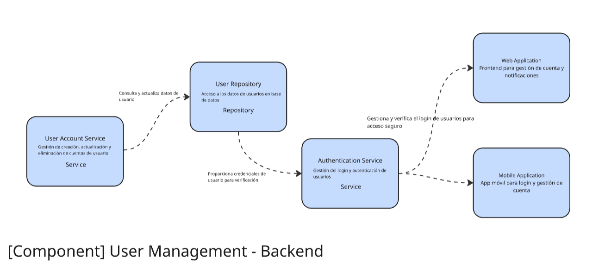

</div>

### 5.3.6. Bounded Context Software Architecture Code Level Diagrams

#### 5.3.6.1. Bounded Context Domain Layer Class Diagrams

<div align="justify">

User Profile Domain Layer diagram:


</div>

#### 5.3.6.2. Bounded Context Database Design Diagram

<div align="justify">

User Profile database diagram:


</div>

## 5.4. Bounded Context: Automated Irrigation Control

<div align="justify">

Este contexto se encarga de la gestión integral y automatización del sistema de riego dentro de AgroSense. La correcta integración de esta capa asegura que los cultivos reciban la cantidad óptima de agua en el momento más oportuno, mejorando significativamente la eficiencia agrícola y reduciendo el desperdicio de recursos hídricos, contribuyendo a una agricultura sostenible.

</div>

### 5.4.1. Domain Layer

<div align="justify">

En esta capa se modelan las entidades y objetos que representan la lógica de negocio para la gestión del riego automatizado, interactuando de manera inteligente con sensores y dispositivos de riego.

**IrrigationZone**: Entidad que representa una zona específica en el campo que puede ser irrigada por un sistema de riego. Contiene atributos detallados como el área total de la zona, tipo de cultivo específico, parámetros de riego necesarios según las características del suelo y requerimientos nutricionales de las plantas.

**IrrigationSystem**: Entidad que gestiona el sistema de riego completo e integrado, desde las válvulas de control hasta los sensores de humedad, controlando la distribución precisa del agua en diferentes zonas del campo según algoritmos de optimización.

**WateringSchedule**: Objeto de valor que define el horario óptimo y la cantidad precisa de agua que se debe aplicar en una zona de riego, calculado en función de los datos de humedad del suelo, tipo de cultivo, condiciones climáticas y etapa de crecimiento.

**SoilMoistureSensor**: Objeto de valor que representa los sensores de humedad instalados estratégicamente en el campo, proporcionando datos en tiempo real de alta precisión para activar o desactivar el riego en las zonas correspondientes de manera automatizada.

</div>

### 5.4.2. Interface Layer

<div align="justify">

Esta capa proporciona las interfaces necesarias para la configuración y monitoreo del sistema de riego automatizado, permitiendo la interacción intuitiva con usuarios y la captura eficiente de datos para el control preciso del riego.

**IrrigationConfiguration**: Estructura de datos que permite a los usuarios definir y configurar las zonas de riego de manera detallada, así como establecer horarios específicos y parámetros técnicos para cada zona según las características del cultivo.

**IrrigationStatus**: Estructura que muestra el estado actual completo de los sistemas de riego, incluyendo la cantidad total de agua distribuida, estado operativo de todos los sensores, zonas activas en tiempo real y eficiencia del sistema.

**WateringRequest**: Estructura que recoge solicitudes específicas para activar o desactivar el riego en una zona determinada, ajustada automáticamente a las condiciones actuales de humedad y las preferencias configuradas por el usuario.

</div>

### 5.4.3. Application Layer

<div align="justify">

Esta capa se encarga de gestionar el flujo de control inteligente del sistema de riego, activando y desactivando el riego según las condiciones ambientales y la configuración del usuario, sin involucrar directamente la lógica de negocio o la infraestructura de fondo.

**IrrigationControlService**: Servicio que orquesta el proceso completo de activación y desactivación del sistema de riego, ajustándose dinámicamente a los parámetros configurados por el usuario y los datos de humedad proporcionados por los sensores en tiempo real.

**WateringScheduleService**: Servicio que gestiona las actualizaciones y consultas sobre los horarios de riego y cantidades de agua requeridas, considerando las zonas específicas, condiciones climáticas actuales y pronósticos meteorológicos.

**SensorMonitoringService**: Servicio que monitorea continuamente los datos de los sensores de humedad y envía notificaciones automáticas o ejecuta acciones directas al sistema de riego para optimizar el uso eficiente del agua y mantener condiciones óptimas del suelo.

</div>

### 5.4.4. Infrastructure Layer

<div align="justify">

En esta capa se encuentran los componentes encargados de la persistencia de datos de riego y la integración con sistemas externos, como sensores de humedad avanzados y válvulas de riego automatizadas.

**IrrigationRepository**: Repositorio encargado de almacenar y recuperar las configuraciones de riego y las definiciones de zonas de irrigación, manteniendo historial de cambios y configuraciones optimizadas.

**SensorDataRepository**: Repositorio que almacena los datos históricos de sensores de humedad y otros datos ambientales relacionados con el sistema de riego, permitiendo análisis de tendencias y optimización predictiva.

**IrrigationDeviceController**: Componente que se encarga de la interacción directa con los dispositivos físicos de riego (válvulas electrónicas, bombas de agua, sensores), activando o desactivando las operaciones basándose en los datos recibidos del sistema de control centralizado.

</div>

### 5.4.5. Bounded Context Software Architecture Component Level Diagrams

<div align="justify">

Automated Irrigation Control Component Diagram:


</div>

### 5.4.6. Bounded Context Software Architecture Code Level Diagrams

#### 5.4.6.1. Bounded Context Domain Layer Class Diagrams

<div align="justify">

Automated Irrigation Control Domain Layer diagram:


</div>

#### 5.4.6.2. Bounded Context Database Design Diagram

<div align="justify">

Automated Irrigation Control database diagram:


</div>

## 5.5. Bounded Context: Field Registration & Management

<div align="justify">

Este contexto se encarga de gestionar el registro completo, seguimiento detallado y administración integral de los campos agrícolas dentro de AgroSense. Permite a los usuarios registrar y configurar las propiedades específicas de sus campos, tales como la ubicación geográfica precisa, el tipo de cultivo seleccionado y las características particulares del suelo. Una gestión adecuada de esta información facilita significativamente la toma de decisiones estratégicas en la optimización de recursos y mejora sustancial de la productividad agrícola.

</div>

### 5.5.1. Domain Layer

<div align="justify">

En esta capa se encuentran las entidades y objetos de valor relacionados con el registro y administración integral de campos agrícolas, incluyendo la configuración detallada de cultivos y las características específicas del terreno.

**Field**: Entidad que representa un campo agrícola completo dentro del sistema. Contiene información detallada sobre su ubicación geográfica exacta, tamaño en hectáreas, tipo específico de cultivo y otras características asociadas importantes, como el tipo de suelo predominante, disponibilidad de sistemas de riego y topografía del terreno.

**SoilType**: Objeto de valor que representa el tipo específico de suelo de un campo determinado. Incluye propiedades técnicas como la textura del suelo, nivel de pH, capacidad de retención de agua, contenido de nutrientes y características de drenaje natural.

**Crop**: Entidad que define el tipo específico de cultivo que se está cultivando en un campo. Incluye información técnica sobre las necesidades hídricas específicas, tiempo estimado de cosecha, requerimientos nutricionales detallados y características de crecimiento según la variedad seleccionada.

**FieldConfiguration**: Objeto de valor que guarda la configuración personalizada y optimizada para un campo específico, como las preferencias de riego automatizado, métodos de fertilización recomendados, prácticas agrícolas aplicadas y cronogramas de mantenimiento específicos.

</div>

### 5.5.2. Interface Layer

<div align="justify">

Esta capa permite la interacción eficiente entre el sistema y el usuario para registrar y gestionar los campos agrícolas, proporcionando la interfaz necesaria para la entrada de datos y visualización de información relevante.

**FieldRegistrationForm**: Estructura que permite a los usuarios registrar un nuevo campo de manera completa, incluyendo detalles específicos como la ubicación GPS exacta, el tamaño preciso del terreno y el tipo de cultivo seleccionado con sus características particulares.

**FieldManagementDashboard**: Interfaz que presenta un panel de control integral para gestionar todos los campos registrados, mostrando información clave como el estado actual del cultivo, registros históricos de riego, recomendaciones personalizadas de fertilización y alertas de mantenimiento.

**CropSelectionForm**: Estructura que permite a los usuarios seleccionar el tipo específico de cultivo para un campo registrado, teniendo en cuenta factores críticos como la temporada de siembra, condiciones climáticas locales y requerimientos específicos del tipo de suelo.

</div>

### 5.5.3. Application Layer

<div align="justify">

En esta capa se gestionan los procesos que orquestan las operaciones sobre los campos agrícolas, coordinando eficientemente las actividades entre las entidades de dominio y la infraestructura técnica.

**FieldRegistrationService**: Servicio encargado de gestionar el proceso completo de registro de un nuevo campo, asegurándose de que toda la información necesaria sea ingresada correctamente, validada técnicamente y almacenada de manera segura en el sistema.

**FieldManagementService**: Servicio que coordina las operaciones para administrar los campos de manera integral, incluyendo la actualización de información de cultivos, el seguimiento continuo de las condiciones del campo y la generación de recomendaciones específicas de acciones agrícolas.

**CropManagementService**: Servicio que orquesta el registro y gestión detallada de los cultivos dentro de un campo, actualizando sus características específicas y necesidades según la etapa actual de crecimiento y las condiciones ambientales predominantes.

</div>

### 5.5.4. Infrastructure Layer

<div align="justify">

Esta capa se encarga de los detalles técnicos relacionados con la persistencia segura de los datos de campos y cultivos, así como la integración con sistemas externos para la gestión optimizada de recursos.

**FieldRepository**: Repositorio encargado de almacenar y recuperar la información completa de los campos registrados, incluidos los detalles sobre la ubicación geográfica, el tipo de cultivo especificado y el estado actual de los cultivos con su evolución histórica.

**CropRepository**: Repositorio que gestiona el almacenamiento y recuperación de la información detallada sobre los cultivos, sus características técnicas específicas y el seguimiento continuo de su evolución y desarrollo a lo largo del ciclo de crecimiento.

**SoilDataRepository**: Repositorio que almacena los datos relacionados con las propiedades específicas del suelo, como el tipo de suelo clasificado, capacidad de retención de agua, niveles de nutrientes y características químicas relevantes para la optimización del cultivo.

</div>

### 5.5.5. Bounded Context Software Architecture Component Level Diagrams

<div align="justify">

Field Registration and Management Component Diagram:


</div>

### 5.5.6. Bounded Context Software Architecture Code Level Diagrams

#### 5.5.6.1. Bounded Context Domain Layer Class Diagrams

<div align="justify">

Field Registration and Management Domain Layer diagram:


</div>

#### 5.5.6.2. Bounded Context Database Design Diagram

<div align="justify">

Field Registration and Management database diagram:


</div>

## 5.6. Bounded Context: Crop Monitoring & Field Data Management

<div align="justify">

Este contexto está encargado de la recopilación sistemática, monitoreo continuo y análisis avanzado de los datos relacionados con los cultivos y las condiciones del terreno. Permite a los usuarios obtener información detallada y actualizada sobre la salud y el progreso de los cultivos, lo que facilita significativamente la toma de decisiones informadas para mejorar el rendimiento agrícola y optimizar el uso eficiente de recursos disponibles.

</div>

### 5.6.1. Domain Layer

<div align="justify">

En esta capa se encuentran las entidades y objetos de valor que representan los datos recopilados de los cultivos y el campo, así como la lógica especializada que se utiliza para analizarlos y extraer información relevante y accionable.

**CropMonitoringData**: Entidad que almacena los datos recopilados de los sensores relacionados específicamente con el cultivo, como humedad del suelo, temperatura ambiental, niveles de fertilización aplicados y otros indicadores importantes para el seguimiento preciso del desarrollo de los cultivos.

**FieldData**: Entidad que agrupa la información sobre el estado general del campo, incluyendo datos climáticos locales, el tipo específico de cultivo, la actividad de riego registrada y otros parámetros ambientales que afectan directamente el rendimiento y la productividad de la agricultura.

**ClimateData**: Objeto de valor que contiene los datos climáticos recolectados específicamente para un campo, como la temperatura máxima y mínima, humedad relativa del aire, radiación solar recibida y precipitaciones registradas, los cuales son fundamentales para realizar predicciones precisas sobre las condiciones óptimas de crecimiento de los cultivos.

**GrowthStage**: Objeto de valor que representa las diferentes etapas de crecimiento de un cultivo, desde la siembra inicial hasta la cosecha final. Incluye indicadores específicos que permiten determinar con precisión cuándo un cultivo está listo para ser cosechado o si requiere intervenciones específicas como fertilización adicional o tratamientos preventivos.

</div>

### 5.6.2. Interface Layer

<div align="justify">

Esta capa presenta las interfaces que permiten a los usuarios consultar y analizar de manera eficiente los datos relacionados con sus cultivos, facilitando la visualización clara de la información y la toma de decisiones estratégicas basadas en datos.

**CropMonitoringDashboard**: Interfaz que presenta un panel de control completo donde los usuarios pueden visualizar el estado en tiempo real de sus cultivos, incluyendo los datos más relevantes y actualizados, como la humedad actual del suelo, condiciones climáticas predominantes y niveles óptimos de fertilización aplicados.

**FieldDataReport**: Interfaz que permite generar reportes detallados y personalizables sobre el estado integral del campo, incluyendo información histórica sobre el clima, las condiciones del suelo a lo largo del tiempo y el progreso documentado de los cultivos según diferentes períodos de análisis.

**GrowthStageOverview**: Interfaz que proporciona una visión general comprehensiva del progreso de los cultivos según su etapa actual de crecimiento, con recomendaciones específicas y personalizadas sobre las acciones a seguir en cada fase particular del desarrollo del cultivo.

</div>

### 5.6.3. Application Layer

<div align="justify">

La capa de aplicación coordina las operaciones necesarias para acceder y procesar los datos del cultivo y el campo, proporcionando la lógica necesaria para la visualización eficiente y análisis avanzado de la información recopilada.

**CropMonitoringService**: Servicio que gestiona el proceso integral de recolección y análisis de los datos de los cultivos, asegurando que los sensores se comuniquen correctamente con el sistema central y que la información se presente de manera clara y comprensible a los usuarios finales.

**FieldDataAnalysisService**: Servicio encargado de procesar y analizar de manera avanzada los datos recopilados sobre el terreno y los cultivos, generando predicciones precisas y recomendaciones específicas sobre el mejor uso de los recursos agrícolas disponibles y estrategias de optimización.

**GrowthStageAnalysisService**: Servicio que se encarga de analizar el progreso detallado de los cultivos en función de su etapa específica de crecimiento, sugiriendo acciones concretas y oportunas como el riego programado o la fertilización necesaria requeridas en cada fase particular del desarrollo.

</div>

### 5.6.4. Infrastructure Layer

<div align="justify">

Esta capa incluye los componentes que gestionan la persistencia y el acceso eficiente a los datos recopilados sobre los cultivos y las condiciones del campo, así como la integración con sistemas externos especializados de monitoreo agrícola.

**CropMonitoringRepository**: Repositorio encargado de almacenar y recuperar los datos de monitoreo de los cultivos, como la humedad del suelo, temperatura ambiental y otros parámetros clave para el análisis del desarrollo de los cultivos a lo largo del tiempo.

**FieldDataRepository**: Repositorio que almacena los datos relacionados con el campo, incluidos los datos climáticos históricos y actuales, la actividad registrada de los cultivos y tendencias de productividad para análisis comparativos y predictivos.

**ClimateDataRepository**: Repositorio que gestiona el almacenamiento y recuperación de los datos climáticos específicos de un campo, que se utilizan para analizar las condiciones externas que afectan significativamente a los cultivos y para generar pronósticos de crecimiento optimizados.

</div>

### 5.6.5. Bounded Context Software Architecture Component Level Diagrams

<div align="justify">

Crop Monitoring & Field Data Management Component Diagram:


</div>

### 5.6.6. Bounded Context Software Architecture Code Level Diagrams

#### 5.6.6.1. Bounded Context Domain Layer Class Diagrams

<div align="justify">

Crop Monitoring & Field Data Management Domain Layer diagram:


</div>

#### 5.6.6.2. Bounded Context Database Design Diagram

<div align="justify">

Crop Monitoring & Field Data Management database diagram:


</div>

# Capítulo VI: *Capítulo VI: Solution UX Design*
## 6.1. Style Guidelines

<div align="justify">

Un manual de estilo es un documento que establece reglas y pautas visuales, organizativas y de redacción con el fin de garantizar la uniformidad y la coherencia en la creación y diseño tanto de materiales comunicativos como de productos digitales. A continuación se exponen las pautas empleadas para la configuración del proyecto.

</div>

### 6.1.1. General Style Guidelines

#### Brand Name
<div align="justify">

Verdeva es más que una solución tecnológica: es una promesa de transformación para la agricultura de pequeños y medianos productores en Sudamérica. El nombre evoca innovación, sostenibilidad y precisión, pilares que definen esta herramienta inteligente para el manejo eficiente de la fertilización y el riego agrícola.

Diseñado con un enfoque humano y técnico, Verdeva transmite confianza, modernidad y conexión con la tierra, reflejando el equilibrio entre tecnología avanzada y respeto por el medio ambiente. Su sonoridad es clara y memorable, facilitando su adopción por usuarios tanto en entornos rurales como digitales. Representa el puente entre el conocimiento agronómico y la acción automatizada, acercando a los productores a una agricultura más rentable, eficiente y resiliente frente al cambio climático.


</div>


#### Typography
<div align="justify">

Nunito es una fuente sans serif contemporánea, suave y muy fácil de leer, diseñada para ofrecer una experiencia visual accesible, cercana y profesional. Su uso en esta aplicación responde a la necesidad de equilibrar la tecnología detallada con una interfaz amigable y humana, enfocándose especialmente en los agricultores de pequeña y mediana escala en América del Sur.


</div>

#### Colors
<div align="justify">
La paleta de colores seleccionada para Verdeva se compone de tonos que reflejan los valores importantes de la marca. Verde oscuro como color principal, representa la vida, la agricultura y la sostenibilidad. Marrón medio, como color de soporte con fuerte vínculo con la tierra, el suelo y lo natural. Aporta calidez y autenticidad, generando una conexión emocional con el entorno rural. Gris oscuro, color neutro para texto principal y elementos funcionales. Aporta claridad, contraste y elegancia. Blanco, color de fondo principal. Limpio, moderno y minimalista.
</div>


### 6.1.2. Web, Mobile & Devices Style Guidelines
<div align="justify">

#### Versión web 
La versión en web de Verdeba implementa de manera uniforme las pautas de diseño y estilo para proporcionar una experiencia clara, útil y accesible desde cualquier navegador. Su estructura adaptable posibilita la adaptación a múltiples tamaños de pantalla, garantizando una navegación sin inconvenientes en computadoras y teléfonos móviles.

La tipografía Nunito, por ser cálida y fácil de leer, es ideal para públicos con diversos grados de experiencia digital. Los tonos de la combinación de colores que abarcan marrones terrosos, verdes intensos y grises sutiles fortalecen la identidad ecológica y agrícola de la marca; por su parte, los espacios vacíos aseguran una lectura ordenada y una interfaz libre de desorden visual.

Cada componente de la interfaz en línea está diseñado para dirigir al usuario intuitivamente, centrando su atención en la claridad, la acción directa y el vínculo emocional con la tecnología y la naturaleza. La combinación de elementos visuales y prácticos tiene como objetivo generar confianza, una sensación de profesionalismo y cercanía con el usuario rural y el técnico.


#### Versión móvil
La aplicación móvil de Verdeba ha sido creada teniendo en cuenta las necesidades del usuario en el entorno: permitir acceso inmediato, operar con una mano y facilitar una navegación sencilla en pantallas más pequeñas. Mantiene todas las directrices visuales —fuentes, tonalidades y diseño— ajustándolas de manera eficaz para dispositivos móviles, asegurando que no se comprometan ni la visibilidad ni el uso.

La experiencia en dispositivos móviles busca ser práctica, eficaz y fácil de usar, posibilitando que los agricultores accedan en tiempo real a información relevante y herramientas para tomar decisiones desde cualquier lugar. Esta edición muestra el compromiso de la marca con una tecnología que es accesible, útil y relacionada con el entorno rural.

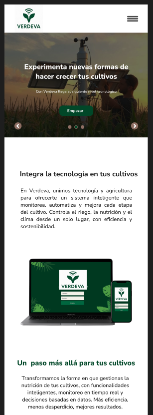

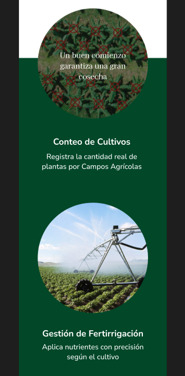

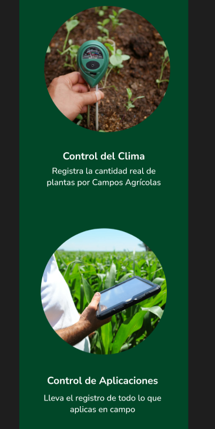


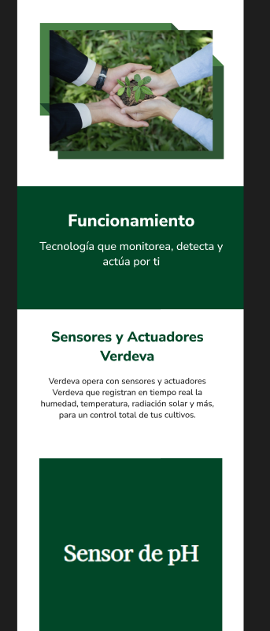


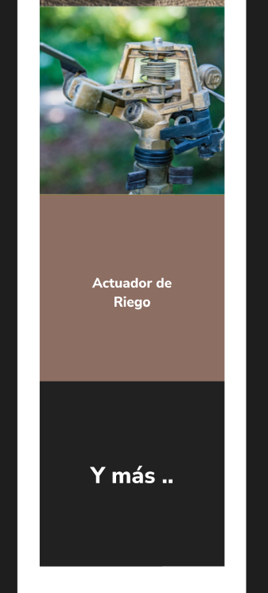

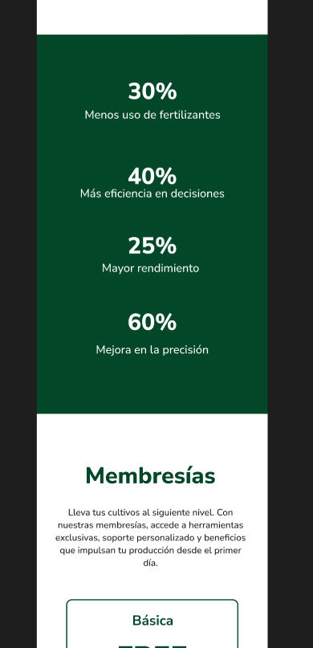


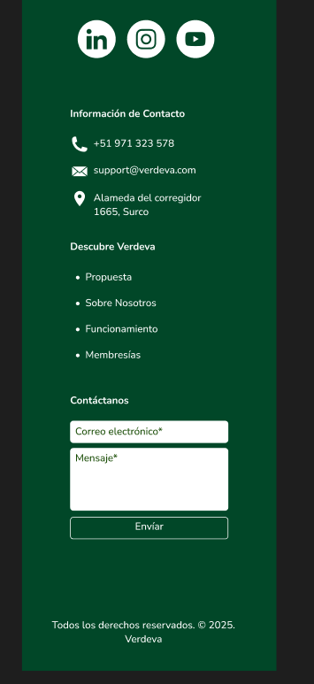

</div>


### 6.2. Information Architecture

Esta sección define cómo Verdeva organiza, nombra, navega y permite encontrar la información en la **Landing Page**, la **Web App** y la **App móvil**, de modo que productores/agricultores y técnicos de campo localicen lo necesario con el menor esfuerzo
#### 6.2.1. Labeling Systems

**Principios**
- **Claridad y brevedad:** 1–3 palabras en menús y chips.
- **Consistencia:** español neutro; sustantivo para entidades (“Cultivos”), verbo-sustantivo para acciones (“Crear tarea”).
- **Estados normalizados:** Pendiente | En curso | Vencida | Completada; Prioridad: Alta | Media | Baja.

**Convenciones (alineadas a Verdeva)**
- Menú principal: **Dashboard**, **Campos**, **Cultivos**, **Dispositivos**, **Tareas**, **Reportes**, **Ayuda**.
- Tarjeta de **Campo/Parcela**: **Ubicación**, **Cultivos activos**, **Alertas**.
- Tarjeta de **Cultivo**: **Tipo**, **Fenología**, **Salud**, **Última tarea**.
- **Tarea**: **Tipo** (Riego | Fertilización | Monitoreo), **Prioridad**, **Vence**, **Responsable**.
- **Filtros/Chips**: **Estado**, **Prioridad**, **Cultivo**, **Campo**, **Fecha**.
- **Iconografía**:
    - Riego 💧, Fertilización 🌿, Sensor IoT 📡, Alerta ⚠️, Reporte 📊, Ubicación 📍.
- **Glosario in-app** (tooltip): define **Fenología**, **CE**, **NDVI**, etc.
#### 6.2.2. Searching Systems

**Búsqueda global (omnibox)**
- Alcance: **Campos/Parcelas**, **Cultivos**, **Tareas/Alertas**, **Dispositivos IoT**, **Reportes**.
- **Autocompletar** por nombre de campo/cultivo/tarea.
- **Sinónimos y tolerancia a error:** “abonado” ≈ “fertilización”, “sensor” ≈ “dispositivo”.

**Búsquedas contextuales**
- En “Campos”, “Cultivos”, “Tareas” y “Dispositivos” con filtros específicos.

**Facetas / Filtros**

- **Entidad:** Campo, Cultivo, Responsable.
- **Estado/Prioridad:** Pendiente/En curso/Vencida/Completada; Alta/Media/Baja.
- **Temporal:** Hoy, Últimos 7 días, Mes, Rango.
- **IoT:** Tipo de sensor (humedad/temperatura/pH/CE), **alertas activas**.

**Ordenamiento**
- Relevancia (coincidencia + prioridad + vencimiento), **Fecha**, **Urgencia**.

**Resultados**
- Agrupados por tipo (Tareas / Cultivos / Campos / Dispositivos / Reportes), **resaltado** de coincidencias, y **acciones rápidas** (Abrir | Editar | Completar).

**Vacíos y errores**
- Sugerencias de filtros cercanos y **atajo para crear** la entidad si no existe.

**Rendimiento y seguridad**
- Debounce 250–400 ms; paginación/infinite scroll; visibilidad conforme a permisos por rol.
#### 6.2.4. SEO Tags and Meta Tags

Verdeva implementa una estrategia de SEO para mejorar su visibilidad y posicionamiento en motores de búsqueda, atrayendo a usuarios interesados en la gestión agrícola con IoT. Las meta-etiquetas optimizan la experiencia web y ayudan a que los productores y técnicos encuentren fácilmente información sobre campos, cultivos, tareas y monitoreo.

```
<title>Verdeva (SmartCrops) - Gestión inteligente de campos y cultivos</title>
```

<title>Verdeva (SmartCrops): Gestión inteligente de campos y cultivos</title>
<title>Verdeva (SmartCrops) - Gestión inteligente de campos y cultivos</title>
**Descripción:** La meta-description resume la solución y el beneficio principal.
```
<meta name="description" content="Verdeva optimiza riego, fertilización y monitoreo IoT para aumentar el rendimiento de tus cultivos con tareas y tableros en tiempo real." />
```

**Palabras clave:** Palabras clave orientativas para mejorar descubribilidad (sin sobrecarga).
```
<meta name="keywords" content="agricultura de precisión, gestión de cultivos, riego inteligente, fertilización, IoT agrícola, monitoreo de campos" />
```

**Autor y derechos de autor:** Identifica autoría y propiedad intelectual.
```
<meta name="author" content="Equipo SmartCrops - Verdeva" />
<meta name="copyright" content="© 2025 SmartCrops" />
```

**Open Graph (para compartir en redes):** Controla cómo se previsualiza el sitio
```
<meta property="og:type" content="website" />
<meta property="og:title" content="Verdeva: Gestión inteligente de cultivos" />
<meta property="og:description" content="Riego y fertilización optimizados, sensores IoT y dashboards en tiempo real." />
<meta property="og:image" content="https://smartcrops.example/og-cover.jpg" />
<meta property="og:url" content="https://smartcrops.example/" />
```

**Twitter Cards:** Optimiza la tarjeta en X/Twitter.
```
<meta name="twitter:card" content="summary_large_image" />
<meta name="twitter:title" content="Verdeva: Gestión inteligente de cultivos" />
<meta name="twitter:description" content="Planifica tareas, integra IoT y decide con datos." />
<meta name="twitter:image" content="https://smartcrops.example/og-cover.jpg" />
```

**PWA y mobile:** Preferencias de tema y manifiesto para una buena experiencia en móviles.
```
<link rel="manifest" href="/site.webmanifest" />
<meta name="theme-color" content="#0E7C86" />
```

**Robots (áreas privadas de la Web App):** Evita indexar vistas tras login o con datos sensibles.
```
<meta name="robots" content="noindex, nofollow" />
```

**Schema.org (JSON-LD):** Datos estructurados para enriquecer el resultado en buscadores.
```
<script type="application/ld+json">
{
  "@context": "https://schema.org",
  "@type": "Product",
  "name": "Verdeva",
  "brand": { "@type": "Organization", "name": "SmartCrops" },
  "description": "Gestión de campos y cultivos con tareas inteligentes, IoT y dashboards en tiempo real.",
  "url": "https://smartcrops.example/",
  "image": "https://smartcrops.example/og-cover.jpg",
  "offers": {
    "@type": "Offer",
    "priceCurrency": "USD",
    "price": "0",
    "availability": "https://schema.org/InStock"
  }
}
</script>
```

**ASO (App Store Optimization) para la app móvil:** Elementos para ficha en tiendas.

```
App Title: Verdeva – Gestión de Cultivos
Subtitle (iOS): Riego, tareas e IoT agrícola
Short description (Play): Gestión de campos, tareas y sensores IoT para mayor rendimiento.
Full description: Verdeva centraliza la gestión agrícola: crea campos y cultivos, planifica riego y fertilización, recibe alertas de sensores IoT y visualiza KPIs en tiempo real. Prioriza tareas por urgencia y colabora con tu equipo desde el campo.
Keywords (iOS): agricultura, riego inteligente, cultivos, IoT, fertilización, campo, agro
Categoría: Productividad / Negocios
Deep links: verdeva://campo/{id} | verdeva://tarea/{id}
```

#### 6.2.5. Navigation Systems

Nos centramos en diseñar un sistema de navegación eficiente, intuitivo y adaptable que permita a los usuarios de Verdeva moverse con facilidad por las distintas funcionalidades de la plataforma. El objetivo es garantizar que los productores puedan gestionar sus campos y cultivos sin esfuerzo, disfrutando de una experiencia de usuario fluida y coherente.

##### Barra de navegación superior
La barra principal agrupa las funciones clave de Verdeva, incluyendo:  
- Gestión de campos y parcelas.  
- Visualización del estado de los cultivos.  
- Acceso a los dispositivos IoT.  
- Configuración de alertas y notificaciones.

Cada ícono ha sido diseñado con una lógica visual simple y reconocible, lo que permite que el usuario se desplace fácilmente entre las secciones principales.

##### Navegación jerárquica por niveles
Verdeva implementa una navegación jerárquica que permite a los usuarios explorar la información de manera estructurada, pasando desde una vista general de todos sus campos hasta los detalles de cada cultivo y sus tareas específicas. Esta organización evita la desorientación y facilita una comprensión clara del estado y las acciones necesarias en cada área productiva.

##### Navegación rápida hacia tareas pendientes
Mediante un sistema de accesos directos, Verdeva permite al usuario acceder rápidamente a sus tareas pendientes, como:  
- Riegos programados.  
- Aplicaciones de fertilizantes.  
- Revisión de alertas o reportes.  

Estas acciones pueden iniciarse desde un botón flotante o notificaciones contextuales en la barra superior, optimizando el tiempo de respuesta del productor.

##### Menú lateral contextual
Además de la barra superior, Verdeva incorpora un menú lateral contextual que se adapta dinámicamente según la sección en la que se encuentre el usuario. Este enfoque garantiza que las opciones disponibles siempre sean relevantes, reduciendo la sobrecarga visual y mejorando la eficiencia al acceder a herramientas o configuraciones específicas.

### 6.3. Landing Page UI Design
#### 6.3.1. Landing Page Wireframe
A continuación, se presentan los prototipos iniciales de la landing page de Verdeva, diseñados para mostrar la estructura base, la disposición de los elementos y la propuesta visual preliminar.


#### 6.3.2. Landing Page Mock-up
A continuación, se presentan los mockups  de la landing page de Verdeva, diseñados para ilustrar la propuesta visual final de la interfaz, incluyendo la disposición de los elementos, el uso de colores, tipografía y estilo gráfico general.

- Web Version: 


-Mobile version:


Los prototipos fueron elaborados en Figma. El enlace al proyecto es el siguiente:
https://www.figma.com/design/eWAZhPqWYhBh6791cz56SC/Verdeva?node-id=0-1&t=tay6ewBm7eF7RCzT-1


### 6.4. Applications UX/UI Design
#### 6.4.1. Applications Wireframes

**App web:**

<br>

 

 

 

 

 

 

 

**App mobile:**

<br>

<p align="center">
  
  
  
  
  

</p>
<br>

#### 6.4.2. Applications Wireflow Diagrams

**App web:**
<br>

**Wireflow 1:** Como productor, quiero poder registrar campos agrícolas para llevar un control claro de mis terrenos.

 

**Wireflow 2:** Como productor, quiero poder visualizar recomendaciones para cada uno de mis campos agrícolas, para tomar decisiones informadas sobre el manejo del cultivo.

 

**Wireflow 3:** Como productor, quiero poder acceder a análisis predictivos sobre mis campos agrícolas, para anticiparme a posibles problemas.

 

**Wireflow 4:** Como productor, quiero poder adquirir una membresía, para acceder a funciones avanzadas que mejoren la gestión.

 

**Wireflow 5:** Como productor, quiero poder agregar un dispositivo IoT nuevo a un cultivo, para mejorar el monitoreo y control.

 


**App mobile:**
<br>

**Wireflow 6:** Como productor, quiero poder ver datos generales de mis campos para poder tomar decisiones informadas sobre el manejo agrícola.

<p align="center">
  
</p>

**Wireflow 7:** Como productor, quiero poder agregar un nuevo cultivo en uno de mis campos para gestionar su seguimiento y planificación desde la aplicación.

<p align="center">
  
</p>


**Wireflow 8:** Como productor, quiero poder eliminar un dispositivo IoT vinculado a mi campo para mantener actualizada la infraestructura.

<p align="center">
  
</p>


**Wireflow 9:** Como productor rural, quiero poder recibir notificaciones, para estar al tanto de alertas importantes relacionados con mis campos.

<p align="center">
  
</p>


**Wireflow 10:** Como productor, quiero poder eliminar campos agrícolas registrados, para mantener organizada la información de mis terrenos en la aplicación.

<p align="center">
  
</p>


#### 6.4.3. Applications Mock-ups

**App web:**

<br>

 

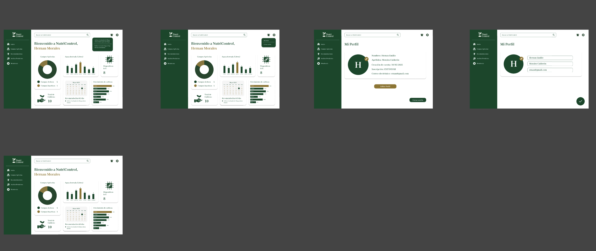 

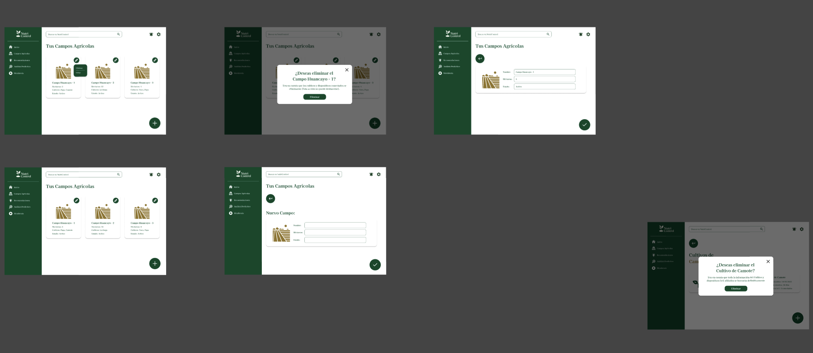 

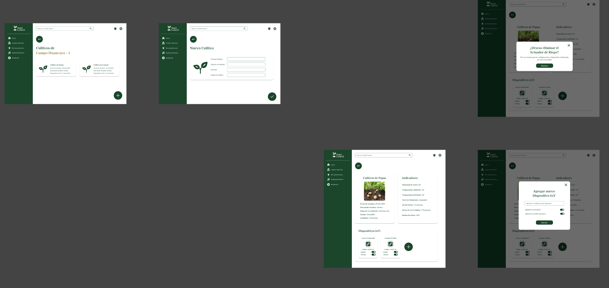 

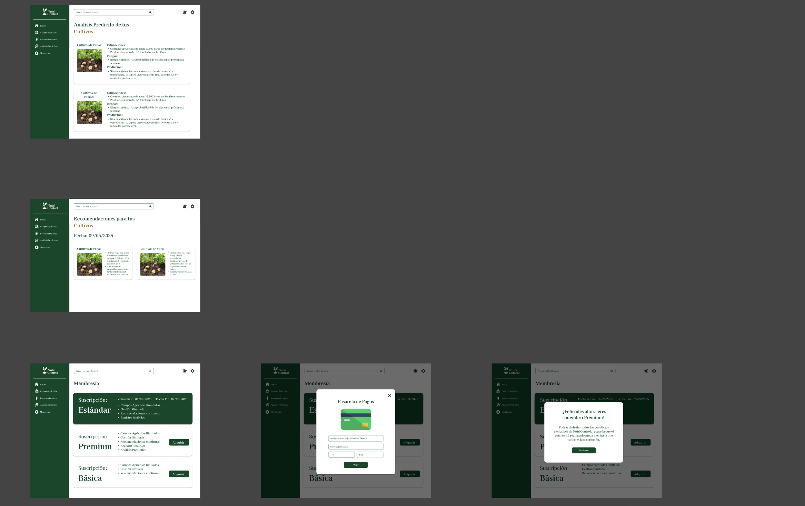 

<br>

**App mobile:**

<br>

<p align="center">
  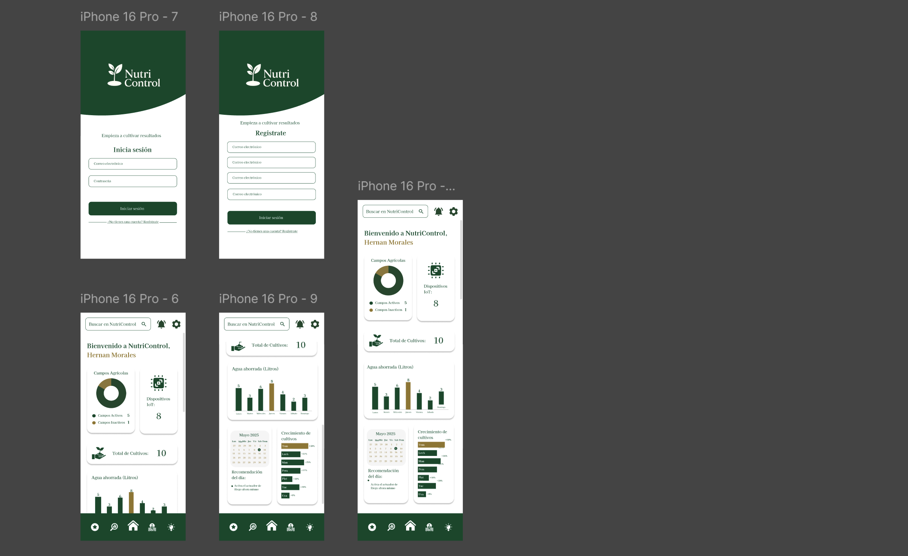
  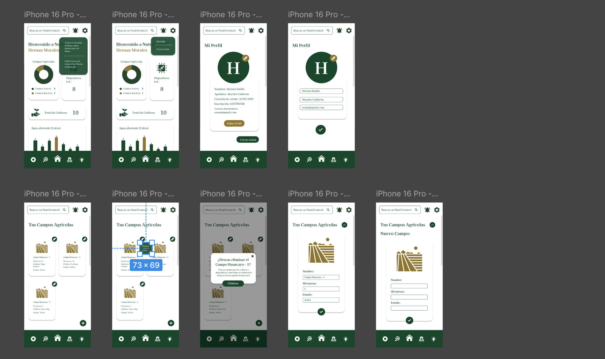
  
  

</p>

<br>

#### 6.4.4. Applications User Flow Diagrams

**App web:**

<br>

**User Flow 1:** Como usuario, quiero poder modificar con libertad mis datos, para mantener mi información actualizada.


**User Flow 2:** Como productor, quiero poder añadir nuevos cultivos registrados, para facilitar la gestión agrícola.


**User Flow 3:** Como productor, quiero poder recibir notificaciones, para estar al tanto de alertas importantes relacionados con mis campos.

<p align="center">
  
</p>


**User Flow 4:** Como productor, quiero poder eliminar campos agrícolas registrados, para mantener organizada la información de mis terrenos en la aplicación.


**User Flow 5:** Como productor, quiero poder modificar un campo agrícola existente, para corregir o actualizar la información del terreno según sea necesario.


**App mobile:**

<br>

**User Flow 6:** Como productor, quiero poder acceder a análisis predictivos sobre mis campos agrícolas, para anticiparme a posibles problemas.

<p align="center">
  
</p>


**User Flow 7:** Como usuario, quiero poder modificar con libertad mis datos, para mantener mi información actualizada.


**User Flow 8:** Como productor rural, quiero poder adquirir una membresía, para acceder a funciones avanzadas que mejoren la gestión.


**User Flow 9:** Como productor, quiero poder eliminar un cultivo registrado en mi campo para mantener actualizada la información y evitar confusiones en la gestión agrícola.


**User Flow 10:** Como productor, quiero poder registrar campos agrícolas para llevar un control claro de mis terrenos.


<br>


### 6.5. Applications Prototyping


**App web:**

<br>

 

**Enlace del Prototipo en Figma:** https://www.figma.com/proto/MIRlv95a1V86XWsO6RXOQe/NutriControl?node-id=240-4103&p=f&t=Qd7XjsL1SgQypE6c-1&scaling=min-zoom&content-scaling=fixed&page-id=1%3A2&starting-point-node-id=240%3A4103

<br>

**App mobile:**

<br>

 

**Enlace del Prototipo en Figma:** https://www.figma.com/proto/MIRlv95a1V86XWsO6RXOQe/NutriControl?node-id=406-1315&p=f&t=Dd7zkpzAU7ir00AW-1&scaling=scale-down&content-scaling=fixed&page-id=1%3A3&starting-point-node-id=406%3A1315

<br>

# Capítulo VII: Product Implementation, Validation & Deployment

## 7.1. Software Configuration Management

<div align="justify">

En esta sección se documentan las herramientas, convenciones, referencias y ajustes de configuración que el equipo usó durante el desarrollo. Estas prácticas fueron determinantes para asegurar la coherencia técnica, la trazabilidad de cambios y la calidad de las entregas.

</div>

### 7.1.1. Software Development Environment Configuration

<div align="justify">

Aquí se detallan las principales herramientas y servicios empleados para coordinar el trabajo del equipo, diseñar interfaces, desarrollar software y mantener la documentación técnica.

</div>

Project management

- Microsoft 365 (https://www.office.com/): utilizado para la redacción y edición colaborativa de documentos, control de versiones de documentos y organización de plazos y entregables.
- Google Meet (https://meet.google.com/): plataforma de videoconferencias para reuniones de planificación, demos y sincronización del equipo.

Requirements management

- Trello (https://trello.com/): tablero para gestionar el Product Backlog, priorizar tareas y visualizar el progreso por sprint.

Product UX/UI Design

- UXPressia (https://uxpressia.com/): creación de mapas de empatía, customer journeys y artefactos de research.
- Figma (https://www.figma.com/): diseño de wireframes, prototipos interactivos y especificaciones de UI para web y móvil.
- Canva (https://www.canva.com/): producción de recursos gráficos, banners y elementos visuales para comunicación y prototipos.

Software development

- Backend: .NET / ASP.NET Core — desarrollo de una API RESTful para exponer la lógica de negocio y los servicios del sistema.
- Mobile App: Android Studio (Kotlin) — desarrollo nativo para Android con foco en rendimiento y usabilidad.

Software documentation & modeling

- Vertabelo (https://vertabelo.com/): modelado de bases de datos y diseño del esquema relacional.
- LucidChart (https://lucid.app/): diagramas UML, diagramas de flujo y wireflows para documentar procesos.
- Structurizr (https://www.structurizr.com/): elaboración de diagramas C4 para describir la arquitectura del sistema.

### 7.1.2. Source Code Management

<div align="justify">

El equipo empleó GitHub como plataforma de control de versiones. Para organizar el desarrollo y facilitar la colaboración se aplicó el flujo GitFlow, que estructura las ramas y el proceso de liberación de versiones.

</div>

- Repositorios (referencias):
  - Organization: Ver Organización
  - Backend Repository: Ver Backend Repository
  - Report Repository: Ver Report Repository
  - Frontend Repository: Ver Frontend Repository
  - LandingPage Repository: Ver LandingPage Repository
  - MobileApp Repository: Ver MobileApp Repository

GitFlow (modelo de ramas)

- main: rama estable con versiones listas para producción.
- develop: rama de integración de las nuevas funcionalidades.

Ramas auxiliares:

- feature/* — ramas para nuevas funcionalidades que, al completarse, se integran en develop.
- release/* — ramas que facilitan pruebas y ajustes antes de publicar una versión estable.
- hotfix/* — ramas para correcciones críticas que requieren despliegue inmediato en producción.

Convenciones de nomenclatura

- feature/nombre-de-la-caracteristica
- release/vX.Y.Z
- hotfix/descripcion-del-error

Convenciones de commit

- Se adoptó Conventional Commits para mensajes de commit, con prefijos como:
  - feat: nueva característica
  - fix: corrección de bug
  - docs: cambios en documentación
  - chore: tareas de mantenimiento

### 7.1.3. Source Code Style Guide & Conventions

<div align="justify">

Con el objetivo de mantener uniformidad y calidad del código, el equipo siguió convenciones adaptadas a los lenguajes y plataformas empleados. A continuación se resumen las reglas principales.

</div>

General Naming & Language Convention

- Idioma: Inglés para identificadores, mensajes y documentación técnica.
- Case styles:
  - camelCase: variables, funciones y métodos.
  - PascalCase: clases, interfaces y componentes.
  - kebab-case: nombres de archivos y componentes en plantillas HTML/CSS.
  - UPPER_SNAKE_CASE: constantes.
- Evitar abreviaciones y nombres poco descriptivos.

Mobile App (Kotlin con Android Studio)

- Guía: Kotlin Style Guide
- Convenciones:
  - Uso de camelCase para variables y funciones.
  - Clases en PascalCase.
  - Preferir val sobre var cuando sea posible.
  - Preferir funciones de extensión y utilidades que mejoren la testabilidad.

Frontend (Vue.js)

- Guía: Vue 3 Style Guide
- Convenciones:
  - Componentes en PascalCase.
  - Props y eventos en camelCase (script) y kebab-case (templates).
  - Archivos de componente en kebab-case.vue.

Backend (C# con ASP.NET Core)

- Guía: Microsoft C# Coding Conventions
- Convenciones:
  - Clases, métodos y propiedades en PascalCase.
  - Variables locales y parámetros en camelCase.
  - Uso generalizado de async/await para IO y acceso a recursos.
  - Inyección de dependencias y evitar "magic strings".

Gherkin (archivos .feature)

- Guía: Gherkin Conventions
- Convenciones:
  - Nombres de archivo en snake_case.feature.
  - Uso de Feature, Scenario, Given, When, Then y And.
  - Enfocar escenarios en comportamiento observable, no en implementación.

### 7.1.4. Software Deployment Configuration

Resumen

La solución Verdeva se despliega en una arquitectura distribuida en la nube. Actualmente incluye:

- Una Landing Page pública (Netlify).
- Una Web Application prototipo (Netlify).
- Un Backend (ASP.NET Core) desplegado en Microsoft Azure.
- Base de datos gestionada en MongoDB Atlas.

Objetivo de la sección: documentar el entorno de despliegue actual, el proceso de entrega continua y los planes de evolución para integrar dispositivos IoT y escalar la solución.

Entorno de despliegue

1) Landing Page

- Plataforma: Netlify
- URL pública: https://landingverdeva.netlify.app/
- Propósito: presentar la propuesta de valor, menú inicial y acceso público al producto.
- Despliegue: integración continua desde el repositorio mediante GitHub Actions (build + deploy automático).


2) Frontend Web Application

- Plataforma: Netlify
- URL pública: https://verdeva.netlify.app/login
- Propósito: prototipo y maquetación base de la interfaz web del producto.
- Despliegue: CI/CD con GitHub Actions; cada push a la rama principal genera un build y despliegue automático.


3) Backend

- Tecnología: C# con ASP.NET Core (API RESTful)
- URL de swagger (entorno de staging/producción): https://verdeva-ayagdeb0dceddwgw.canadacentral-01.azurewebsites.net/swagger/index.html
- Contenerización: imágenes Docker para facilitar portabilidad y despliegue en la nube.
- Seguridad: credenciales y parámetros sensibles almacenados en variables de entorno y/o servicios de gestión de secretos.
- Buenas prácticas: se sigue la guía Microsoft C# Coding Conventions para mantener código mantenible.


4) Base de datos

- Servicio: MongoDB Atlas (Cloud)
- Configuración: instancias gestionadas con acceso restringido por IP/credenciales; uso de usuarios con permisos mínimos necesarios.

Proceso de despliegue (resumen)

- Flujo general:
  1. Desarrollo local y ejecución de pruebas unitarias/integ. 
  2. Construcción de artefactos (build de frontend / imagen Docker del backend).
  3. Ejecución de pipelines CI (GitHub Actions) que realizan tests y builds.
  4. Despliegue automático a Netlify (frontend) y Azure Web App o contenedor registrado (backend).
  5. Variables de entorno y secretos gestionados fuera del repositorio (Azure Key Vault o variables de GitHub Actions/Azure).

- Notas de seguridad y operativas:
  - Las credenciales de MongoDB Atlas no deben almacenarse en el código. Usar variables de entorno y servicios de secretos.
  - Habilitar HTTPS en todos los endpoints públicos.
  - Monitorización básica (logs de aplicación, métricas de uso) y alertas para fallos críticos.

Planes futuros

- Integración de dispositivos IoT: planificar colas/streaming (MQTT / Kafka) y endpoints seguros para recepción de telemetría.
- Escalado del backend: configurar autoescalado en Azure, balanceo de carga y cache distribuido (Redis) para cumplir requisitos de rendimiento.
- Observabilidad: integración con herramientas de monitorización y trazabilidad (Application Insights / Prometheus + Grafana).

### 7.2. Solution Implementation
#### 7.2.1. Sprint 1

Para este primer Sprint hemos definido como objetivo desarrollar las principales pantallas de nuestra aplicación web y la primera versión de nuestro backend.

##### 7.2.1.1. Sprint Planning 1

| Campo | Detalle |
|---|---|
| Sprint # | Sprint 1 |
| Sprint Planning Background | Planificación inicial del equipo para organizar entregables y responsabilidades |
| Date | 2025-10-28 |
| Time | 15:00 pm |
| Location | Virtual por Zoom |
| Prepared By | Pinto Fuentes Rivera, Alvaro Felipe |
| Attendees (to planning meeting) | Pinto Fuentes Rivera, Alvaro Felipe; Espinoza Saenz, Christian Renato; Chirinos Zúñiga, Rodrigo Manuel; Litano Liza, Joel Alexander; Isla Quispe, Luis Fernando |
| Sprint 1 Goal | Desplegar la primera versión de nuestra Landing Page, Aplicación Web y Backend. |

##### 7.2.1.2. Sprint Backlog 1.
A continuación se presenta el Sprint Backlog 1, que incluye todas las User Stories (US) del trabajadas, excluyendo las Technical Stories (TS). Se indica responsable y estimación para cada US. Las US están agrupadas según su contexto (Landing Page, Web Application y Mobile Application).

| Tipo                         | User Story ID | Título                                               | Descripción principal                                                          | Estimación (Horas) | Responsable(s)                      | Estado |
| ---------------------------- | ------------- | ---------------------------------------------------- | ------------------------------------------------------------------------------ | ------------------ | ----------------------------------- | ------ |
| **Landing Page**             |               |                                                      |                                                                                |                    |                                     |        |
|                              | US-01         | Información de Verdeva                               | Implementar sección de información en la landing page                          | 2                  | Pinto Fuentes Rivera, Alvaro Felipe | Done   |
|                              | US-02         | Características de Verdeva                           | Implementar sección de características en la landing page                      | 2                  | Pinto Fuentes Rivera, Alvaro Felipe | Done   |
|                              | US-03         | Sección de planes o membresías                       | Implementar sección de planes en la landing page                               | 2                  | Pinto Fuentes Rivera, Alvaro Felipe | Done   |
| **Web y Mobile Application** |               |                                                      |                                                                                |                    |                                     |        |
|                              | US-04         | Registro de Usuario                                  | Crear funcionalidad para el registro del usuario                               | 4                  | Chirinos Zúñiga, Rodrigo Manuel     | Done   |
|                              | US-05         | Inicio de Sesión                                     | Crear funcionalidad para el inicio de sesión                                   | 4                  | Chirinos Zúñiga, Rodrigo Manuel     | Done   |
|                              | US-07         | Adición de Campos Agrícolas                          | Crear funcionalidad para agregar campos agrícolas                              | 4                  | Espinoza Saenz, Christian Renato    | Done   |
|                              | US-08         | Edición de Campos Agrícolas                          | Crear funcionalidad para editar los campos agrícolas agregados                 | 5                  | Espinoza Saenz, Christian Renato    | Done   |
|                              | US-09         | Eliminación de Campos Agrícolas                      | Crear funcionalidad para eliminar campos agrícolas                             | 5                  | Espinoza Saenz, Christian Renato    | Done   |
|                              | US-10         | Registro de Cultivos                                 | Crear funcionalidad para el registro de cultivos                               | 5                  | Litano Liza, Joel Alexander         | Done   |
|                              | US-11         | Edición de Cultivos                                  | Crear funcionalidad para editar los cultivos agregados                         | 4                  | Espinoza Saenz, Christian Renato    | Done   |
|                              | US-12         | Eliminación de Cultivos                              | Crear funcionalidad para eliminar cultivos agregados                           | 4                  | Espinoza Saenz, Christian Renato    | Done   |
|                              | US-13         | Conectar y Adicionar Dispositivos IOT a mis Cultivos | Crear funcionalidad conectar y agregar los sensores a los cultivos respectivos | 6                  | Isla Quispe, Luis Fernando          | Done   |
|                              | US-14         | Desconectar Dispositivos IOT a mis Cultivos          | Crear funcionalidad para desconectar los sensores deseados                     | 6                  | Isla Quispe, Luis Fernando          | Done   |
|                              | US-17         | Recomendaciones y Toma de decisión de los Cultivos   | Crear funcionalidad para las recomendaciones de la IA                          | 6                  | Pinto Fuentes Rivera, Alvaro Felipe | Done   |
|                              | US-23         | Configuración de Cuenta                              | Crear funcionalidad para que el usuario pueda personalizar su cuenta           | 4                  | Litano Liza, Joel Alexander         | Done   |

##### 7.2.1.3. Development Evidence for Sprint Review.

**Landing Page:**
|Repository| Branch| Commit Id| Commit Message |Commit Message Body| Commited on (Date)|
|----|-----|------|-----|----|---|
|https://github.com/SmartCrops-ArquiDeSoftwareEmergentes/Landing-Page-Verdeva| main | d10ad8ba2655b3197904edd40aca24e5b912771e|chore: initial commit|-|09/10/2025|

**Web Application:**
|Repository| Branch| Commit Id| Commit Message |Commit Message Body| Commited on (Date)|
|----|-----|------|-----|----|---|
|https://github.com/SmartCrops-ArquiDeSoftwareEmergentes/Front-End-Verdeva| main | 4aa16b3dbf2c0048be2946201651b0f7cabe0a17|chore: initial commit|-|05/10/2025|
|https://github.com/SmartCrops-ArquiDeSoftwareEmergentes/Front-End-Verdeva| main | 117cb0c9b253e4b35018942b93c79c3d388c37fb|feat: changed styles|-|05/10/2025|
|https://github.com/SmartCrops-ArquiDeSoftwareEmergentes/Front-End-Verdeva| main | c242cf3cfef5f3a2f627c52ee8c0e9ce193396d9|feat: api deployed added|-|07/10/2025|
|https://github.com/SmartCrops-ArquiDeSoftwareEmergentes/Front-End-Verdeva| main | 087e67ba880845a57b931384b7f4644b7fab10e9|feat: realtime sensors styles fixed|-|29/10/2025|
|https://github.com/SmartCrops-ArquiDeSoftwareEmergentes/Front-End-Verdeva| main | 1086eafdcbe8fbddcf3cd3259e807b8b831f07fa|feat: added first version of ai recommendations|-|30/10/2025|
|https://github.com/SmartCrops-ArquiDeSoftwareEmergentes/Front-End-Verdeva| main | 6c7dcb5721cac4a5c9644762bab0c5fc79ac8bad|feat: ai recommendation improved|-|08/11/2025|
|https://github.com/SmartCrops-ArquiDeSoftwareEmergentes/Front-End-Verdeva| main | 2d9a1bc14ab278d9979926e548d30d66322aa9b3|feat: sensors recommendations improved|-|10/11/2025|
|https://github.com/SmartCrops-ArquiDeSoftwareEmergentes/Front-End-Verdeva| main | 09bd4c4d851ca72665bf88a6f3c6926a709fb7f4|feat: improved ai conexion|-|10/11/2025|
|https://github.com/SmartCrops-ArquiDeSoftwareEmergentes/Front-End-Verdeva| main | 071144ed2a60203203d44aa76112cd2b0c722ed7|feat: netflify toml added|-|11/11/2025|
|https://github.com/SmartCrops-ArquiDeSoftwareEmergentes/Front-End-Verdeva| main | 639a1ac7401a4b0cebfd44ac4586b7d589307cf4|fix: api integration fixed|-|11/11/2025|
|https://github.com/SmartCrops-ArquiDeSoftwareEmergentes/Front-End-Verdeva| main | 071144ed2a60203203d44aa76112cd2b0c722ed7|feat: api integration updated|-|11/11/2025|
|https://github.com/SmartCrops-ArquiDeSoftwareEmergentes/Front-End-Verdeva| main | 071144ed2a60203203d44aa76112cd2b0c722ed7|fix: base api fix|-|11/11/2025|

**Api-edge-Verdeva**
|Repository| Branch| Commit Id| Commit Message |Commit Message Body| Commited on (Date)|
|----|-----|------|-----|----|---|
|https://github.com/SmartCrops-ArquiDeSoftwareEmergentes/Api-edge-Verdeva| main | dadc0f76f8f58ccd6765b9d2034bfea2bb985119|feat:innitial commit|-|07/10/2025|
|https://github.com/SmartCrops-ArquiDeSoftwareEmergentes/Api-edge-Verdeva| main | 1f6696b9c9218415808f6386662e4c46afba65d5|Add or update the Azure App Service build and deployment workflow config|-|07/10/2025|
|https://github.com/SmartCrops-ArquiDeSoftwareEmergentes/Api-edge-Verdeva| main | a2e38bb7bb3b552913fae546eed91e2568105974|fix|-|07/10/2025|
|https://github.com/SmartCrops-ArquiDeSoftwareEmergentes/Api-edge-Verdeva| main | a136ff83155d0b3625e4c1febf92e4aa0d7f05c0|Add or update the Azure App Service build and deployment workflow config|-|07/10/2025|
|https://github.com/SmartCrops-ArquiDeSoftwareEmergentes/Api-edge-Verdeva| main | c88f9b118a95f98305e696a10de0ecfc4cad698a|fix: error|-|07/10/2025|
|https://github.com/SmartCrops-ArquiDeSoftwareEmergentes/Api-edge-Verdeva| main | 67def639000caf67631958d1e2de87594a0272c6|Add or update the Azure App Service build and deployment workflow config|-|22/10/2025|
|https://github.com/SmartCrops-ArquiDeSoftwareEmergentes/Api-edge-Verdeva| main | 6e2fc3f63b476355b4f7bbb2d30e1cd6fc160e80|ADDED
|-|22/10/2025|

**AI-API**
|Repository| Branch| Commit Id| Commit Message |Commit Message Body| Commited on (Date)|
|----|-----|------|-----|----|---|
|https://github.com/SmartCrops-ArquiDeSoftwareEmergentes/AI-API| main | 2e3064135ff83780e5f96f1919c4b1de4ae9e6b0|chore: initial commit|-|27/10/2025|
|https://github.com/SmartCrops-ArquiDeSoftwareEmergentes/AI-API| main | 8119ee83fbd7ab5a3867a780faed8016bc2e8321|Create .env|-|27/10/2025|
|https://github.com/SmartCrops-ArquiDeSoftwareEmergentes/AI-API| main | 90b42288577360aec8af703eaadc8d7afd356c59|feat: resources added|-|27/10/2025|
|https://github.com/SmartCrops-ArquiDeSoftwareEmergentes/AI-API| main | eb78c1bcbb3dac436eb6802399f9c2f956a15b53|feat: vercel environment|-|27/10/2025|
|https://github.com/SmartCrops-ArquiDeSoftwareEmergentes/AI-API| main | a1beed19e1882d7f3c986cccd2e950621e85581c|fix: vercel.json fixed|-|27/10/2025|
|https://github.com/SmartCrops-ArquiDeSoftwareEmergentes/AI-API| main | d0e4e542e0f93e5a0c105b6261317c0f06bdf69e|fix|-|27/10/2025|
|https://github.com/SmartCrops-ArquiDeSoftwareEmergentes/AI-API| main | d1ccd49bb79e07d7bdd1952af8003ecf6d96b347|fix|-|27/10/2025|
|https://github.com/SmartCrops-ArquiDeSoftwareEmergentes/AI-API| main | 4270cc4a46a233f518587f9fd04be47e56313029|fix|-|27/10/2025|
|https://github.com/SmartCrops-ArquiDeSoftwareEmergentes/AI-API| main | e24cab6f6a5042431b5a6c2f4fabbc978e64009e|feat: ai logic changed|-|08/11/2025|
|https://github.com/SmartCrops-ArquiDeSoftwareEmergentes/AI-API| main | 7831cfd3f3513b9ba723ee3fd4c664384873ccf1|fix: ai language fixed|-|08/11/2025|
|https://github.com/SmartCrops-ArquiDeSoftwareEmergentes/AI-API| main | a3f610883e1f9956fee9107066e0fae5cffa4d59|feat: more consideration of attributes added|-|10/11/2025|
|https://github.com/SmartCrops-ArquiDeSoftwareEmergentes/AI-API| main | 89e473cb6a70847b0313b8bab1f04e41e6e06352|feat: attributes logic update|-|10/11/2025|

**Mobile Application:**
|Repository| Branch| Commit Id| Commit Message |Commit Message Body| Commited on (Date)|
|----|-----|------|-----|----|---|
|https://github.com/SmartCrops-ArquiDeSoftwareEmergentes/App-Mobile-Verdeva| main | 7734c9159ddd3e3f462ad58a823a6ff2ed3fa692|Innitial Commit|-|08/11/2025|
|https://github.com/SmartCrops-ArquiDeSoftwareEmergentes/App-Mobile-Verdeva| main | 1f6813a5911778f08fbcc6823a86275e43f7a52c|edit|-|08/11/2025|
|https://github.com/SmartCrops-ArquiDeSoftwareEmergentes/App-Mobile-Verdeva| main | e2a16c777319d70a9ef1a1f2aaf3ba85d3831246|edit|-|08/11/2025|
|https://github.com/SmartCrops-ArquiDeSoftwareEmergentes/App-Mobile-Verdeva| main | 45c0bb080a1c13774064a574292edb9af070ae0d|added|-|08/11/2025|
|https://github.com/SmartCrops-ArquiDeSoftwareEmergentes/App-Mobile-Verdeva| main | c0bc1bc04fc6c2dfe1ec26a7b88e0bfa2323a7c8|save|-|09/11/2025|
|https://github.com/SmartCrops-ArquiDeSoftwareEmergentes/App-Mobile-Verdeva| main | 4e80f0718ee9b2e1f75ff1faadebd9920afa1b45|feat: added new sensors|-|09/11/2025|
|https://github.com/SmartCrops-ArquiDeSoftwareEmergentes/App-Mobile-Verdeva| main | c040facafb2a39e755cf1d2ce8caecffd55a92f8|feat: improved sensors data display|-|09/11/2025|
|https://github.com/SmartCrops-ArquiDeSoftwareEmergentes/App-Mobile-Verdeva| main | 45e06acace042cc5d3b33e746469f12fc89a938a|feat: sensors data display and update sign in|-|09/11/2025|
|https://github.com/SmartCrops-ArquiDeSoftwareEmergentes/App-Mobile-Verdeva| main | 325f81bb68fa86e0e3c3f2d7f7d97a9ef5060ed4|feat: Important commit|-|10/11/2025|
|https://github.com/SmartCrops-ArquiDeSoftwareEmergentes/App-Mobile-Verdeva| main | dcaafc138e824da2480d7f4852fa4b1465998a20|feat: improve logo|-|10/11/2025|

##### 7.2.1.4. Testing Suite Evidence for Sprint Review.

En esta sección se presenta el conjunto de **Unit Tests, Integration Tests** y **Acceptance Tests** automatizados desarrollados para los **Web Services** relacionados con las _User Stories_ implementadas durante el **Sprint 1** del proyecto **Verdeva**.

El objetivo de esta evidencia es demostrar el inicio de la cobertura de testing automatizado en los diferentes niveles de la arquitectura del sistema, garantizando la correcta validación de las funcionalidades implementadas en los repositorios de backend y servicios API.

La suite de pruebas se compone de dos partes:

- **Unit Tests:** desarrollados en el proyecto `Verdeva.Application.Test` del repositorio **Back-End-Verdeva**, utilizando el framework **xUnit**, con librerías auxiliares **Moq** y **AutoMapper** para simular dependencias.
    
- **Integration y Acceptance Tests bajo BDD:** planificados mediante archivos `.feature` escritos en lenguaje **Gherkin**, que describen el comportamiento esperado de los servicios y flujos principales del sistema.  

| **Repository**                                        | **Branch**              | **Archivo .feature**     | **User Story Relacionada(s)**            | **Descripción principal**                                                                     | **Commit Id**                            | **Commit Message**                             | **Commit Message Body**                                                          | **Committed on (Date)** |
| ----------------------------------------------------- | ----------------------- | ------------------------ | ---------------------------------------- | --------------------------------------------------------------------------------------------- | ---------------------------------------- | ---------------------------------------------- | -------------------------------------------------------------------------------- | ----------------------- |
| SmartCrops-ArquiDeSoftwareEmergentes/Api-edge-Verdeva | feature/testing-sprint1 | auth.feature             | US-04, US-05                             | Pruebas BDD para el registro e inicio de sesión de usuarios en la API de autenticación.       | b6d5c6099154ffb0a5b9f3124e0bacc3226e8712 | test: add auth.feature for user login/register | Added feature file for user registration and login scenarios (BDD).              | 13/11/2025              |
| SmartCrops-ArquiDeSoftwareEmergentes/Api-edge-Verdeva | feature/testing-sprint1 | fields_crops.feature     | US-07, US-08, US-09, US-10, US-11, US-12 | Pruebas BDD de gestión de campos agrícolas y cultivos (registro, edición, eliminación).       | 4f98991ca3396826004fa59890ad3962c7485c6e | test: add fields and crops feature scenarios   | Added CRUD feature tests for fields and crops endpoints.                         | 13/11/2025              |
| SmartCrops-ArquiDeSoftwareEmergentes/Api-edge-Verdeva | feature/testing-sprint1 | devices_iot.feature      | US-13, US-14                             | Pruebas BDD para conexión y desconexión de dispositivos IoT asociados a cultivos.             | df33033671141bb5e704b7d028816045117eefff | test: add IoT device connection feature        | Added BDD scenarios for connecting and disconnecting IoT sensors.                | 13/11/2025              |
| SmartCrops-ArquiDeSoftwareEmergentes/AI-API           | feature/testing-sprint1 | recommendations.feature  | US-17                                    | Pruebas BDD del endpoint de IA que entrega recomendaciones direccionales basadas en sensores. | 08b31958581eb39fb020b9c4b368ff1ae11508d0 | test: add AI recommendations feature           | Added feature file for AI recommendation endpoint with valid and invalid inputs. | 13/11/2025              |
| SmartCrops-ArquiDeSoftwareEmergentes/Back-End-Verdeva | feature/testing-sprint1 | account_settings.feature | US-23                                    | Pruebas BDD para actualización de preferencias y configuración de cuenta del usuario.         | 6c715ff5709bf30b790afca7103e4d8a1d0cc469 | test: add account settings feature             | Added feature file for user account settings update and validation scenarios.    | 13/11/2025              |

##### 7.2.1.5. Execution Evidence for Sprint Review.
Ejecución del Frontend: Durante este sprint se concretó el desarrollo del frontend incluyendo las recomendaciones.


Ejecución de la ai api: Durante este sprint se configuró la api key de gemini para ser usada en el frontend.


Ejecución del backend: Durante este sprint se completó el desarrollo del backend cubriendo todos los endpoint mencionados en nuestro alcance.


Ejecución api edge: Se demostró mediante logs y la herramienta Postman cómo el ESP32 enviaba peticiones a la API Edge.


##### 7.2.1.6. Services Documentation Evidence for Sprint Review.

Agro Gemini API (AI)

Información básica:

- Nombre: Agro Gemini API
- Versión: 0.1.0
- Especificación: OAS 3.1
- OpenAPI descriptor: /openapi.json
- Security: default
- Documentación pública: https://ai-api-pearl-one.vercel.app/docs#/

Endpoints relevantes (referencia de integración):

| Verbo | Ruta | Nombre / Acción |
|---|---|---|
| GET | /health | Health, revisar el estado de la api |
| POST | /v1/agro/ask | Ask, pregunta a la ia |
| GET | / | Root |

##### 7.2.1.7. Software Deployment Evidence for Sprint Review.

Firmware en ESP32: El firmware fue compilado y cargado exitosamente en el dispositivo ESP32 físico. API Edge en Azure: La API Edge fue desplegada y está accesible públicamente en Azure, lista para recibir datos de los dispositivos IoT en campo.

Prueba con Postman del Edge:
Postman Solicitud 


##### 7.2.1.8. Team Collaboration Insights during Sprint.

En el Sprint 1, la colaboración se centró en la integración de las diferentes capas del proyecto. El equipo de hardware y firmware (liderado por Alvaro) trabajó en estrecha colaboración con el equipo de la API Edge (liderado por Christian) para definir los contratos de datos. A su vez, el equipo de backend (liderado por Rodrigo) coordinó con el equipo Edge para asegurar la correcta recolección de los datos. El esfuerzo conjunto fue clave para superar los desafíos de la integración física y lograr una solución funcional. 

#### 7.2.2. Sprint 2

Para este segundo Sprint hemos definido como objetivo finalizar con las implementaciones que se tomaron desde el inicio del proyecto, dejando todo listo para esta entrega final.

##### 7.2.2.1. Sprint Planning 2

| Campo | Detalle |
|---|---|
| Sprint # | Sprint 2 |
| Sprint Planning Background | Planificación inicial del equipo para organizar entregables y responsabilidades |
| Date | 2025-11-15 |
| Time | 15:00 pm |
| Location | Virtual por Zoom |
| Prepared By | Pinto Fuentes Rivera, Alvaro Felipe |
| Attendees (to planning meeting) | Pinto Fuentes Rivera, Alvaro Felipe; Espinoza Saenz, Christian Renato; Chirinos Zúñiga, Rodrigo Manuel; Litano Liza, Joel Alexander; Isla Quispe, Luis Fernando |
| Sprint 2 Goal | Terminar de desarrollar e implementar todos nuestros productos. |

##### 7.2.2.2. Sprint Backlog 2.
A continuación se presenta el Sprint Backlog 2, que incluye todas las User Stories (US) trabajadas en este sprint, enfocadas en mejoras, optimizaciones y nuevas funcionalidades sobre lo desarrollado en el Sprint 1. Se indica responsable y estimación para cada US. Las US están agrupadas según su contexto (Web Application, Mobile Application y Testing).

| Tipo                         | User Story ID | Título                                               | Descripción principal                                                          | Estimación (Horas) | Responsable(s)                      | Estado |
| ---------------------------- | ------------- | ---------------------------------------------------- | ------------------------------------------------------------------------------ | ------------------ | ----------------------------------- | ------ |
| **Web Application - Mejoras** |               |                                                      |                                                                                |                    |                                     |        |
|                              | US-15         | Chatbot de IA para Consultas                         | Implementar chatbot conversacional con IA para consultas agrícolas            | 8                  | Pinto Fuentes Rivera, Alvaro Felipe | Done   |
|                              | US-16         | Visualización de Datos en Tiempo Real                | Mejorar visualización de datos de sensores en tiempo real                     | 6                  | Isla Quispe, Luis Fernando          | Done   |
|                              | US-18         | Historial de Datos de Sensores                       | Implementar visualización de historial de datos de sensores                   | 5                  | Espinoza Saenz, Christian Renato    | Done   |
|                              | US-19         | Notificaciones Push                                  | Implementar sistema de notificaciones push para alertas                       | 6                  | Litano Liza, Joel Alexander         | Done   |
|                              | US-20         | Reportes y Análisis Predictivos                      | Crear sistema de reportes y análisis predictivos de cultivos                  | 7                  | Chirinos Zúñiga, Rodrigo Manuel     | Done   |
| **Mobile Application**       |               |                                                      |                                                                                |                    |                                     |        |
|                              | US-06         | Recuperación de Contraseña                           | Implementar funcionalidad de recuperación de contraseña en app móvil          | 4                  | Chirinos Zúñiga, Rodrigo Manuel     | Done   |
|                              | US-15         | Chatbot de IA Móvil                                  | Adaptar chatbot de IA para interfaz móvil                                     | 6                  | Pinto Fuentes Rivera, Alvaro Felipe | Done   |
|                              | US-21         | Recomendaciones de Cultivos Móvil                    | Visualizar recomendaciones personalizadas en app móvil                        | 5                  | Isla Quispe, Luis Fernando          | Done   |
| **Testing & Quality**        |               |                                                      |                                                                                |                    |                                     |        |
|                              | TS-02         | Testing de Autenticación                             | Desarrollar suite de pruebas BDD para autenticación                           | 4                  | Chirinos Zúñiga, Rodrigo Manuel     | Done   |
|                              | TS-03         | Testing de Integración IoT                           | Desarrollar pruebas de integración con dispositivos IoT                       | 5                  | Espinoza Saenz, Christian Renato    | Done   |
|                              | TS-04         | Testing de Motor de Alertas                          | Implementar pruebas para motor de alertas y recomendaciones IA                | 5                  | Pinto Fuentes Rivera, Alvaro Felipe | Done   |
|                              | TS-05         | Testing de Gestión de Campos y Cultivos              | Desarrollar suite de pruebas para CRUD de campos y cultivos                   | 4                  | Litano Liza, Joel Alexander         | Done   |

##### 7.2.2.3. Development Evidence for Sprint Review.

**Landing Page:**
|Repository| Branch| Commit Id| Commit Message |Commit Message Body| Commited on (Date)|
|----|-----|------|-----|----|---|
|https://github.com/SmartCrops-ArquiDeSoftwareEmergentes/Landing-Page-Verdeva| main | d10ad8ba2655b3197904edd40aca24e5b912771e|chore: initial commit|-|09/10/2025|

**Web Application:**
|Repository| Branch| Commit Id| Commit Message |Commit Message Body| Commited on (Date)|
|----|-----|------|-----|----|---|
|https://github.com/SmartCrops-ArquiDeSoftwareEmergentes/Front-End-Verdeva| main | 3a4303fe77e6b90d488b25ba4417ee425976f92c|feat: ai chat implementation added|-|29/11/2025|

**Api-edge-Verdeva**
|Repository| Branch| Commit Id| Commit Message |Commit Message Body| Commited on (Date)|
|----|-----|------|-----|----|---|
|https://github.com/SmartCrops-ArquiDeSoftwareEmergentes/Api-edge-Verdeva| main | 4f98991ca3396826004fa59890ad3962c7485c6e|test: add fields_crops.feature|-|13/11/2025|
|https://github.com/SmartCrops-ArquiDeSoftwareEmergentes/Api-edge-Verdeva| main | df33033671141bb5e704b7d028816045117eefff|test: add devices_iot.feature|-|13/11/2025|
|https://github.com/SmartCrops-ArquiDeSoftwareEmergentes/Api-edge-Verdeva| main | fc4cdde4b75f471d65f2eccbccaaf4e8c49dd95d|Update devices_iot.feature|-|13/11/2025|

**AI-API**
|Repository| Branch| Commit Id| Commit Message |Commit Message Body| Commited on (Date)|
|----|-----|------|-----|----|---|
|https://github.com/SmartCrops-ArquiDeSoftwareEmergentes/AI-API| main | 08b31958581eb39fb020b9c4b368ff1ae11508d0|test: add reccomendations.feature|-|13/11/2025|
|https://github.com/SmartCrops-ArquiDeSoftwareEmergentes/AI-API| main | 6625086cf06820cfdc917055ee39823282943a32|feat: ai chatbox added
|-|29/11/2025|
|https://github.com/SmartCrops-ArquiDeSoftwareEmergentes/AI-API| main | 08b31958581eb39fb020b9c4b368ff1ae11508d0feat: ai chat improved
|-|29/11/2025|


**BACK-END**
|Repository| Branch| Commit Id| Commit Message |Commit Message Body| Commited on (Date)|
|----|-----|------|-----|----|---|
|https://github.com/SmartCrops-ArquiDeSoftwareEmergentes/Back-End-Verdeva| main | b6d5c6099154ffb0a5b9f3124e0bacc3226e8712|test: add auth.feature|-|13/11/2025|
|https://github.com/SmartCrops-ArquiDeSoftwareEmergentes/Back-End-Verdeva| main | 6c715ff5709bf30b790afca7103e4d8a1d0cc469|test: add account_settings.feature|-|13/11/2025|

##### 7.2.2.4. Testing Suite Evidence for Sprint Review.

En esta sección se presenta el conjunto de **Unit Tests, Integration Tests** y **Acceptance Tests** automatizados desarrollados para los **Web Services** relacionados con las _User Stories_ implementadas durante el **Sprint 2** del proyecto **Verdeva**.

El objetivo de esta evidencia es demostrar el inicio de la cobertura de testing automatizado en los diferentes niveles de la arquitectura del sistema, garantizando la correcta validación de las funcionalidades implementadas en los repositorios de backend y servicios API.

La suite de pruebas se compone de dos partes:

- **Unit Tests:** desarrollados en el proyecto `Verdeva.Application.Test` del repositorio **Back-End-Verdeva**, utilizando el framework **xUnit**, con librerías auxiliares **Moq** y **AutoMapper** para simular dependencias.
    
- **Integration y Acceptance Tests bajo BDD:** planificados mediante archivos `.feature` escritos en lenguaje **Gherkin**, que describen el comportamiento esperado de los servicios y flujos principales del sistema.  

| **Repository**                                        | **Branch**              | **Archivo .feature**     | **User Story Relacionada(s)**            | **Descripción principal**                                                                     | **Commit Id**                            | **Commit Message**                             | **Commit Message Body**                                                          | **Committed on (Date)** |
| ----------------------------------------------------- | ----------------------- | ------------------------ | ---------------------------------------- | --------------------------------------------------------------------------------------------- | ---------------------------------------- | ---------------------------------------------- | -------------------------------------------------------------------------------- | ----------------------- |
| SmartCrops-ArquiDeSoftwareEmergentes/Api-edge-Verdeva | feature/testing-sprint1 | auth.feature             | US-04, US-05                             | Pruebas BDD para el registro e inicio de sesión de usuarios en la API de autenticación.       | b6d5c6099154ffb0a5b9f3124e0bacc3226e8712 | test: add auth.feature for user login/register | Added feature file for user registration and login scenarios (BDD).              | 13/11/2025              |
| SmartCrops-ArquiDeSoftwareEmergentes/Api-edge-Verdeva | feature/testing-sprint1 | fields_crops.feature     | US-07, US-08, US-09, US-10, US-11, US-12 | Pruebas BDD de gestión de campos agrícolas y cultivos (registro, edición, eliminación).       | 4f98991ca3396826004fa59890ad3962c7485c6e | test: add fields and crops feature scenarios   | Added CRUD feature tests for fields and crops endpoints.                         | 13/11/2025              |
| SmartCrops-ArquiDeSoftwareEmergentes/Api-edge-Verdeva | feature/testing-sprint1 | devices_iot.feature      | US-13, US-14                             | Pruebas BDD para conexión y desconexión de dispositivos IoT asociados a cultivos.             | df33033671141bb5e704b7d028816045117eefff | test: add IoT device connection feature        | Added BDD scenarios for connecting and disconnecting IoT sensors.                | 13/11/2025              |
| SmartCrops-ArquiDeSoftwareEmergentes/AI-API           | feature/testing-sprint1 | recommendations.feature  | US-17                                    | Pruebas BDD del endpoint de IA que entrega recomendaciones direccionales basadas en sensores. | 08b31958581eb39fb020b9c4b368ff1ae11508d0 | test: add AI recommendations feature           | Added feature file for AI recommendation endpoint with valid and invalid inputs. | 13/11/2025              |
| SmartCrops-ArquiDeSoftwareEmergentes/Back-End-Verdeva | feature/testing-sprint1 | account_settings.feature | US-23                                    | Pruebas BDD para actualización de preferencias y configuración de cuenta del usuario.         | 6c715ff5709bf30b790afca7103e4d8a1d0cc469 | test: add account settings feature             | Added feature file for user account settings update and validation scenarios.    | 13/11/2025              |

##### 7.2.2.5. Execution Evidence for Sprint Review.

Ejecución del Frontend: Durante este sprint se concretó el desarrollo del frontend incluyendo las recomendaciones.


Ejecución de la ai api: Durante este sprint se configuró la api key de gemini para ser usada en el frontend.


Ejecución del backend: Durante este sprint se completó el desarrollo del backend cubriendo todos los endpoint mencionados en nuestro alcance.


Ejecución api edge: Se demostró mediante logs y la herramienta Postman cómo el ESP32 enviaba peticiones a la API Edge.


##### 7.2.2.6. Services Documentation Evidence for Sprint Review.

Agro Gemini API (AI)

Información básica:

- Nombre: Agro Gemini API
- Versión: 0.1.0
- Especificación: OAS 3.1
- OpenAPI descriptor: /openapi.json
- Security: default
- Documentación pública: https://ai-api-pearl-one.vercel.app/docs#/

Endpoints relevantes (referencia de integración):

| Verbo | Ruta | Nombre / Acción |
|---|---|---|
| GET | /health | Health, revisar el estado de la api |
| POST | /v1/agro/ask | Ask, pregunta a la ia |
| GET | / | Root |

##### 7.2.2.7. Software Deployment Evidence for Sprint Review.

Firmware en ESP32: El firmware fue compilado y cargado exitosamente en el dispositivo ESP32 físico. API Edge en Azure: La API Edge fue desplegada y está accesible públicamente en Azure, lista para recibir datos de los dispositivos IoT en campo.

Prueba con Postman del Edge:
Postman Solicitud 


API Central "Agro Gemini" Desplegada (en Vercel): La API principal, que actúa como el backend inteligente y maneja la lógica de negocio, ha sido desplegada exitosamente en la plataforma Vercel. Su documentación pública, accesible en ai-api-pearl-one.vercel.app/docs#/default.

Endpoints Operacionales:

GET /health: Verifica el estado de disponibilidad del servicio.

POST /v1/agro/ask: Punto de entrada para consultas de datos puntuales (Ej: promedios, valores específicos).

POST /v1/agro/chat: Punto de entrada para la interacción conversacional continua con la IA.

GET /v1/agro/history y /v1/agro/history/{chat_id}: Recuperan el historial de conversaciones.

GET /v1/agro/sensors/history y /v1/agro/stats: Ofrecen acceso a datos brutos e indicadores clave de los sensores IoT.

GET /v1/agro/search: Permite manejar las búsquedas dentro de la aplicación.


##### 7.2.2.8. Team Collaboration Insights during Sprint.

En el Sprint 2, la colaboración se centró en terminar cada producto del proyecto, por ejemplo para la sección de recomendaciones con IA, se desarrolló e implementó un chatbox. Además, se hicieron sus respectivos test de funcionamiento. 

### 7.3. Validation Interviews.
#### 7.3.1. Diseño de Entrevistas.

Estas preguntas están diseñadas para evaluar la usabilidad de la plataforma Verdeva desde la perspectiva de los usuarios finales, considerando distintos niveles de tecnificación agrícola. El objetivo es identificar oportunidades de mejora en comprensión, funcionalidad, navegación y percepción general de la solución.


1. ¿Pudiste entender desde el inicio para qué sirve Verdeva y cómo puede ayudarte en tu labor agrícola?

2. ¿La plataforma te guió de manera sencilla para conectar los sensores y comenzar a monitorear tu terreno?

3. ¿Sentiste que los datos del suelo (humedad, pH, nutrientes) estaban claros, eran comprensibles y útiles para tomar decisiones?

4. ¿Tuviste dificultades al momento de configurar alertas, activar el riego o interpretar las recomendaciones?

5. ¿Qué tan intuitiva te pareció la navegación entre las secciones del sistema (dashboard, reportes, alertas, configuración, etc.)?

6. ¿La plataforma respondió adecuadamente cuando cometiste un error al ingresar datos o al configurar un sensor?

7. ¿Las recomendaciones y alertas personalizadas fueron fáciles de entender y aplicar en el campo?

8. ¿Te resultó fácil distinguir cuáles funciones están disponibles en el plan gratuito y cuáles requieren suscripción?

9. ¿Consideras que el lenguaje utilizado en la aplicación (web y móvil) es claro, especialmente si no tienes experiencia técnica previa?

10. ¿Qué mejoras o funciones adicionales te gustaría que tenga Verdeva para facilitar aún más el cuidado de tus cultivos?

#### 7.3.2. Registro de Entrevistas.

Segmento 1: Productores Rurales Tradicionales

<div>
  <h4>Entrevista #1</h4>
  <table>
    <tr><th style="text-align:left;">Nombre</th><td>Darling</td></tr>
    <tr><th style="text-align:left;">Apellidos</th><td>Fuentes Rivera</td></tr>
    <tr><th style="text-align:left;">Edad</th><td>41 años</td></tr>
    <tr><th style="text-align:left;">Distrito</th><td>Huancayo</td></tr>
    <tr><th style="text-align:left;">Aplicaciones Usadas</th><td>Google Chrome, Zoom</td></tr>
    <tr><th style="text-align:left;">Motivación</th><td>Mejorar el rendimiento de sus cultivos y aprender nuevas tecnologías que faciliten su trabajo.</td></tr>
    <tr><th style="text-align:left;">Frustración</th><td>No saber con precisión cuánto fertilizante o agua aplicar y enfrentar el alto costo de los insumos.</td></tr>
    <tr><th style="text-align:left;">Tecnologías</th><td>Zoom, Windows</td></tr>
    <tr><th style="text-align:left;">Browsers</th><td>Google Chrome</td></tr>
    <tr><th style="text-align:left;">Entrevistador</th><td>Alvaro Pinto</td></tr>
    <tr><th style="text-align:left;">Link</th><td>https://upcedupe-my.sharepoint.com/:v:/g/personal/u202213384_upc_edu_pe/IQAVws4DynKyTbT1OrQuNm3vAe4Lp8T0WIfwRb6g1LpcKAg?nav=eyJyZWZlcnJhbEluZm8iOnsicmVmZXJyYWxBcHAiOiJPbmVEcml2ZUZvckJ1c2luZXNzIiwicmVmZXJyYWxBcHBQbGF0Zm9ybSI6IldlYiIsInJlZmVycmFsTW9kZSI6InZpZXciLCJyZWZlcnJhbFZpZXciOiJNeUZpbGVzTGlua0NvcHkifX0&e=UrjG12</td></tr>
    <tr><th style="text-align:left;">Duración</th><td>05:16 min</td></tr>
    <tr>
      <th style="text-align:left; vertical-align:top;">Imagen</th>
      <td>
        <div align="center"></div></td>
      </td>
    </tr>
    <tr>
      <th style="text-align:left; vertical-align:top;">Resumen</th>
      <td>
        Darling Fuentes Rivera, agricultora del distrito de Huancayo, señaló que desde el inicio comprendió que Verdeva permite monitorear el estado del suelo y optimizar riego y fertilización. Destacó que las instrucciones y los indicadores visuales facilitaron la conexión de sensores y que los gráficos (humedad, pH, nutrientes) y las recomendaciones resultaron claros y útiles para la toma de decisiones en campo. No experimentó dificultades al configurar alertas ni al activar el riego, y valoró la navegación intuitiva y la claridad de los mensajes de error. También apreció que las diferencias entre funciones gratuitas y de pago estén bien señaladas y consideró el lenguaje de la aplicación accesible para usuarios sin formación técnica. Como sugerencias propuso incorporar un asistente virtual o chat de soporte y añadir una vista predictiva del clima para complementar las recomendaciones de riego.
      </td>
    </tr>
  </table>
</div>

<div>
  <h4>Entrevista #2</h4>
  <table>
    <tr><th style="text-align:left;">Nombre</th><td>Diego</td></tr>
    <tr><th style="text-align:left;">Apellidos</th><td>Cano Acero</td></tr>
    <tr><th style="text-align:left;">Edad</th><td>23 años</td></tr>
    <tr><th style="text-align:left;">Distrito</th><td>La Molina</td></tr>
    <tr><th style="text-align:left;">Aplicaciones Usadas</th><td>Zoom, Celular, Laptop, Sensores de pH</td></tr>
    <tr><th style="text-align:left;">Motivación</th><td>Mejorar la calidad del cultivo, optimizar el uso del agua y garantizar la producción de arándanos de alta calidad.</td></tr>
    <tr><th style="text-align:left;">Frustración</th><td>Dificultad al aplicar teorías agrícolas a condiciones reales; el impacto del cambio climático (exceso de calor) en la calidad del cultivo; mala conectividad; falta de intercambio de información sobre plagas.</td></tr>
    <tr><th style="text-align:left;">Tecnologías</th><td>Riego por goteo, Fertirriego, Sensores de pH y Riego</td></tr>
    <tr><th style="text-align:left;">Browsers</th><td>Google Chrome</td></tr>
    <tr><th style="text-align:left;">Entrevistador</th><td>Christian Espinoza</td></tr>
    <tr><th style="text-align:left;">Link</th><td>https://upcedupe-my.sharepoint.com/:v:/g/personal/u202213208_upc_edu_pe/IQCg6ThB-bT5QqumhUdj_DX8AcpqpCiWwg51l-Z4_UaEsbs?nav=eyJyZWZlcnJhbEluZm8iOnsicmVmZXJyYWxBcHAiOiJTdHJlYW1XZWJBcHAiLCJyZWZlcnJhbFZpZXciOiJTaGFyZURpYWxvZy1MaW5rIiwicmVmZXJyYWxBcHBQbGF0Zm9ybSI6IldlYiIsInJlZmVycmFsTW9kZSI6InZpZXcifX0%3D&e=RIq4Rh</td></tr>
    <tr><th style="text-align:left;">Duración</th><td>9:40</td></tr>
    <tr>
      <th style="text-align:left; vertical-align:top;">Imagen</th>
       <td>
        <div align="center"></div></td>
      </td>
    </tr>
    <tr>
      <th style="text-align:left; vertical-align:top;">Resumen</th>
      <td>
        Diego Cano, agricultor técnico de 23 años que cultiva arándanos en 3 hectáreas, comprende que la solución brinda retroalimentación en tiempo real, esencial para la calidad del cultivo. Señala que el proceso de conexión de sensores es funcional, aunque busca robustez ante la mala conectividad. Destaca que los datos de pH y humedad son precisos y útiles para ajustar el fertirriego. Anticipa que no tendría problemas en configurar alertas ni aplicar las recomendaciones, ya que la plataforma actúa como un filtro de seguridad contra errores de dosificación. Valora la navegación intuitiva y la transparencia en la diferenciación de funciones de pago. Sugiere dos mejoras críticas: una herramienta de Alerta Cooperativa de Plagas para compartir información con agricultores cercanos y optimizar las herramientas para baja conectividad en el campo.
      </td>
    </tr>
  </table>
</div>


<div>
  <h4>Entrevista #3</h4>
  <table>
    <tr><th style="text-align:left;">Nombre</th><td>Jose</td></tr>
    <tr><th style="text-align:left;">Apellidos</th><td>Isla Samaniego</td></tr>
    <tr><th style="text-align:left;">Edad</th><td>54 años</td></tr>
    <tr><th style="text-align:left;">Distrito</th><td>San Miguel</td></tr>
    <tr><th style="text-align:left;">Aplicaciones Usadas</th><td>Presencial</td></tr>
    <tr><th style="text-align:left;">Motivación</th><td>Mejorar el rendimiento de sus cultivos, ahorrar agua y fertilizantes, y aumentar la producción para vender más.</td></tr>
    <tr><th style="text-align:left;">Frustración</th><td>Dificultades para identificar la cantidad exacta de agua y fertilizante que debe aplicar. También presenta problemas evaluando el estado actual de sus cultivos al momento y debe esperar a que se terminen de cultivar.</td></tr>
    <tr><th style="text-align:left;">Tecnologías</th><td>Windows, celular básico</td></tr>
    <tr><th style="text-align:left;">Browsers</th><td>Google Chrome</td></tr>
    <tr><th style="text-align:left;">Entrevistador</th><td>Luis Isla</td></tr>
    <tr><th style="text-align:left;">Link</th><td>https://upcedupe-my.sharepoint.com/:v:/g/personal/u202124146_upc_edu_pe/IQBPNzGrp7hfQIWNveTT3vbdAbwDpUp5TM302mmdF8rOvAg?e=cMbo74</td></tr>
    <tr><th style="text-align:left;">Duración</th><td>8:04</td></tr>
    <tr>
      <th style="text-align:left; vertical-align:top;">Imagen</th>
       <td>
        <div align="center"></div></td>
      </td>
    </tr>
    <tr>
      <th style="text-align:left; vertical-align:top;">Resumen</th>
      <td>
        osé Isla es un agricultor de 54 años, con más de 20 años de experiencia en la agricultura. Comprende lo útil que esta aplicación puede resultar para el monitoreo de sus cultivos. Menciona que la interfaz le resulta muy amigable al momento de navegar y que la información mostrada es clara y precisa. También agradece las notificaciones de error al introducir algún dato, ya que le ayudan a evitar problemas y completar los registros correctamente. Las recomendaciones y el análisis predictivo le parecen muy útiles, pues le permiten tomar acciones tanto preventivas como correctivas. Asimismo, indica que entiende correctamente las membresías, sus diferencias y en qué casos conviene pasar de un plan a otro. La funcionalidad de los sensores en los cultivos le resulta especialmente valiosa, ya que le permite mantener un control preciso y en tiempo real del estado de sus campos; además, gracias a las recomendaciones generadas puede saber de manera más clara qué acciones tomar. Considera que no tendría ningún tipo de dificultad al utilizar la herramienta en un entorno real. Como sugerencia, propone incluir la posibilidad de acceder a más tipos de sensores que puedan apoyar no solo en la parte del cultivo, sino también en etapas posteriores del proceso agrícola.
      </td>
    </tr>
  </table>
</div>


Segmento 2: Productores Tecnificados de Cultivos de Alto Valor

<div>
  <h4>Entrevista #1</h4>
  <table>
    <tr><th style="text-align:left;">Nombre</th><td>Álvaro</td></tr>
    <tr><th style="text-align:left;">Apellidos</th><td>Acero</td></tr>
    <tr><th style="text-align:left;">Edad</th><td>25 años</td></tr>
    <tr><th style="text-align:left;">Distrito</th><td>Ica</td></tr>
    <tr><th style="text-align:left;">Aplicaciones Usadas</th><td>Excel, WhatsApp</td></tr>
    <tr><th style="text-align:left;">Motivación</th><td>Optimizar la producción agrícola, asegurar el bienestar de los cultivos y mejorar el uso del agua.</td></tr>
    <tr><th style="text-align:left;">Frustración</th><td>No contar con herramientas digitales de precisión, depender de experiencia/criterios subjetivos, y las variaciones climáticas que afectan la producción.</td></tr>
    <tr><th style="text-align:left;">Tecnologías</th><td>Riego por goteo (programación manual), Fertirriego, Excel para trazabilidad.</td></tr>
    <tr><th style="text-align:left;">Browsers</th><td>Uso ocasional de Chrome</td></tr>
    <tr><th style="text-align:left;">Entrevistador</th><td>Christian Espinoza</td></tr>
    <tr><th style="text-align:left;">Link</th><td>https://upcedupe-my.sharepoint.com/:v:/g/personal/u202213208_upc_edu_pe/IQDpaxKVEygCQKfoCMsw4DsPAdonh6saR2BX8tL5Jdn-vwo?e=bWolFd&nav=eyJyZWZlcnJhbEluZm8iOnsicmVmZXJyYWxBcHAiOiJTdHJlYW1XZWJBcHAiLCJyZWZlcnJhbFZpZXciOiJTaGFyZURpYWxvZy1MaW5rIiwicmVmZXJyYWxBcHBQbGF0Zm9ybSI6IldlYiIsInJlZmVycmFsTW9kZSI6InZpZXcifX0%3D</td></tr>
    <tr><th style="text-align:left;">Duración</th><td>7:12</td></tr>
    <tr>
      <th style="text-align:left; vertical-align:top;">Imagen</th>
     <td>
        <div align="center"></div></td>
      </td>
    </tr>
    <tr>
      <th style="text-align:left; vertical-align:top;">Resumen</th>
      <td>
        Álvaro Acero, encargado operativo y técnico en Ica (35 hectáreas de papa, maíz y espárrago), comprendió rápidamente que la solución sirve para darle datos exactos y optimizar el uso del agua, abordando su frustración por la falta de herramientas digitales. Encontró el proceso de conexión funcional, pero enfatiza que necesita que sea muy práctico. Considera que los datos de humedad y pH son útiles, aunque deben estar contextualizados para su cultivo (si el valor es bueno o malo para su papa). Valoró que la navegación sea intuitiva y que la plataforma corrija errores ingresados. Como sugerencias clave, necesita una función de predicción climática integrada para sugerir ajustes de riego preventivo, y un módulo de Trazabilidad para reemplazar Excel y centralizar todo el registro de labores.
      </td>
    </tr>
  </table>
</div>

<div>
  <h4>Entrevista #2</h4>
  <table>
    <tr><th style="text-align:left;">Nombre</th><td>Camila Andrea</td></tr>
    <tr><th style="text-align:left;">Apellidos</th><td>Rojas Paredes</td></tr>
    <tr><th style="text-align:left;">Edad</th><td>25 años</td></tr>
    <tr><th style="text-align:left;">Distrito</th><td>Chao, La Libertad</td></tr>
    <tr><th style="text-align:left;">Aplicaciones Usadas</th><td>Google Chrome, WhatsApp, Zoom, Microsoft Excel, Power BI</td></tr>
    <tr><th style="text-align:left;">Motivación</th><td>Consolidar en una sola plataforma los datos de riego, suelo y clima para mejorar la toma de decisiones en arándanos de exportación, reducir el uso ineficiente de agua y fertilizantes, y fortalecer la trazabilidad para auditorías.</td></tr>
    <tr><th style="text-align:left;">Frustración</th><td>Tener información dispersa entre sensores, equipos manuales, Excel y distintos sistemas no integrados; retrasos entre la medición en campo y la disponibilidad de datos analizables; dificultad para comparar campañas y justificar decisiones técnicas con evidencia consolidada.</td></tr>
    <tr><th style="text-align:left;">Tecnologías</th><td>Riego por goteo automatizado, sistema de fertirriego, sensores de humedad de suelo, estación meteorológica, laptop con Windows, smartphone Android</td></tr>
    <tr><th style="text-align:left;">Browsers</th><td>Google Chrome</td></tr>
    <tr><th style="text-align:left;">Entrevistador</th><td>Joel Litano</td></tr>
    <tr><th style="text-align:left;">Link</th><td>https://upcedupe-my.sharepoint.com/:v:/g/personal/u20181a732_upc_edu_pe/IQCrLOTLEEm2Q4RHELwNU5w0AUQdpJiON9Pd7FVkYwtlEqo?nav=eyJyZWZlcnJhbEluZm8iOnsicmVmZXJyYWxBcHAiOiJPbmVEcml2ZUZvckJ1c2luZXNzIiwicmVmZXJyYWxBcHBQbGF0Zm9ybSI6IldlYiIsInJlZmVycmFsTW9kZSI6InZpZXciLCJyZWZlcnJhbFZpZXciOiJNeUZpbGVzTGlua0NvcHkifX0&e=HqHBxd</td></tr>
    <tr><th style="text-align:left;">Duración</th><td>16:46 min</td></tr>
    <tr>
      <th style="text-align:left; vertical-align:top;">Imagen</th>
      <td>
        <div align="center"></div>
      </td>
    </tr>
    <tr>
      <th style="text-align:left; vertical-align:top;">Resumen</th>
      <td>
        Camila Andrea Rojas Paredes, ingeniera agrónoma de 25 años y responsable de monitoreo e innovación en una operación tecnificada de arándanos en Chao (La Libertad), indicó que comprendió desde el inicio que Verdeva está orientada a monitorear el campo con sensores y apoyar decisiones de riego y fertilización. Percibió clara la guía para la conexión de sensores y consideró que el asistente paso a paso facilita su uso incluso para personal menos familiarizado con tecnología, aunque sugirió aclarar algunos términos como “nodo”. Valoró positivamente la visualización de humedad en gráficos y mapas de color, así como los indicadores de pH y conductividad eléctrica con rangos óptimos y códigos de color. No reportó dificultades importantes al configurar alertas, aunque señaló que las reglas combinadas podrían beneficiarse de ejemplos prácticos. Consideró la navegación del sistema intuitiva, especialmente el dashboard como vista general del día, y destacó la claridad de los mensajes de error y validaciones. Identificó sin problemas la diferencia entre funciones gratuitas y de suscripción, y vería valor en pagar por reportes avanzados, predicciones e integración con herramientas como Excel y Power BI. Opinó que el lenguaje de la aplicación es mayormente claro, con apoyo visual suficiente para usuarios menos técnicos. Como mejoras, propuso un módulo de análisis por campaña, una versión móvil ligera para zonas con baja conectividad, plantillas de perfiles por cultivo y un asistente contextual dentro de la aplicación. Calificó la experiencia general con un 9/10 y afirmó que recomendaría Verdeva a productores tecnificados que buscan aprovechar mejor sus sensores y fortalecer la trazabilidad para exportación.
      </td>
    </tr>
  </table>
</div>


<table>
<colgroup>
</colgroup>
<thead>
  <tr>
    <th colspan="2"><div align="center">Entrevista #3<br></div></th>
  </tr>
</thead>
<tbody>
  <tr>
    <td>Nombre</td>
    <td>Diego</td>
  </tr>
  <tr>
    <td>Edad</td>
    <td>24 años</td>
  </tr>
  <tr>
    <td>Distrito</td>
    <td>Lima</td>
  </tr>
  <tr>
    <td>Motivación</td>
    <td>Mejorar la eficiencia en el uso de insumos (agua y fertilizantes), reducir costos operativos y optimizar la trazabilidad para cumplir normativas y obtener certificaciones.</td>
  </tr>
  <tr>
    <td>Frustración</td>
    <td>NLa falta de automatización, el uso de métodos manuales en riego y fertilización, y la ausencia de herramientas digitales que integren datos.</td>
  </tr>
  <tr>
    <td>Tecnologías</td>
    <td>Riego por goteo con activación y dosificación manual. No se usan sensores ni sistemas automatizados para monitoreo o ajuste del riego.</td>
  </tr>
  <tr>
    <td>Entrevistador</td>
    <td>Rodrigo Chirinos</td>
  </tr>
  <tr>
    <td>Evidencia</td>
    <td><div align="center"></div></td>
  </tr>
  <tr>
    <td>Link</td>
    <td><p><a target="_blank"  href="https://upcedupe-my.sharepoint.com/:v:/g/personal/u202217804_upc_edu_pe/IQAy8Ul3_zjDT56U4gVsHD6cAYxTFuhKEqZOMFzz4S2RyM0?nav=eyJyZWZlcnJhbEluZm8iOnsicmVmZXJyYWxBcHAiOiJTdHJlYW1XZWJBcHAiLCJyZWZlcnJhbFZpZXciOiJTaGFyZURpYWxvZy1MaW5rIiwicmVmZXJyYWxBcHBQbGF0Zm9ybSI6IldlYiIsInJlZmVycmFsTW9kZSI6InZpZXcifX0%3D&e=fFV2i0" title="Title">Ver Entrevista</a></p></td>
  </tr>
  <tr>
    <td>Duración<br></td>
    <td>5:42</td>
  </tr>
  <tr>
    <td>Resumen</td>
    <td style="text-align: justify;">
    Diego percibió de inmediato que la herramienta le brinda información precisa y le ayuda a gestionar mejor el uso del agua, mitigando así su molestia por no contar con soluciones digitales adecuadas. Si bien el proceso de vinculación le resultó operativo, insiste en que debe ser extremadamente simple. Considera provechosos los datos de humedad y pH. Destacó la facilidad para desplazarse por la plataforma y la capacidad del sistema para corregir datos mal ingresados. Como principales mejoras, solicita incorporar unas integraciones con otras aplicaciones.
    </td>
  </tr>
</tbody>
</table>


#### 7.3.3. Evaluaciones según heurísticas.

En esta sección se resumen las evaluaciones heurísticas realizadas a partir de los hallazgos recogidos durante las entrevistas de validación de Verdeva. Para cada heurística se presenta: una breve descripción, observaciones recogidas, evidencia de los usuarios, nivel de severidad y recomendaciones prácticas.

1) Heurística: Consistencia y estándares

- Descripción: La interfaz debe mantener patrones y convenciones uniformes en todos sus elementos.
- Observaciones: Los entrevistados perciben coherencia en la navegación y en la disposición del dashboard, reportes y alertas; no obstante, algunas notificaciones resultan poco claras.
- Evidencia: Valoración positiva de la organización del dashboard y la usabilidad general; varias personas solicitan mayor claridad en las notificaciones y su integración con canales como WhatsApp.
- Severidad: 2 (Moderado)
- Recomendaciones:
  - Estandarizar el aspecto visual de las notificaciones (paleta, iconografía, tono de redacción).
  - Evaluar canales complementarios (por ejemplo, envío de alertas críticas vía WhatsApp).
  - Definir y aplicar un sistema de diseño que garantice uniformidad entre secciones.

2) Heurística: Flexibilidad y eficiencia de uso

- Descripción: La plataforma debe permitir adaptar flujos a las necesidades del usuario y acelerar tareas recurrentes.
- Observaciones: Se resaltó la facilidad para emparejar sensores y la navegación rápida; se propuso permitir personalizaciones por tipo de cultivo y lote, así como compatibilidad con sistemas automatizados existentes.
- Evidencia: Usuarios destacaron la rapidez para conectar dispositivos y moverse entre funciones; pidieron perfiles por cultivo/lote y soporte para integración con riego automatizado.
- Severidad: 3 (Alto)
- Recomendaciones:
  - Añadir perfiles configurables por lote y tipo de cultivo.
  - Implementar conectores o adaptadores para sistemas de riego automatizado comunes.
  - Incluir mecanismos de carga masiva o importación personalizada de datos.

3) Heurística: Diseño estético y minimalista

- Descripción: La interfaz debe evitar información innecesaria y priorizar lo relevante.
- Observaciones: El diseño limpio y el contraste fueron bien valorados; varias personas sugirieron un modo nocturno para mejorar la usabilidad en condiciones de baja luz.
- Evidencia: Comentarios positivos sobre la estética, tipografías y contraste; solicitudes recurrentes de un modo oscuro.
- Severidad: 2 (Moderado)
- Recomendaciones:
  - Incorporar un modo nocturno activable desde perfil/configuración.
  - Mantener un enfoque minimalista, destacando datos críticos mediante colores semánticos.

4) Heurística: Prevención de errores

- Descripción: La interfaz debe reducir la posibilidad de errores y facilitar su corrección.
- Observaciones: Las validaciones de entrada son útiles, aunque algunos usuarios presentaron dudas iniciales durante la configuración de la aplicación.
- Evidencia: Se valora la existencia de validaciones y correcciones automáticas; sin embargo, hubo confusión puntual en los primeros pasos de configuración.
- Severidad: 2 (Moderado)
- Recomendaciones:
  - Añadir un asistente interactivo paso a paso para la primera configuración.
  - Proveer retroalimentación visual clara durante procesos críticos.
  - Mantener validaciones en tiempo real con mensajes explicativos y accionables.

5) Heurística: Accesibilidad e inclusive design

- Descripción: La experiencia debe ser usable por personas con distintas capacidades y niveles técnicos.
- Observaciones: Se valoró el lenguaje sencillo y la simplicidad visual; al mismo tiempo se sugirió mejorar contrastes y etiquetado para facilitar la comprensión sin formación técnica.
- Evidencia: Usuarios indicaron que el lenguaje es comprensible; recomendaron aplicar mejores contrastes y descripciones en gráficos.
- Severidad: 2 (Moderado)
- Recomendaciones:
  - Verificar contraste de texto y controles según WCAG 2.1 (AA).
  - Añadir descripciones y leyendas en gráficos y elementos interactivos.
  - Etiquetar formularios e inputs con atributos ARIA adecuados.

### 7.4. Video About-the-Product.


Enlace del video en Youtube: https://youtu.be/wySmQKZML6k


# Conclusiones

<br>

<div align = "justify">

El desarrollo e implementación de Verdeva representa un logro significativo en la transformación digital del sector agrícola sudamericano, demostrando la viabilidad de integrar tecnologías emergentes de IoT, inteligencia artificial y arquitecturas de software modernas para resolver problemáticas críticas como la escasez hídrica, el incremento de costos de fertilizantes y el limitado acceso a tecnologías de precisión. A lo largo del proyecto, se implementó exitosamente una arquitectura distribuida basada en Domain-Driven Design, desplegada en Microsoft Azure, que integra un backend en ASP.NET Core, una API Edge para dispositivos IoT ESP32, un motor de IA basado en Google Gemini, y aplicaciones frontend web (Vue.js) y móvil (Android/Kotlin). El equipo aplicó rigurosamente metodologías ágiles y prácticas de DevOps, evolucionando desde un MVP funcional (Sprint 1) hasta un producto completo con chatbot conversacional, visualización de datos históricos, notificaciones push y reportes predictivos (Sprint 2), generando documentación técnica integral que garantiza mantenibilidad y escalabilidad del producto.

En conclusión, Verdeva constituye un caso de estudio integral de ingeniería de software aplicada a problemas reales con impacto social y ambiental. Las validaciones con usuarios confirmaron la efectividad de la solución, alcanzando la propuesta de valor de reducir hasta 40% el consumo de agua y fertilizantes e incrementar 25% la productividad mediante automatización inteligente de riego. El modelo freemium implementado garantiza accesibilidad para pequeños productores mientras asegura viabilidad comercial sostenible. Los resultados obtenidos validan la hipótesis de que la tecnología IoT inteligente y accesible puede democratizar la agricultura de precisión, empoderando a productores de cualquier escala para optimizar recursos críticos, aumentar su competitividad y contribuir a la sostenibilidad del sector agropecuario frente a los desafíos del cambio climático y la volatilidad de precios de insumos.

<br><br>

</div>

### Video About-the-Team

Enlace del video:  https://upcedupe-my.sharepoint.com/:v:/g/personal/u202213384_upc_edu_pe/IQArPEu4MnXqTKMAjN2THp43AVXzJ-H-KGblbaRVeLbMzkM?e=xUKR5S&nav=eyJyZWZlcnJhbEluZm8iOnsicmVmZXJyYWxBcHAiOiJTdHJlYW1XZWJBcHAiLCJyZWZlcnJhbFZpZXciOiJTaGFyZURpYWxvZy1MaW5rIiwicmVmZXJyYWxBcHBQbGF0Zm9ybSI6IldlYiIsInJlZmVycmFsTW9kZSI6InZpZXcifX0%3D

<br>

# Bibliografía

<br>

<div align = "justify">

+ Infobae. (2024, marzo 28). *Crisis del agua en Perú: Ceplan proyecta una alarmante escasez para el 2030*. Infobae. https://www.infobae.com/peru/2024/03/28/crisis-del-agua-en-peru-ceplan-proyecta-una-alarmante-escasez-para-el-2030/ <br><br>

+ MBF Group. (2024). *Fertilizantes: Situación del mercado en 2025 y análisis de las previsiones de precios*. MBF Group. https://mbfgroup.pl/es/fertilizantes-situacion-del-mercado-en-2025-y-analisis-de-las-previsiones-de-precios/ <br><br>

+ Cámara de Comercio de Lima. (2024). *Rubén Carrasco: Precio de fertilizantes se ha triplicado debido a la pandemia*. La Cámara. https://lacamara.pe/ruben-carrasco-precio-de-fertilizantes-se-ha-triplicado-debido-a-la-pandemia/ <br><br>

+ Infobae. (2025, enero 9). *Crisis hídrica en Piura: Prorrogan estado de emergencia en 21 distritos*. Infobae. https://www.infobae.com/peru/2025/01/09/crisis-hidrica-en-piura-prorrogan-estado-de-emergencia-en-21-distritos/ <br><br>

+ Taranis. (s.f.). *Taranis*. https://www.taranis.com/ <br><br>

+ Agrosmart. (s.f.). *Agrosmart*. https://agrosmart.cl/ <br><br>

+ Netafim. (s.f.). *Agricultura digital*. Netafim. https://www.netafim.com.mx/digital-farming/agricultura-digital/

</div>

<br>

# Anexos

#### Diagramas:
+ Lean UX Canva: [Ver imagen](<Images/chapter1/Lean Ux Canvas.png>)<br><br>
+ Empathy Mapping del primer segmento: [Ver imagen](<Images/chapter2/empathy map1.jpeg>)<br><br>
+ Empathy Mapping del segundo segmento: [Ver imagen](<Images/chapter2/empathy map2.jpeg>)<br><br>
+ User Journey Mapping del primer segmento: [Ver imagen](<Images/chapter2/userjurneymap1.jpeg.jpeg>)<br><br>
+ User Journey Mapping del segundo segmento: [Ver imagen](<Images/chapter2/userjurneymap2.jpeg.jpeg>)<br><br>
+ As-is Scenario Mapping del primer segmento: [Ver imagen](<Images/chapter2/asis 1.png>)<br><br>
+ As-is Scenario Mapping del segundo segmento: [Ver imagen](<Images/chapter2/asis 2.png>)<br><br>
+ To-Be Scenario Mapping del primer segmento: [Ver imagen](<Images/chapter3/tobe1.png>)<br><br>
+ To-Be Scenario Mapping del segundo segmento: [Ver imagen](<Images/chapter3/tobe2.png>)<br><br>
+ Software Architecture System Landscape Diagram: [Ver imagen](<structurizr-verdeva_landscape.png>)<br><br>
+ Software Architecture Context Level Diagrams: [Ver imagen](<structurizr-verdeva_context.png>)<br><br>
+ Software Architecture Container Level Diagrams: [Ver imagen](<structurizr-verdeva_container.png>)<br><br>
+ Software Architecture Deployment Diagrams: [Ver imagen](<structurizr-Deployment.png>)<br><br>


#### Repositorios
+ Repositorio GitHub de la Organización: [Ver Organización](https://github.com/SmartCrops-ArquiDeSoftwareEmergentes)<br><br>
+ Repositorio GitHub del Informe: [Ver Repositorio](https://github.com/SmartCrops-ArquiDeSoftwareEmergentes/Project-Report-Verdeva)<br><br>
+ Repositorio GitHub del Backend: [Ver Repositorio](https://github.com/SmartCrops-ArquiDeSoftwareEmergentes/Back-End-Verdeva)<br><br>
+ Repositorio GitHub de la Landing Page: [Ver Repositorio](https://github.com/SmartCrops-ArquiDeSoftwareEmergentes/Landing-Page-Verdeva)<br><br>
+ Repositorio GitHub de la Aplicación Web: [Ver Repositorio](https://github.com/SmartCrops-ArquiDeSoftwareEmergentes/Front-End-Verdeva)<br><br>
+ Repositorio GitHub de la Aplicación Móvil: [Ver Repositorio](https://github.com/SmartCrops-ArquiDeSoftwareEmergentes/App-Mobile-Verdeva)<br><br>
+ Landing Page: [Ver Landing Page]()<br><br>


### Video About-the-Product.

https://youtu.be/wySmQKZML6k

### Video about-the-team:

https://upcedupe-my.sharepoint.com/:v:/g/personal/u202213384_upc_edu_pe/IQArPEu4MnXqTKMAjN2THp43AVXzJ-H-KGblbaRVeLbMzkM?e=xUKR5S&nav=eyJyZWZlcnJhbEluZm8iOnsicmVmZXJyYWxBcHAiOiJTdHJlYW1XZWJBcHAiLCJyZWZlcnJhbFZpZXciOiJTaGFyZURpYWxvZy1MaW5rIiwicmVmZXJyYWxBcHBQbGF0Zm9ybSI6IldlYiIsInJlZmVycmFsTW9kZSI6InZpZXcifX0%3D

### Video exposición trabajo final:

https://upcedupe-my.sharepoint.com/:v:/g/personal/u202213384_upc_edu_pe/IQDbdLjPFcDuT7YH87bKzFgIAZ61F3coCgHzdiSpmmofmLI?e=azn3jq&nav=eyJyZWZlcnJhbEluZm8iOnsicmVmZXJyYWxBcHAiOiJTdHJlYW1XZWJBcHAiLCJyZWZlcnJhbFZpZXciOiJTaGFyZURpYWxvZy1MaW5rIiwicmVmZXJyYWxBcHBQbGF0Zm9ybSI6IldlYiIsInJlZmVycmFsTW9kZSI6InZpZXcifX0%3D
