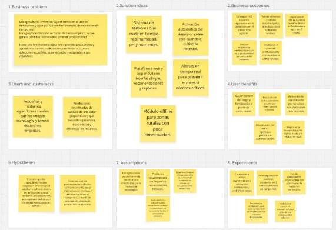
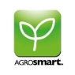
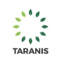
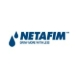

**Universidad Peruana de Ciencias Aplicadas**

**Ingeniería de Software**

**Arquitecturas De Software Emergentes**

**Sección (NRC):** 14653

**Profesor:** Richard Leonardo Berrocal Navarro

**TB1**

|

**Nombre**
|

**Código**
|

**Carrera**
|
| :- | :- | :- |
|Pinto Fuentes Rivera, Alvaro Felipe|U202213384|Ingeniería de Software|
|Espinoza Saenz, Christian Renato|U202213208|Ingeniería de Software|
|Chirinos Zúñiga, Rodrigo Manuel|U202217804|Ingeniería de Software|
|Litano Liza, Joel Alexander|U20181A732|Ingeniería de Software|
|Isla Quispe, Luis Fernando|U202124146|Ingeniería de Software|

**2025-02**

![ref1]1/40                                                                                                                      V11.0/40

**Registro de Versiones del Informe**

|Versión|Fecha|Autor|Descripción de modificación|
| :- | :- | :- | :- |
|||||

**Tabla de contenidos**

**Student Outcome**

|**Criterio Específico**|**Acciones realizadas**|**Conclusiones**|
| :- | :- | :- |
|
Capacidad de comunicarse

efectivamente con un rango de audiencias.
|
Alvaro:

Christian: Rodrigo:
|TB1:|

**Capítulo I: Introducción**

*1.1.      Startup Profile*

1\.1.1.   Descripción de la Startup

SmartCrops es una startup dedicada a revolucionar la agroindustria a través del desarrollo de soluciones tecnológicas inteligentes. Su propuesta se centra en la agricultura de precisión, la automatización y el uso estratégico del Internet de las Cosas (IoT), creando herramientas avanzadas para monitorear y analizar factores clave como el clima, la humedad del suelo, la salud de los cultivos y otras variables determinantes. Todo esto con el objetivo de optimizar la productividad, reducir el consumo innecesario de insumos y facilitar decisiones respaldadas en datos confiables en tiempo real.

En SmartCrops creemos en una agricultura sostenible, conectada y enfocada en mejorar la experiencia del productor. Por ello, buscamos hacer accesible la tecnología agrointeligente para agricultores de cualquier escala, brindándoles la posibilidad de gestionar sus cultivos desde cualquier lugar y en todo momento.

Nuestra visión del futuro agrícola es clara: un ecosistema donde cada hectárea sea más eficiente y menos contaminante, donde las decisiones estén impulsadas por información precisa y donde la tecnología se convierta en un aliado esencial frente a los retos del cambio climático y la seguridad alimentaria mundial.

1\.1.2.   Perfiles de integrantes del equipo

Los integrantes que conforman parte de nuestro startup son:

![ref1]2/40                                                                                                                      V12.0/40

|**Integrante**|**Perfil**|**Foto**|
| :- | :- | :- |
|

Isla Quispe, Luis

Fernando
|Me llamo Luis Fernando Isla Quispe, tengo 21 años y soy estudiante de Ingeniería de Software. Poseo experiencia en programación con lenguajes como C++, C#, Python, HTML, y SQL, lo que me ha permitido desarrollar diversos proyectos. Además, he trabajado en equipo, aprendiendo a comunicarme eficazmente y a colaborar en entornos.|

|
||||
|

Chirinos Zúñiga, Rodrigo Manuel
|

Tengo 21 años, soy un estudiante de la carrera de Ingeniería de Software, considero que soy una persona responsable y de escucha activa. Estoy comprometido con mis compañeros en realizar un buen trabajo y así aprender todos en el proceso. También tengo conocimientos en programación en C++, HTML, CSS y JavaScript.
||
|

Pinto Fuentes

Rivera, Álvaro Felipe
|
Hola, mi nombre es Alvaro, soy un estudiante del octavo ciclo de la carrera Ingeniería de Software. Me gusta mucho leer, sobre todo el género de fantasía y ciencia ficción, mi frase favorita de un libro es el credo "Vida antes que muerte, fuerza antes que debilidad y viaje antes que destino", también soy un gran fan del cine

y pasó la mayor parte de mi tiempo libre

escribiendo por diversión. Poseo un nivel bueno de programación en los lenguajes de C# y C++, creo que podré resultar de gran ayuda para resolver cualquier tipo de problema durante el desarrollo del proyecto, así como podré brindar ideas creativas para el equipo.
|

|
|

Espinoza Saenz, Christian Renato (U202213208)
|Mi nombre es Christian Espinoza, soy un estudiante de 21 años que cursa el 8vo ciclo de la carrera Ingeniería de Software. Poseo ideas únicas e innovadoras para que el trabajo logre sobresalir. Tengo experiencia en la creación de distintos tipos de diagramas, editar diferentes tipos de multimedia como videos, y un conocimiento general en programación de C++, HTML, CSS y SQL. Además, se me facilita desarrollar interfaces intuitivas en el frontend, lo cual será beneficioso para el proyecto.|

|

*1.2.      Solution Profile*

![ref1]3/40                                                                                                                      V13.0/40

Nombre del Producto: Verdeva

Descripción del Producto:

Verdeva es una solución tecnológica desarrollada por SmartCrops para optimizar la

fertilización agrícola de manera inteligente y sostenible. Diseñada especialmente para pequeños y medianos productores en Sudamérica, integra sensores avanzados con riego por goteo automatizado, permitiendo medir en tiempo real parámetros esenciales del suelo como pH, humedad y nutrientes. Con esta información, Verdeva activa el riego únicamente cuando los cultivos lo requieren, garantizando un uso eficiente de agua y fertilizantes. Además, ofrece una plataforma web y una aplicación móvil con acceso a monitoreo en tiempo real, alertas, reportes y recomendaciones personalizadas, lo que facilita decisiones más informadas y productivas. Así,

Terranova impulsa la productividad agrícola y fomenta prácticas sostenibles frente a la crisis climática y la escasez de agua.

Monetización:

Verdeva se comercializará bajo un modelo freemium accesible y escalable. Los

agricultores podrán usar sin costo funciones básicas como monitoreo y alertas, mientras que las herramientas avanzadas —análisis históricos, reportes predictivos y asesoría personalizada— estarán disponibles mediante planes de suscripción mensual de bajo costo, ajustados al tamaño del terreno o al número de sensores instalados.

1\.2.1     Antecedentes y problemática

En el contexto agrícola de Sudamérica, y de manera particular en Perú, los

productores se enfrentan a una combinación de retos estructurales y emergentes que comprometen la eficiencia y sostenibilidad del sector. Uno de los más críticos es la escasez de agua: de acuerdo con el Centro Nacional de Planeamiento Estratégico (Ceplan), para el año 2030 más del 58% de la población peruana residirá en zonas con estrés hídrico. Regiones como Piura ya atraviesan emergencias debido al déficit de agua, lo que afecta directamente la capacidad de riego y exige nuevas estrategias de gestión hídrica. A ello se suma el incremento sostenido de los precios de los fertilizantes: Perú importa anualmente más de un millón de toneladas de estos insumos, con un valor que supera los 800 millones de dólares, impulsado por factores como la pandemia, conflictos geopolíticos y disrupciones en la cadena de suministro. Este escenario ha golpeado con mayor fuerza a los pequeños y medianos agricultores, reduciendo sus márgenes y dificultando el acceso a insumos básicos. Otro gran

desafío es la brecha tecnológica: mientras algunos grandes productores han comenzado a implementar agricultura de precisión, la mayoría de los agricultores aún no dispone de herramientas para monitorear en tiempo real parámetros esenciales como humedad, pH o niveles de nutrientes, limitando la capacidad de reaccionar frente a condiciones climáticas cada vez más inestables.

En respuesta a estos desafíos, SmartCrops presenta Verdeva, una solución tecnológica integral que automatiza el proceso de fertilización a través de sensores inteligentes capaces de medir en tiempo real variables críticas del suelo, como pH, humedad y nutrientes. Con estos datos, el sistema activa de manera autónoma el riego por goteo únicamente cuando el cultivo lo necesita, garantizando así una aplicación precisa y eficiente de agua y fertilizantes. Esta innovación no solo reduce el uso innecesario de

![ref1]4/40                                                                                                                      V14.0/40

recursos, sino que también incrementa el rendimiento de los cultivos de forma significativa.

Para explicar con mayor claridad el valor de Verdeva, utilizamos el modelo 5W y 2H:

**What**

Actualmente, los agricultores gestionan el riego y la fertilización de manera empírica o siguiendo calendarios fijos.

Esto provoca un consumo excesivo de agua y fertilizantes, encareciendo los costos y reduciendo la eficiencia.

La ausencia de monitoreo en tiempo real limita la toma de decisiones oportunas y precisas.

**Who**

Pequeños y medianos agricultores rurales, que dependen de la experiencia empírica y enfrentan restricciones económicas, técnicas y climáticas.

Agricultores de cultivos de alto valor orientados a la exportación, que requieren precisión en el manejo de insumos para mantener calidad y rentabilidad.

**Where**

El problema se presenta en toda Sudamérica, pero tiene especial impacto en regiones agrícolas peruanas como Piura, Lambayeque o Ica, donde la disponibilidad de agua es crítica y los efectos del cambio climático intensifican la variabilidad en suelo y clima.

**When**

El desafío es constante durante toda la campaña agrícola, pero se agudiza en etapas clave de desarrollo del cultivo, donde la falta de agua o nutrientes afecta directamente el rendimiento.

También se intensifica en periodos de sequía o cuando los precios de fertilizantes se disparan.

**Why**

Los agricultores carecen de herramientas accesibles para monitorear las condiciones del suelo.

Las decisiones se toman en base a experiencia o tradición, más que en datos concretos.

La tecnología agrointeligente aún no llega de forma masiva a las zonas rurales.

![ref1]5/40                                                                                                                      V15.0/40

**How**

Con Verdeva, los productores pueden automatizar el riego y la fertilización mediante sensores que registran en tiempo real las condiciones del suelo.

El sistema decide de manera autónoma cuándo activar el riego por goteo, optimizando el uso de recursos.

A través de una plataforma web y una aplicación móvil, los agricultores acceden a monitoreo, alertas y recomendaciones adaptadas a su terreno.

**How Much**

Un agricultor puede perder hasta un 30% del rendimiento por una fertilización mal ejecutada.

Con Verdeva, es posible reducir hasta un 40% el consumo de agua y fertilizantes, y aumentar la productividad en aproximadamente un 25%, generando un impacto económico directo y positivo para el productor.

1\.2.2    Lean UX Process.

1\.2.2.1.             Lean UX Problem Statements. Problem Statement

1\. Dominio

El sector de aplicación es el agropecuario, con foco en la agricultura de precisión para cultivos de pequeña y mediana escala en zonas impactadas por limitaciones climáticas, hídricas y económicas. El enfoque se centra en el uso de tecnologías digitales, sensores IoT, automatización y analítica de datos para optimizar recursos críticos y aumentar la rentabilidad agrícola.

2\. Segmentos de Clientes

Pequeños y medianos agricultores rurales:

•  No cuentan con acceso a tecnologías de monitoreo o automatización.

•  Sus decisiones productivas se basan en experiencia empírica, no en datos.

•  Operan con recursos económicos limitados y márgenes de ganancia reducidos.

•	Trabajan en zonas rurales con alta presión hídrica y condiciones climáticas adversas.

Productores de cultivos de alto valor destinados a exportación:

•	Requieren precisión en riego y nutrición para cumplir estándares de calidad internacional.

•  Están más dispuestos a invertir si existe un retorno claro y medible.

![ref1]6/40                                                                                                                      V16.0/40

•	Errores en la fertilización o riego tienen un alto impacto en su producción y rentabilidad.

3\. Puntos de Dolor (Pain Points)

Falta de información confiable sobre el estado del suelo: La mayoría carece de herramientas para medir humedad, pH o nutrientes, aplicando insumos de forma poco técnica.

Ineficiencia en el uso de agua: El riego manual o en horarios fijos no considera las necesidades reales del cultivo, lo que deriva en desperdicio o déficit hídrico.

Dependencia de fertilizantes costosos: Los altos precios y el uso ineficiente elevan los costos de producción sin garantizar mayores rendimientos.

Acceso limitado a tecnología adecuada: Las soluciones actuales suelen ser costosas, complejas y diseñadas para grandes productores, dejando de lado a los agricultores rurales.

Vulnerabilidad al cambio climático: Fenómenos como sequías, heladas o lluvias intensas afectan de forma impredecible y sin información en tiempo real el agricultor no puede anticiparse.

Sobrecarga operativa y decisiones bajo presión: El monitoreo manual y la falta de apoyo tecnológico generan estrés y errores frecuentes en la gestión diaria.

4\. Brecha Identificada (Gap)

Existe una falta evidente de soluciones agro inteligentes que sean:

Económicamente accesibles para pequeños y medianos productores, frente a un mercado saturado de opciones costosas e importadas.

Simples de instalar y usar, sin necesidad de conocimientos técnicos avanzados ni soporte constante.

Adaptadas a la baja conectividad de zonas rurales, capaces de funcionar offline o con sincronización diferida.

Centradas en el ahorro de recursos y en el empoderamiento del agricultor, con interfaces claras y orientadas al impacto inmediato.

5\. Visión / Estrategia

La visión de SmartCrops con su producto Verdeva es democratizar el acceso a la agricultura de precisión, transformando la tecnología en una herramienta práctica y cercana para el agricultor. Para ello, se plantea:

Crear una solución modular, escalable y de bajo costo, equipada con sensores precisos para recolectar datos del suelo y del clima.

![ref1]7/40                                                                                                                      V17.0/40

Implementar un sistema que automatice riego y fertilización, reduciendo la carga operativa y optimizando recursos críticos.

Diseñar una interfaz visual e intuitiva, fácil de usar incluso para agricultores con poca experiencia tecnológica.

Incorporar alertas y recomendaciones accionables, que faciliten la toma de decisiones sin depender de consultores externos.

Promover una red de usuarios conectados que compartan aprendizajes y validen el valor de la tecnología desde la práctica en campo.

1\.2.2.2.             Lean UX Assumptions. Business Assumptions

Los agricultores estarán motivados a incorporar tecnología siempre que represente un beneficio tangible en su rentabilidad y productividad.

La creciente necesidad de optimizar el uso del agua impulsará la demanda de herramientas de monitoreo y control hídrico.

La dependencia del Perú de fertilizantes importados seguirá generando interés por alternativas que reduzcan su consumo.

Programas de subsidios y financiamiento agrícola podrían facilitar la adquisición de soluciones como Verdeva.

Las políticas públicas tenderán a favorecer la sostenibilidad, creando un escenario favorable para la agricultura de precisión.

El mercado agrícola en Sudamérica, al ser diverso, exigirá soluciones flexibles y adaptables a distintos cultivos.

La brecha tecnológica entre pequeños y grandes productores representa una oportunidad para democratizar la innovación.

La confianza en la solución se generará principalmente mediante recomendaciones directas y demostraciones en campo.

Business Outcomes

Incremento progresivo en las ventas y adopción de Verdeva en regiones agrícolas con problemas severos de agua (Piura, Arequipa, Ica y Lambayeque).

Reducción del uso de fertilizantes entre un 20% y 40% gracias a la dosificación inteligente y personalizada.

![ref1]8/40                                                                                                                      V18.0/40

Optimización del riego hasta en un 50%, especialmente en zonas con recursos hídricos limitados.

Expansión hacia otros países andinos con contextos agrícolas similares (Ecuador, Bolivia, Colombia).

Establecimiento de alianzas con cooperativas, ONGs rurales y entidades públicas que faciliten la implementación.

Posicionamiento de SmartCrops como referente en innovación agrícola en ferias, congresos y medios especializados.

Obtención de datos estratégicos sobre suelos y cultivos que permitan futuras mejoras del producto.

User Assumptions

¿Quién es el usuario?

Agricultores pequeños y medianos de zonas rurales de Perú y Sudamérica, con acceso limitado a tecnología.

Productores tecnificados de cultivos de alto valor, enfocados en exportación.

¿Qué problemas resuelve?

Escasez de agua, costos elevados de fertilizantes, baja eficiencia en riego y fertilización, carencia de información en tiempo real.

¿Qué características son críticas?

Sensores de humedad, pH y nutrientes, monitoreo en tiempo real, riego y fertilización automatizados, interfaz intuitiva, acceso remoto.

¿Dónde se integra en su vida laboral?

En la gestión diaria de los cultivos, permitiendo supervisar riego y nutrición sin necesidad de presencia constante en el campo.

¿Cuándo y cómo se utiliza?

Durante toda la temporada de cultivo mediante una app móvil o plataforma web conectada a los sensores instalados, operando de forma autónoma y continua.

¿Cómo debe verse y funcionar?

![ref1]9/40                                                                                                                      V19.0/40

Interfaz sencilla y clara, accesible en dispositivos móviles de gama media/baja, con funcionamiento predictivo, automatizado y con alertas personalizadas.

User Outcomes

Mejor control sobre agua y nutrientes con información clara y visual. Ahorro anual en costos de agua, fertilizantes y mano de obra.

Mayor productividad por hectárea gracias a decisiones más precisas.

Reducción de carga operativa mediante automatización de riego y fertilización. Menor riesgo de pérdidas por climas extremos con alertas predictivas.

Adopción de decisiones basadas en datos, fomentando profesionalización agrícola. Imagen de modernización tecnológica y competitividad frente a grandes productores. Mayor resiliencia ante efectos del cambio climático y variaciones de mercado.

Feature Assumptions

Los sensores funcionarán correctamente en distintos tipos de suelo y condiciones climáticas extremas.

El sistema de riego responderá en tiempo real a los datos del suelo sin intervención humana constante.

La interfaz será simple, multilingüe y apta para celulares de gama baja con conectividad inestable.

Habrá acceso en zonas con internet limitado, incluyendo funciones offline. Reportes y alertas se adaptarán a cultivo, suelo y perfil del agricultor.

El sistema será modular y ampliable, permitiendo incorporar nuevas variables

(temperatura, salinidad, plagas).

Instalación y mantenimiento sencillos, con capacitación básica y sin necesidad de técnicos permanentes.

Escalabilidad desde pequeñas parcelas hasta fincas medianas, con configuraciones ajustables.

1\.2.2.3.             Lean UX Hypothesis Statements.

![ref1]10/40                                                                                                                    V11.00/40

Creemos que los pequeños y medianos agricultores adoptarán Verdeva si perciben un beneficio claro en la eficiencia del uso de agua y fertilizantes. Esto se confirmará cuando al menos el 70% de los usuarios en piloto reporten una reducción

comprobada en el consumo de recursos durante los primeros tres meses de uso.

Consideramos que una interfaz simple, visual e intuitiva permitirá que agricultores sin experiencia tecnológica manejen el sistema sin apoyo externo. Lo validaremos cuando el 80% de los participantes en pruebas de usabilidad puedan realizar las funciones básicas (consultar datos, programar riego, recibir alertas) sin asistencia técnica.

Planteamos que la automatización del riego y la fertilización disminuirá la carga operativa y elevará la productividad de los agricultores. Esto será cierto cuando, tras dos ciclos agrícolas, al menos el 60% de los usuarios informen un incremento en el rendimiento de sus cultivos y menos carga de trabajo diario.

Confiamos en que Verdeva, desarrollado por SmartCrops, podrá adaptarse a distintos cultivos y tipos de terreno sin rediseños complejos. Esto quedará demostrado cuando al menos tres tipos de cultivos diferentes (ejemplo: vid, maíz y arándanos) integren el sistema sin requerir modificaciones técnicas relevantes.

Estimamos que un proceso de instalación guiado y sencillo elevará la tasa de adopción sin depender de visitas presenciales. Sabremos que esto es cierto cuando más del

70% de los usuarios logren instalar y activar Verdeva por sí mismos, sin intervención directa del equipo de SmartCrops.

Creemos que al incorporar lenguaje local, soporte en español y ejemplos prácticos con cultivos reales, se generará mayor confianza en el uso de la plataforma. Lo confirmaremos cuando el índice de satisfacción del onboarding supere el 80% en comunidades rurales durante las primeras pruebas piloto.

1\.2.2.4.             Lean UX Canvas.

![ref1]11/40                                                                                                                    V11.01/40

1\.3.      Segmentos objetivo.

En esta sección se identifican los segmentos de clientes objetivo de Verdeva, desarrollada por SmartCrops, considerando sus características productivas, prácticas agrícolas y necesidades comunes frente a los principales retos del sector agropecuario.

1\. Productores rurales tradicionales (pequeños y medianos agricultores) Descripción:

Son agricultores que trabajan en zonas rurales, usualmente con acceso limitado a

tecnologías modernas, y que gestionan sus cultivos basándose en la experiencia acumulada. Representan la mayoría de productores en regiones como la sierra y la costa del Perú, donde la escasez de agua y la vulnerabilidad climática impactan fuertemente en la producción.

Características:

Bajo nivel de tecnificación en sus procesos. Recursos económicos reducidos.

Alta dependencia de condiciones climáticas.

Cultivos de subsistencia o producción destinada al mercado local. Necesidades:

![ref1]12/40                                                                                                                    V11.02/40

Herramientas accesibles para monitorear riego y condiciones del suelo.

Optimizar el uso de agua y fertilizantes sin requerir conocimientos técnicos avanzados.

Alertas y recomendaciones claras que simplifiquen la toma de decisiones. Acceso a financiamiento o subsidios que faciliten la adopción de Verdeva.

2\. Productores tecnificados de cultivos de alto valor (orientados al mercado de exportación)

Descripción:

Se trata de agricultores o agroindustrias que producen cultivos como arándanos, uvas, paltas o espárragos, destinados a mercados nacionales e internacionales. Este grupo busca optimizar procesos para mantener calidad, trazabilidad y sostenibilidad, cumpliendo los estándares de exportación.

Características:

Mayor capacidad de inversión y apertura a nuevas tecnologías. Necesidad de un control riguroso de las variables agrícolas. Altos requerimientos de calidad y cumplimiento normativo.

Operación en contextos donde pequeñas variaciones pueden afectar la rentabilidad. Necesidades:

Monitoreo en tiempo real de variables críticas del suelo (humedad, pH y nutrientes). Automatización del riego y la fertilización para aumentar la eficiencia operativa. Reportes históricos y análisis predictivos para mejorar la planificación estratégica.

Recomendaciones adaptadas al tipo de cultivo y a las condiciones específicas del terreno.

**Capítulo II: Requirements Elicitation & Analysis**

2\.1.      Competidores.

Después de analizar el mercado, logramos identificar tres plataformas que ofrecen funcionalidades comparables a las que propone nuestra solución Verdeva. Estas son:

•	**NetBeat (Netafim):** Plataforma digital de gestión de riego que combina monitoreo, análisis y automatización en tiempo real. A través de un panel inteligente, ofrece a los agricultores la posibilidad de controlar de manera

![ref1]13/40                                                                                                                    V11.03/40

centralizada el riego y la fertilización, utilizando información generada por sensores de suelo, clima y cultivos. Destaca por ser una solución innovadora y pionera en su tipo, consolidada en el mercado por su eficacia. Detrás de esta tecnología se encuentra Netafim, empresa reconocida a nivel mundial por su liderazgo en riego por goteo y agricultura de precisión. Sin embargo, su alto costo de implementación dificulta que productores rurales pequeños y medianos puedan acceder a esta herramienta.

•	**Agrosmart:** Plataforma brasileña de agricultura digital enfocada en apoyar a los productores en la toma de decisiones a partir de datos climáticos, sensores de campo y modelos de análisis predictivo. Permite realizar un monitoreo remoto del suelo, el clima y los cultivos, además de generar reportes, alertas y recomendaciones personalizadas para cada contexto productivo. Su enfoque local y la accesibilidad de sus soluciones le han permitido consolidarse como una de las opciones más utilizadas en América Latina. A diferencia de otras alternativas, su principal fortaleza está en el seguimiento y análisis de la información, más que en la automatización directa del riego y la fertilización.

•	**Taranis:** Plataforma global de inteligencia agrícola que emplea imágenes aéreas de alta resolución, sensores y algoritmos de inteligencia artificial para identificar de manera temprana plagas, enfermedades o deficiencias nutricionales en los cultivos. Su propuesta está dirigida principalmente a explotaciones agrícolas de gran escala, a las que proporciona reportes detallados y alertas preventivas sobre el estado de los cultivos. A pesar de su alto nivel tecnológico, se orienta más al diagnóstico visual masivo que a la automatización de procesos productivos como el riego o la fertilización.

2.1.1.   Análisis competitivo.

|Competitive Analysis Landscape||||||
| :- | :- | :- | :- | :- | :- |
|
¿Por qué llevar a cabo este

análisis?
|
Este análisis se llevó a cabo con el propósito de

reconocer a nuestros posibles competidores y

definir estrategias que nos permitan diferenciarnos de ellos.
|||||
|Nombre|Verdeva|
NeatBeat

(Netafim)
|AgroSmart|Taranis||
|Logo||

|

|

||
||

Overview
|Plataforma|Plataforma digital|Plataforma|Plataforma de|
|||tecnológica que|para la gestión de|digital agrícola|agricultura|
|||articula|riego que|orientada al|inteligente que|
|||sensores|combina|seguimiento de|utiliza imágenes|
|||avanzados,|monitoreo,|datos y al análisis|aéreas y|
|Perfi||control|análisis y|predictivo.|algoritmos de IA|
|l||automatizado|automatización||para identificar|
|||del riego y|en tiempo real.||anomalías en los|
|||procesamiento|||cultivos.|

![ref1]14/40                                                                                                                    V11.04/40

|||
de información

en tiempo real.
||||
| :- | :- | :- | :- | :- | :- |
||
Ventaja

competiti

va ¿Qué valor ofrece a los clientes?
|
Enfoque en

productores rurales, ofreciendo una solución accesible y escalable que facilita la toma de decisiones basada en datos en tiempo real.
|
Sistema

automatizado de riego y fertilización, respaldado por tecnología de alta precisión aplicada a la agricultura.
|
Orientación al

ámbito local, con costos accesibles y sugerencias adaptadas a las necesidades de pequeños y medianos productores.
|
Uso de tecnología

de vanguardia para identificar visualmente inconvenientes en cultivos de gran extensión.
|
|

Perfi l de Mar keti ng
|
Mercado

Objetivo
|
Orientado a

pequeños y medianos productores rurales, con la posibilidad de expandirse posteriormente hacia agricultores tecnificados.
|
Agricultores

tecnificados dedicados a cultivos de alto valor y a explotaciones agrícolas de gran escala.
|
Productores

rurales de pequeña y mediana escala en la región de América Latina.
|
Extensas unidades

de producción agrícola con presencia a escala internacional.
|
||
Estrategi

as de

Marketin g
|
Estrategia de

difusión basada en participación en ferias

locales, pruebas en campo, colaboración

con cooperativas y posicionamient o en medios digitales.
|
Empresa con

trayectoria sólida, centrada en tecnologías de precisión y en la generación de beneficios sostenibles a

largo plazo.
|
Orientación al

mercado local, fortalecida mediante colaboraciones estratégicas con cooperativas y entidades gubernamentale s.
|
Difusión de

innovaciones tecnológicas en foros y eventos internacionales del sector agrícola.
|
||
Producto

s &

servicios
|
Sistema de

riego automatizado con monitoreo en tiempo real, que ofrece alertas personalizadas, informes completos y sugerencias ajustadas a las características de cada terreno.
|
Sistema de riego

automatizado con funciones de monitoreo y análisis en tiempo real.
|
Supervisión

remota de suelo, clima y cultivos, complementada con alertas y reportes a medida.
|
Análisis inteligente

de cultivos con IA, acompañado de reportes visuales completos y detallados.
|
||
Precios &

Costos
|
Modelo

freemium que ofrece
|
El costo promedio

por hectárea varía entre $2,500 y
|
Tarifa base de

$950 anuales.
|
El costo por acre

oscila entre $5 y

$20 por
|

![ref1]15/40                                                                                                                    V11.05/40

distribuci

|||||||
| :- | :- | :- | :- | :- | :- |
|||||||
|||

|

||

|
|||||||
|||||||
|||||||
|||||||
|||||||
|||||||
|||

||||
||||||

|
|||||||
|||||||
|||||||
|||||||
|||||||
|||||||
|||||||
|||||||
|||||||
|||||||
||||

|||
|||||||
|||||||
|||||||
|||||||
|||||||
||||||

|
|||||||
|||||||
|||||||
|||||||
|||||||
|||||||
|||||||
|||||||
|||||||
|||||||
|||||||
|||||||
|||||||
|||||||

SWO

![ref1]16/40                                                                                                                    V11.06/40

|||con más|adaptadas a|automatización|y posibles|
| :- | :- | :- | :- | :- | :- |
|||recursos y|pequeños|avanzada que|limitaciones|
|||resistencia al|productores.|podrían atraer al|regulatorias.|
|||cambio entre||mismo mercado||
|||productores||objetivo.||
|||tradicionales.||||

2\.1.2.   Estrategias y tácticas frente a competidores.

El éxito de Verdeva  depende de su capacidad para diferenciarse en un mercado cada vez más competitivo. Para lograrlo, es fundamental definir estrategias que permitan ofrecer soluciones accesibles, innovadoras y adaptadas a las necesidades específicas de los productores. Basándose en el análisis SWOT, se plantean tres enfoques principales: optimizar costos, generar valor mediante la innovación y concentrarse en segmentos de mercado específicos, asegurando así una ventaja sostenible y un crecimiento a largo plazo.

1\.   **Eficiencia en costos:**

**Objetivo:** Ofrecer una solución tecnológica eficiente y accesible, especialmente para pequeños y medianos productores, optimizando recursos y reduciendo barreras económicas.

**Tácticas:**

•	Desarrollar una plataforma ligera compatible con dispositivos básicos y conexiones limitadas.

•	Implementar modelos de suscripción flexibles, ajustados al tamaño del productor o tipo de cultivo.

•	Establecer alianzas con instituciones públicas y organizaciones sin fines de lucro para subsidios o cofinanciamiento.

**2.   Innovación Diferenciadora:**

**Objetivo:** Destacar mediante funciones especializadas que integren análisis de suelo, clima, nutrición y generación de recomendaciones mediante inteligencia artificial, adaptadas a las necesidades locales y específicas de los cultivos. **Tácticas:**

•	Incorporar recomendaciones en tiempo real basadas en datos de campo y predicciones inteligentes.

•	Desarrollar modelos de inteligencia artificial entrenados con información local para generar sugerencias precisas de manejo y nutrición.

•	Crear una interfaz intuitiva con alertas prácticas y sugerencias fáciles de implementar por los agricultores.

3\.   **Enfoque en Nichos de Mercado:**

**Objetivo:** Especializarse en segmentos agrícolas con baja penetración tecnológica,

como cooperativas rurales o cultivos de pequeña escala, brindando soluciones adaptadas y soporte personalizado.

**Tácticas:**

•	Diseñar funciones específicas para cultivos como café, cacao, maíz y hortalizas en regiones tropicales.

![ref1]17/40                                                                                                                    V11.07/40

•	Ofrecer asistencia técnica y recursos educativos contextualizados a la realidad local.

•	Establecer colaboraciones con asociaciones de productores para facilitar la adopción de la plataforma.

2\.2.      Entrevistas.

2\.2.1.   Diseño de entrevistas.

Se han realizado entrevistas detalladas enfocadas en individuos que representan

nuestros grupos meta. Las interrogantes se ajustaron a cada grupo, considerando su contexto, grado de tecnología y requerimientos específicos. Esta variedad nos facilita obtener datos más exactos y pertinentes, además de ser adaptados a la situación particular de cada tipo de usuario.

Segmento 1: Productores Rurales Tradicionales

Preguntas de introducción:

1\. ¿Cuál es su nombre y cuántos años tiene?

2\. ¿En qué zona o distrito vive?

3\. ¿Cómo calificaría su situación económica? (Alta, media, media-baja o baja)

4\. ¿Cuántos años lleva trabajando en agricultura?

5\. ¿Qué cultivos tiene y en cuántas hectáreas?

6\. ¿Alguna vez ha usado tecnología o herramientas digitales para su trabajo en el campo?

Preguntas principales:

1\. ¿Cómo realiza actualmente el riego y la fertilización de sus cultivos? ¿Sigue algún calendario o lo hace

según la observación diaria?

2\. ¿Qué dificultades enfrenta al momento de decidir cuánto fertilizante o agua aplicar a sus plantas?

3\. ¿Con qué frecuencia monitorea el estado del suelo (humedad, pH, nutrientes)?

¿Utiliza algún método o herramienta para hacerlo?

4\. ¿Ha tenido pérdidas en sus cultivos por aplicar demasiada o muy poca agua/fertilizante?

5\. ¿Qué tan costoso representa para usted adquirir fertilizantes o insumos? ¿Ha notado que su precio ha

cambiado en los últimos años?

6\. ¿Qué haría diferente si pudiera saber en tiempo real lo que su cultivo necesita?

7\. ¿Qué importancia tiene para usted el ahorro de agua en su actividad agrícola?

8\. ¿Cómo le afecta el cambio climático en su producción agrícola? ¿Ha cambiado algo en la forma en que

trabaja?

9\. ¿Con qué frecuencia accede a internet o usa un celular durante su jornada en el campo?

10\. ¿Estaría dispuesto a utilizar una herramienta que le diga exactamente cuándo y cuánto fertilizante o

agua aplicar?

![ref1]18/40                                                                                                                    V11.08/40

11\. ¿Qué condiciones debería tener una herramienta tecnológica para que usted la use sin complicaciones?

12\. ¿Qué beneficios espera de una solución que automatice parte del riego o fertilización?

13\. ¿Desea agregar algo más que considere importante sobre su trabajo o sobre el uso de nuevas herramientas?

Segmento 2: Productores Tecnificados de Cultivos de Alto Valor

Preguntas de introducción:

1\. ¿Cuál es su nombre, edad y cargo dentro de la empresa o predio agrícola?

2\. ¿Hace cuántos años están operando con este cultivo?

3\. ¿Qué cultivos producen principalmente y cuántas hectáreas manejan actualmente?

4\. ¿En qué región o zona se ubica su operación agrícola?

5\. ¿Actualmente cuentan con algún sistema de agricultura de precisión o monitoreo digital?

6\. ¿Qué herramientas o tecnologías utilizan para gestionar riego, fertilización o trazabilidad?

Preguntas principales:

1\. ¿Cómo determinan actualmente la cantidad de agua y fertilizantes que necesita el cultivo?

2\. ¿Con qué frecuencia monitorean variables como humedad del suelo, pH o niveles

de nutrientes?

3\. ¿Tienen sensores instalados actualmente? Si no, ¿por qué aún no los implementan?

4\. ¿Qué tan automatizado está su sistema de riego/fertilización? ¿Hay procesos manuales?

5\.   ¿Qué impacto económico tiene el uso de fertilizantes en su operación? ¿Buscan

optimizarlo?

6\.   ¿Han tenido problemas por sobreuso o deficiencia de fertilizantes o agua en

campañas pasadas?

7\.   ¿Qué tan importante es para su empresa la trazabilidad de los insumos y el historial del cultivo?

8\.   ¿Cómo gestionan actualmente la toma de decisiones en base a los datos del terreno o clima?

9\.   ¿Qué tipo de reportes o métricas son más útiles en su gestión diaria o estratégica?

10\. ¿Qué valoraría más de una solución como Verdeva : automatización, precisión o

ahorro?

11\. ¿Qué características o integraciones consideran imprescindibles en una

plataforma tecnológica agrícola?

12\. ¿Estarían dispuestos a adoptar una solución modular que se adapte al tipo de cultivo, terreno o tamaño de operación?

13\. ¿Desea agregar algo más que considere importante sobre su trabajo o sobre el uso de nuevas herramientas?

2\.2.2.   Registro de entrevistas.

![ref1]19/40                                                                                                                    V11.09/40

2\.2.3.   Análisis de entrevistas.

2\.3.      Needfinding.

2\.3.1.   User Personas.

2\.3.2.   User Task Matrix.

2\.3.3.   Empathy Mapping.

2\.3.4.   As-is Scenario Mapping.

2\.4.      Ubiquitous Language.

**Capítulo III: Requirements Specification**

3\.1.      To-Be Scenario Mapping.

3\.2.      User Stories.

3\.3.      Impact Mapping.

3\.4.      Product Backlog.

**Capítulo IV: Strategic-Level Software Design**.

4\.1.      Strategic-Level Attribute-Driven Design.

4\.1.1.   Design Purpose.

4\.1.2.   Attribute-Driven Design Inputs.

4\.1.2.1.             Primary Functionality (Primary User Stories).

4\.1.2.2.             Quality attribute Scenarios.

4\.1.2.3.             Constraints.4.1.3.   Architectural Drivers Backlog.

4\.1.4.   Architectural Design Decisions.

4\.1.5.   Quality Attribute Scenario Refinements.

4\.2.      Strategic-Level Domain-Driven Design.

4\.2.1.   EventStorming.

4\.2.2.   Candidate Context Discovery.

4\.2.3.   Domain Message Flows Modeling.

4\.2.4.   Bounded Context Canvases.

4\.2.5.   Context Mapping.

4\.3.      Software Architecture.

4\.3.1.   Software Architecture System Landscape Diagram.

4\.3.1.   Software Architecture Context Level Diagrams.

4\.3.2.   Software Architecture Container Level Diagrams.

4\.3.3.   Software Architecture Deployment Diagrams.

**Conclusiones**

Conclusiones y recomendaciones.

Video About-the-Team.

**Bibliografía**

**Anexos**

![ref1]20/40                                                                                                                    V12.00/40

[ref1]: Aspose.Words.207c8e0d-110c-4b05-aa70-6ec141d669c3.002.png
